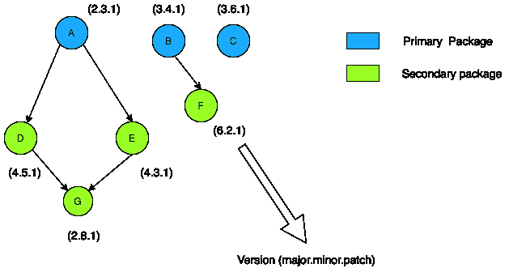
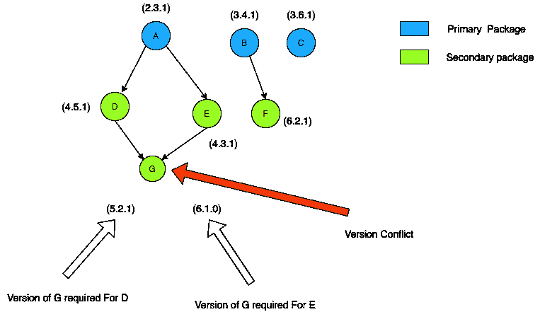

# 生活中的算法——理解一个包管理器

> 原文：<https://blog.devgenius.io/the-algorithmic-approach-in-life-e5ccb3fb0dd?source=collection_archive---------17----------------------->

我们使用[包管理器](https://en.wikipedia.org/wiki/Package_manager)来为我们的项目安装包。假设我们的项目需要包 A、B 和 C，其中 A 和 B 有一些依赖关系。

*   **A 依赖 D** ， **E.**
*   **B 依赖于 F** 。
*   **D 和 E 依赖于 G** 。

然后需要安装所有的 **A、B、C、D、E、F 和 G。**软件包管理器以正确的顺序安装主软件包 A、B 和 C 以及这些主软件包的所有依赖项。

它是如何发生的？下一节我们来试着理解一下。

# 首先，让我们试着想象一下

# **首次安装方法**

我们将开始安装主要的、直接在配置文件中定义的包，然后以自顶向下的方式安装它们的依赖项等等。

例如，我们将首先安装包 A、它的依赖项 D 和 E，然后安装包 G。现在我们将安装包 B 和它的依赖项 f。在此之后，将安装包 C。

安装顺序为 *A、D、E、G、B、F、C*

# 上述方法的问题

为了理解上述方法的问题，让我们首先理解包的版本控制。

如果软件包版本是 5.4.2，那么 5 是主要版本，4 是次要版本，2 是修补版本

1.  主要版本变化代表不兼容的 API 变化，
2.  次要版本更改以向后兼容的方式表示功能更改
3.  补丁版本更改代表向后兼容的错误修复。

因此，如果我们需要 4.5.2 版本的软件包，我们不能安装 5.0.0，但 4.x.x 是可以接受的。

你可以在这里了解更多:[语义版本](https://semver.org/)

现在我们来讨论一个场景

如果我们看到上图，D 需要一个 5.2.1 版本的 G，E 需要一个 6.1.0 版本的 G，如果我们从顶部开始，安装顺序将是 A，D，E 但是由于需要不同的 **major** 版本，安装过程将在 G 处失败。如果有不同的次要版本，那么可以安装一个通用版本的 G。

# 第二种安装方法

正如我们在前面的例子中看到的，在安装包时，我们有时会遇到[版本冲突](https://en.wikipedia.org/wiki/Dependency_hell#:~:text=Dependency%20hell%20is%20a%20colloquial,versions%20of%20other%20software%20packages.)的问题。如果我们从主包开始，只有当我们试图安装它们的依赖项时，我们才会知道这个版本冲突。

为了解决这个问题，我们将从一个不依赖于任何其他包的包开始安装，然后我们将以自下而上的方式安装主包。

例如，要安装主包，安装顺序将是 *G、D、E 和 A。*这种自底向上的方法将有助于在早期阶段发现版本冲突问题。

**从以上方法中，我们可以看出包的安装顺序很重要，第二种方法有助于我们更早地发现版本冲突问题**。

# 结论

这篇博客的目的是给出一个包管理器用来安装依赖项的不同方法的简要概述。

如需进一步阅读，请查看以下链接-

*   [https://www . geeks forgeeks . org/find-the-ordering-of-tasks-from-given-dependencies/？ref=rp](https://www.geeksforgeeks.org/find-the-ordering-of-tasks-from-given-dependencies/?ref=rp)
*   [https://docs . npmjs . com/specifying-dependencies-and-dev dependencies-in-a-package-JSON-file](https://docs.npmjs.com/specifying-dependencies-and-devdependencies-in-a-package-json-file)

此外，您可以查看本系列的第 1 部分[,它讲述了如何有效地发现项目中的 bug。](https://medium.com/dev-genius/the-algorithmic-approach-in-life-de0b2ecbff23)