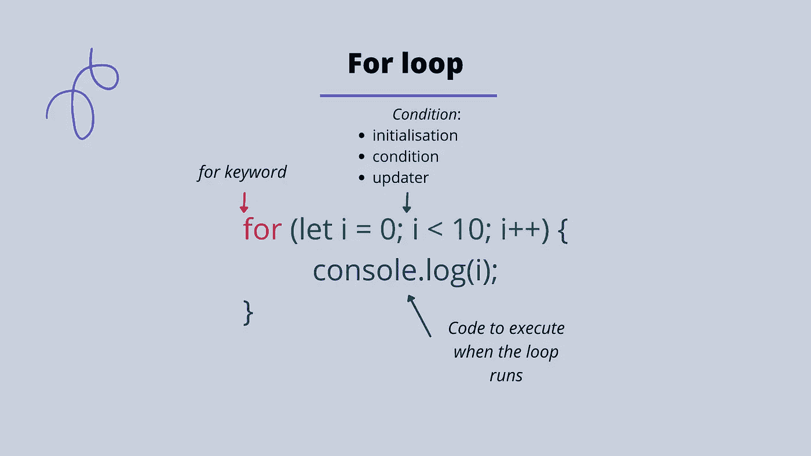

# JavaScript 中 For 循环的剖析

> 原文：<https://blog.devgenius.io/the-anatomy-of-a-for-loop-in-javascript-9523c3da0d59?source=collection_archive---------7----------------------->

循环让我们一遍又一遍地重复一些代码，直到满足某个条件。当我们有一些需要重复发生的逻辑时，我们使用循环。

如果你出去散步，想在一天中走完一万步，那么你就不断地走，直到走完一万步。这是一个重复序列直到你达到一个条件的例子。

回到编程世界，您可能会遇到这个术语来迭代数组之类的东西。这与使用循环是一样的。javascript 中三种最常见的循环类型是的**循环、 **while** 循环和 **do while** 循环。**

当我们知道我们希望循环运行多少次时，循环的**对于运行一些代码是有用的。我们可能希望多次运行一些代码，直到达到一个特定的值，比如数到 10。如果我们不使用循环，我们将不得不重复写出我们想要运行的代码，这将打破编写代码的一个关键原则，即不要重复自己——有时缩写为 **DRY** 。**

For 循环有三个部分:

*   for 关键字
*   条件(包括初始化、条件和更新程序)。
*   循环运行时要执行的代码

我们首先使用他们的关键字，然后添加一组括号。

接下来是条件部分。为了初始化这个循环，我们创建了一个变量，人们通常称之为 I。变量可以用一个值初始化，这个值取决于你想从什么开始计数。如果你想让循环计数到某一点(例如 10)并且你想让计数从 0 开始，那么你可以用 0 值初始化变量 iw。

接下来，我们创建条件本身。条件是停止点。这是我们希望变量 *i* 停止计数和循环停止重复的点。如果我们想数到 10 但不包括 10，我们会说: *i < 10。*

最后，对于更新器，我们指定计数器(变量 *i* )在每次循环运行时应该如何改变。如果我们想数到 10，因此每次循环运行时将 *i* 加 1，我们可以使用增量运算符( *++* )。增量运算符由两个加法符号组成，将一个值递增 1。我们在初始化、条件和更新器之间添加分号。下面 for 循环的结果将是从 0 到 10(不包括 10)的所有值，打印到控制台。

最后，我们添加了一组花括号，在里面我们放置了每次循环运行时要执行的代码。以下循环的结果将是从 0 到 9(包括 9)的所有值打印到控制台。

如果您想观看有关上述主题的视频，请参见下文。

请随时张贴任何意见，问题或反馈！

在 Instagram 上关注我[这里](https://www.instagram.com/codecup_dev/)。

我还有一门 [Udemy](https://www.udemy.com/course/learn-javascript-in-90-minutes/) 课程，涵盖了这个话题以及更多。

下次见！