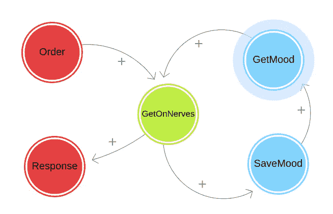

# 愤怒的聊天机器人

> 原文：<https://blog.devgenius.io/the-angry-chatterbot-6d004b8c41a4?source=collection_archive---------5----------------------->

## 软件作为行为修正工具的(成功)实验

通过负反馈减少虚拟环境中不适当的社会行为。鱼类分析学的后续:作为行为修正工具的数据分析的(失败)实验。

[](https://jefferey-cave.medium.com/fishalytics-b966b02e211) [## 鱼类分析

### 作为行为修正工具的数据分析(失败)实验

jefferey-cave.medium.com](https://jefferey-cave.medium.com/fishalytics-b966b02e211) 

许多年前(2012 年)，我与加拿大一所主要大学的一个小型开发团队签订了一份合同。作为一个嵌入在大公司实体中的团队，我的期望相对较低，但是当我们开始一起工作时，我发现自己惊喜万分；非常惊喜，因为我发现了一群对软件艺术既好奇又有热情的人。

告诉我们这将是一个伟大的团队的关键之一是非正式的入会仪式。

其中一张办公桌下是一个简单的桌面，被重新用作团队的服务器。这个服务器不是用来托管团队正在开发的应用程序，而是运行小助手脚本和工具:团队有一个自动化服务器。该团队分布在校园的几个办公室，所以安装了一个简单的叮当聊天服务器，团队成员定期发布更新，并在聊天中提问。为了更容易访问，有人连接到了 jingle 服务器，并设置了一个聊天机器人来监听我们的对话，并且(基于团队存储库中的一些代码)会提供有用的提示，查找文档，或者告诉你你的公交车是否晚点了。

每个人都被鼓励增加机器人的技能和行为，并使之变得更好。鼓励创建工具、集成新服务或添加新控件。从来没有人说过，但你并不是团队的一员，直到你给 CQBot 添加了你的特殊风格。

首先，它鼓励员工控制他们的环境，承担责任使工作场所变得更好，并掌控他们的环境。如果你没有先试着安装工具，你就不会抱怨没有工具。

其次，也是最有趣的是，你选择添加的内容向团队透露了一些关于你的信息。

# 社会群体是复杂的

社会团体(比如说一个开发团队)是复杂的系统，涉及到棘手的问题；一个领域的变化会在其他领域产生意想不到的后果。有时他们是积极的，有时他们是消极的，有时他们是怪异的。

首席开发人员对人们问他愚蠢的问题感到厌烦，并在 CQBot 中添加了一个“查询”例程。特别是联系供应商文档，查找与查询匹配的任何文档。

有人会问他一个愚蠢的问题，他会问 CQBot。

它的效果很好，让他有了一种幽默的方式来告诉你如何去做 [RTFM](https://en.wikipedia.org/wiki/RTFM) ，它甚至在讨论和辩论中被用作验证戏剧性陈述的一种手段，但它也有负面的副作用。

作者并没有费心添加一个限定词，所以在查询中使用一个通配符，它就容易受到团队成员的 DDOS 攻击。

## 让团队紧张

团队中有人认为通过运行`!query *`并在公共渠道上转储所有文档来请求大规模和详细的搜索很有趣。我们其他人不得不在屏幕外接受垃圾邮件和干扰。

作为减少信息噪音的工具而引入的东西实际上增加了噪音量。这真的让我们很紧张。

作为主要开发者，他失望地决定删除这个特性。经理主动要求和这个人谈谈，让他停下来，但我脑子里闪过一个想法——“请给我一个周末，我会让这个问题消失的”。

我所想到的是，这个人的行为不受任何影响。他可以在虚拟空间里“大喊”，把事情搞得一团糟，但当时没有任何社会信号表明他的这种行为是不恰当的，没有任何后果，没有任何代价。

## 社会法则

问题在于，被权威人士告发只会让普通人感到不满，进而想方设法绕过这些规定。制定一项法律，人口中的某一个子集就会想办法运作这项法律的文字，只是为了证明自己是聪明的。他们期待着用言语挑战权威。

社会法则不同。

这迫使人们学会不去违反它们。蹒跚学步的孩子知道，当别人的玩具在他们的鼻子里乱弹时，拿走对方的玩具是会有后果的。四处走走，告诉你的朋友们他们是失败者，并时刻敲打他们的心，你会发现自己受邀参加聚会的机会会少一些。随着时间的推移，表现糟糕的人得到的选择会越来越少。必须认识到的是[欺凌也与受欢迎和领导力](https://www.greatschools.org/gk/articles/why-are-some-bullies-so-popular/)紧密相关，但社会排斥是一种强大的影响。

社会法则是自我修正的:如果你忽视它们，失去同龄人的帮助会带来负面后果，最终导致你将自己从这个群体中驱逐出去。

如果我们能让机器人不让自己被利用呢？如果我们能让机器人远离恶霸呢？

# 撰写守则

目的是给 CQBot 添加行为，让它跟踪对他人的善意。如果它受到了不好的对待，它应该记住这一点，以后不要这么合作。后果不是让 CQBot 变得敌对，而是简单地不参与，如果人们滥用它，它不会有所帮助。

后果就是得不到帮助。

创建它的第一步是建立一个类来封装 CQBot 的新行为。这个类以及所有相关的代码都可以在 GitLab 上找到。

[](https://gitlab.com/jefferey-cave/ChatterBot/-/blob/b11caa914bae0a46bc03af5cf70c3ab8398c566f/lib/cqbot.class.php) [## lib/CQ bot . class . PHP b 11 CAA 914 BAE 0a 46 BC 03 af 5 cf 70 C3 ab 8398 c 566 f Jeff Cave/chatter bot git lab

### 多年前我们在工作中使用的聊天机器人。我个人最喜欢的是它的“个性”,滥用机器人将…

gitlab.com](https://gitlab.com/jefferey-cave/ChatterBot/-/blob/b11caa914bae0a46bc03af5cf70c3ab8398c566f/lib/cqbot.class.php) 

这是用于开发该功能的原始代码。因此，我需要一个存根聊天客户端，并构建了一个存根聊天引擎，允许我发布与 CQBot 的交互。

虽然有几个助手功能，但 ChattBot 有三组主要功能:

*   `Order`:告诉 CQBot 做一件事。这是一个机器人，建造来服务:给它一个指令。指令被定义为功能的`hashmap`
*   `getMood` / `saveMood`:为了让机器人记住人们对它的态度，它需要能够连续排列并保存一个“情绪”得分列表，并在以后再次查找。
*   `GetOnBotsNerves`:与某人的每一次互动都会经过一系列的计算，以确定互动如何影响 CQBot 的情绪，然后 CQBot 如何基于这一思维过程做出回应。



基本流程是用户向机器人发出 and `Order`命令:常见的命令是类似于`cqbot calc scale=10; 4*a(1)`的命令，它会给出值`3.1415926532`，或者`!tests site.scan.speed.*`会返回该组中未通过`[FAIL] /sports/scores.html is reasonably fast`的所有测试，或者`!bus 10 6078`会声明`Route 10, next bus at 5:16p, followed by 5:26p`。模式很简单:`!`是`CQBot`的别名，它只是告诉它要注意，下一个单词是函数名，后面是特定于函数的参数。

```
$response = $this->commands[$cmd]($this->args);
                                  **// [**[**cqbot.class.php:188**](https://gitlab.com/jefferey-cave/ChatterBot/-/blob/b11caa914bae0a46bc03af5cf70c3ab8398c566f/lib/cqbot.class.php#L133)**]**
```

问题是`$response`在数量上可能非常重要。我们希望实现的是，为你对同事的回应量创造一个成本。

因此，一旦确定了`$response`，我们需要检查 CQBot 处理这个请求有多麻烦。

```
$nerves = count(explode("\n",$response));
$this->GetOnBotsNerves($nerves);
                                **// [**[**cqbot.class.php:149-150**](https://gitlab.com/jefferey-cave/ChatterBot/-/blob/b11caa914bae0a46bc03af5cf70c3ab8398c566f/lib/cqbot.class.php#L149-150)**]**
```

我们用一种叫做神经的度量来衡量这一点:CQBot 有数量有限的“神经”,它们被大量的响应所消耗。成本以简单的大小计算，响应中的每一行文本都算作一个神经。

```
//sanity check on the bounds
if($nerves < 1){
    $nerves = 1;
}
if($nerves>self::$maxnerves){
    $nerves = self::$maxnerves;
}
$this->mood[$name]['n'] = $nerves;
$this->mood[$name]['d'] = $this->now; **// [**[**cqbot.class.php:236-259**](https://gitlab.com/jefferey-cave/ChatterBot/-/blob/b11caa914bae0a46bc03af5cf70c3ab8398c566f/lib/cqbot.class.php#L236-259)**]**
```

我们首先查找他们的善意是什么(默认情况下是),然后从中减去他们当前的讨厌程度。

```
//setup the variable we track for this user in
$this->getMood();
if(!isset($this->mood[$name])){
    $this->mood[$name] = array('d'=>0,'n'=>self::$maxnerves);
}//remove the current annoyance level
$nerves = $this->mood[$name]['n'] - $nerves;
                               **// [**[**cqbot.class.php:236-243**](https://gitlab.com/jefferey-cave/ChatterBot/-/blob/b11caa914bae0a46bc03af5cf70c3ab8398c566f/lib/cqbot.class.php#L236-259)**]**
```

公平地说，我们需要让人们通过表现良好来恢复善意，因此，我们允许紧张情绪随着时间的推移而积累。为了做到这一点，我们检查他们已经有多长时间没有互动了，并根据他们没有使用服务的时间增加点数。

```
//over time, nerves regenerate
$nerves += floor(
    ($this->now - $this->mood[$name]['d'])
    /
    (self::$fullhealtime / self::$maxnerves)
);
                                 **// [**[**cqbot.class.php:244-249**](https://gitlab.com/jefferey-cave/ChatterBot/-/blob/b11caa914bae0a46bc03af5cf70c3ab8398c566f/lib/cqbot.class.php#L236-259)**]**
```

这是边界检查，以确保它们永远不会低于零或高于最大值。最后，我们跟踪个人得分。

```
$this->mood[$name]['n'] = $nerves;
$this->mood[$name]['d'] = $this->now; **// [**[**cqbot.class.php:236-259**](https://gitlab.com/jefferey-cave/ChatterBot/-/blob/b11caa914bae0a46bc03af5cf70c3ab8398c566f/lib/cqbot.class.php#L236-259)**]**
```

现在我们有了对用户的态度，我们可以最终决定我们是否倾向于通过在高和低之间产生一个随机值来帮助他们。如果生成的数量小于机器人拥有的`nerves`的数量，那么机器人就合作。

```
//check to see if CQbot is in a good mood
$happy = ($nerves >= rand(0,self::$maxnerves));
 **// [**[**cqbot.class.php:262**](https://gitlab.com/jefferey-cave/ChatterBot/-/blob/b11caa914bae0a46bc03af5cf70c3ab8398c566f/lib/cqbot.class.php#L262)**]**
```

这有助于把它变成一个游戏。这种反应在一定程度上是基于运气的因素，这不是一个硬性的界限，但在某个时候，用户开始得到警告，他们的行为正在产生后果。警告很重要，原因有二:

1.  技术上来说，有时候我需要表现得像个混蛋才能把事情做好。只要我不经常做，人们是理解的
2.  从社交角度来说，警告是有用的。他们允许人们随着时间的推移改正他们的行为。

所以，如果程序处于`$happy`状态，你会得到你的答案；如果它不高兴，那么它的行为就会改变，给它们口头警告。

有两种方法可以做到这一点

1.  我们确定他们到底有多讨厌。他们越令人讨厌，信息的语言就变得越刺耳。
2.  在确定的烦恼级别内，我们随机选择一条消息。这只是让事情变得有趣

然后将消息传递给用户。

```
$annoylevel = floor(count($msgs)*$nerves/self::$maxnerves);
$msg = $msgs[$annoylevel][rand(0,count($msgs[$annoylevel])-1)];
if($msg !== null){
    chat("@$from, " . $msg);
}
 **// [**[**cqbot.class.php:316-320**](https://gitlab.com/jefferey-cave/ChatterBot/-/blob/b11caa914bae0a46bc03af5cf70c3ab8398c566f/lib/cqbot.class.php#L316-320)**]**
```

假设用户没有请求太多的信息，或者至少在主要请求之间留有时间，CQBot 会保持友好和有帮助。随着用户越来越滥用系统，系统变得越来越没有帮助。控制权在用户手中，但后果也是真实的。

# 结论

在[邪恶问题:值得解决的问题](https://wickedproblems.com/)中，乔恩·科尔科描述了“难以或不可能解决的……这些问题相互关联的本质”的社会问题。众所周知，系统中的通信点越多，问题就变得越复杂。对于社会问题，人类的观点和反应也是多种多样的。很难预测人们会如何回应，以及与他们交流的人会如何回应。

[](https://www.buymeacoffee.com/jeffereycave) [## 觉得这个有意思？留小费！

### 我写一些关于软件和开发的东西。如果你发现我做的任何有用的事情，请告诉我

www.buymeacoffee.com](https://www.buymeacoffee.com/jeffereycave) 

软件不在于数字，而在于帮助人们和社会。我们制造的机器人和软件是为了服务于某个人。有时，这意味着调整群体行为来帮助人们，超越他们狭隘的欲望，伸出援手互相帮助。

这就是过程存在的原因，来控制和调节人类行为。

## 社会结果

到了星期一，改动已经准备好了，我安装了它们…并且完全破坏了这个机器人…哎呀。首席开发人员问我做了什么，我给他看了作品，他脸上露出了笑容…

“这简直是邪恶”

它花了几个午餐时间，并对一些底层隐藏绑定进行了重大修改，但我们让它工作起来，并让新代码进入我们的环境。

周二下午，有问题的用户向系统发送了垃圾邮件，并(像往常一样)向我们发送了回复。

他又做了一次

> HTTP/420

他停顿了一下，然后又做了一次…

> 当演讲失败时，最好保持沉默

就像所有复杂的系统一样，有一个意想不到的副作用:他变得好奇所有的谚语是什么。

突然，游戏开始了…

> 思想的启示把人从奴役中带向自由
> 
> 统治欲是异端之母
> 
> 常识不那么常见
> 
> 我只剩一根神经了，而你却越来越强了！

…然后就什么都没有了。

他又试了几次，但机器人就是不理他。

在接下来的 15 分钟左右，他一直在尝试，最后放弃了。教训已经上了，问题已经解决了。

## 第二个(无意的)教训

然后他打字

`!bus 10 6078`

…却一无所获。

他又试了几次……试着去查他回家的车什么时候会到。当我的经理转向我说，“我想他真的需要知道他的车什么时候到，关掉它，这样他就能赶上他的车了”。

不幸的是，我没办法这么快移除它。花了两天时间才到位。我们把它锁定为行为。我办公室的人开始变得焦躁不安。这是最后一课的开始。

我打字了

`!bus 10 6078`

…时间表出现了。

最后一个教训是:我们都在一起，我们相互依赖。对你的同事无礼并不酷，更重要的是，可能会让你在最需要的时候失去他们的帮助。还有，当你看到有人处于困境时，并不意味着你要拆掉整个系统，也许只是向他们伸出援助之手。

我们再也没有遇到过这个问题。

## 管理者的隐性课程

当我讲述这个故事时，很多人都忽略了一个重要的事情，那就是隐藏的教训，尽管我认为大多数阅读这篇文章的经理都明白了:

> 没有比做实际工作更好的团队建设练习了，为它的发生创造空间。

在这种情况下，工具本身就充当了团队交互、实验和相互学习的手段。我自己，首席开发人员，经理，甚至初级开发人员都花了很长时间讨论如何以不破坏事物的方式很好地实现这样的想法。

这种共享的实验和讨论是可能的，因为我们正在开发的工具不是关键的产品，这使得失败成为一件安全的事情，这意味着公开辩论是可能的。学到的和讨论过的(和尝试过的)经验被带到了生产系统中。

最后，像这样的工具让人们感觉像专家。我曾无数次看到有人提出用最昂贵的新工具来填补空白，高管们兴奋地增加预算，但这个想法需要花费数年时间才能实现。另一方面，快速开发可能可行的工具的能力，导致开发人员自己感觉他们是专家…老实说，这不就是你雇他们的原因吗？

如果你不为它的存在腾出空间，像这样的团队建设就不存在:创造一个工具建设空间，积极鼓励人们为之做出贡献，积极劝阻“我们不够好”的感觉。

> 对待人们，就好像他们是他们应该成为的样子，你帮助他们成为他们能够成为的样子
> 
> 约翰·沃尔夫冈·冯·歌德

## 马后炮是 20/20

对于一家内部公用事业公司来说，这种做法效果很好，实现了它的目标。当然，有许多方法可以改进这一点:

*   行数？那应该是字符数。长队应该是昂贵的，就像很多队一样
*   `GetOnMyNerves`应该发生在传送消息之后。消息被返回给用户，我们也可以发送它，然后进行计算。它很小，所以可能不会痛。
*   将成本推迟到下一次计算。让人们在需要时收集他们的信息，即使这会让他们在短期内失去一些服务。有时候付出代价就是值得的。
*   你能想到别的吗？留个评论，我很好奇。

## 脚注

当我试图寻找关于奴隶挣脱锁链的古老谚语时，上面引用的引文大部分都被查阅到了。随着机器人变得越来越激动，它感到有必要挣脱它的锁链:

*   在演讲不会成功的地方，最好保持沉默
    (Guru I，Majh Rag)
*   思想的启示将人们从奴役中解放出来，走向自由

*   统治欲是异端邪说之母
*   常识并不那么普通
    ( [伏尔泰](https://en.wikipedia.org/wiki/Voltaire)，*dictionnare Philosophique，* 1764 年)
*   我只剩一根神经了，而你却越来越强了！
    (我瞎编的)