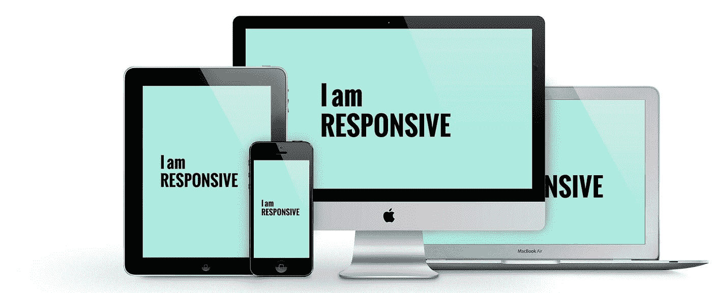
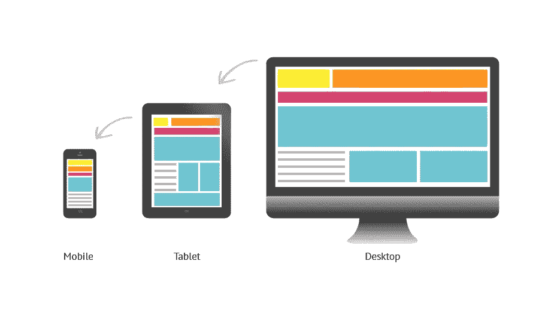
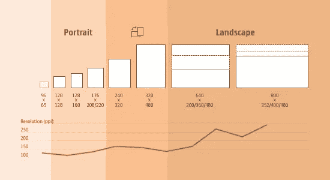
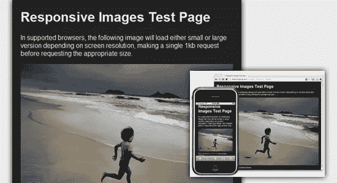
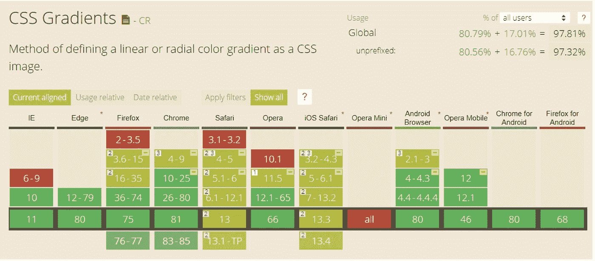

# 回应的艺术

> 原文：<https://blog.devgenius.io/the-art-of-being-responsive-19a880eff39?source=collection_archive---------16----------------------->

HTML/CSS 基础——响应式设计



# 响应式设计

你有没有在你的笔记本电脑上访问一个网站，然后在你的手机上访问相同的页面，并注意到它的格式完全不同，以适应屏幕？



或者，您是否曾经访问过一个网站，并被告知您的浏览器不支持某个组件？


笔记本电脑屏幕尺寸、电脑显示器、移动设备、平板电脑、电子阅读器等多种多样。作为设计师/开发人员，我们的工作是确保我们的内容在所有领域都受到欢迎。更复杂的是，不同类型的浏览器之间也存在差异。



那么我们如何应对维度的变化呢？

一旦你开始写 CSS，你会很快意识到你可以控制所有元素的大小。此时，您可能想用像素或其他度量单位来硬编码尺寸。这对于像字体大小或按钮这样的东西来说可能很好。然而，现在作为一名程序员，你可能已经开始了解到硬编码通常不是很抽象，会导致限制和错误。您可以通过实现相对大小和位置来纠正这一点。

在下面的例子中，你可以用 px 代替 css 中的%,来设置相对于其他组件的大小。

```
img { max-width: 100%; }
```



当然，在某些情况下，您可能希望图像大小保持不变。可能内容缩小了就变得不可分辨了。也可能是分辨率低，无法拉伸到一定尺寸以上。在这种情况下，您可以对像素大小进行编码。


我还提到了不同浏览器之间的差异。下面是一个在广泛使用的浏览器中需要特别注意的组件的例子。Chrome、Safari、Firefox、Opera，当然还有最大的罪魁祸首 Internet Explorer。


实现梯度

**微软过滤器和扩展** — Internet Explorer 是最难支持的，因为你需要三种不同的线路来支持不同的浏览器版本。要获得上述从灰色到白色的渐变，您需要编写:

```
/* IE 5.5–7 */
filter: progid:DXImageTransform.Microsoft.gradient( startColorstr='#999999', endColorstr='#ffffff', GradientType=1);
/* IE 8–9 */
-ms-filter: "progid:DXImageTransform.Microsoft.gradient(startColorstr='#999999', endColorstr='#ffffff', GradientType=1)";
/* IE 10 */
-ms-linear-gradient(left, #999999 0%, #ffffff 100%);
```

**Mozilla 扩展**—*-moz-*扩展的工作方式类似于 CSS3 属性，只是使用了扩展。要获得 Firefox 的上述渐变，请编写:

```
-moz-linear-gradient(left, #999999 0%, #ffffff 100%);
```

**Opera 扩展**—*-o-*扩展为 Opera 11.1+增加了渐变。要获得上述梯度，请写出:

```
-o-linear-gradient(left, #999999 0%, #ffffff 100%);
```

**Webkit 扩展**—*—Webkit*—扩展的工作方式很像 CSS3 属性。要为 Safari 5.1+或 Chrome 10+定义渐变，请编写:

```
-webkit-linear-gradient(left, #999999 0%, #ffffff 100%);
```

还有一个旧版本的 Webkit 扩展，可以与 Chrome 2+和 Safari 4+配合使用。在其中，您将渐变类型定义为一个值，而不是属性名。要使用此扩展获得从灰色到白色的渐变，请编写:

```
-webkit-gradient(linear, left top, right top, color-stop(0%,#999999), color-stop(100%,#ffffff));
```

下面是描述浏览器支持的图表。



如果你觉得这有趣或有帮助，请给我一些掌声，让我知道！如果有任何问题，请随时联系我，我很乐意帮忙。祝你编码好运！