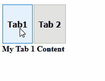
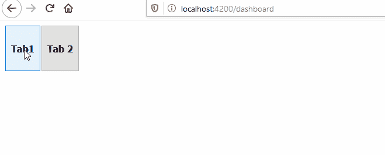
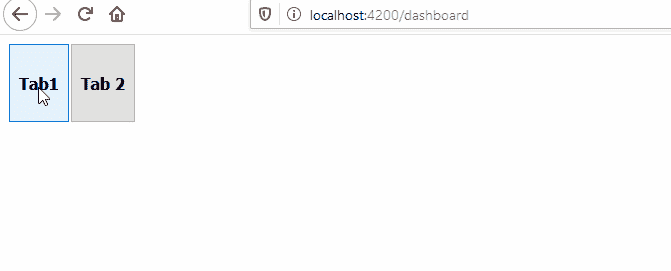
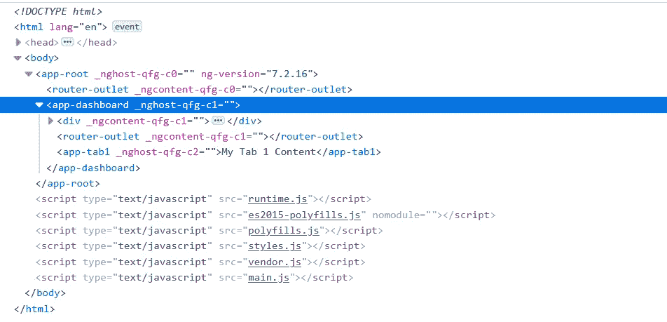

# 角形嵌套路由器插座的艺术

> 原文：<https://blog.devgenius.io/the-art-of-nested-router-outlets-in-angular-dafb38245a30?source=collection_archive---------0----------------------->

> 在设计您的 Angular 应用程序时，您会遇到这样一个场景:您将选项卡放在路由器插座中。现在，您希望在特定选项卡被选中时，通过使用 routes 来加载这些选项卡的内容。但是，如果您将该路由定向到您的主路由器出口，您的选项卡将变得不可见。这是需要嵌套路由器出口的一种情况。

## 因此，首先让我们在一个路由器出口上尝试一下，看看我们在谈论什么。

1.  让我们在 app.component.html 的**有一个路由器插座。**

2.并且有一个路由配置，用于显示带有选项卡的仪表板。

AppModule 的路由配置

3.一般来说，我们要做的是在 dashboard 中选择选项卡内容组件，并根据选择的选项卡显示它们。所以这将是我们的 dashboard.component.html

dashboard.component.html

4.它的工作和给我们的输出如下。

4.但是现在，假设我想让 tab1 和 tab2 基于 URL 加载，而不把它们的选择器放在 dashboard.component.html。因为在大型应用程序的情况下，我们可能会有许多选项卡及其内容。所以让我们改变我们的路线配置和 dashboard.component.html。

**app . module . ts 的路径配置**

**dashboard.component.html**

这应该可以，对吧？让我们看看我们收到的输出。

5.嗯…我们的网址正在改变，但我们的组件无法加载。哦，等等，让我们稍微改变一下我们的路由和配置。

**请注意我们是如何将仪表板组件移动到子路线的。让我们看看输出。**

嘿，我的账单呢。很奇怪，对吧？。因此，让我们讨论一下我们如何通过第 4 点中提到的路由配置来实现我们想要实现的目标。

6.嵌套路由器插座来拯救我们了。让我们看看第 4 点中的路由配置。

在这个配置中，我们的 URL 在改变，但是我们的组件没有显示，但是为什么呢？。

一旦我们将 Tab1 和 Tab2 组件路由定义为仪表板路由的子路由，我们的路由配置就代表了一个层次结构。当我们将仪表板组件定义为仪表板路由组件时。然后，子路由将尝试在仪表板组件中查找路由器出口。

因此，让我们在 dashboard.component.html 的路由配置中再添加一个路由器出口。

**dashboard.component.html**

**现在让我们看看输出**

有用！！。让我们也看看开发工具中的 DOM，以确保我们的两个路由器出口都在那里。

您可以在各种场景中从嵌套的路由器出口中获益。试想一下，如果你想在选择标签时延迟加载这些标签的内容，对吗？

> 要记住的要点是，每条路由在寻找各自的路由器出口时都会查看父路由。如果父路由分配了一个组件，那么该父路由的组件应该有一个路由器出口。如果父路径没有分配组件，那么它将进一步移动到层次结构的顶部，并选择最近的路由器出口。
> 
> 对于没有父路由和最近路由器出口的路由。将使用 app.component.html 内部的路由器出口。只要你能把路由配置想象成一棵树。嵌套路由器插座变得轻而易举。