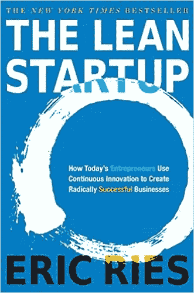
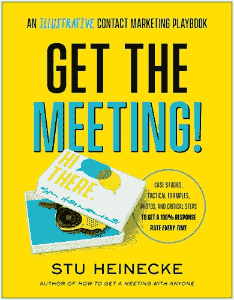
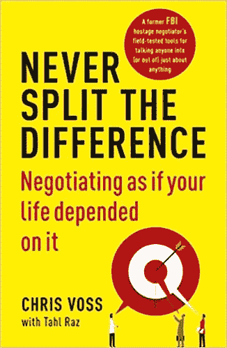

# 销售小型 IT 项目的艺术

> 原文：<https://blog.devgenius.io/the-art-of-selling-a-tiny-it-project-e3ad622c860?source=collection_archive---------7----------------------->

[rupixen.com](https://unsplash.com/@rupixen?utm_source=medium&utm_medium=referral)在 [Unsplash](https://unsplash.com?utm_source=medium&utm_medium=referral) 上拍照

作为一名程序员，在空闲时间构建小项目是必须要做的事情。

主要目标是测试那些有时可行并且你能赚很多钱的想法。

销售网站或应用程序的过程一直是一门艺术。

因此，在这篇文章中，我将告诉你销售一个小项目是什么样的，以及我认为任何人都可以这样做。

# 1.构建项目

根据许多成功的小企业创始人和连续创业者的说法。

不管出于什么原因，你最好的想法可能并不*完全*是你的客户想要的。

如果你把所有的资金都花在了一个不能让顾客购买的产品上，你的企业可能会在从失误中恢复过来之前就已经没钱了。

这是一个很大的风险，尤其是如果你用自己的积蓄来投资你的新家庭生意。

一个更谨慎的计划是从提供你听到的客户要求的基本版本开始，然后寻求反馈。

我读过的关于如何成功创业的最好的书之一是作者 Eric Ries 的《精益创业》。

精益创业:今天的企业家如何利用持续创新创造彻底成功的企业

# 2.会见买家

在一个相对非正式的场合做介绍是个好主意，比如商务午餐，这样双方可以互相了解一下。

这将有助于打破僵局，让你感觉更轻松。

重要的是不要让你的情绪妨碍你，因为这可能会影响买家的立场。

清楚地陈述你为什么想卖掉你的公司，并尽量保持客观。

买家可能会说一些让你心烦或生气的话，但如果发生这种情况，尽量不要表现出来。

会议期间，留出足够的提问空间。如果你不知道某个具体问题的答案，就说你会调查这件事，然后通过电子邮件告诉他。

不要回避谈论你的企业可能遇到的挑战。真正感兴趣的买家无论如何都会在尽职调查中发现，所以你最好把一切都公开。

我强烈推荐这本书:[获取会议！:一本说明性的联系营销行动手册](https://amzn.to/3nLbWFu)，里面有一套你召开会议所需的工具。

去开会！:说明性的联系营销行动手册

# 3.谈判价格

在谈判时，寻找能让你发挥优势的优势，但不要贬低对方获得胜利的热情。

当谈判结果不如预期时，从经验中学习。致力于变得更好。增加您的知识，了解如何根据正确的情况，使用正确的策略来使用正确的战术。

在评估你要与之谈判的人时，确保你观察并控制你的偏见。

我推荐这本书:[永远不要分割差异:谈判就像你的生命取决于它一样](https://amzn.to/3hnovEM)，它展示了如何在谈判时有效。

永远不要分割分歧:谈判就像你的生命取决于此一样

# 4.收到付款

如何安全地将代码兑换成现金？

我认为使用托管服务会更好。

他们有很多平台提供这种服务，比如:escrow.com

它是这样工作的:

*   买方转移到托管服务。
*   您将域名、用户和 Github 存储库转让给买方。
*   简短的视频通话解释代码。
*   买家有几天时间来尝试一切。
*   托管服务把钱转给你。

就这样，交易完成了。

# 结论:

我明白，要销售一个项目，你至少应该有一小部分观众。

所以，作为一个程序员，为了在互联网上赚钱，你必须有好的技术和好的市场营销。

一个好的策略可能是:

1.  建造你喜欢的东西
2.  写下这个过程
3.  吸引少量观众
4.  吸引机会(买家、客户、工作机会)

就这么简单。花几个星期写点东西，也许在你自己的博客上发表。

1 人们可能会读它，这太棒了。下一次可能是十次！

不断制造许多激起你兴趣的小东西，谈论它，伟大的事情就会开始发生。

**奖励:**

一个普通程序员的工作环境需要长时间坐在办公桌前，周围都是小工具。

这里的现实是，程序员很有可能患上某些健康疾病和与计算机相关的伤害。

从我的个人经历来看，我有时会因为长时间坐在电脑前，有时是错误的姿势，而患上背痛。

我推荐一款 [**姿势矫正器**](https://amzn.to/3lPCzYl) **来**恢复正确的姿势，有助于预防背部、颈部和肩部疼痛的发作。**姿势矫正器**有助于在坐着、站着、躺着或进行其他日常活动时调整姿势。

我每周写一篇关于编程的文章，感谢作为我的撰稿人在 [**patreon**](https://www.patreon.com/zelakioui) 上支持我:-)

# 推荐书籍

## [干净代码:敏捷软件技术手册](https://amzn.to/3j1lNWx)

## [头脑优先设计模式:一个对大脑友好的指南](https://amzn.to/3vG0Zbl)

## [清洁建筑](https://amzn.to/3cVvkfy)

# 计算机和显示器

## [新款苹果 MacBook Pro](https://amzn.to/3wOP10M)

## [戴尔 27 英寸 Ultrasharp U2719D 显示器](https://amzn.to/3zIcT7M)

## [双臂支架桌面支架](https://amzn.to/2SNdHI3)

## [USB C Hub 多端口适配器](https://amzn.to/2VfxiS6)

## 我用于编码的 IDE:

- IntelliJ
- Vscode