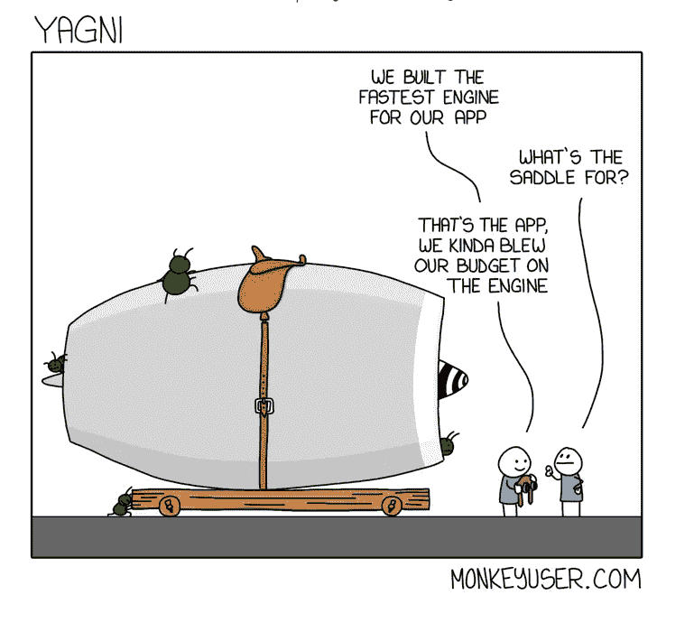

# 简单的艺术

> 原文：<https://blog.devgenius.io/the-art-of-simplicity-c0b381cc2b7f?source=collection_archive---------0----------------------->

[https://www.monkeyuser.com/2019/yagni/](https://www.monkeyuser.com/2019/yagni/)

每个人都在谈论简单，我们总是想创造简单的东西。但是简单就是为我们的实际问题创造最好的解决方案，而不是更多。找到真正要解决的问题通常是更复杂的事情。考虑到这一点，有些事情是我们无法改变的，我们无法针对要解决的问题的复杂程度做任何事情。所以我们的软件至少会和要解决的问题一样复杂。但是通常软件比试图解决的问题要复杂得多，这是因为我们不遵守 YAGNI 原则。

软件设计很难定义，但在某种程度上，我们可以说它与我们创建的所有抽象相关，以支持解决我们认为我们拥有的问题的算法。这个设计更多的是针对人而不是编译器。所以事实上，我们试图以某种方式塑造我们的代码，只是为了让它对下一个开发人员(或未来的我们自己)来说更容易维护。但是我们通常混淆了可维护性和可扩展性。我们决定在这里添加一个接口，或者在那里添加这个模式，以防将来我们需要添加一个新特性来解决一个主要问题。根据我的经验，意外的复杂性依赖于可扩展性。

## **偶然的复杂性**

它是由 Fred Brooks 在他的论文“没有银弹——软件工程中的本质和意外”中定义的。基本上，它指的是我们刚刚在软件中引入的所有复杂性，因为我们作为开发人员、产品所有者、经理等都很糟糕。所有让一个问题变得更加复杂的事情都与问题本身无关，而是与我们的工作方式、公司文化以及我们对未来的看法有关。

一些例子:

*   没有人使用的功能，但保留在系统中，因为我们不想删除一些我们不知道有多少人使用的功能。
*   死代码，不再执行的东西。
*   代码优化不能解决我们面临的实际情况。
*   [货物崇拜](https://en.wikipedia.org/wiki/Cargo_cult)。

在我看来，对软件设计有一个基本的误解，当我们说我们的设计应该准备好容易地改变时，我们不是在谈论创建一个所有部分都是可插拔的设计。记住肯特·贝克简单设计的四条规则很重要:

*   通过测试
*   揭示意图(应该容易理解)
*   无重复(干)
*   最少的元素(删除任何不符合前面三个规则的元素)

一个元素更少的设计比另一个没有解决真正问题的设计要好。事实上，当我们谈论易于改变的设计时，我们谈论的是:

*   当我们改变它时识别错误的能力→有一个好的测试套件来提醒我们错误。
*   理解之前存在的内容以及如何添加新功能的能力→清理代码。
*   引入快速变化和不重复概念的能力。→干燥原理
*   成为简单可行的设计的能力。→ YAGNI 原理

YAGNI 原理是为了避免创造一个设计来解决一个你没有的问题，这是对抗意外复杂性的方法。

## 复杂的面孔

YAGNI 应该在我们设计软件时指导我们，同时也指导我们选择解决什么问题。一个问题通常有许多不同的子问题，找到这些子问题并定义它们给我们机会选择首先做什么，并看看我们需要付出多少努力来解决我们的实际问题。有时候我们会在开发过程中理解问题的局限性。例如，假设我们想要为 backoffice 应用程序创建一个登录页面。我们可以考虑登录后勤办公室的所有不同选项:

*   谷歌账户
*   用户名/密码
*   脸书账户

如果我们决定实现所有的东西，我们需要等到所有的组件都准备好了，当我们开始收到反馈时(当代码在生产中时)，我们将冒险验证我们的大多数用户没有使用我们给他们的一些选项。

如果我们选择只实现一种可能的情况，并且我们用这种情况评估结果，我们可以决定是否在下一种情况上投入更多，或者仅仅是足够了。

在第一个场景中，我们将不得不在将来维护为公司很少使用的东西创建的代码，但是他们的工作与最常用的工作是一样的。这也是偶然的复杂性，作为开发人员，我们需要给公司机会来做出更好的决定来解决什么问题。YAGNI 在那里对抗偶然的复杂性，并遵循最后负责的时刻原则。

## 什么时候考虑未来？

如果我们的代码遵循简单设计的四个规则，那么我们可以增量地改变它(为了下周)。我认为这是一种习惯，我们只需要根据我们的功能、我们新的非功能性需求以及改变当前环境的一切来改变我们的设计。一个重要的考虑是，YAGNI 不是来制造混乱的，你需要一个可理解的设计来维护你已经创建的代码。软件设计成为 YAGNI 的唯一原因是因为系统一旦工作就不再需要维护。如果机器能够编写软件，它们将不再需要设计，设计是为人服务的。

所以总结一下:

> *做好准备。但为了明天，而不是明年。太晚决定是危险的，但是在快速变化的软件开发世界中，太早决定可能更危险。让最后责任时刻的原则成为你的指南。杰夫·阿特伍德—*[*https://blog.codinghorror.com/the-last-responsible-moment/*](https://blog.codinghorror.com/the-last-responsible-moment/)