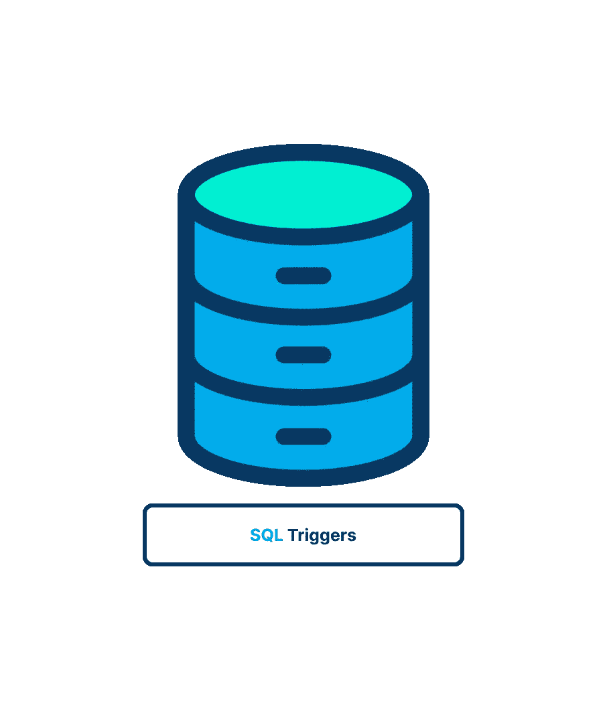
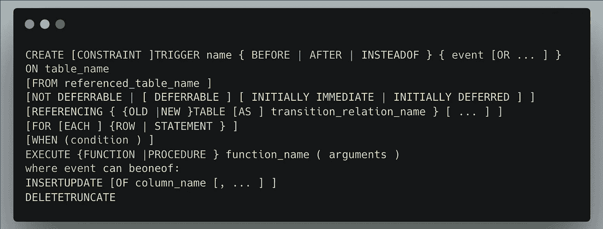
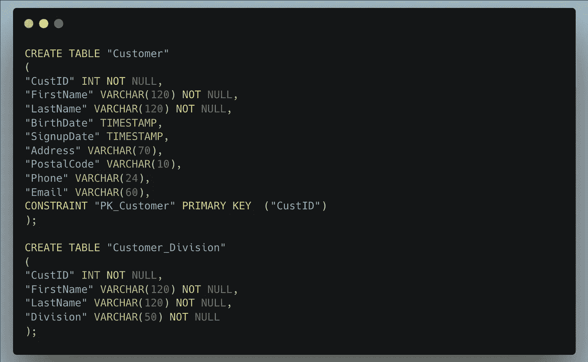
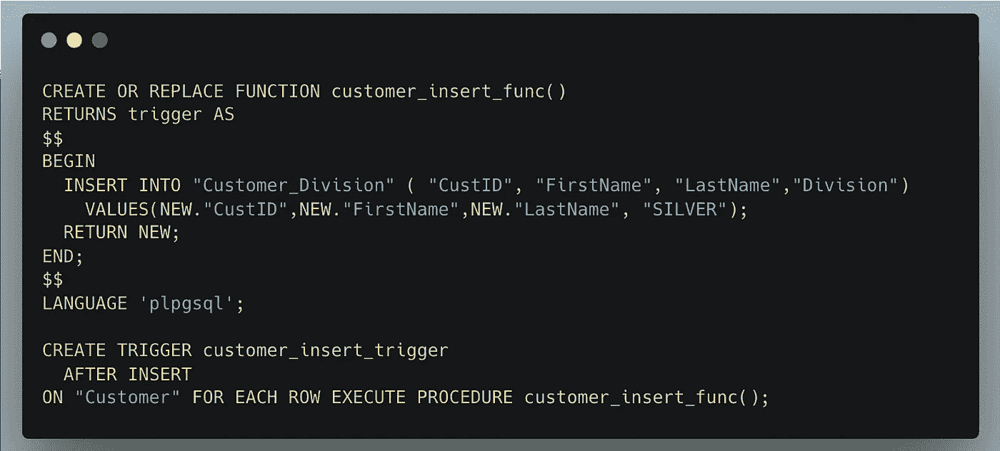
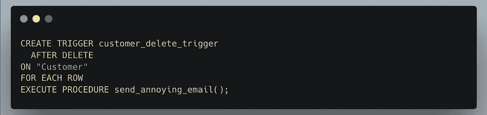
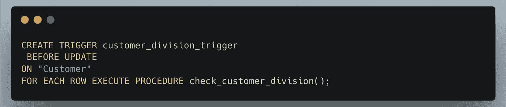
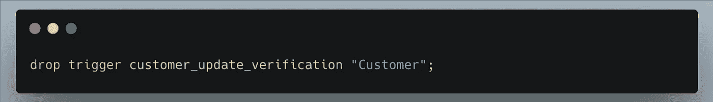

# SQL 触发器的惊人世界

> 原文：<https://blog.devgenius.io/the-astonishing-world-of-triggers-6d1effe33357?source=collection_archive---------16----------------------->

在本文中，我们将深入探究触发器，了解它们是什么，我们为什么使用它们，以及如何使用它们。🫡

# 🤨什么是触发器？

触发器是唯一的存储过程，每当发生特定的数据库活动时都会自动运行。在特定的表上，触发器可以连接到插入、更新、截断和删除动作(或其任意组合)。

触发器连接到特定的表，而存储过程只是存储的 SQL 语句。只有当向 Customers 表中添加一行时，才会激活与该表上的插入操作相关的触发器。类似于 Mobs 表，插入和更新操作的触发器只有在那些特定操作发生在该表上时才会被激活。

触发器可以在执行指定操作的之前或之后*执行。*

尽管 PostgreSQL 实现了 SQL 标准，但该数据库中的触发器包括以下独特的功能:

1.  [TRUNCATE]事件触发器由 PostgreSQL 触发。
2.  您可以在 PostgreSQL 中的视图上创建语句级触发器。
3.  虽然 SQL 标准允许您使用任何 SQL 命令作为触发器的动作，但 PostgreSQL 要求您编写一个用户定义的函数。

## **📝注意** : **约束比触发**快

尽可能使用约束代替触发器，因为它们通常处理起来更快。

# ⚔️触发器类型

行和语句级触发器是 PostgreSQL 提供的两种基本类型的触发器。这两种类型触发触发器的频率和时间是不同的。

1.  语句级触发器:无论更新多少行，对于每条语句，它只会调用一次触发器函数。
2.  行级触发器:触发器函数将为被触发器事件修改的每一行调用。

# 👨🏻‍💻触发器的使用

1.  执行额外的验证并撤销任何必要的数据更改，例如检查是否达到了客户的信用限额，如果达到了就停止插入。
2.  确保数据一致性，例如在插入或更新事务期间，将所有状态名改为大写。
3.  通过记录事件信息来跟踪表事务..
4.  基于对一个表的更改，对其他表采取行动；例如，每次修改或删除一行时，将审计跟踪记录写入日志表。
5.  强制检查约束。

# 🥸使用触发器

为了建立新的触发器，必须先定义触发器函数，然后才能将其链接到表。触发器和用户定义函数的不同之处在于，当触发事件发生时，会自动调用触发器。

*你可以在这个* [*里看到代码要点*](https://gist.github.com/LinuxDevil/4eeebb6c686fc84263e06ad34b3dcfd2)

创建触发器的语法如下:

*   **名称:**触发器的名字。同一表中的任何其他触发器都不会共享此名称。
*   **Before:** 表示该函数在事件之前被调用。
*   **之后:**表示我们正在利用事后功能。
*   **而不是:**表明我们使用函数而不是事件来进行调用。
*   **事件:**触发器将被任何事件触发，包括插入、更新、删除和截断。
*   **表格名称:**表格*或*视图*的名称*
*   **引用的表名:**这是与约束相关的其他表的名称。使用此选项只能定义约束触发器。
*   **可延迟、不可延迟、初始立即和初始延迟:**这是 PostgreSQL 触发器的默认时间。
*   **对于每一行:**将声明受触发事件影响的每一行将导致触发器的单次触发。
*   **For each statement:** 有了这个，就清楚了，对于受触发事件影响的每个语句，它只会被触发一次。
*   **条件:**决定触发功能将被执行的布尔表达式。
*   **功能名称:**用户提供的功能。
*   **Arguments:** 这是提供给函数的可选逗号分隔参数，然后触发器执行。
*   该函数在以下兼容语言中定义:
    1。PL/pgsql
    2。PL/Python
    3。Pl/ Java

有关更详细的描述和可用选项，请查看 [PostgreSQL 文档](https://www.postgresql.org/docs/12/sql-createtrigger.html.)

## 📱插入触发器

当使用 INSERT 语句向表中添加新记录时，将调用 INSERT 事件触发器。

让我们看一个创建新触发器的例子。在本例中，我们将创建一个名为“Customer”的新表，如下所示:

每当新的客户记录被添加到“客户”表中时，为了向“客户部门”表中添加一个条目，我们必须首先建立一个*触发器*。

插入触发函数并创建触发命令:

## 🗑删除触发器

删除事件触发器，可以添加到删除记录的事务中。

## 🤖更新触发器

UPDATE 事件触发器在 UPDATE 语句执行时被调用。

## 🫳🏼掉落触发器

DROP TRIGGER 用于删除触发器。

## 🛒上市触发因素

您可以从 **pg_trigger** 表中列出当前数据库中的所有触发器，如下所示:

上面给出的 PostgreSQL 语句将列出所有触发器。

## ⚠️需要记住的要点

1.  为了在表上建立触发器，用户需要对表具有 trigger 特权，对 TRIGGER 函数具有 EXECUTE 特权。
2.  您可以通过检查系统目录“pg trigger”来查找数据库的当前触发信息。
3.  如果您创建了多个触发器，则针对同一事件的同一对象上的多个触发器将按名称列出的顺序触发。
4.  每当数据库对象(如表)上发生数据库事件时，就会激活一个称为 PostgreSQL 触发器的自动函数。
5.  触发器只在为其创建的数据库对象的生存期内存在，如果数据库对象被删除，触发器也将被删除。

> 我希望你发现这篇文章有用和有趣的❤️