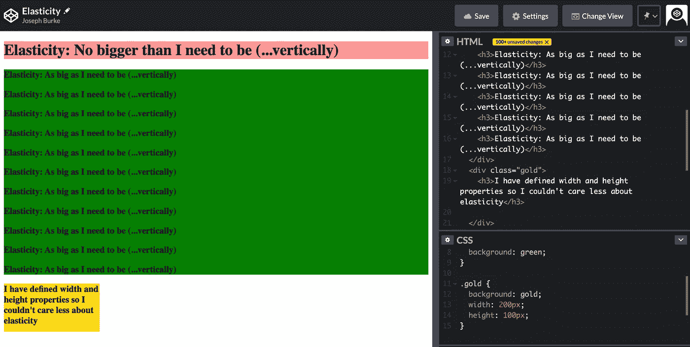
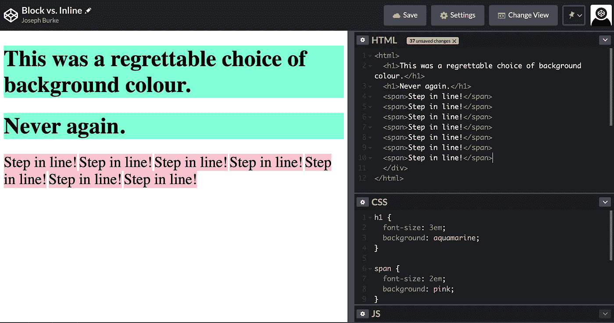
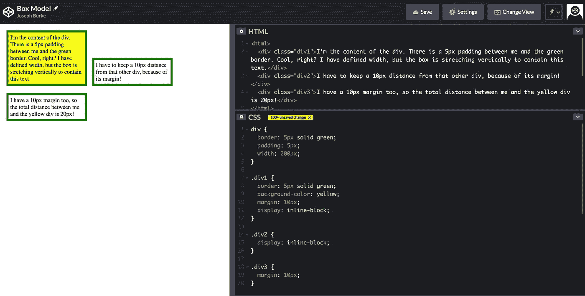
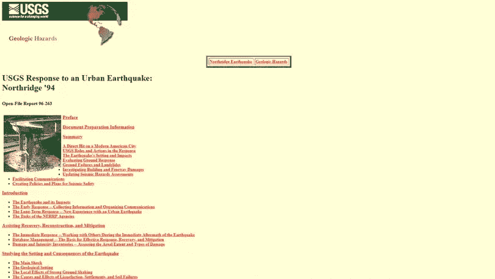
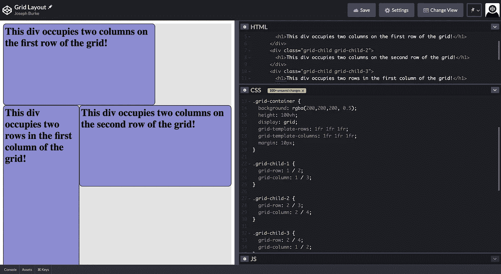

# It 的基本框架:掌握 CSS 定位基础

> 原文：<https://blog.devgenius.io/the-bare-bones-of-it-mastering-css-positioning-fundamentals-43077f27cbc4?source=collection_archive---------24----------------------->

CSS 定位属性对于网页来说就像骨骼对于身体一样。

软件开发人员普遍认为，在学习编程方面取得进步的最佳方式是“边做边学”，任何与软件开发人员交谈过的人都可以证明这一点。我不是来争论这个的。

相反，作为一名开发人员，在显然将是一个漫长的——可能是一生的——学习之旅的开始，我已经亲身经历了在我的 Web 开发课程中基于项目的教育所带来的显著的学习加速。

但我也目睹了只关注项目最终目标的 web 开发新手如何养成坏习惯和笨拙的解决问题的方法，变得过度依赖熟悉但不合适的技术，而更干净、更强大、更符合逻辑的替代方法却被忽视和使用。

虽然看起来很简单，但是定位是 CSS 学习者特别喜欢的一两种方法。正如我对 Flexbox 定位所做的那样，许多学生变得过于依赖一种放置和移动元素的方式，而没有意识到还有其他技术可以让他们的生活变得更加轻松。

尽管我承认这不是 CSS 最迷人的一面，但我向你保证:**如果 CSS 有一个领域让你感到无比自信，那就是定位。**

CSS 定位属性对于网页来说就像骨骼对于身体一样。你想在你的网站上看到的所有内容、功能和美学都依赖于你的 CSS 定位基础提供的坚实结构。

因此，如果你曾经发现自己一个像素一个像素地浏览网页的各个部分，或者想知道是否有更简单的方法来用同样大小的链接填充一个响应性的导航栏，那么你就在正确的地方来填补你的知识空白，并逐步掌握真正的 CSS 定位。我们开始吧。

## 随波逐流

问题:上次忘记链接 HTML 和 CSS 文件时，你的页面是什么样子的？

除了您精心选择的字体、背景和边框消失之外，您可能还注意到，在没有任何 CSS 定位属性的情况下，您的许多元素突然想要沿着屏幕的左侧排队。这是为什么呢？

你看到的是一种叫做**“正常流动”**的东西。对于一个网页来说，重力就像是我们在地球上的生活:一种很容易被克服的微弱力量，一种如此普遍的力量，以至于你会忘记它的存在，但在没有任何干扰的情况下，它往往是解释事物为什么运动或为什么不运动的主导因素。

正常流量是你的朋友。

## 一块……元素有多长？

从广义上来说，一个元素就是*——只要它需要多大就有多大。*

*与我的第一印象相反，元素不只是随机的大小。一般来说，它们表现得像橡皮筋。首先，他们紧紧围绕他们的内容。然后，它们符合任何给定的盒子模型尺寸属性，比如宽度/高度和填充。然后他们会停下来，不再多要一个像素。

虽然这是一个健全的工作原理，但这种弹性也有很多常见的例外。定义了宽度和高度的元素牺牲了它们的包装行为，flexbox 和 grid 项目也偏离了这个原则。但是这个弹性原理的第一个也是最明显的例外是块元素。*

**

*块级元素的行为类似于弹性…垂直。*

## *块与内联:块中的新成员*

***Block** 和 **Inline** 是两种类型的*块格式上下文，*也就是只是一些行话，基本上意味着所谓的“Block”元素在页面上的行为和排列方式与所谓的“Inline”元素不同。*

*简单来说，**块元素的行为像段落，而行内元素的行为像单词**。在英语中，每个单词位于前一个单词的右边，而每个段落位于前一个段落的下面。

那是因为文字和行内元素一样，可以共享一个水平空间，而段落和块元素则不能。

这就解释了为什么，你第一次写< h1 > Hello World！想用蓝绿色的背景使它更有活力，蓝绿色的背景从左到右贯穿了整个网页。*

*除了展示海蓝宝石色是多么糟糕的选择之外，这也表明块元素并没有*而不是*环绕其内容的宽度，而是延伸到其父容器的宽度。*

**

*向所有海蓝宝石迷道歉*

# *与*

*和*

*一样，默认情况下是一个 block 元素，因此尽管包含两个单词，它占据了容器的整个宽度，因此任何后续的子元素都将被迫坐在它的下面。但是，不要忘记，即使是贪婪的块元素也会换行到其内容的*高度*，除非另有指示。*

*其他元素，比如默认为内联元素，收缩到其内容的高度*和宽度*。事实上，内联元素是如此“有弹性”，以至于它们的大小甚至不能用显式的高度和宽度属性来改变！*

*尽管它们会增长以适应填充，但内联元素也会忽略顶部和底部的边距——更多内容将在后面介绍。*

*块元素*可以*获取宽度和高度属性，但是如果没有它们，它们将只能换行到其内容的高度，并伸展到其容器的整个宽度。*

*然而，尽管默认情况下是内嵌的，并且默认情况下*

# *、*

*和*

*是阻塞的，但是任何元素都可以将其显示值定义为“任一”来改变其行为。*

## *在盒子里思考*

*我就这么说一次:**每个元素都是一个盒子**。*

*不要被现代网页设计的烟雾和镜子所迷惑。如果不是盒子，就不是元素。如果它看起来不像一个盒子，它就是。这句话是一个盒子，这段话是一个盒子，本文中的图片都是盒子，甚至网页本身也是一个盒子。这些盒子中的每一个都由四个部分组成，实际上是四个子盒子，像俄罗斯洋娃娃一样一个放在另一个里面:内容盒、填充盒、边框和边距盒。虽然它们都很重要，但我们在定位元素时经常使用的是边距和填充。但是让我们从头开始。我指的是中间。*

***内容框**是元素的核心。当我们谈论“包装”其内容的元素时，这是我们正在谈论的内容的基本区域。如果没有填充，这个内容区域将(通常)是盒子的整个区域。你说什么是填充？很高兴你问了。

**填充**很简单。它回答了这样一个问题，“这个元素应该离它的内容多近？”。元素*希望*占用尽可能少的空间，尽可能紧密地包装它的内容。因此，当 padding 为 0 时，没有什么可以阻止元素换行到它的内容，这正是它要做的。

但是增加填充意味着内容和元素的边框之间必须保持一定的距离。如果一个元素被紧紧包裹，然后应用填充，那么该元素的总面积将被迫增加，因为内容的大小是相同的，但是现在将边框“推”得离它更远。但是你说这个边界是什么？

很高兴你问了。**边框**将元素框的“内部”与“外部”分开。它取决于元素面积的限制。而且，虽然它通常是一个非常窄的区域，但重要的是要问:边框本身是在盒子内部还是外部？

很高兴你问了。答案是，两者都可以。默认情况下,*认为边框在盒子外面，但是 box-sizing 属性可以用来改变这一点，并且可以根据具体情况使计算盒子的真实大小变得更加容易。**

## *边缘:无人之地*

***Margin** 是盒子模型拼图的第四块，可能是四块中最有可能被用作定位工具的一块。为什么会这样？*

*在正常的流上下文中，边距做的工作类似于填充，但是边距不是保持内容和框的边缘之间的距离，而是位于框的之外的*，使*其他*框保持一定距离。为了适应边距要求的距离，页面上的元素会向左、向右或任何需要的方向移动，以确保保持那些无人地带的距离。**

*页边距不可折叠，这意味着两个页边距*不能*重叠。如果一个元素的边距要求它与任何其他元素保持 10 像素的距离，而下一个元素的边距要求它与任何其他元素保持 15 像素的距离，那么这两个元素将拒绝相距小于 25 像素的距离。*

**

*边距可用于放置元素之间的距离*

## *位置，位置，位置*

*现在我们清楚了元素是盒子，它们通常遵循这种称为“正常流动”的力，让我们看看它们什么时候不遵循。*

*position 属性有五个可能的值，其中一个我们已经知道:static。*

***静态**是位置属性的默认值。意思是“按正常流程走就行”。静态定位的元素是所有元素中最顺从的。*

*下一个值是相对于的**。相对定位的元素也非常顺从，但是可以说服它们使用像 top、right、bottom 和 left 这样的偏移属性来打破规则。***

*根据正常流程，相对定位的元素首先位于它们应该在的位置，但是从那里开始，它们将根据已经给定的任何偏移属性向其他方向平移。*

*第一个真正恶作剧的位置值是**绝对**。*

*这些元素*只有*服从偏移属性，并且*在正常流程*之外。绝对定位的元素根本不能“看到”正常流动的元素，它们的边距不会推开任何其他元素(除了它们的父元素)。*

*但是如果相对定位的元素以它们的“正常流动”位置作为偏移的起点，*绝对定位的元素从*偏移什么？*

*好吧，从他们最近的“非静态祖先”开始。这可能是它们的母元素，也可能只是身体。不管是哪一个，它们的行为就好像它们是该容器的第一个也是唯一的子元素，并将自己放在它的左上角，然后按照指示从那里偏移。*

*第四个位置值是**固定的**。这些元素，像它们绝对定位的表亲一样，也脱离了正常的流程。但是，当绝对元素相对于它们的直接祖先定位它们自己时，固定元素相对于*视口*定位它们自己。没错。滚动网页对于一个固定的元素来说毫无意义。告诉它坐在屏幕的左侧，它就会一直在那里。*

*位置属性的最后一个选项是组中的年轻人。仅使用 CSS3 到达现场，**粘性**定位结合了相对定位和固定定位的行为。它将保持在其相对定位的位置，直到用户的滚动将它移动超过其“允许的”偏移(例如，top: 0px)，在这一点上，它“坚持”视口以遵守该偏移规则。*

*到目前为止，我们的定位选项要么是具有边距和填充的“流入”，要么是具有非静态定位和偏移的“流出”。*

*关于自然元素行为的基本信息*是绝对必须知道的*。但是仅仅使用这些有点笨拙的定位方法建立的网站看起来会有点……90 年代。*

**

*美国地理调查局 1994 年的开创性网站*

*对我们来说幸运的是，现在有几个其他主要的、得到很好支持的定位技术，它们离“正常流量”和 90 年代的网站已经很远了。*

*先说网格。*

## *网格和广场*

*对于一个网络开发新手来说，网格是最强大的二维定位系统。使用网格，您可以将容器划分为任意大小的网格行、网格列和网格单元，然后只需告诉子元素要占用哪些区域！*

*网格布局可以夸耀的其他优势包括它们对屏幕尺寸的卓越响应能力。他们可以使用**百分比距离单位**根据容器的宽度/高度来定义行和列的宽度。或者他们可以使用**网格特有的 fr 单元**，它是“自由空间的单元”，基本上指示网格在 fr 单元的行和列之间按比例划分*未占用的*空间。*

*网格的力量存在于宏观结构中。当 flexbox 或正常流程定位完全胜任工作时，许多较小的容器不需要网格定位。但是用边距、偏移量、浮动、甚至 flexbox 来布局整个网页会变得异常复杂，就像用火柴棍搭建一个小木屋一样。*

*通过允许网格控制大比例，然后用填充、边距、偏移量等微调位置。，您可以发挥每种方法的优势，并保持代码的整洁和可靠。*

**

## *Flexbox*

*虽然网格是二维布局系统，但 **flexbox** 定位最适合一维环境。*

*柔性盒容器具有主轴和横轴。例如，在水平导航栏中，主轴应该是从左到右，而横轴应该是从上到下。*

*柔性项目会自动消耗*十字*轴*轴*上所有可用的空间。利用 flex-basis 和 flex-grow 等属性可以非常精确地控制*主轴*上的空间如何分布，这些属性指示 flex 项应该扩展多少来填充空白空间。或者可以使用 justify-content 属性将空间留空并分布在项目之间的间隙中。对于 flexbox，一个项目的大小没有它相对于所在空间的大小重要，也没有它与其他项目共享空间的大小重要。*

*Flexbox 非常出色。结合媒体查询、响应测量单位和 flex-wrap 属性，flexbox layout 可以让导航栏和其他容器在拉伸或收缩时无缝适应。然而，在一维布局环境中，在网格擅长的大规模结构化和填充和边距提供的“最后润色”洗牌之间，它们真正发挥了自己的作用。*

**

## *结论*

*我相信这篇文章的内容代表了一些关于 CSS 定位的最重要的概念和工具，即使没有涉及到 floats、z-index 或不同定位规则交互的无数小方法——我目前每天至少发现其中的一些。*

*但是，比理解可供您使用的概念和工具更重要的是，直觉告诉您什么时候适合使用不同的定位方法。定位方法没有“好”和“坏”之分，只有“这个好”和“那个不好”。*

*web 开发的新手——我在这里说的是第一手经验——很容易被 CSS 更华丽的方面，它的颜色和背景，它的视频和图像，它的字体和边框所迷惑，以至于他们忽略了真正花时间去理解他们构建的每个网页上的定位机制。我认为他们应该这么做。*

*掌握定位基础意味着知道你的工具是什么以及何时使用它们。本文中涉及的一些技术对你来说可能非常熟悉，但是我相信避免过度依赖你最有信心的领域意味着多样化你的工具包，这只会提高你创建的网站的质量和你创建网站时的乐趣。*

*我在这篇文章的开头引用了那句神圣的话:“边做边学”，最后我要再次说，我对这个想法有着巨大的信心。陷进去。想一件你希望存在的事情，并成为那个把它变成现实的人。真的没有更好的学习方法了。*

*但对于这个建议，我想补充一点:通过学习来做。不要拘泥于自己的方式，要对其他方式感到好奇。不要拘泥于舒适的事物，而要适应其他事物。不要和你的弱点谈判，直接冲向他们！因为在开发这样的领域，总有更好的方法。所以去找吧。*

## *进一步阅读*

*[这个**CSS-Tricks**flex-box 规则的图形化解释](https://css-tricks.com/snippets/css/a-guide-to-flexbox/)应该获得 flexbox 规则图形化解释的某种奖项。太好了。*

*虽然不是“深入阅读”，但 Chrome 的 [**杀虫剂**](https://chrome.google.com/webstore/detail/pesticide-for-chrome/bblbgcheenepgnnajgfpiicnbbdmmooh) 绝对是我定位游戏的游戏规则改变者。只需点击一个按钮，这个浏览器扩展就能让你看到你正在浏览的页面上每个元素的轮廓。过会儿谢谢我。*

*这些免费提供的 **Odin 项目**课程是关于[网格](https://www.theodinproject.com/courses/html-and-css/lessons/grid)、 [flexbox](https://www.theodinproject.com/courses/html-and-css/lessons/flexbox?ref=lnav) 和[浮动](https://www.theodinproject.com/courses/html5-and-css3/lessons/floats-and-positioning?ref=lnav)更多细节的极好资源。*

*我也可以强烈推荐在 [**Codepen**](https://codepen.io/) 上坚持一些好的音乐，用不同的定位方法概念来玩。*

*最后但并非最不重要的是，一些独立的项目 freeCodeCamp 的 Responsive Web Design Certificate 是一个很好的方法来实现所有的定位。*

*快乐定位！*