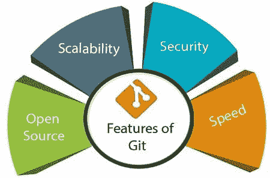

# 针对初学者的 Git 基础知识(第 1 部分)

> 原文：<https://blog.devgenius.io/the-basics-of-git-for-beginners-part-1-52cae2c3daef?source=collection_archive---------21----------------------->

# 围绕 Git 基础知识的博客

# 介绍

Git 是互联网上最重要和最常用的开源软件包之一。如果你曾经想知道 Git 是什么，或者你甚至在第一时间听说过 Git，那么这篇博文就是为你准备的。

# Git 是什么？

Git 是一个版本控制系统，用于跟踪计算机文件的变化。它通常用于软件开发中的源代码管理。在现代软件开发领域，Git 是最受欢迎的工具之一。这是一个开源版本控制系统，旨在用于软件开发。

# Git 是做什么的？

*   使用存储库管理项目
*   克隆项目以在本地副本上工作
*   通过准备和提交来控制和跟踪变更
*   分支和合并，以允许在项目的不同部分和版本上工作
*   将项目的最新版本提取到本地副本
*   将本地更新推送到主项目

# Git 的优势

1.  追踪历史
2.  免费和开源
3.  支持非线性开发
4.  创建备份
5.  可攀登的
6.  支持协作
7.  分支更容易
8.  分布式开发
9.  节省时间
10.  离线工作

# 使用 Git

以下是如何使用 Git 的基本概述:

*   在文件夹上初始化 Git，使它成为一个存储库
*   Git 现在创建一个隐藏文件夹来跟踪该文件夹中的更改
*   当文件被更改、添加或删除时，它被认为是修改过的
*   选择要转移的已修改文件
*   提交暂存文件，这将提示 Git 存储文件的永久快照
*   Git 允许我们看到每次提交的完整历史
*   您可以恢复到任何以前的提交
*   Git 不会在每次提交中存储每个文件的单独副本，它会跟踪每次提交中所做的更改！

# Git 工作流

Git 工作流分为三种状态:

*   工作目录:已修改的文件，但未被跟踪，尚未准备好提交
*   暂存目录:将修改过的文件添加到暂存环境意味着它们已经准备好提交。
*   已提交:保存在提交历史记录中的临时区域中的文件快照

# Git 的安装

1.  搜索“下载 git”
2.  转到*'*[*git-scm.com/downloads*](https://git-scm.com/downloads)*'*
3.  为您的操作系统(Windows/Linux/Mac)下载安装程序

1.  找到与您的操作系统[兼容的版本。在我们的例子中，它是 Windows x64。](http://system.in/)

1.  点击链接。指定文件夹后，下载将开始。

1.  之后，转到下载文件所在的文件夹并运行它。
2.  选择安装路径并继续。
3.  继续选择组件时，选中附加图标复选框。以后会简化使用。

1.  继续安装。
2.  将安装过程中提供的所有设置保留为默认位置，直到最后一步——完成 Git 安装向导。

1.  选中启动 Git Bash 复选框。将来，您将能够使用桌面上的图标运行该程序。

1.  取消选中查看发行说明复选框。我们现在不需要它。

# 结论

感谢您阅读这份完整的 Git 版本控制指南。无论你是初学者还是更有经验的用户，我们希望本指南能帮助你理解 Git 的基础知识。我们将在 Git 上添加更多信息。如果你觉得这个指南很有帮助，请点赞、分享并关注我们，以便将来有更多类似的博客帖子。