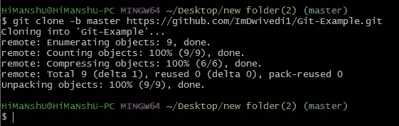
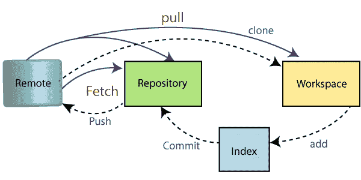

# 针对初学者的 Git 基础知识:(第 2 部分)

> 原文：<https://blog.devgenius.io/the-basics-of-git-for-beginners-part-2-c19de1fee4cf?source=collection_archive---------12----------------------->


# 介绍

Git 是互联网上最重要和最常用的开源软件包之一。如果你想开始使用 Git，或者想提高你的 Git 技能，这个博客是为你准备的。在这篇博客中，我们将为初学者讨论 Git 的基础知识。我们将介绍 Git 的基础知识，比如创建存储库、添加文件和提交更改。我们还将讨论一些最常见的 Git 命令。因此，如果您准备好了解 Git，请继续阅读！

# 一些基本的 Linux 命令

*   `mkdir folder/`:制作目录
*   `cd folder/`:变更目录
*   `rmdir folder/`:删除目录
*   `ls`:列表目录
*   `pwd`:打印工作目录
*   `touch text.txt`:创建 text.txt
*   `rm text.txt`:删除 text.txt
*   `mv a.txt folder`:将 a.txt 移动到文件夹
*   `history`:命令历史
*   `clear`:清除终端

# Git 配置

我们第一次使用 Git，我们必须告诉 Git 关于我们的事情。我们做出的所有承诺都有关于我们的信息。

*   `git config -- global user.name` :向 Git 提供我们的名字

```
$ git config -- global [user.name](http://user.name/) "User_Name"
```

*   `git config -- global user.email` :向 Git 提供我们的电子邮件

```
$ git config -- global [user.email](http://user.email/) "[Useremail@test.com](mailto:Useremail@test.com)"
```

*   `git config –global alias`:创建 Git 命令的快捷方式。
*   `git config --list`:显示已配置的凭证列表

# 跟踪存储库

建档后，我们要跟踪。

*   `git status` :显示当前目录的状态。新创建的项目没有用 git 初始化。
*   `git init`:初始化一个空的 git 仓库。新的。git 文件夹是自动生成的。使用 ls-a 列出目录中的所有文件和文件夹。此文件夹(。git)是隐藏的。
*   `git add -A`:添加到暂存区的所有文件
*   `git add file.py`:仅将此文件添加到暂存区。
*   `git commit -m "Initial Commit"`:所有文件提交！
*   `git commit`:这将打开一个活动的 vim 编辑器。按“我”他们把提交信息
*   `git log`:显示提交列表。

# 磨尖

Git 可以将存储库历史中的某些特定点标记为重要。这标志着一个发布版本。

```
git tag -a v.1.0 -m "first version of software"
```

它创建了一个名为 v.1.0 的标签。

*注意:*我们可以做多个标签

`git tag`:显示标签列表。

`rm -rf .git` :删除。git 文件夹{非常小心地使用此命令}

`git commit -a -m "My Commit"` :将文件添加到暂存区并提交。

未跟踪的文件不支持此命令。## Git Clone 命令 Git Clone 是一个命令行实用程序，用于制作远程存储库的本地副本。它通过远程 URL 访问存储库。通常，原始存储库位于远程服务器上，通常来自 GitHub、Bitbucket 或 GitLab 等 Git 服务。远程存储库 URL 被称为源。*语法:*

```
$ git clone
```


# Git 克隆存储库

假设，您想从 GitHub 克隆一个存储库，或者拥有一个现有的存储库，该存储库属于您想为之做出贡献的任何其他用户。克隆存储库的步骤如下:

*   打开 GitHub 并导航到存储库的主页。
*   在存储库名称下，单击克隆或下载。


*   选择“使用 HTTPs 克隆”部分，并复制存储库的克隆 URL。对于空存储库，您可以从浏览器中复制存储库页面 URL，然后跳到下一步。


*   打开 Git Bash，将当前工作目录切换到您想要创建存储库本地副本的位置。
*   使用带有存储库 URL 的 git clone 命令来制作远程存储库的副本。请参见下面的命令:

```
$ git clone [github.com/ImDwivedi1/Git-Example.git](https://github.com/ImDwivedi1/Git-Example.git)
```


# 将存储库克隆到特定的本地文件夹中

Git 允许将存储库克隆到一个特定的目录中，而不需要切换到那个特定的目录。您可以在 git clone 命令中将该目录指定为下一个命令行参数。请参见下面的命令:

```
$ git clone [github.com/ImDwivedi1/Git-Example.git](https://github.com/ImDwivedi1/Git-Example.git) "new folder(2)"
```


给定的命令与前一个命令做同样的事情，但是目标目录被切换到指定的目录。

# Git 克隆分支

要创建克隆分支，您需要使用-b 命令指定分支名称。下面是克隆特定 git 分支的命令的语法:*语法:*

```
$ git clone -b {branch name} {Repository URL}>
```

请参见下面的命令:

```
$ git clone -b master [github.com/ImDwivedi1/Git-Example.git](https://github.com/ImDwivedi1/Git-Example.git) "new folder(2)"
```



在给定的输出中，只有主分支是从主存储库 Git -Example 中克隆的。

# 将文件推送到 GitHub

我们可以把我们的代码从 bash 推送到 GitHub 建议我们什么都不要提交]

1.  *创建新的存储库:*您需要创建一个新的存储库，然后单击加号。填写所有必需的详细信息，即存储库名称和描述，同时公开存储库，因为它是免费的。


1.  *打开你的 Git Bash*
2.  *在桌面上创建指向当前工作目录的本地项目:*移动到本地计算机中的特定路径`by cd 'path_name'`。`cd`命令用于切换到你的操作系统中的工作目录，定位你的文件，需要给出`'path_name'`，即`C:/Users/Dell/Downloads/FaceDetect-master`。该命令可以识别您要处理的所需文件。


1.  初始化 git 存储库:使用`git init`命令初始化 gir 存储库


1.  将文件添加到新的本地存储库中:在 bash 中使用`git add .`将所有文件添加到给定的文件夹中。在 bash 中使用`git status` 来查看所有将要提交到第一次提交的文件。


1.  通过编写提交消息来提交存放在本地存储库中的文件


1.  从 GitHub 复制您的远程存储库的 URL:


1.  添加复制的 URL，这是您的远程存储库，存储库中的本地内容将被推送到该存储库

```
git remote add origin 'your_url_name'
```

1.  将本地存储库中的代码推送到 GitHub

```
git push -u origin master
```


1.  查看托管在 GitHub 上的存储库中的文件


# 拉取请求

如果您在存储库中进行了更改，GIT PULL 可以允许其他人查看这些更改。

从分支提取的简单命令是:

```
git pull 'remote_name' 'branch_name'
```


下图演示了 pull 在不同位置之间的作用，以及它与其他相关命令的相似性或差异性



# 通过命令行拉请求

1.  派生存储库:


1.  在您的计算机中打开 bash:


1.  创建新分支:

```
git checkout -b 'branch_name'
```

1.  通过使用 bash 中的 vim 或直接替换原始的 README 文件来进行更改


1.  向存储库添加和提交文件


1.  将存储库推送到 GitHub

```
git push origin 'branch_name'
```

1.  GitHub 上特定分支的拉请求:


1.  打开一个拉式请求:


# 通过 GitHub 桌面拉请求

1.  克隆并打开到桌面:


1.  创建新分支:


1.  在文本编辑器中对 imp 文件进行更改:
2.  提交更改:


1.  发布分支:


1.  创建拉式请求:


# 合并拉取请求后删除分支

*   您需要转到存储库的主页，然后单击“Pull requests”。


*   您需要单击“Closed”来查看您所做的所有拉取请求的列表，但目前只有一个请求需要选择。您要删除的是与您的分支相关的文件。


*   现在，您可以单击“删除分支”来完成操作。


*   所有者现在单击“合并拉取请求”。此外，他/她将通过以下过程单击“确认合并”。


*   下面是对 [README.md](http://readme.md/) 文件进行的最后一次修改，并纠正了一个错别字。


# 结论

感谢您阅读这份完整的 Git 版本控制指南。无论你是初学者还是更有经验的用户，我们希望本指南能帮助你理解 Git 的基础知识。我们将在 Git 上添加更多信息。如果你觉得这个指南很有帮助，请点赞、分享并关注我们，以便将来有更多类似的博客帖子。