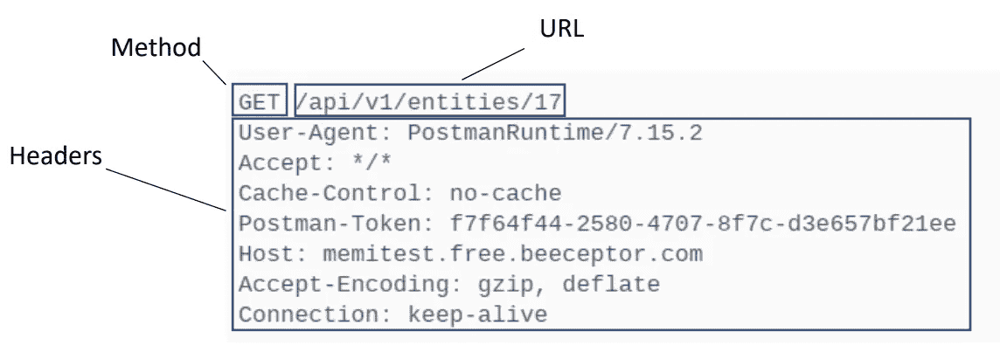
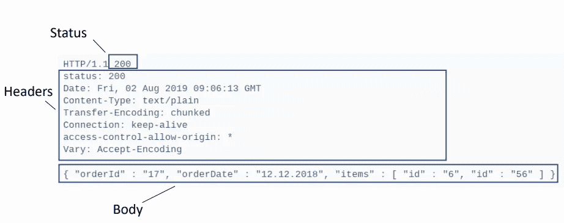
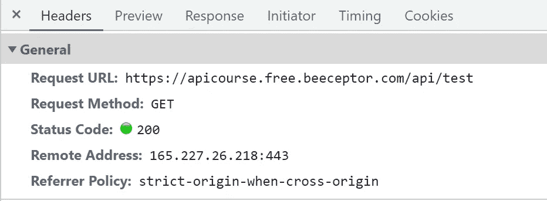

# REST API 的基础&它的结构

> 原文：<https://blog.devgenius.io/the-basics-of-rest-api-its-structure-61c71d8d5d72?source=collection_archive---------13----------------------->

初学者完全指南

在上一篇文章中，我们讨论了 [API 和 Web API](https://devforid.medium.com/the-basics-of-api-and-web-api-11b47143faa6) 。在本文中，我们将讨论 REST API 及其结构。

**REST API**

**RE**presentational**S**tate**T**transfer 通常被称为 REST，是一种软件架构风格，用于设计被称为 API 的应用程序编程接口。它遵循一组规则，这些规则对 API 应该如何工作施加了条件。

我们可以说，遵循 REST 架构风格的 API 称为 REST API。


由 [Clément Hélardot](https://unsplash.com/@clemhlrdt?utm_source=medium&utm_medium=referral) 在 [Unsplash](https://unsplash.com?utm_source=medium&utm_medium=referral) 上拍摄

**restful API**

实现 REST 架构的 Web 服务称为 RESTfull web 服务。RESTfull web 服务也称为 RESTfull API。RESTfull API 也遵循 REST API 的基本原则。RESTfull API 使用 HTTP 来访问数据。

**REST API 的结构**

为了从服务器访问数据，客户端发送了一个 HTTP 请求。为了从服务器向客户机返回数据，服务器生成一个 HTTP 响应。所以，它是基于请求和响应来工作的。

**REST API 请求的结构**

REST API 请求基本上有以下 4 个组成部分。

1.  方法/HTTP 动词
2.  URL/端点
3.  头球
4.  正文*(可选)*

**方法/HTTP 动词**

这些方法或 HTTP 动词描述了操作以及要对数据做什么。基本上有 4 种类型的方法或 HTTP 动词，即 GET、POST、PUT 和 DELETE，下面将对它们进行描述。

**URL/端点**

URL 或端点指示在哪里以及如何找到数据。

**标题**

头存储服务器和客户机可能需要的信息。它提供授权密钥、名称或 IP 地址以及其他相关信息。

**正文*(可选)***

如果需要，主体存储附加信息。

**REST API 请求示例**

在下面的例子中，我们可以看到 REST API 请求的方法、URL 和头。



REST API 请求

**REST API 响应的结构**

REST API 响应有以下 3 个组件。

1.  状态代码
2.  头球
3.  身体

**状态码**

状态代码是一个三位数，表示请求是否成功。如果不成功，那是什么问题？看起来像，2xx，4xx，5xx 等等。

例如，200 代表成功，404 代表未找到，等等。

**标题**

头包含一些关于响应的元数据。例如内容类型、状态、日期等。

内容类型可以像下面这样，

*   应用程序/JSON
*   应用程序/XML
*   多部分/表单数据
*   application/x-www-form-urlencoded
*   应用程序/x-wbe+xml

**正文**

正文包含响应的内容。任何请求响应的主体可以是空的，也是可选的。响应内容通常是 JSON 格式的，但也可以是 XML 或字符串。

**REST API 响应示例**

下面是一个 REST API 响应的例子，组件如下。



REST API 响应

**REST API 请求的方法/HTTP 动词**

方法或 HTTP 动词实际上设置了要执行的动作。当 REST API 收到请求时，它首先查看动词，并决定实际的操作需要对结果执行什么。

在面向数据的应用程序中，基本上有 4 种类型的操作。

1.  添加资源
2.  检索资源
3.  更新资源
4.  删除资源

这些操作也称为 CRUD defines、 **C** reate、 **R** ead、 **U** pdate 和 **D** elete。

要执行这些操作，有如下 4 种类型的 HTTP 动词。

1.  得到
2.  邮政
3.  放
4.  删除

**获取**

GET 动词用于访问或检索位于服务器特定 URL 的资源。它可能检索单个资源或多个资源，或者可能没有为参数找到资源。该动词也用作浏览器的默认动词。

GET 的示例如下。

```
[https://apicourse.free.beeceptor.com/api/test](https://apicourse.free.beeceptor.com/api/test)
```



**帖子**

POST 动词用于添加资源。POST 动词应该包含指定要添加的资源的消息。请求应该包含一个主体，以便服务器知道应该添加什么资源。另一件事是 POST 请求不应该包含任何查询参数。

POST 请求的卷曲如下。

```
curl --location --request POST '[https://restapi.free.beeceptor.com/api/order'](https://restapi.free.beeceptor.com/api/order') \
--header 'Content-Type: application/json' \
--data-raw '{ 
    "Order": {
        "OrderDate": "25.08.2022", 
        "OrderUser": "10"
    }
}'
```

**放**

PUT 动词与 POST 非常相似，但有一个非常重要的区别。PUT 动词用于修改资源，而 POST 用于添加资源。请求应该包含一个主体，以便服务器知道应该修改什么资源。另一件事是，PUT 请求不应该包含任何查询参数。

看跌请求的旋度如下。

```
curl --location --request PUT '[https://restapi.free.beeceptor.com/api/order'](https://restapi.free.beeceptor.com/api/order') \
--header 'Content-Type: application/json' \
--data-raw '{ 
    "Order": {
        "OrderDate": "25.08.2022", 
        "OrderUser": "10"
    }
}'
```

**删除**

删除动词用于删除任何资源。它不应该用于添加、更新或检索资源。URL 可能有一个参数，告诉服务器我们到底想要删除哪个资源。

删除请求的卷曲如下。

```
curl --location --request DELETE '[https://restapi.free.beeceptor.com//api/order/45'](https://restapi.free.beeceptor.com//api/order/45') \
--header 'Content-Type: application/json' \
--data-raw ''
```

**总结**

在本文中，我们讨论了 REST API、REST API 请求和响应的结构。此外，我们讨论了 4 个基本的 REST API 请求方法或 HTTP 动词，它们是 GET、POST、PUT 和 DELETE。但实际上，这些并不是 HTTP 标准中存在的所有动词。有些很少用，如补丁、头、选项等。

感谢阅读！微笑！