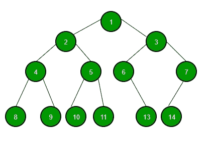
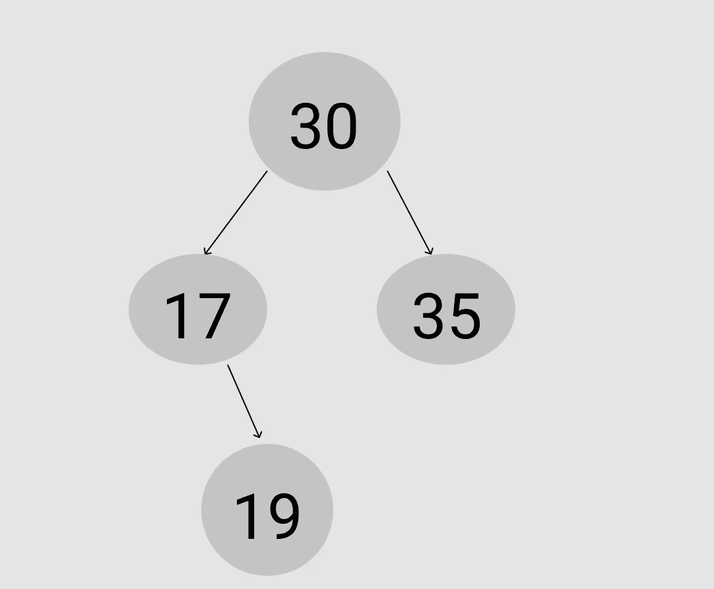

# 树形数据结构的基础

> 原文：<https://blog.devgenius.io/the-basics-of-tree-data-structure-fe16ad421a01?source=collection_archive---------2----------------------->



geekforgeeks.org

与数组和链表不同，树是一种以父子关系连接节点(或元素)的非线性数据结构。这意味着数据是分层组织的。每个父节点都有一个指向子节点的指针，因此知道它。

树的另一个重要特征是它们是一种递归数据结构——与数组和链表一样！换句话说，每棵树都是由具有父节点和子节点的其他树组成的。

当我们看一棵树时，我们可以清楚地看到它类似于一个家谱或一个组织层级。我想到的另一个例子是 React。如果您熟悉这个框架，您肯定知道组件的层次结构与树数据结构非常相似。

那么，什么是树元素呢？

树的头部被称为**根节点**——第一个也是唯一一个没有双亲的节点。**兄弟节点**是共享一个父节点的节点。如果一个根节点指向另一个节点，那么这个根节点就变成了一个**父节点**并且连接的节点是一个**子节点**。

现在，当我们熟悉了术语，让我们来谈谈一种特定类型的树— **二叉查找树**。维基百科上说“二叉树是一种树形数据结构，其中每个节点最多有两个孩子，称为左孩子和右孩子”。同样，左右节点可以指向零或其他节点。反过来，这些其他节点下也可以有节点。所以，我们可以说左右节点都指向**子树**。

听起来不错，对吧？二叉查找树可以帮助我们操作排序数据的方式甚至更好！我们可以添加和删除元素，而不需要一次又一次地排序，就像我们在处理数组时必须做的那样。为什么？因为这两条简单的规则。

1.  **左子树**中的所有数据**小于或等于当前节点的数据**。
2.  **右子树**中的所有数据都比当前节点的数据大**。**

我们如何用 JavaScript 编写一个简单的二叉树呢？让我们看一看。

```
//we need two classes - Node and BinarySearchTree, for a single element and for a tree class Node {
    constructor(value)
{
        this.value = value;
        this.left = null;
        this.right = null;
    }} //unlike a linked list, there is no next or previous - it's left and right!class BinarySearchTree {
    constructor(){
        this.root = null; //the first element in a tree
    }
}let tree = new BinarySearchTree(); //a tree is created
tree.root = new Node(30);
tree.root.right = new Node(35); //greater than 30
tree.root.left = new Node(17); //less than 30
tree.root.left.right = new Node(19); //greater than 17
```

这就是我们得到的！



看起来不错，对吧？

**来源:**

1.  [关于树形数据结构你需要知道的一切](https://www.freecodecamp.org/news/all-you-need-to-know-about-tree-data-structures-bceacb85490c/)
2.  [二叉树数据结构](https://www.geeksforgeeks.org/binary-tree-data-structure/)
3.  [树(数据结构)](https://en.wikipedia.org/wiki/Tree_(data_structure))
4.  [二叉树](https://en.wikipedia.org/wiki/Binary_tree)
5.  [JavaScript 算法和数据结构大师班](https://www.udemy.com/course/js-algorithms-and-data-structures-masterclass/)