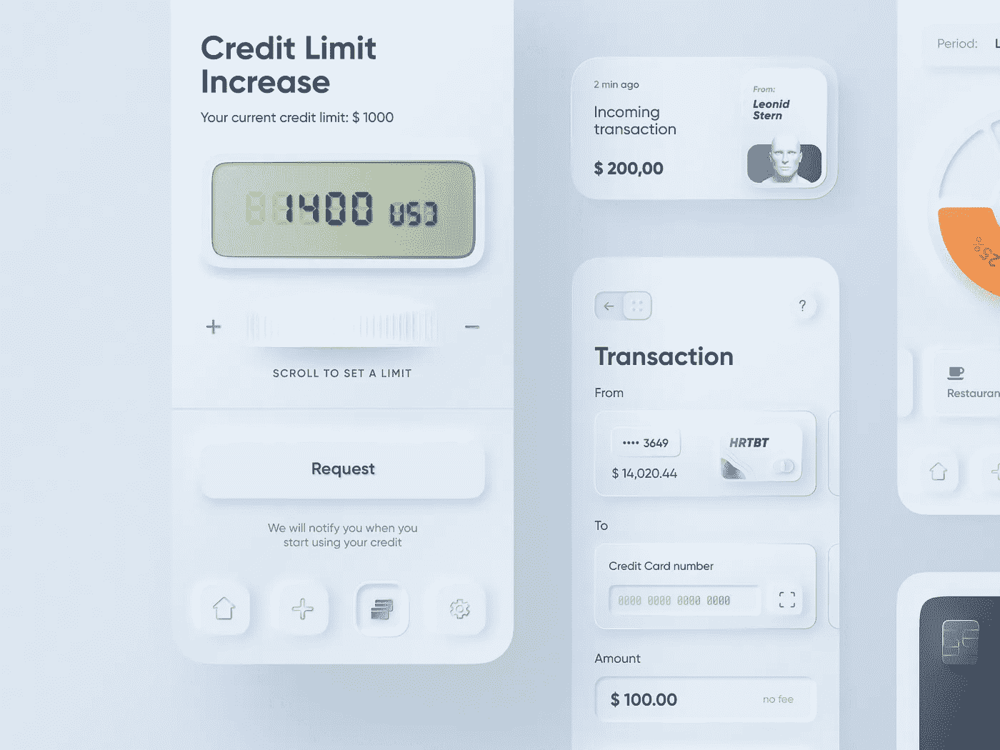
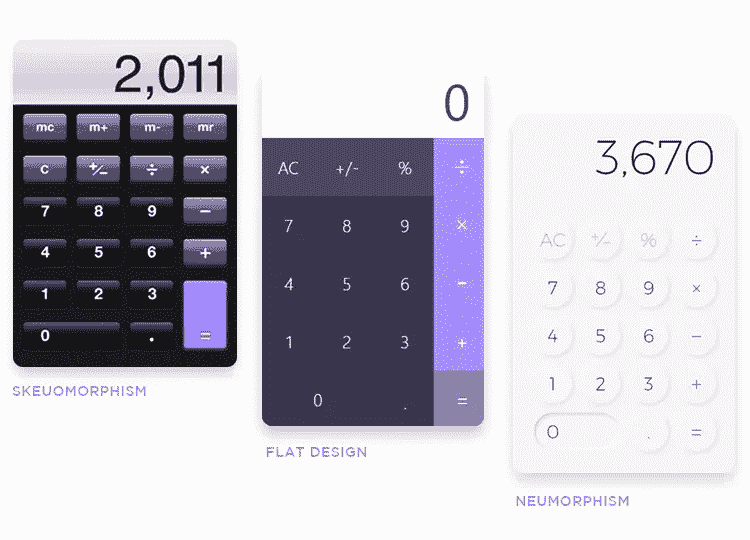
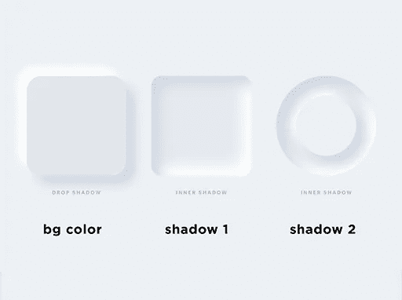
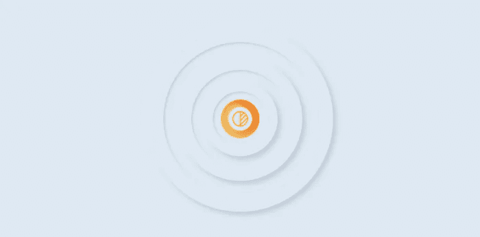
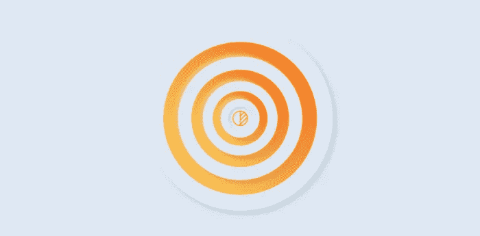
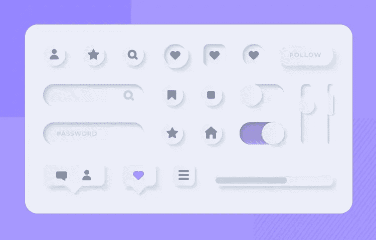

# 新用户界面设计模式之美

> 原文：<https://blog.devgenius.io/the-beauty-of-neumorphic-ui-design-patterns-63bcd7855c91?source=collection_archive---------10----------------------->

用户界面和体验早已超越了美学吸引力的单一方面。如今，管理一个突破性的用户体验需要你最大限度地关注有说服力的 UI 设计方面，例如:

*   易接近
*   个性化
*   极简主义&简单，以及
*   便利

‍

为此，如今每个人都在关注的一个设计趋势是神经形态。Neumorphism 是一个*软 UI 设计*概念，最近在 2019 年 12 月。然而，这种风格的基础在于重现当代和去年 UI 设计趋势的最佳元素。问题是——新形态用户界面设计有什么吸引人的地方，让整个设计社区都在热烈讨论？

在这里，我们将讨论神经形态的起源，神经形态的基本元素，以及它如何为你和你的用户带来一个吸引人的 UI 设计..

差不多 [40 年前，苹果推出了](https://medium.com/@openGeeksLab/neumorphism-the-next-big-thing-in-ui-design-11e703df3ab0)外形设计。他们希望提供一个模仿 3D 真实感的 UI 设计，使用鲜艳的调色板、超逼真的形状、阴影&表面和具有反射视觉质量的界面&图标，例如下图中的计算器。在 2000 年末和 2010 年初之间，微软和苹果都开始发布产品，吹嘘一种更新的 UI 设计格式——平面 UI 设计。UI 设计的扁平化风格在理论和实践上都是，从*丰富的*外形设计的比喻完全 180 度大转弯。它结合了单色或对比色调色板，背景-前景元素之间的深度阴影**、**和突出 2D 的图标，*平面*界面设计。

当 UI UX 专家 Michal Malewicz 提出 UI 设计中“新形态”的概念，Jason Kelley 将其命名为“新形态”时，新形态的诞生就在在线设计社区的眼前发生了。设计师和用户界面专家都惊讶于 Neumorphism 如何保留了平面用户界面的视觉*柔和*并注入了 3D 风格的物理元素。设计社区已经在寻找一种方法来结合 Skeuomorphic 和平面设计所提供的最好的东西，全心全意地拥抱 Neumorphism。

[在美国，](https://truelist.co/blog/ux-statistics/)用户平均每 3 分钟就有 2 分钟是通过移动平台上网的。这使得设计师必须比桌面平台更加关注移动应用的 UI 设计，如果不是更多的话！这就引出了一个问题——就用户参与度而言，Neumorphic UI 设计真的让用户受益了吗？

为此，我们必须从比较神经形态设计的原理和同时代的原理开始，并推测它能提供什么好处。

关于 Neumorphic UI 设计的可行性已经进行了无数次辩论，不仅是针对桌面应用程序，也针对运行 iOS、Android 或 Windows 的下一代移动设备。你的网站 UI 设计也需要针对移动设备进行优化，否则，你将会失去超过一半的用户参与机会。 [85%](https://uxcam.com/blog/ux-statistics/) 的成年用户希望在移动网站上获得比桌面网站更好或同等质量的 UX，并且由于缺乏移动优化，他们放弃这一任务的可能性是[的 5 倍](https://uxcam.com/blog/ux-statistics/)。那么，神经形态能给你的用户参与度带来多大的积极影响呢？嗯，异形设计吸收了平面 UI 和异形 UI 设计的最佳品质。图标、字体和界面层仍然提供了一种*极简*的美感，但它呈现了一种创造 3D 交互性的 UX。

以下几点成功地总结了 Neumorphism 如何为软件用户提供了一个足智多谋的设计方法和一个吸引人的 UX:

# 创造

神经形态设计通常使用单色调色板作为背景和交互元素，如按钮、开关、进度条等。内部和外部阴影的组合被用来实现颜色渐变，给元素一个凸起的*、*突出的外观，就像在 3D 投影中一样，而不是像在平面 UI 设计中一样*浮在背景之上*。

因此，用户在使用 3D 交互 UI 的同时，享受到了*软* UI。在任何设计软件上，比如 Adobe XD，制作这样一个神经形态的设计是相当容易的。您甚至可以使用 [CSS 代码](https://neumorphism.io/#55b9f3)为 web 应用程序实现一个神经形态布局。

# 实验

如前所述，Neumorphism 大部分是单色的，但你仍然可以设计不同颜色的按钮、图标和开关，以确保低对比度不会损害可见性和妨碍用户的可访问性。对比度和阴影级别给人的感觉是交互元素仍然是背景的一部分——一种回归到 Skeuomorphism 的真实感，例如:

为了让你的按钮看起来栩栩如生，你可以使用高对比度的颜色来描绘用户交互，只要颜色选择不损害设计。因此，设计师不需要做太多的实验，就可以确定一个既能吸引用户注意力又不会太花哨的配色方案。

# UI 设计实现

当用户与用户界面元素(按钮、开关、卡片等)交互时，只要你使用对比、阴影和高亮有效地、可视地描绘效果/状态变化，神经形态设计就会给用户留下深刻印象。).从下面的图片中可以明显看出，只要对比度和阴影水平能够清晰地传达给用户，Neumorphic UI 设计就会在可见性和可访问性上得分。

因此，只要交互元素和背景表面之间的对比度和阴影水平有深度感，Neumorphic UI 设计就可以适应深色和浅色调色板。

# 高效的 UI 设计原型

神经形态设计遵循已经累积了几十年的设计惯例。设计者在设计这样一个 UI 时需要考虑的参数很少。因此，对于设计师来说，高效快速地为任何类型的应用程序或网站设计神经形态 UI 原型是非常容易的。

将你的网站或应用程序界面转换成一种新的形式并不能保证成功的用户参与和良好的投资回报。尽管如此，UX 的低可访问性或低可见性问题至少将 88%的用户拒之门外；糟糕的用户界面性能赶走了 90%的好用户。因此，挑选出一个对你有益的新设计用例是很重要的。

# 连接用户和界面

如果你的应用程序网站 UI 不能弥合用户界面和用户之间的鸿沟，不能产生富有成效的应用程序使用体验，你的用户参与机会就会减少[一半以上](https://truelist.co/blog/ux-statistics/)。设计风格的真正考验在于它能给予用户的启示。*启示*是用户与任何数字产品互动的方式。一个神经形态的用户界面模糊了数字应用的启示和现实生活中的启示之间的界限，例如一个神经形态的火炬或计算器用户界面。

因此，当你将一个新形态设计与正确的过渡/效果结合起来，给用户留下印象时，你实际上可以更好地控制 3D 真实感。Neumorphism 允许您在斜面、压制和/或挤压元素阶段变化中进行选择，以传达一种感觉更熟悉且*逼真的 UX。因此，在其他 UI 风格的翻译中经常丢失的东西，在新形态的 UI 中变得更加简单，它的新形态能力融入了现实主义。*

# 快速设计原型

到目前为止，你肯定已经意识到新形态 ui 通过简单的方法引入了直观的设计细节。Neumorphism 可能还不到一年，但它已经在设计社区中拥有许多支持者，他们有无数的例子、[教程](https://uxplanet.org/neumorphism-in-user-interface-tutorial-c353698ac5c0)和设计组件库，以及其他可以引领设计原型的资源。

所以，当你需要线框和设计原型而没有太多时间的时候，一个神经形态的用户界面可以走上前台。易于实现的 UI 设计为提前完成铺平了道路。[在一个市场](https://www.intechnic.com/blog/100-ux-statistics-every-user-experience-professional-needs-to-know/)中，每投资 1 美元在一个有利可图的 UX 创意上，就能保证 100 美元的投资回报率，选择一个能加快上市时间的设计方案，你会获益匪浅。

那么，一个新形态的用户界面会给你的用户带来积极的 UX 吗？如果你翻新你以前的网站/应用程序界面，或者为你的新软件实现一个新的界面设计，会给你带来多方面的投资回报吗？

一个新的用户界面**可以**有助于你的应用程序或网站的适销性，只要小心设计。网站或应用程序的可销售性和用户参与度很大程度上依赖于其 UI 设计的移动响应性和可访问性。所以，这样一个成功的新形态设计的关键是对用户来说无所不包的 ***易访问性*** 。一个高效的新形态用户界面可能甚至不需要依赖排版！

**Tempest House 为您安排了一个经验丰富的 UI UX 专家团队，他们可以为现代软件构建提供熟练的神经形态软件设计** [**服务**](https://www.tempest.house/services) **。要预约免费咨询会议，请点击** [**此处**](https://calendly.com/will-59/tempest-house-founder-ceo)

因此，一个神经形态的 UI **可以**给你的软件在市场上带来竞争优势，并在 UI 设计上提供多种投资回报。苹果和微软已经采用了一种软用户界面设计风格，这种风格被称为“新派”UX 策展，只需一点点尝试和努力，你的应用也能一针见血！

*原载于*[*https://www . tempest . house*](https://www.tempest.house/blog-posts/the-beauty-of-neumorphic-ui-design-patterns)*。*