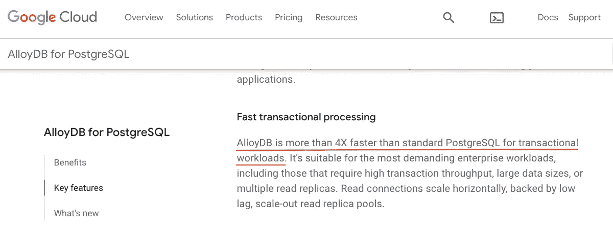
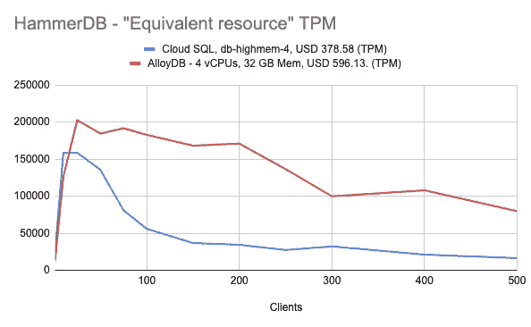

# 基准测试 Google Cloud 上的 PostgreSQL

> 原文：<https://blog.devgenius.io/the-benchmarking-postgresql-on-google-cloud-5c67b3cfc567?source=collection_archive---------3----------------------->


> 这是我对谷歌云产品分析的第二部分——将 AlloyDB 的预览版与云 SQL 进行比较。详情见第一部分 [**此处**](https://weiyuan-liu.medium.com/postgresql-on-google-cloud-alloydb-cloud-sql-or-cloud-spanner-b03c391bd853) **。**

# 1.介绍



如果你已经阅读了 AlloyDB 的文档或在线博客文章，你可能会注意到以上是 AlloyDB 谈论最多的一点。*事务性工作负载速度提高 4 倍*。太神奇了！

然而，另一种解释这种说法的方式是，它是托管工具(AlloyDB)与自托管 PostgreSQL 实例(运行在本地或云中的虚拟机上)的基准比较。像 Google Cloud 这样的云提供商已经对托管工具的性能进行了优化，使得采用托管数据库比我们自己更值得。

鉴于这种思路……我想让**更好地了解 AlloyDB 的事务性能，与其他托管 PostgreSQL 工具 Cloud SQL 和 Cloud Spanner** 相比。除了进行我们自己的基准测试，还有什么更好的方法来实现这种理解呢？

## 1.1.介绍基准测试工具


对于本练习，我们将首先使用 [**Pgbench**](https://www.postgresql.org/docs/current/pgbench.html) 来执行基准测试。如 Pgbench 文档中所述:

```
By default, pgbench tests a scenario that is loosely based on TPC-B, involving five SELECT, UPDATE, and INSERT commands per transaction
```

我们将跨多种配置运行基准测试工具，看看 AlloyDB 与其他工具相比表现如何。使用 Pgbench 的默认初始化过程，以便添加所需的表、系统初始数据和主索引，从而建立读写事务的基本要求。


我还使用了另一个基准测试工具 [**HammerDB**](https://www.hammerdb.com/) 来运行与上面类似的配置，但是将基准配置文件设置为 [TPC-C](https://en.wikipedia.org/wiki/TPC-C) 。这将为我们提供另一个关于基准测试的视角。

> 该基准测试不是 OLTP，因为它不需要任何终端、网络或思考时间
> — [**TPC-B 规范**](https://www.tpc.org/tpcb/spec/tpcb_current.pdf)

还应注意的是，与 [TPC-B](https://www.tpc.org/tpcb/) 相比， [TPC-C](https://www.tpc.org/tpcc/) 在我们的 OLTP 基准测试中更具相关性。TPC-B 可以被视为更多的数据库压力测试，但我们仍然可以在稍后检查它时考虑结果。

## 1.2.假设

使用上述基准工具，我们将做出以下假设:

*   所有工具和实例都将在新加坡的`**asia-southeast1**`区域和`**asia-southeast1-a**`区域使用
*   所有三个数据库都将被分配一个基本存储量`**100GB**` **，并尽可能选择 SSD**
*   **备份存储不会计入成本**，因为基准测试是针对数据库选项的性能进行的，而不是可靠性方面
*   **基准测试将通过扩展客户端**来完成，以模拟客户端连接到数据库的应用程序的水平可伸缩性
*   所有基准测试都将使用 **PostgreSQL 14** 完成
*   **私有 IP** 将用于所有基准测试
*   用于执行基准测试的计算实例是**E2-medium(**pg bench**)**和**E2-standard-4(**HammerDB**)，在同一地区和区域**。因为用 HammerDB 播种数据总是会超出 CPU 的利用率，所以我决定使用一个 vCPU 值更高的实例。
*   所有比较成本均为**月估算金额**

最后但同样重要的是，我发现 Cloud Spanner 的 PostgreSQL 接口与 Pgbench 和 HammerDB 并不完全兼容，即使在使用[**pg adapter**](https://github.com/GoogleCloudPlatform/pgadapter#google-cloud-spanner-pgadapter)**时也是如此——详细信息将添加到本文末尾，以供将来参考，并提供使用 Cloud Spanner 进行测试的建议。**由于这种复杂性，我们将不使用 PostgreSQL 的这些主流基准测试工具来比较 Cloud Spanner。****

# **2.基准兴趣领域**

**我们将在以下三个方面对谷歌云的托管数据库进行基准测试:**

*   ****“价格相同”的实例基准测试**——以几乎相同的成本跨实例进行性能测试，以了解哪种工具更能实现物有所值**

****

**“同等定价”实例基准测试，来源:[谷歌云定价计算器— #1](https://cloud.google.com/products/calculator/#id=4f539b4b-fd7e-4bc7-96ba-fc2915b9ff2c)**

*   ****“等效资源”实例基准测试** —相同资源级别的实例间的性能**

****

**“等效资源”实例基准测试，来源:[谷歌云定价计算器— #2](https://cloud.google.com/products/calculator/#id=eb2008ec-9d32-4d7b-b7c6-6dc0f9dc0410)**

*   ****“最便宜的/实验性的”实例基准测试(可选)** —不完全是比较性能的最佳方法，但如果在实验或试用 Google Cloud PostgreSQL 数据库时，将成本保持在最低是主要考虑因素，则有助于了解您可能想要使用哪种托管工具。使用它来比较每个托管工具的最便宜实例的性能。 **(Pgbench 仅用于提供一个简单的视角)****

****

**“最便宜/实验性”实例基准测试，来源:[谷歌云定价计算器— #3](https://cloud.google.com/products/calculator/#id=a36907bb-9869-415e-b17d-7c212567db73)**

# **3.Pgbench 结果**

**让我们从使用 Pgbench 的基准测试结果开始——如前所述，最好将其视为数据库压力测试。**

## **3.1.**“同等定价”实例基准测试****

********

**来源: [#1 —“同等定价”TPS](https://docs.google.com/spreadsheets/d/1j4_UVD5IyBjsZy25BjO4cn42yFeDVhFcGi33OmcAgA8/edit#gid=2104739530) 和 [#1 —“同等定价”延迟平均值](https://docs.google.com/spreadsheets/d/1j4_UVD5IyBjsZy25BjO4cn42yFeDVhFcGi33OmcAgA8/edit#gid=0)**

**有趣的是， **AlloyDB 在每秒事务处理量(TPS)和延迟方面始终比云 SQL 做得更好**，即使它是一个与云 SQL 成本相同的较低层实例。**

**正如预期的那样，AlloyDB 和 Cloud SQL 的 TPS 数量在连接数较低时达到峰值，并随着客户端连接的扩展而开始下降。在峰值时，AlloyDB 在 TPS 方面比云 SQL 领先 3–10%。**

**在 50 到 250 个客户端连接中，AlloyDB 在 TPS 方面领先 8–15%。当从 300 个客户端连接进一步扩展时，AlloyDB 的 TPS 可以比 Cloud SQL 高出 50%以上，即使 TPS 在两项指标上都有所下降。**

****在 Pgbench 的 TPC-B 基准测试中，AlloyDB 的整体性能始终比云 SQL 的客户端连接< 300 高出约 10%,并且当客户端连接开始扩大时，与云 SQL 相比，性能下降速度也较慢。****

## **3.2.**“等效资源”实例基准测试****

********

**来源: [#2 —“等效资源”TPS](https://docs.google.com/spreadsheets/d/1j4_UVD5IyBjsZy25BjO4cn42yFeDVhFcGi33OmcAgA8/edit#gid=1335226202) 和 [#2 —“等效资源”平均延迟](https://docs.google.com/spreadsheets/d/1j4_UVD5IyBjsZy25BjO4cn42yFeDVhFcGi33OmcAgA8/edit#gid=1843628093)**

**对于 CloudSQL 与 AlloyDB 的同等资源，总体趋势与上次比较相似——alloy db 与 Cloud SQL 相比享有更好的 TPS 性能，尤其是现在分配的资源与上次测试相比更加接近。**

**当客户端连接较少时，AlloyDB 和 Cloud SQL 的 TPS 数量再次达到峰值，并随着客户端连接的扩展而开始下降。**

****然而，随着客户端连接从> 100 扩展，AlloyDB 的 TPS 性能与 CloudSQL 相比下降得更慢，性能差异为> 10%，在 500 个客户端连接时差异高达 100%。这使它能够以更一致的性能为更多的客户端连接提供服务。****

## **3.3.**“最便宜/实验性”实例基准测试****

****

**来源: [#3 —“最便宜的/实验性的”TPS](https://docs.google.com/spreadsheets/d/1j4_UVD5IyBjsZy25BjO4cn42yFeDVhFcGi33OmcAgA8/edit#gid=794307959)**

**当检查最便宜的实例时，云 SQL 受到较小实例的低连接限制的高度限制，因此数据点较少。由于 Cloud SQL 端没有太多的数据点来显示趋势，所以让我们看看原始数据。**

**当查看较低的客户端连接数时，总体 TPS 性能接近，AlloyDB 仅略微领先。**考虑到云 SQL 的“db-f1-micro”实例的成本约为 AlloyDB 最便宜实例的 11%——如果您打算保持低成本(例如开发或实验实例)，云 SQL 可能是这里更有吸引力的选择。**您可以通过手动修改 PostgreSQL 的 Cloud SQL 中的 [max_connections](https://cloud.google.com/sql/docs/quotas#postgresql) 标志来绕过连接限制。**

# **4.HammerDB 结果**

**现在我们已经查看了 Pgbench 的结果，让我们转到 HammerDB，在这里我们使用 TPC-C 概要文件作为 OLTP 基准。请注意，我们将使用每分钟事务数(TPM ),这是基准测试给出的一个指标，而不是 TPS。**

## **4.1.“同等定价”实例基准测试**

****

**来源: [#1 —“同等定价”TPM](https://docs.google.com/spreadsheets/d/1GxoQANqYG2r0DEVqOZRzhn7srmcnnL-jypXtun8QIsM/edit#gid=2104739530)**

**在比较这两个数据库的 TPM 趋势时，我们看到虽然结果最初波动很大，但 **Cloud SQL 能够在较低的客户端连接上提供较高的 TPM，而 AlloyDB 的 TPM 在 50 到 150 个连接的中等水平上更好**。随着连接数的增加，两个数据库显示出类似的 TPM 趋势。**

****在这种“同等定价”的配置中，两个数据库的性能似乎处于相似的水平**，这似乎是由于 TPC-C 基准测试的性质，它侧重于模拟 OLTP 操作，而不是压力测试。**

## **4.2.“等效资源”实例基准测试**

****

**来源:#2 — [“等效资源”TPM](https://docs.google.com/spreadsheets/d/1GxoQANqYG2r0DEVqOZRzhn7srmcnnL-jypXtun8QIsM/edit#gid=1335226202)**

**与 Hammer DB 的第一次测试结果不同,“等效资源”配置显示了更明显的有利于 AlloyDB 的趋势。**

**在中等数量的连接(≥ 25)情况下，AlloyDB 在 TPM 中的表现始终优于云 SQL。从 100 个连接开始，**与云 SQL 相比，AlloyDB 能够处理 300%到 500%的事务数量，**尽管 AlloyDB 的成本仅比云 SQL 高 57.4%。**

# **总结——理解结果**

**在比较****AlloyDB **工具时，alloy db**在对其执行的原始事务中比云 SQL 做得更好**——差异在**3%–50%**之间变化，但当我们考虑 OLTP 性能时**表现相似 OLTP 性能模拟了使用数据库(如网络)的其他延迟方面以及人的方面(如响应时间)。**********

**然而，当我们比较在**“等效资源”**配置下运行的实例时，我们看到 AlloyDB 始终表现更好。AlloyDB 在原始事务中比云 SQL 多提供了 10%到 100%的 T21。**在比较 OLTP 性能时，AlloyDB 的性能比云 SQL 高 3-5 倍。****

## **校准我们的期望以更好地解释结果**

**我们必须明白，在 AlloyDB 和 Cloud SQL 之间比较**【同等价格】**的配置，就像比较苹果和橙子一样。这同样适用于**“等效资源”**配置。**

**[正如上一次](https://weiyuan-liu.medium.com/postgresql-on-google-cloud-alloydb-cloud-sql-or-cloud-spanner-b03c391bd853)所讨论的，AlloyDB 具有云 SQL 中没有的用例和可靠性方面，因为 AlloyDB 是一个“被管理”而不是“自我管理”的工具。因此，AlloyDB 的较高成本的一部分应该归因于使用云 SQL 时的其他方面，如开发和维护成本。**

**使用**【同等定价】**和**【同等资源】**配置作为基础，如果您或您的公司将 AlloyDB 在云 SQL 上的功能视为当前甚至未来使用的净正增值，使用 AlloyDB 将是有益的。如果使用**“同等价格”**配置运行，唯一的成本是迁移，但是您将获得很小的性能提升。如果使用**“等效资源”**配置运行，与成本相比，应用程序的性能和可伸缩性会有更大的提升。**

**但是，如果你想把成本作为主要因素(开发实例、实验等)。)，坚持使用云 SQL 可能是明智的。其最便宜的选项几乎比 AlloyDB 今天最便宜的选项便宜 10 倍。**

## **最终注释**

**尽管已经讨论过了，并且暗示了提供 AlloyDB 作为竞争选择的场景，但是必须注意 AlloyDB 仍然处于[预览](https://cloud.google.com/products#product-launch-stages)状态。它也不提供承诺使用折扣，造成了更大的价格差距。我建议在这里采取谨慎的态度，例如在正式发布之前，是否使用它来替换您今天的生产实例。**

**另一方面，需要注意的是，我们只测试了 2-3 种不同的配置，如果实例值发生变化，则“同等定价”或“同等资源”的结果可能不会直接适用。如果您打算将不同配置的云 SQL 实例迁移到 AlloyDB，请执行您自己的基准测试。**

****也就是说，如果这些性能基准与 AlloyDB 的最终 GA 版本保持一致，它将描绘出一幅充满希望的使用图，并有可能在未来超过 Cloud SQL 的 PostgreSQL。****

# **旁注#1 —值得注意的问题**

**1. **AlloyDB** —面临的附带问题—运行 HammerDB 基准测试一段时间后 AlloyDB 的事务速度变慢—必须重新启动 AlloyDB 数据库实例来解决该问题**

**2. **AlloyDB** —确保使用 [CLI](https://cloud.google.com/alloydb/docs/backup/delete#procedure) 删除 AlloyDB 创建的任何备份，因为它目前在云控制台(云 UI)中不可用**

****

**用户界面有恢复按钮，但没有删除按钮**

****

**隐性成本—如果测试时间超过一天并且创建了备份，可能会让人措手不及**

****3。云扳手** —不幸的是，我们这次无法测试云扳手。**然而，使用** [**JDBC 驱动程序**](https://cloud.google.com/spanner/docs/jdbc-drivers) **作为未来的简单数据库压力测试基准还是有希望的**:**

*   **使用 PostgreSQL 接口的 Cloud Spanner 对 JDBC 驱动程序的使用目前还没有文档记录——在提交基准测试之前，最好定期检查更新[这里](https://cloud.google.com/spanner/docs/use-oss-jdbc)**
*   **查看关于[使用 JMeter](https://cloud.google.com/community/tutorials/jmeter-spanner-performance-test) 测量云扳手性能的更多信息，该工具可用于使用 PostgreSQL 和 AlloyDB 对云 SQL 进行基准测试，只是不需要连接到云扳手的额外驱动程序。**

# **旁注#2 —云扳手与基准工具的兼容性**

**Pgbench —不适用于云扳手**

********

**HammerDB —不适用于云扳手**

********