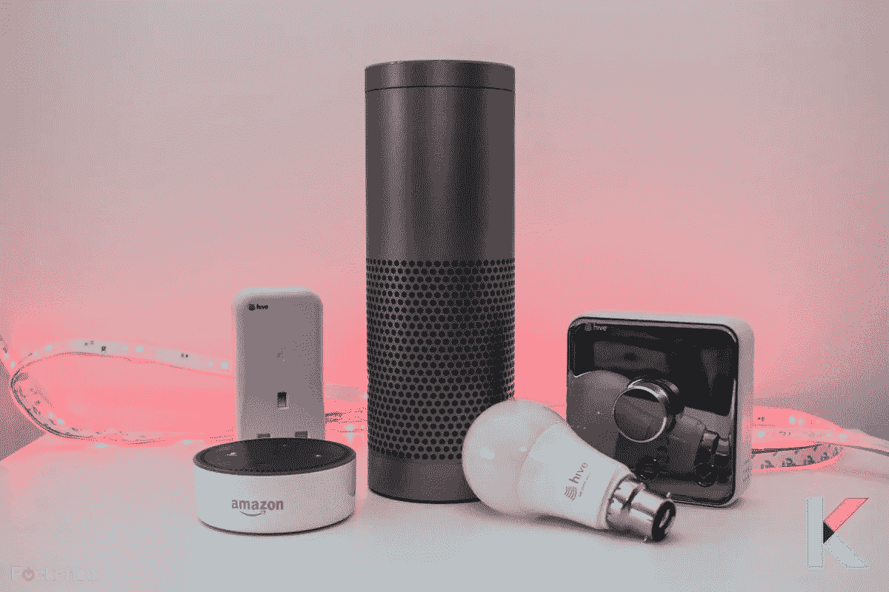
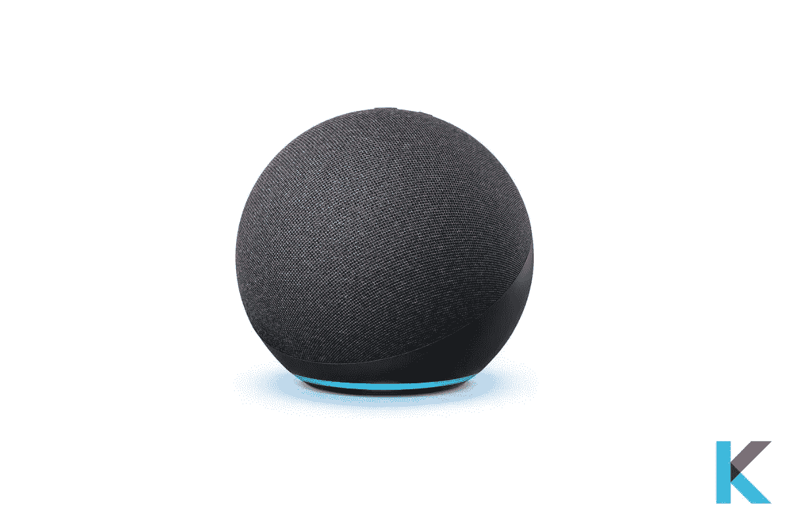
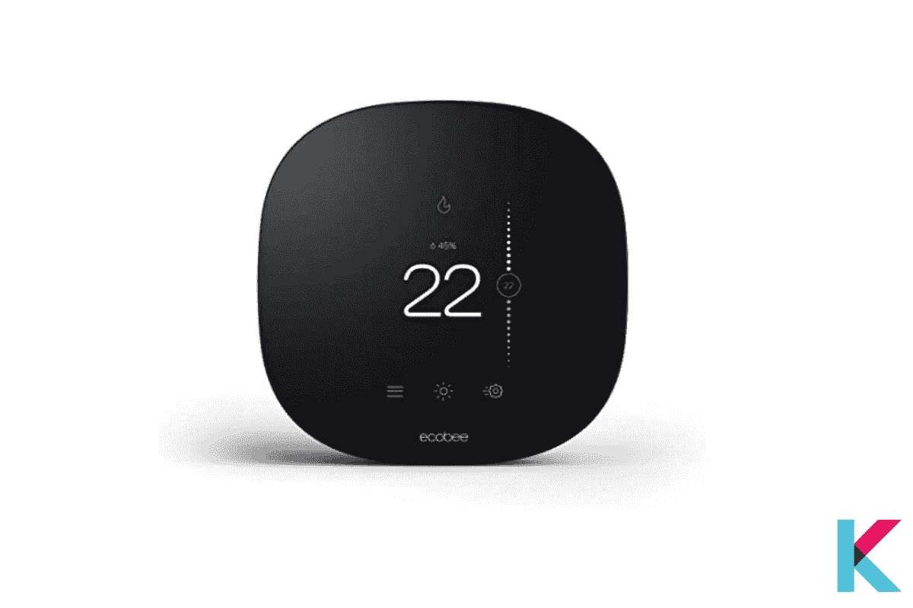
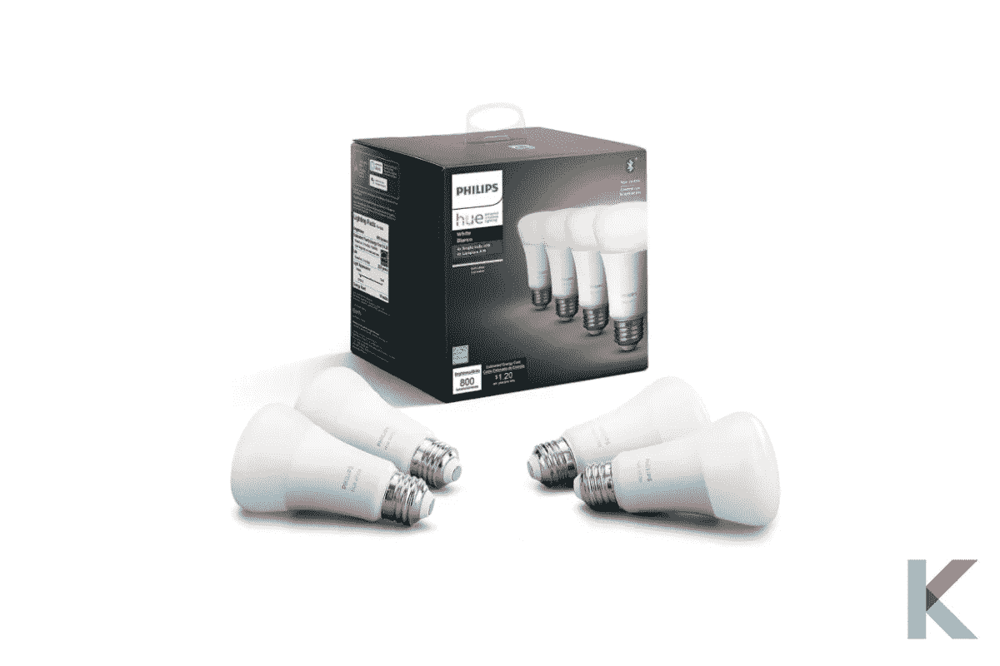
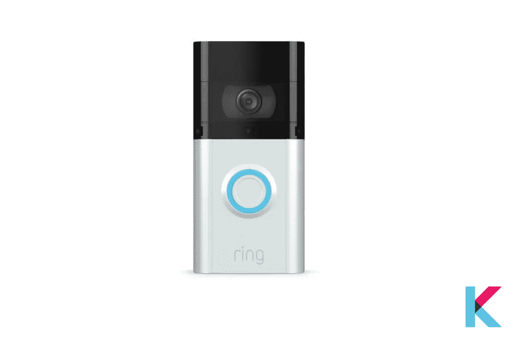
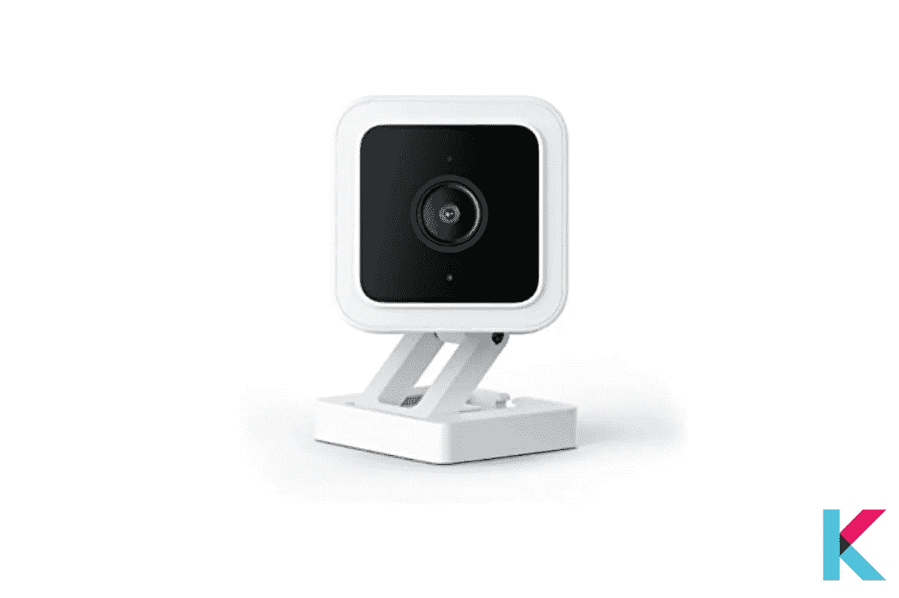
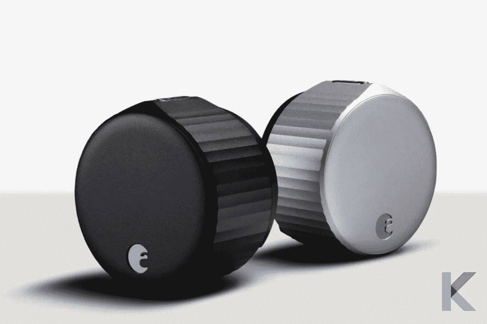
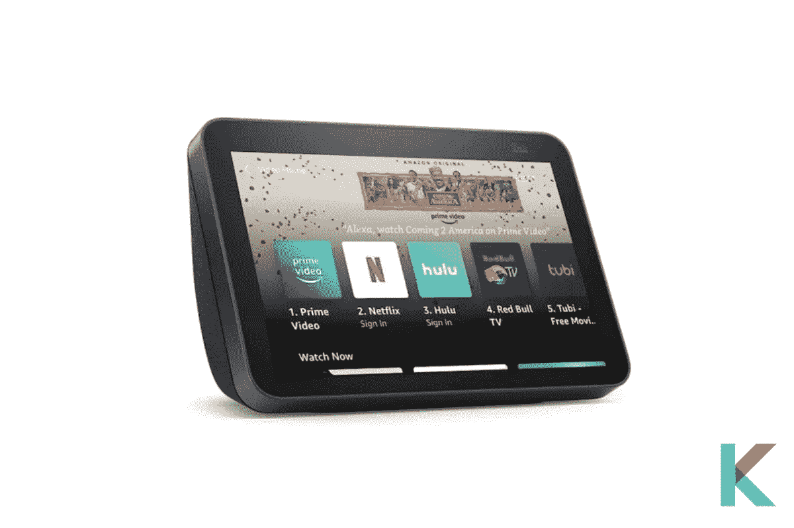
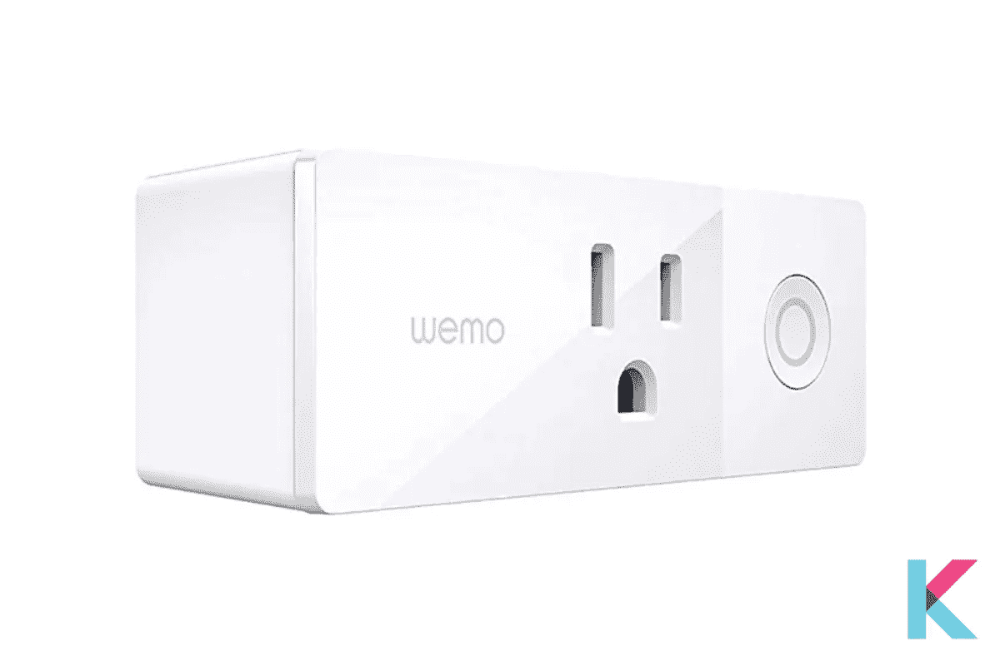
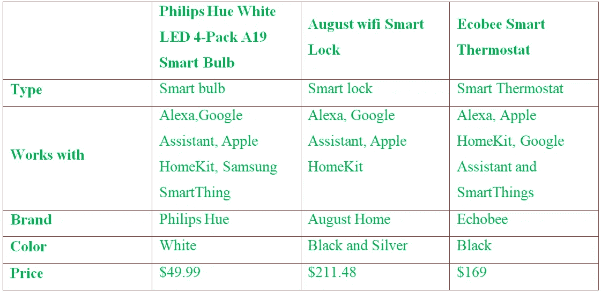

# 2021 年最好的 Alexa 兼容设备

> 原文：<https://blog.devgenius.io/the-best-alexa-compatible-devices-in-2021-d5ce4e9a2f9f?source=collection_archive---------4----------------------->

近年来，语音识别技术有了突飞猛进的发展。它已被整合到各种产品和品牌中。智能家居允许您通过扬声器使用您的声音和数字助理来控制您的智能设备。此外，亚马逊 Alexa 现在可以兼容大量流行产品。以下是 2021 年最好的 Alexa 兼容设备。

亚马逊 Alexa 兼容设备

*   亚马逊 Alexa 是什么？
*   2021 年最好的兼容 Alexa 的设备有哪些？
*   你如何让 Alexa 设备兼容？
*   如何选择最好的兼容 Alexa 的设备？
*   我们如何为你测试最好的 Alexa 兼容设备？
*   最佳 Alexa 兼容设备对比

# 亚马逊 Alexa 是什么？

亚马逊 Alexa 是一项虚拟助理 AI 技术。它能够播放音乐，设置闹钟，语音交互，流媒体播客，提供天气，制作待办事项列表等。它还可以将自己作为家庭自动化系统来控制您的智能家居设备。感谢亚马逊 Alexa 这样的虚拟语音助手的进入。

# 2021 年最好的兼容 Alexa 的设备有哪些？

市场上有很多兼容 Alexa 的设备。但你必须接触哪些是最好的支持 Alexa 的设备。以下是 2021 年[最好的 Alexa 兼容设备](https://kodmy.com/the-best-alexa-compatible-devices-in-2021/)。

**亚马逊 Alexa 最佳智能音箱**

亚马逊回声点第四代

*   **亚马逊 Echo Dot 4 代**

[亚马逊 Echo 第四代智能音箱](https://kodmy.com/alexa-echo-dot/)是最著名的智能音箱，拥有超过前三代的优质声音。此外，它还与 Zigbee 家庭集线器集成在一起。它有着球形的外形，更好的音质，对于一个扬声器来说还算不错的低音。

此外，它还可以播放来自 Apple Music、Amazon Music、Spotify、Deezer 等网站的歌曲。Alexa 随时准备提供帮助。你可以让 Alexa 播放音乐、播放新闻、回答问题、设置闹钟、查看天气、控制智能家居设备等等。它还通过在每个房间的回声设备上播放同步音乐，让你的家充满声音。只需使用内置集线器，您就可以打造自己的家。

您可以连接两个回声设备来创建立体声配对。此外，您可以将 Dot 与 Fire TV 连接，以改善音频。没有屏幕或摄像头；因此，对于那些担心隐私的人来说，这是一个很好的选择。

[从亚马逊](https://www.amazon.com/gp/product/B08YT2N5SX/ref=as_li_tl?ie=UTF8&camp=1789&creative=9325&creativeASIN=B08YT2N5SX&linkCode=as2&tag=kodmy-20&linkId=7e005260ae6bf1f3b3b6d75f239924f4)获得亚马逊 Echo Dot 4 代。

[从亚马逊](https://amzn.to/3AEHC5V)获得带时钟的亚马逊 Echo Dot 第四代。

[从亚马逊](https://www.amazon.com/gp/product/B084J4QQK1/ref=as_li_tl?ie=UTF8&camp=1789&creative=9325&creativeASIN=B084J4QQK1&linkCode=as2&tag=kodmy-20&linkId=b2c7f718e50707a1a386540d42d5353c)获得亚马逊 Echo Dot 4 儿童版。

**亚马逊 Alexa 最好的恒温器**

Ecobee 智能恒温器

*   **Ecobee 智能恒温器**

Ecobee 智能温控器是最好的智能温控器。它集成了 Alexa、苹果 HomeKit、谷歌助手和 SmartThings。当你在家或不在家时，它会检测你的当前温度并自动调节温度以提供能量。

Ecobee 应用程序可以在任何地方控制温度。还有，恒温器内置了 Alexa 智能音箱。因此，您不需要单独的回声设备。你可以从 Alexa 上问问题，只需连接你的恒温器。

[从亚马逊](https://amzn.to/3uqtRFB)获得 Ecobee 智能恒温器。

**亚马逊 Alexa 最好的智能灯**

飞利浦色相白色 LED 4 包 A19 智能灯泡

*   **飞利浦色相白色 LED 4 个装 A19 智能灯泡**

飞利浦 Hue 白色智能灯泡是[飞利浦 Hue](https://kodmy.com/about-philips-hue/) 的最新版本。它可以与 Alexa 和谷歌助手配合使用，并兼容蓝牙和 Zigbee。只需轻触智能手机或语音助手上的一个按钮，就能轻松上手。此外，您可以使用 Hue Bluetooth 应用程序添加多达 10 个 Hue 智能灯泡。

它可以很容易地与您的色相生态系统集成，并将继续与您的色相中心合作。通过使用 Hue hub，您可以轻松控制整个智能家居中多达 50 盏灯。此外，它还可以在出门在外时控制您的灯，或者添加智能开关和运动传感器等设备。

[从亚马逊获得飞利浦 Hue 白色和彩色 LED 智能按钮入门套件](https://www.amazon.com/gp/product/B07XH4KDR5/ref=as_li_tl?ie=UTF8&camp=1789&creative=9325&creativeASIN=B07XH4KDR5&linkCode=as2&tag=kodmy-20&linkId=4eefd05eb1d08d488ad32ce908ee18e8)。

**亚马逊 Alexa 最好的视频门铃**

响视频门铃 3 plus

*   **按视频门铃 3 加**

环形视频门铃 3 plus 是原始环形视频门铃 2 的升级版。它增加了令人印象深刻的新功能，如预卷。它允许它在检测到真实事件之前记录长达 4 秒的视频。还有，你可以让 Alexa 告诉我谁在门口。当你不在家时，这很重要。

太棒了。有人按门铃时，你会收到手机通知。你可以将它连接到门铃电线上以获得恒定的电力，或者用可充电电池供电。使用 Ring 应用程序，您可以通过将其连接到 WiFi 来轻松设置它。当有人按门铃时，Alexa 可以在您的兼容 Echo 设备上宣布。

**亚马逊 Alexa 最好的家庭安防摄像头**

Wyze 照相机

*   **Wyze 相机**

Wyze 摄像头是带 WiFi 的室内智能家居摄像头，带夜视功能。亚马逊 Alexa 和谷歌助手与此整合。它有 1080p 全高清直播。此外，它可以让你用手机从任何地方看到你家的内部。

通过 Wyze 应用程序，您可以使用双向音频与家人和朋友通话。当检测到声音或动作时，它会自动录制视频并免费保存到云端几天。此外，夜视可以让你在黑暗中使用 6 个红外发光二极管。

你可以使用你最喜欢的语音助手来查看你的孩子在做什么，谁在你家门口，或者任何你想保持联系的事情。但是 Wyze cam pan 只适用于 2.4 GHz 的 Wi-Fi 网络、Android 移动设备和苹果(iOS)系统。

[通过下面的链接](https://amzn.to/3o0WHLu)从亚马逊获得 Wyze 相机。

**亚马逊 Alexa 最好的智能锁**

八月 WiFi 智能锁

*   **八月 WiFi 智能锁**

您可以使用 [August WiFi 智能锁](https://kodmy.com/smart-lock-for-smart-life/#best)钥匙从任何地方控制您的前门门锁。它不需要额外的桥来连接 Wi-Fi。因此，您可以获得完整的远程和语音访问功能。使用 August 应用程序，您可以向家人、朋友或您信任的人发送安全密钥。

此外，使用该应用程序，您可以跟踪谁去和谁来，并获得提醒。它还有一个生物特征验证选项。使用智能手机的面部识别或指纹，您可以在远程锁门之前添加安全验证。它也适用于你现有的插销。Alexa 会通知你什么时候电池就是法律。

[获得亚马逊](https://amzn.to/3nMD5dH)八月 WiFi 智能锁。

**亚马逊 Alexa 最好的智能屏幕**

亚马逊 Echo show 8(第二代)

*   **亚马逊 Echo show 8(第二代)**

该屏幕有一个 8 英寸高清触摸屏，配有立体声扬声器和自适应颜色。您可以使用带有自动取景功能的 1300 万像素摄像头进行视频通话。太神奇了！你可以简单地要求 Alexa 打电话给你的联系人。设置计时器、新闻更新、交通更新和更新列表是其中的一些功能。它可以很容易地用在你的声音中。

您可以监控灯和相机等兼容设备。此外，你可以让 Alexa 播放 Apple Music、Amazon Music 或 Spotify。

而且，你可以把你的记忆放在这个显示器上。使用亚马逊照片将您的主屏幕变成数码相框。它还内置了多层隐私控制，包括按钮上的麦克风开关和内置的相机快门。

**最好的智能迷你插头**

Wemo 迷你智能插头

*   **Wemo 迷你智能插头**

Wemo Mini 智能插头是一种小型智能插头，具有 WiFi 连接功能。它可以与 Alexa、苹果 HomeKit 以及谷歌助手一起工作。此外，它还可以与内置语音设备配对。你可以用你的智能插件监控灯光。例如，它在你回家之前打开或关闭它们。它采用超薄设计，因此您可以在一个插座上轻松安装两个。

# 你如何让 Alexa 设备兼容？

您可以轻松连接兼容的智能家居设备，如插件、灯和相机。首先，你要遵循这些步骤。

**开始之前:**

*   你想检查你的智能家居设备是否与 Alexa 兼容。
*   然后，您可以使用制造商的配套应用程序或网站来完成设置。
*   然后，将您的设备连接到同一个无线网络
*   为您的设备下载并安装最新的更新。

**要连接智能家居设备，请使用引导式发现**

使用引导式发现，您必须在 Alexa 应用程序中连接智能家居设备:

*   您希望从菜单中选择添加设备
*   选择智能家居设备类型后，您需要选择
*   选择品牌后，您可以按照屏幕上的说明进行操作。

**用一项技能发现您的智能家居设备**

使用 Alexa 应用程序发现使用技能的智能家居设备。

*   首先，您需要进入菜单并选择技能
*   然后，找到设备的技能并选择启用。您可以按照屏幕上的说明完成链接过程。
*   之后，请 Alexa 发现您的设备。你可以说“Alexa，发现我的设备”或者在应用程序中选择添加设备。

# 如何选择最好的兼容 Alexa 的设备？

如果你想挑选最好的 Alexa 兼容设备，你需要考虑的事情很少。

*   **价格**

有时候，你会更喜欢最便宜的智能家居设备。通常，最便宜的设备并不是最好的。在买这个之前，你必须核实它是否符合你的需要。

*   **功能**

你要考虑的另一件事是你的智能家居设备的功能。有没有什么特别的功能比如主场/客场功能？在购买之前，您要考虑它的功能是否满足您的需求。

*   **设计**

这是你要考虑的一个重要因素。它的设计是否舒适？这到底是不是制作精良的产品？我们都喜欢购买舒适、智能的设备。因此，在选择智能设备之前，你需要考虑设计。

# 我们如何为你测试最好的 Alexa 兼容设备？

当我们测试最好的 Alexa 兼容设备时，我们会看一些东西。以下是几件事。

**性能—** 现在有很多智能家居设备。每个设备都有许多功能。但是，它真的像他们说的那样有效吗？我们使用几个条件来测试它的性能，比如它是否易于使用？

**功能—** 我们测试该设备的功能，并将其与其他智能设备进行比较。此外，我们还测试了智能设备的价格范围。

**价格—** 与市场上的同类智能家居设备相比，它有多贵？这是选择最佳家用设备时最需要考虑的因素。

**设置—** 与其他设备相比，有些设备很难设置。我们测试，“与同类产品相比，设置是否简单。

# 最佳 Alexa 兼容设备对比

最佳 Alexa 兼容设备对比

**我们的选择**

Echo Dot 第四代是您尝试的第一个最佳选择。是全球非常有名的智能音箱。如果你在乎音质，你可以选择 Echo Dot。但是，如果你不太在乎音质，想省点钱，你可以得到其他回声点品种。尽管如此，这个点仍然是大多数人日常回声的最佳选择。

此外，飞利浦 Hue White 智能灯泡是您点亮智能家居的一个非常好的选择。它很容易与您的生态系统集成，Hue smart light 可与所有 Echo 智能扬声器和 Google Nest 设备配合使用。