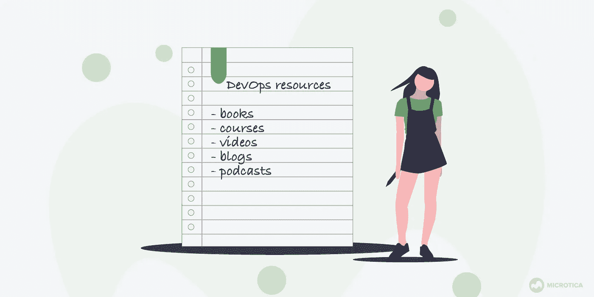

# 最好的 DevOps 资源(初学者和高级)

> 原文：<https://blog.devgenius.io/the-best-devops-resources-beginners-advanced-506dd649fc81?source=collection_archive---------3----------------------->

DevOps 解决方案的未来是光明的。[全球 DevOps 市场规模](https://www.marketsandmarkets.com/Market-Reports/devops-824.html)预计将**从 2017 年的 29.0 亿美元增长到 2023 年的 103.1 亿美元**，在预测期内的复合年增长率(CAGR)为 24.7%。

对快速应用交付的日益增长的需求推动了市场增长，组织希望同时实现速度和质量。

然而，世界正面临发展技能的短缺。这就是 DevOps 工程师收入高的原因， [Glassdoor 估计](https://www.glassdoor.com/Salaries/devops-engineer-salary-SRCH_KO0,15.htm) **平均年薪在 10 万美元左右**。

因此，如果你正在寻找职业转换或升级，学习 DevOps 是一个好主意。从书籍到播客，*以下是最好的 DevOps 资源:*

# [凤凰计划](https://www.bookdepository.com/Phoenix-Project-Gene-Kim/9781942788294?ref=grid-view&qid=1588577029418&sr=1-1)

谁能想到你能写一部关于 DevOps 的小说？嗯，吉恩·金、凯文·贝尔和乔治·斯帕福德显然做得很好！

**凤凰计划**是一部关于 DevOps 的惊艳小说。故事围绕一家名为“零件无限”的虚构公司展开，在该公司中，IT 经理被提升到高级职位。然后，他得到 90 天的最后期限来修复“凤凰项目”，一个失败而混乱的代码项目，对公司的未来至关重要。如果他失败了，首席执行官威胁要外包整个 it 部门，并解雇在 IT 部门工作的人。

因此，他在一些董事会成员的帮助下开始着手这项工作。这里最重要的是他的哲学，叫做三条道路。它包括(显然)三个部分——最大化从左到右的工作流程，从业务到开发到 It 运营再到最终用户；增加从右到左的反馈循环，发展和培养[持续部署](https://microtica.com/cracking-the-continuous-deployment-code/?utm_source=medium&utm_medium=referral_link&utm_campaign=devgenius&utm_content=devops-resources)和学习的文化。

这种理念帮助他在部门、[创造了**一个精简的工作流程，提高了**沟通**、**和效率**，让 IT 部门真正对公司有价值。**](https://microtica.com/6-tips-to-solve-miscommunication-in-dev-teams/?utm_source=medium&utm_medium=referral_link&utm_campaign=devgenius&utm_content=devops-resources)

我认为这是一本非常棒的书，尤其是对初学者来说。它让我们了解 It 部门每天面临的问题，并提供切实可行的解决方案。

# [基础设施代码](https://www.oreilly.com/library/view/infrastructure-as-code/9781491924334/)

来自 ThoughtWorks，这是另一本书，从更技术性的角度关注整个 DevOps 运动。本书涵盖了基础设施作为代码的原则、实践示例、动态基础设施平台、各种云选项、工具、模式、软件工程实践、[管道](https://microtica.com/how-to-create-simple-ci-cd-pipeline/?utm_source=medium&utm_medium=referral_link&utm_campaign=devgenius&utm_content=devops-resources)的创建和管理、工作流以及基础设施管理。它们都分为三个部分——基础、模式和实践。

如果你对类似的书籍感兴趣，你可以查看同样由 ThoughtWorks 撰写的[进化架构](https://www.amazon.com/Evolutionary-Architecture-Nature-Basis-Design/dp/0471117269)和[构建微服务](https://www.amazon.com/Building-Microservices-Designing-Fine-Grained-Systems/dp/1491950358/ref=sr_1_1?s=books&ie=UTF8&qid=1508683865&sr=1-1&keywords=microservices)。

# [DevOps 要领](https://www.udemy.com/course/linux-academy-devops-essentials/?LSNPUBID=JVFxdTr9V80&ranEAID=JVFxdTr9V80&ranMID=39197&ranSiteID=JVFxdTr9V80-BF4jpUPRiGZluHvCXXjptQ)

这个 Udemy 课程已经接待了超过 90，000 名学生，他们给出了 4.5/5 的平均评分。课程完全免费，包括 2 小时 10 分钟的视频课程。

这门课程可以让你了解 DevOps 如何影响 IT 世界。您将了解基本的 DevOps 术语、DevOps 的发展、最重要的流程、最常用的工具以及最受欢迎的 DevOps 和云提供商。

# [Docker 和 Kubernetes:完全指南](https://www.udemy.com/course/docker-and-kubernetes-the-complete-guide/?ranMID=39197&ranEAID=JVFxdTr9V80&ranSiteID=JVFxdTr9V80-T3DyVhPcjn.KepO0Rg.oZg&LSNPUBID=JVFxdTr9V80)

另一门 Udemy 课程，注册学生超过 19 万，平均评分 4.7。在 22 小时的视频材料中，你会学到你需要知道的关于 **Docker 和 Kubernetes** 的一切，即使你以前没有这些话题的经验。

本课程从深入了解 Docker 世界开始，向您展示所有 Docker 基础知识。然后，您将了解关于建立 [CI/CD 管道](https://microtica.com/how-to-create-simple-ci-cd-pipeline/?utm_source=medium&utm_medium=referral_link&utm_campaign=devgenius&utm_content=devops-resources)以及在 Github 和 AWS 上实现它所需的一切。

然后，您将学习利用 Node、React、Redis 和 Postgres 构建一个多容器应用程序。之后，您应该能够在 AWS 上部署单容器和多容器应用程序。

最后，您将学习如何构建 Kubernetes 集群。本课程甚至包括在 Kubernetes 上设置 HTTPS。

在他们的评论中，学生们说他们非常喜欢老师一步一步解释所有概念的方式。总而言之，这是 Udemy 上最好的课程之一。

# [学习 DevOps:持续交付更好的软件](https://www.udemy.com/course/learn-devops-continuously-deliver-better-software/?LSNPUBID=JVFxdTr9V80&ranEAID=JVFxdTr9V80&ranMID=39197&ranSiteID=JVFxdTr9V80-ImNkBFHUPJQ04wh3qXOm9A)

关于 DevOps 的最详细的课程之一，面向更有经验的工程师、系统管理员、IT 经理、IT 运营成员和其他 IT 专业人员。

讲师解释了如何**通过自动化、配置管理、供应和部署来改进软件交付。** Docker 和 Kubernetes 也包括在内。

虽然课程持续了大约 4.5 个小时，但是你可以通过自己尝试每件事情来增加更多的内容。讲师甚至为陷入困境的人提供支持。学生们也有一个脸书小组，在那里他们张贴问题和讨论。

# [网飞理工大学博客](https://netflixtechblog.com/)

网飞理工大学的博客是一个很好的地方，在那里你可以找到“他们如何在网飞编写代码”开发者共享几乎所有的东西，超越了 DevOps。在这里，你将了解**网飞如何创建、建设和管理其系统和工程组织**。

例如，在他们的一篇博客中，他们详细阐述了如何将[网飞 DevOps 模式应用于 Windows](https://netflixtechblog.com/applying-netflix-devops-patterns-to-windows-2a57f2dbbf79) ，而另一篇则是关于他们的[六边形架构](https://netflixtechblog.com/ready-for-changes-with-hexagonal-architecture-b315ec967749)。

# [DevOps 子编辑](https://www.reddit.com/r/devops/)

虽然 DevOps SubReddit 不是每个人的首选，但它有许多有趣和有用的信息，软件工程师应该查看一下。在这里，你会发现很多关于 DevOps 的博文、文章和新闻。

最重要的是，您可以**与其他 DevOps 爱好者**进行讨论，从他们的知识和经验中学到很多东西，分享很多实际的例子。

# [播客:被捕的 DevOps](https://www.arresteddevops.com/)

《被捕的 DevOps》是由乔·拉哈、布里奇特·克罗姆胡特、马特·斯特拉顿、特雷弗·赫斯和杰西卡·克尔主持的播客。他们已经录制了超过 170 集，目标是帮助开发人员发展实践和管理团队，帮助他们最大限度地利用 DevOps。

听众可以从来自世界各地的嘉宾那里了解更多关于 DevOps 策略、最佳工具和集成的信息。剧集时长约 40-45 分钟，每月发布一次。

**这里有一些 DevOps 资源的其他链接，你可能会觉得有用:**

*   [53 个 DevOps 从业者必备资源](https://techbeacon.com/devops/53-essential-resources-devops-practitioners)
*   [DevOps YouTube 频道订阅](https://microtica.com/blog/8-devops-youtube-channels-to-follow-in-2021/?utm_source=medium&utm_medium=referral_link&utm_campaign=devgenius&utm_content=devops-resources)
*   [DevOps 资源— AWS](https://aws.amazon.com/devops/resources/)
*   [最好的 DevOps 在线资源](https://www.upguard.com/blog/devops-resources-online)
*   [2020 年成功必读的 8 篇 DevOps 文章](https://opensource.com/article/19/12/devops-resources)
*   [GitOps 资源终极清单](https://microtica.com/blog/the-ultimate-list-of-gitops-resources/?utm_source=medium&utm_medium=referral_link&utm_campaign=devgenius&utm_content=gitops)

*原载于 2020 年 5 月 14 日 https://microtica.com***。**