# 我在生产模式中遇到的最好的糟糕代码的例子。

> 原文：<https://blog.devgenius.io/the-best-examples-of-bad-code-ive-come-across-production-mode-4f13e8d4de2?source=collection_archive---------6----------------------->

这些截图只是为了好玩，我希望你不要生这些家伙的气。

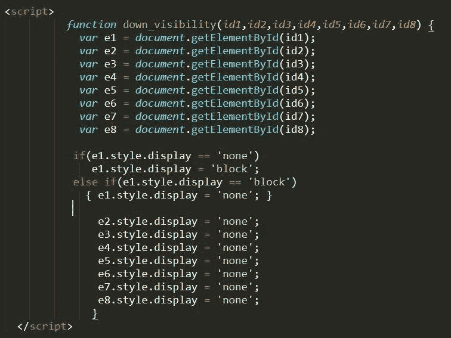

这是唯一一个不生产的。但这是狗屎代码的最好例子

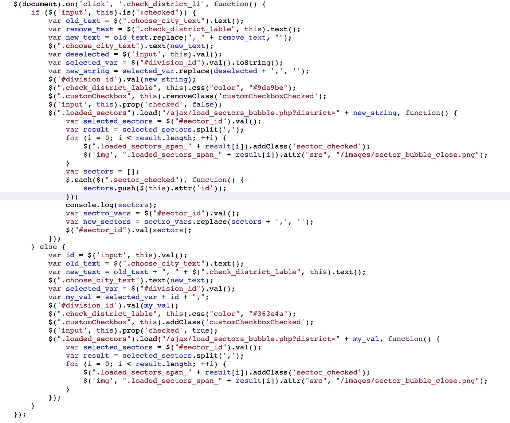

究竟

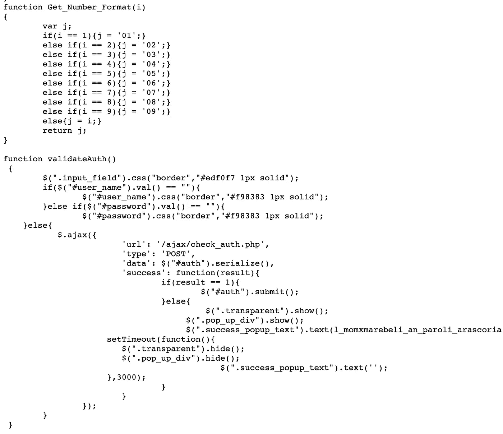

二合一设备。自定义 padStart 和“validateAuth”

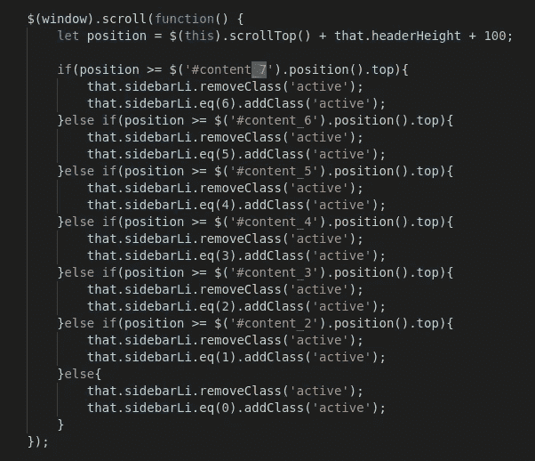

简单导航

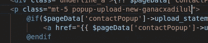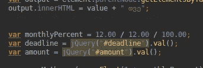

条件语句，本地语言

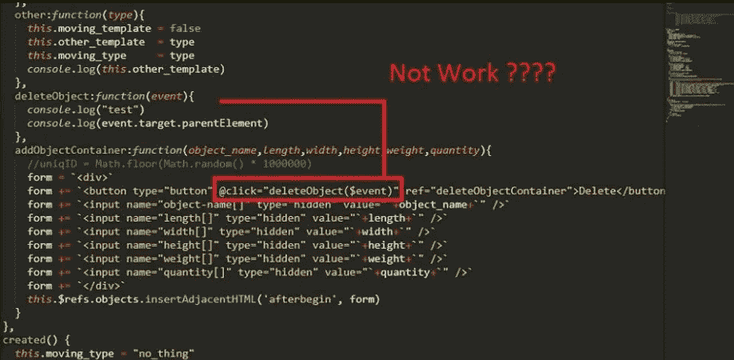

Vue.js 像地狱的 jquery。参见[篇](https://medium.com/@sosogvritishvili/how-not-to-use-vue-like-jquery-15fc32ecc377)

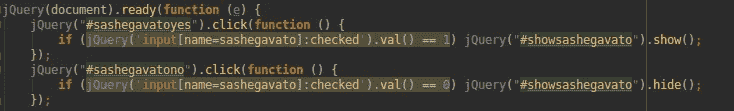

如此干净

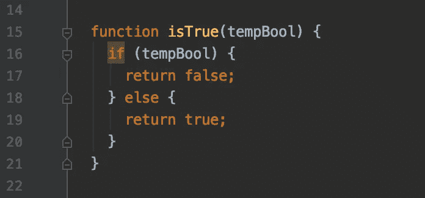

只是“isTrue”

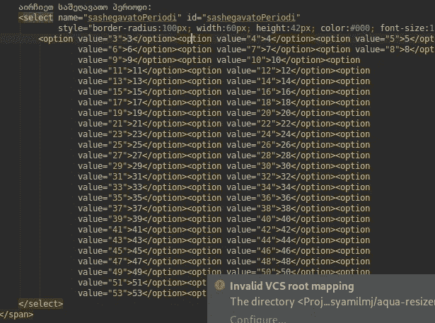

这段 HTML 代码是由银行开发人员编写的，目前仍在生产中:(

附言

我也有很多不好的代码。

我在我的项目里发现了这个，但是我不明白这到底是什么— **设置语言**函数)))))

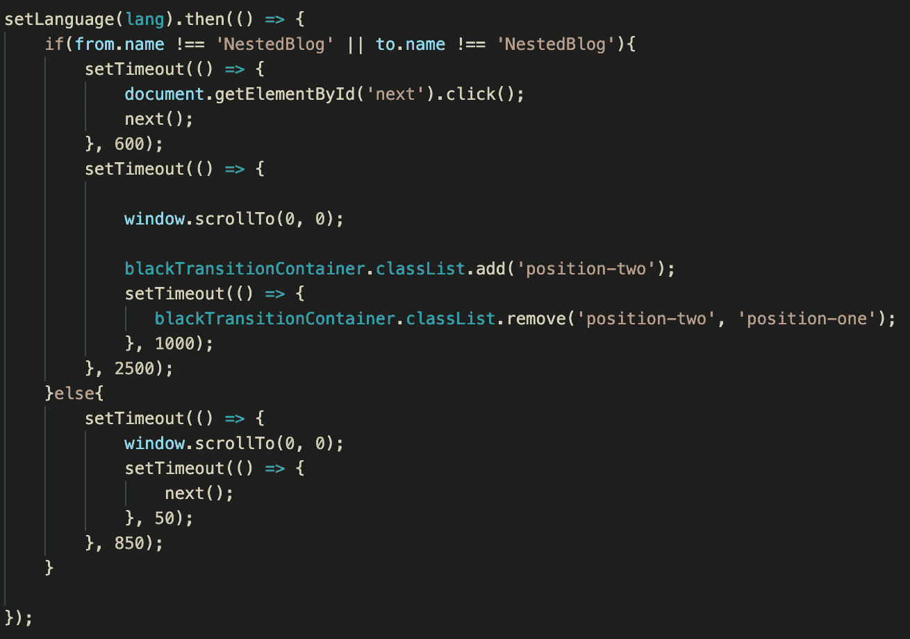