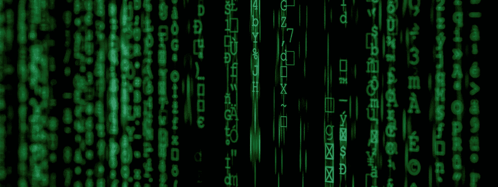
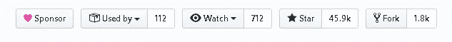
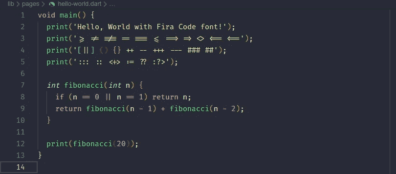
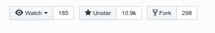
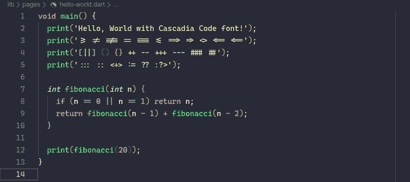
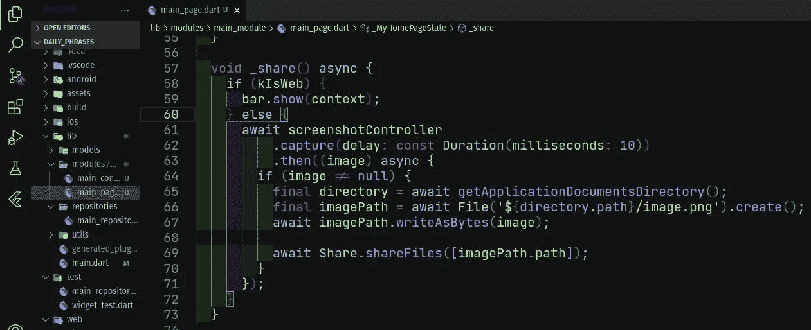
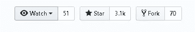
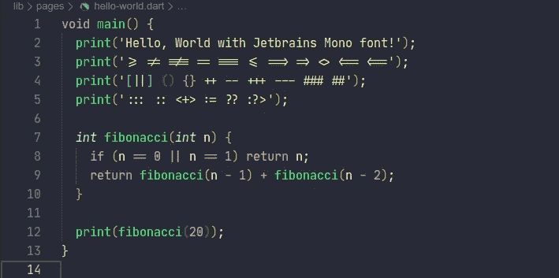

# 开发的最佳字体

> 原文：<https://blog.devgenius.io/the-best-fonts-for-development-25b15a748409?source=collection_archive---------5----------------------->

souce:[https://www . tecmundo . com . br/cultura-geek/144636-matrix-retorna-cinemas-20-anos . htm](https://www.tecmundo.com.br/cultura-geek/144636-matrix-retorna-cinemas-20-anos.htm)

嘿，怎么了！在这篇文章中，我将向你展示一些最漂亮的单色字体，以改善你在编程时的视觉体验。

当然，以上所有字体都是**单声道**、**开源**，可用于 **GNU/Linux** 、 **Windows** 和 **macOS** ，也可用于大多数文本编辑器，如 VS Code、Sublime Text、NotedPad ++等，以及集成开发环境(IDE)，如 Android Studio、Visual Studio 等。

**# 1——FIRA 电码**
毫无疑问，它是最广为人知和最著名的电码之一。根据 whit GitHub 的统计，这是最常用的。

*   GitHub 统计数据:

*   代码示例:

下载和更多信息:[https://github.com/tonsky/FiraCode](https://github.com/tonsky/FiraCode)

**#2 —卡斯卡迪亚代码** 卡斯卡迪亚代码于 2019 年推出，承诺通过命令行和其他环境改善我们的体验。看看博文:[https://devblogs.microsoft.com/commandline/cascadia-code/](https://devblogs.microsoft.com/commandline/cascadia-code/)

*   GitHub 统计数据:

*   代码示例:

下载和更多信息:[https://github.com/microsoft/cascadia-code](https://github.com/microsoft/cascadia-code)

在我们进一步讨论之前，如果你使用 Visual Studio 代码并且喜欢黑暗主题、Ufo、科幻，请看看我的 UFO 主题。

截图 Ufo 主题

我现在使用的字体是由 JETBRAINS 创建的，你可能知道。这种字体与其他字体不同，并且在视觉体验上做了很好的优化。

*   GitHub 统计数据:

*   代码示例:

下载和更多信息:[https://www.jetbrains.com/lp/mono/](https://www.jetbrains.com/lp/mono/)

要不你选其中一种字体，看你喜欢怎么样！？

感谢你阅读❤

“所以不要害怕，因为我与你同在；不要惊惶，因为我是你的神。我会给你力量，帮助你；我将用我正义的右手支持你。”**以赛亚书 41:10 (NIV)**

错误或建议？用你的拍手留下评论。

→ [**看看我的 GitHub 简介。**](http://github.com/wendreof)→ [**我的 LinkedIn 简介。**](https://www.linkedin.com/in/wendreof/)→[**Ufo 主题**](https://marketplace.visualstudio.com/items?itemName=wendreof.ufo) **。**