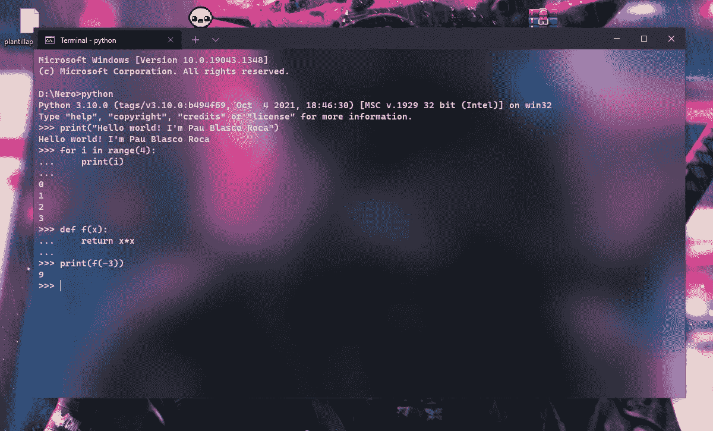

# Python 初学者的最佳免费 ide

> 原文：<https://blog.devgenius.io/the-best-free-ides-for-python-beginners-f138e59bf381?source=collection_archive---------7----------------------->

## 编程/ Python

## 以防你想开始编程，却不知道去哪里。

当我开始编程时，我很幸运，我有一个知道他在说什么的朋友。他让我下载某些程序，我也是。我只是信任他，一切都很顺利。

但是我认识很多人，他们花了整整一个学期的时间使用 Python 的基本 IDE——甚至是终端——来用 Python 编程。不好意思，什么？你为什么要这样对自己？

## 该终端不是初学者友好的！

有些人会告诉你，从终端编程是一个很好的开始方式。我非常不同意。该终端应该是高级用户的工具，而不是初学者的工具。如果您想测试安装是可以的，但是如果您计划定期编程，只需安装一个 IDE。

从终端使用 python 可能很棘手，并且会导致错误

顺便说一下，如果你想让你的终端和我的一样酷，看看这篇文章:

 [## 如何在 Windows 10 中自定义您的终端

### 你不知道你能做到，对吗？这就是你在这里的原因。没关系，我也不知道，直到几个…

medium.com](https://medium.com/@paublascoroca/how-to-customize-your-terminal-in-windows-10-896fd2432f25) 

## 选项 0: Python 的集成开发环境

[Python 自己的 IDE](https://docs.python.org/3/library/idle.html) 不是最棒的选择，但是默认情况下你会安装它。如果您正在学习编程课程，这可能会为您节省几天时间。但从长远来看，这不是你想坚持的事情。

这就是为什么我把它写成选项零。试用它是可以的——比终端好得多——但要尝试其他东西。

[真人蟒蛇](https://www.google.com/url?sa=i&url=https%3A%2F%2Frealpython.com%2Fpython-idle%2F&psig=AOvVaw3IxeAUeIRrBRqCQiox7sxE&ust=1639201786032000&source=images&cd=vfe&ved=0CAwQjhxqFwoTCJjliOLE2PQCFQAAAAAdAAAAABAd)图片

## 备选方案 1:Replit.com

假设这是你这学期的第一或第二节课，或者你只是在尝试 python。你没有时间安装一个大的集成开发环境？这里有一个解决方案:使用在线翻译！

[回复](https://replit.com/~)拥有您需要的一切。一个命令提示符，一个自由编写和编辑代码的外壳，一个清晰显示错误的好控制台。该网站还允许您与其他用户进行实时协作，访问 GitHub repos 等等。

我曾经教过我的一个学生的一些代码的截图

> 快速提示:记住要使用离线 IDEs(你安装在你的电脑中的 IdeS)，你需要安装 [Python 本身](https://www.python.org/downloads/release/python-3101/)。

## 选项 2: Jupyter

Jupyter 是一个基于网络的 IDE(一个“笔记本”)。这个与另一个有点不同，因为它使用“块”来工作。按块编程有一些优点，因为您可以只编译代码的某些部分。它对新程序员、数据分析师和科学研究特别有用。

Jupyter 可以直接从 Google Drive 导入数据，如果您的 Python 代码需要数据库工作，这是一个非常重要的功能。你需要在你的电脑上安装 Jupyter 来运行它，但是它是一个非常轻量级的程序。

Jupyter 用户界面的快速快照

## 选项 3: PyCharm

[来自 JetBrains 行业的 PyCharm](https://www.jetbrains.com/pycharm/promo/?source=google&medium=cpc&campaign=14127625862&gclid=CjwKCAiA78aNBhAlEiwA7B76p6x7h73N1g61yip4M4RTtFiUCpsxnaDnvvRtbC_HZHdxsV8h5EkNLRoCueIQAvD_BwE) 是一个先进的 IDE，可以让你开发更大更健壮的 python 项目。如果你正在构建一个大的东西，比如一个应用程序或者一个视频游戏，PyCharm 可能是你最好的选择之一。

PyCharm 的 edu 和社区版本可以免费使用。程序不是很重，但是需要一段时间安装。幸运的是，安装程序附带了一个向导，可以为您完成这项工作。

PyCharm 允许更高级的调试和变量跟踪

## 选项 4: Spyder + Anaconda

[Sypder](https://www.spyder-ide.org) ，Anaconda 的一项服务，面向高级和专业 Python 程序员。它允许用户广泛地控制变量。此外，它有一个非常清晰和可视化的文件树，这使得导航对程序员来说更容易。

Jupyter 也在 Anaconda 包中，所以如果你既需要一个轻量级的应用程序，又需要一个更强大的工具，也许你应该考虑安装整个程序。

你现在用的是什么？你的第一个想法是什么？你是初学者还心存疑虑吗？在下面评论一下。

*更多内容尽在*[*blog . devgenius . io*](http://blog.devgenius.io)*。*