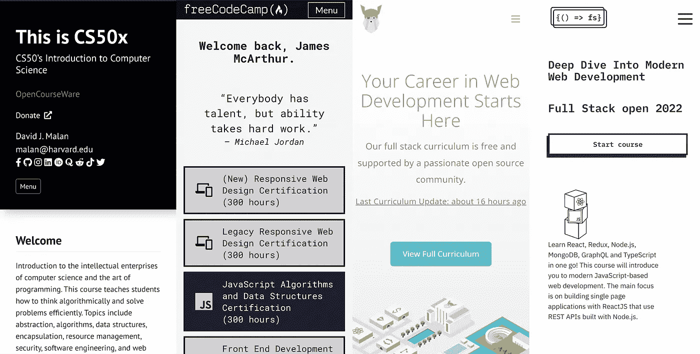

# 学习编码的最佳免费在线训练营

> 原文：<https://blog.devgenius.io/the-best-free-online-bootcamp-to-learn-to-code-5e0a6fa72326?source=collection_archive---------0----------------------->

## 在无数的全堆叠训练营中，有一个可以统治所有的训练营

而答案是……在文章底部。但是在你向下滚动以满足你的好奇心之前，让我们花点时间来评估一下今天你可以参加的一些最著名的训练营。了解每种方法的优缺点，将有助于您做出正确的选择，并加速您的开发之旅。

# 竞争者

今晚在座的有一些大人物:

*   
*   *[***全栈打开***](https://fullstackopen.com/en/)*
*   *[***奥丁项目***](https://www.theodinproject.com/)*
*   *[***CS50:计算机科学导论—哈佛大学***](https://pll.harvard.edu/course/cs50-introduction-computer-science?delta=0)*

*在这四种信息中，有你曾经想要学习编码、获得一份开发人员的工作，或者甚至建立一个十亿美元的独角兽项目的所有信息；所以，知道你可以在键盘前和屏幕后变得熟练，而不必在你的口袋或银行账户里挖洞，你会感到安慰。*

**

*竞争*

# *自由代码营*

*我们首先从 FreeCodeCamp.org 开始；真的不用动脑筋。FreeCodeCamp 为全栈开发者可能想要探索的所有基础知识领域提供免费的教育课程。*

## *赞成的意见*

*   *提供的许多课程都是高度互动的。FCC 为学习者提供一个主题或概念的演示，然后是一个互动的环境以及相关性的挑战，以确保学习者能够调整他们的理解并在新的环境中应用它。*
*   *他们的课程非常全面，确保每个主题都得到一丝不苟的理解。他们的大部分互动课程都辅以相当详细的答题方案。*
*   *每门课程都是在提交了几个“项目”之后完成的，这些项目需要结合一些主题来完成。这种内容材料的集体应用对巩固你的学习是极好的。*
*   *在他们的互动课程中，有一个非常快速的反馈循环，可以非常上瘾和有益；学习一个小概念，然后立即测试你的理解能力。*

## *骗局*

*   *有些课程纯粹是基于视频的，这会让他们觉得不那么吸引人，也更难保持一致、有动力和专注。*
*   *如果你很难理解一个概念的解释，那么你如何寻求帮助并不明显；这意味着你可能会被卡住。*
*   *他们的一些精选课程稍微有些过时，考虑到软件不断发展的本质，这可能会在你的学习旅程中浪费大量时间。*

# *奥丁计划(上)*

*TOP 是更传统的结构化学习资源；在很多方面类似于教科书。TOP 将他们的网站分成独立的、连续的课程，要求用户通读一个大主题的相当全面的解释，然后在最后提供一个练习/家庭作业，用户可以选择完成一个“项目”并应用他们的新知识。*

## *赞成的意见*

*   *顶级网站上的内容是按照非常符合逻辑的顺序组织的，这为用户提供了一个非常渐进和自然的学习过程。*
*   *TOP 提供了一个极好的学习资源供参考，就像一本解释关键概念的字典，所有这些都非常系统地相互关联。*
*   *通过顶级课程的学习，你会逐渐积累项目组合。这些可以展示出来给未来的雇主留下深刻印象。*
*   *TOP 提供了两个独立的总体课程，即**全栈 JavaScript** 路径和**全栈 Ruby on Rails** 路径。*
*   *TOP 为一系列路径和主题提供了大量信息。*

## *骗局*

*   *虽然介绍性材料非常好，并提供了所有相关主题的丰富深度信息，但一些更中级到高级的课程感觉远不那么吸引人&完全呈现，失去个性，并依赖于将你外包给替代信息源。*
*   *由于没有内置的交互式开发环境，因此积极参与课程的障碍更大。*
*   *家庭作业练习感觉很随意，应用新概念的机会不是很频繁。*
*   *人们很容易变得自满，跳过任何“知识的应用”或互动部分，然后才进入下一部分。这可能会损害你的学习，因为它减少了你头脑中对主题的巩固。因此，感觉更容易分心，因为在继续前进之前没有性能要求。*

# *全栈开放(FSO)*

*全栈开放有且只有一个目标，教你如何用 ReactJS 构建单页应用程序(SPA ),它使用用 NodeJS 构建 REST APIs。*

## *赞成的意见*

*   *不要浪费时间——这是绝大多数雇主想要的内容，FSO 会马上帮你找到。*
*   *有大量有用的代码示例展示了无数特性的优秀代码实现。*
*   *内容贯穿初级和中级阶段，向您传授一些更高级的(也许不那么激动人心，但绝对重要)和基本的主题，真正使您成为 NodeJS & ReactJS 开发专家。其中一些主题在其他课程中通常是没有的。*
*   *内容也是“教科书”式的，非常全面。*

## *骗局*

*   *互动部分仍然存在障碍，但是 FSO 课程仍然努力激励你像好学生一样完成作业。*
*   *信息的广度不那么一般化，更加单向，这可能导致编码之旅不那么激动人心和充满活力。*
*   *本课程被认为比其他课程更难，需要一些先决知识，因此学习步骤往往让人觉得有点大，难以独自完成；这会让人感到有点泄气。*
*   *关于最佳实践和实施，有些内容可能有点过时。*

# *CS50:哈佛大学计算机科学导论*

*经过尝试和测试，这个训练营将你置于权威的教育环境中。这是一篇大学论文，从更理论和学术的角度涵盖了计算机科学的介绍性主题。*

## *赞成的意见*

*   *该课程由最高水平的教育机构提供，保证在课程的结构和讲授以及引入内容的进度方面无缝衔接。*
*   *你将会对你所知道和听到的流行语背后的推理和机制有一个非常完整的理解。*
*   *CS50 教授了更广泛的信息，包括你要学习的语言和技术。这有助于您理解更宏观的 web 开发基础设施以及与性能相关的概念和实践。*

## *骗局*

*   *这个过程不是一件小事；长达 11 周，每周 10-20 小时，这是一项需要完成的小型火星任务。*
*   *有时，学术资源可能会忽视真实工作环境的实用性，这可能意味着一些内容可能是不必要的，可能会延长您的学习旅程。*
*   *一些教学材料的受欢迎程度和采用率呈下降趋势，使其相关性稍有下降。*

# *判决*

*无论怎么强调都不为过，这些课程中的每一门都足以教会你学习编码、找工作或实现你想要的任何目标所需的知识和技能。*

*然而，仍然有一条道路可以加速你的学习之旅，从你应该学习的各种技术中，教育你最好和最现代的实践。这条路就是利用上述每一种方法提供的最佳部分。*

## *小路*

1.  *首先，我们从 [FreeCodeCamp](https://www.freecodecamp.org/learn/javascript-algorithms-and-data-structures/) 的 [JavaScript 算法&数据结构](https://www.freecodecamp.org/learn/javascript-algorithms-and-data-structures/)课程开始，这无疑是学习你的第一语言的最佳场所。此外，在课程结束时，您将获得一份证书，并显示在您的专业资料中。*
2.  *接下来，学习 Git 和 HTML & CSS 的基础是非常重要的。没有比这里更好的地方来学习奥丁计划的基础课程。补充这一步骤的一个很好的资源是[你可能需要的任何额外内容或解释的互联网碎片](https://www.internetingishard.com/)。*
3.  *(可选)——要真正巩固你从上述 HTML & CSS 课程中获得的技能，完成 FreeCodeCamp 的全新 [HTML & CSS](https://www.freecodecamp.org/learn/2022/responsive-web-design/) 证书是实现和测试你的知识的一个好地方。*
4.  *现在基础已经很好了，是时候通过参与 [**整个**全栈开放](https://fullstackopen.com/en/)课程来拓展你的视野了。这是一个令人惊讶的课程，但它需要一些上述内容的先决经验。*
5.  *真正完成基本学术旅程的最后一步是 [FCC 关系数据库](https://www.freecodecamp.org/learn/relational-database/)课程。关系数据库及其带来的一切在行业中无处不在，FCC 为这个确切的主题提供了最终的交互式学习资源。*

***恭喜你，你现在是认证程序员了。***

*所有的要点都来自我们今天可以获得的最好的免费在线资源。在我自己成功的职业转变过程中自学了 web 开发，我可以回顾性地证明这是理想的学习路线图。*

*您可能会注意到，我没有将 CS50 包含在上面的路径中。这是因为这门课的性质。它是缓慢的，但是稳定的，这确实最终会让你到达你需要去的地方，但是就时间效率而言，它不会对你到达你需要去的地方构成挑战。*

*感谢您的阅读，祝您一路顺风，如果您有任何学习**全栈开发**栈的首选方法，请务必告诉我！*