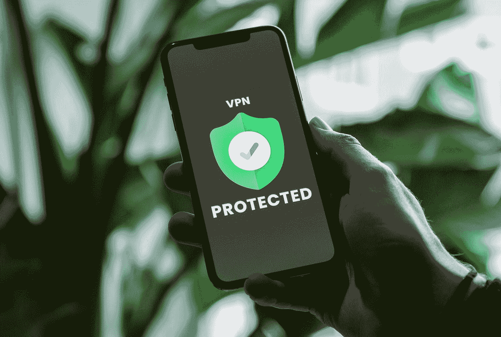
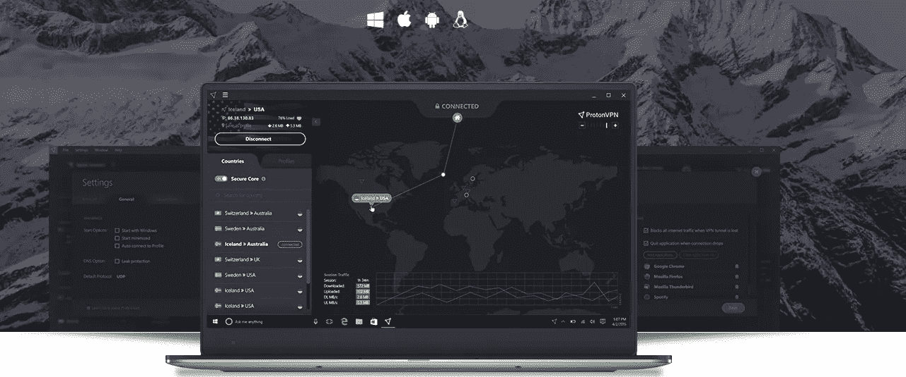

# 最好的免费 VPN 服务

> 原文：<https://blog.devgenius.io/the-best-free-vpn-services-e5be82e4fc95?source=collection_archive---------10----------------------->

在一个互联网监控越来越多的世界，拥有一个 VPN 来保护你的身份，这是必不可少的。黑客和间谍公司变得越来越复杂，你必须保持匿名。

在 [Unsplash](https://unsplash.com?utm_source=medium&utm_medium=referral) 上[privesics](https://unsplash.com/@privecstasy?utm_source=medium&utm_medium=referral)拍摄的照片

我现在使用 VPN 已经有很多时间了，我从来没有对它们失望过。当然，他们开始的时候有点慢，但是一旦基础设施跟上了，就好了。让我们来看看一些最好的免费 VPN 选项。

# 质子虚拟专用网

第一个是 ProtonVPN，它提供一个有限的免费版本，提供强大的高级服务。与大多数免费 VPN 相比，它最大的优势之一是**它有无限的数据，是的，你没看错，无限的数据**。它也是无广告的，这是一大优势。使用免费计划，你只能访问日本、荷兰和美国的服务器。

ProtonVPN 具有**易用、直观的界面**和多平台兼容性。**快速连接功能**将您连接到附近最快的服务器。VPN 还提供了强大的安全性，包括**强大的 AES 加密**和**自动删除开关。**其他功能包括 DNS 泄漏保护和分割隧道支持。

# Windscribe

Windscribe 提供了**慷慨的数据津贴**，这使它成为我最喜欢的免费 VPN 之一。仅仅三个多小时的高清视频就足够了。你可以通过推特获得额外的 5 GB，也可以通过推荐朋友每月获得额外的 1 GB 免费数据。Windscribe 拥有**最先进的安全性**，具有强大的 AES 加密和对多种 VPN 协议的支持。

付费和免费用户都可以访问 Windscribe 的所有功能，包括它的**广告和恶意软件拦截器**。很少能找到有这个功能的免费 VPN，所以这是一个很大的好处。这个虚拟专用网还配备了一个**防火墙，可以阻止其安全隧道**之外的所有流量，以防止意外泄漏。

# 热点屏蔽

Hotspot Shield 提供**可靠的连接和军用级加密**。我的测试没有发现任何 DNS 漏洞，这意味着它有效地掩盖了你的 IP 地址，以保护你的在线隐私。

Hotspot Shield 兼容所有主流操作系统，有一个**无日志策略**来保护你的匿名，并提供专门的技术支持。

虽然 Hotspot Shield 在 80 个国家拥有 3200 台服务器，但免费版只能让你访问美国的虚拟位置。

# 结束语

使用 VPN 对保护你的隐私至关重要，所以我建议使用这些免费版本中的任何一个来试试。您可能想要从不同的位置访问一个节目或打开一个受限的网站，这些选项将非常有用。如果你更重视你的隐私，那么我建议你买一个高级版本，永远不要回头看。