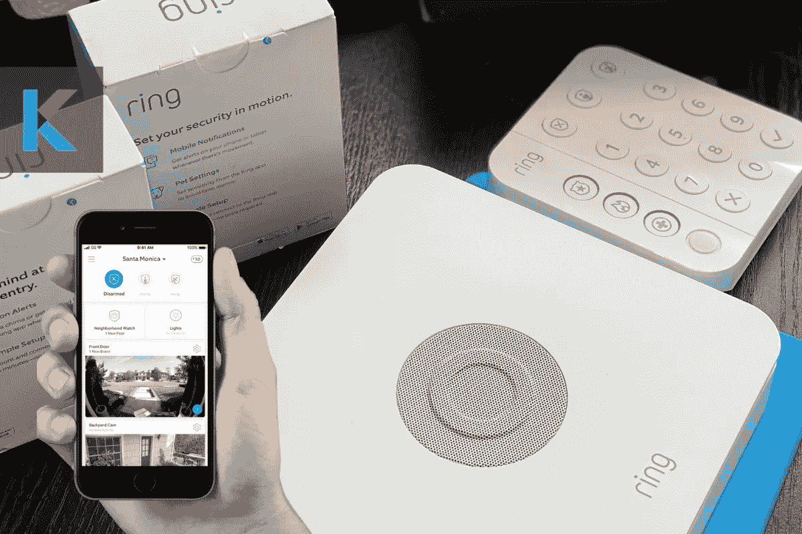
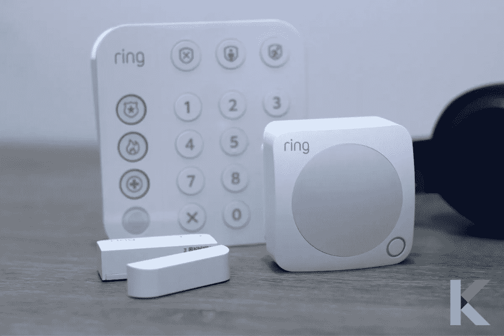
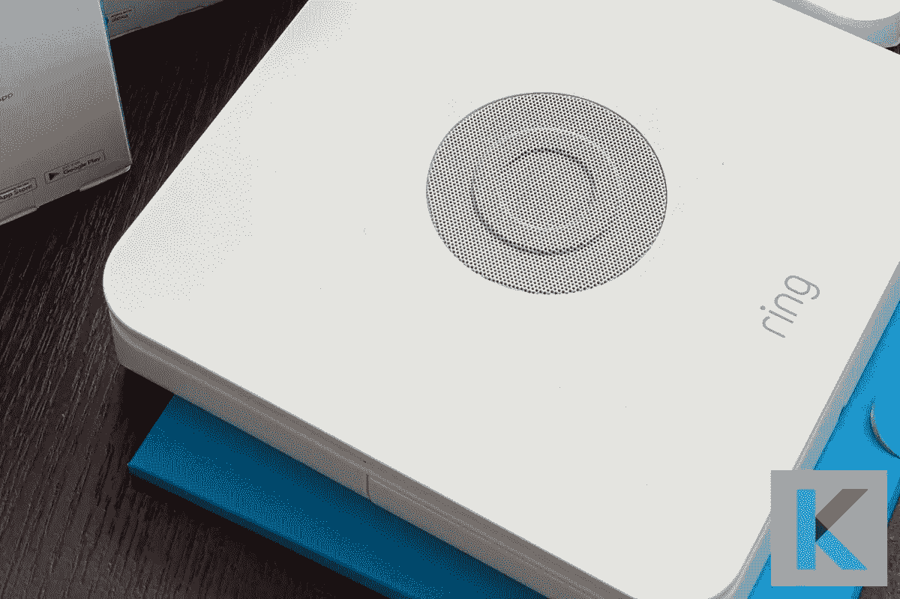
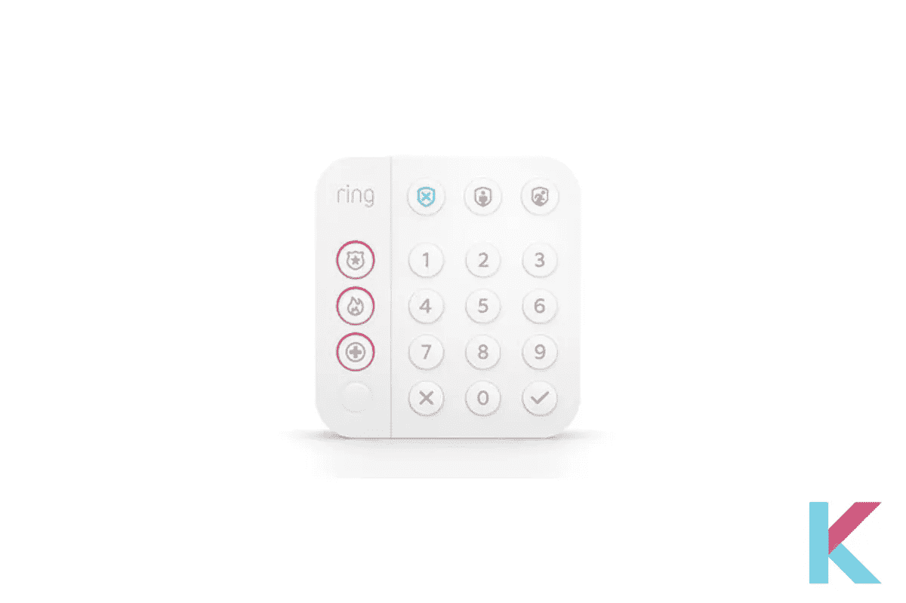
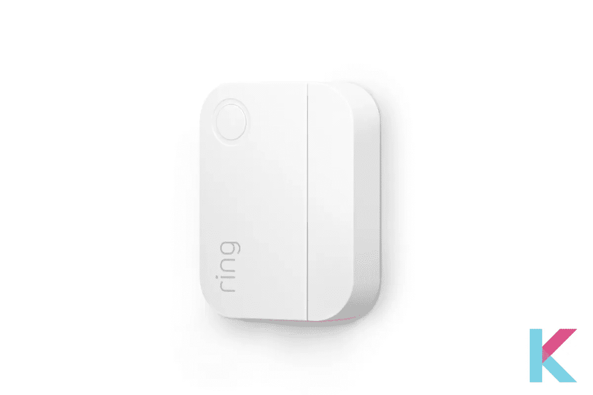
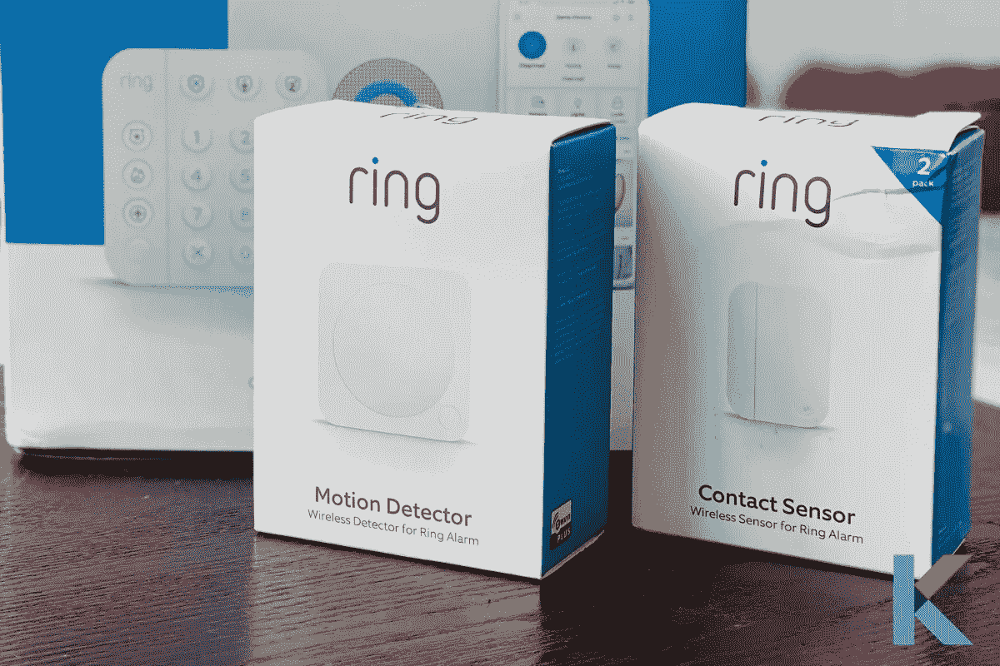
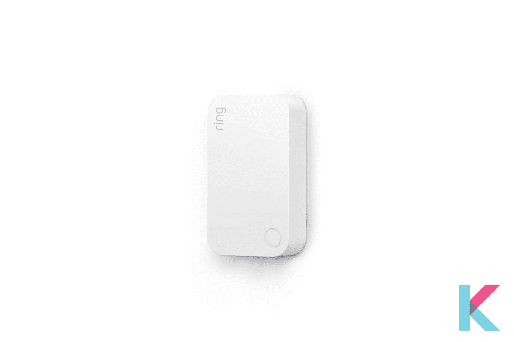

# 2021 年最好的响铃报警家庭安全套件

> 原文：<https://blog.devgenius.io/the-best-ring-alarm-home-security-kit-in-2021-174569e85126?source=collection_archive---------3----------------------->

说到家庭安防，Ring 对这个领域并不陌生。如果你想更安全地保护你的家，戒指装置是你最好的选择。市场上有许多戒指装置。响铃报警安全套件是你能买到的最好的设备之一。它包括保护你家所需的一切。这就是我们为您回顾的原因。以下是 2021 年你需要知道的关于你最喜欢的安全系统的一切。

响铃警报家庭安全套件

***在这篇文章中，你会学到；***

*   什么是环报警家庭安全套件？
*   为戒指用户提供良好的家庭安全性
*   响铃报警系统的利弊
*   比较规格/特性和组件
*   如何设置和安装环安全家庭工具包？
*   定价和应用程序
*   铃声警报套件的价格比较

# 什么是环报警家庭安全套件？

响铃警报家庭安全套件

环报警家庭系统是一个完美的入门套件给你。这是第二代 DIY 家庭安全系统的戒指。它只是根据您的需求进行扩展。只要简单地插入铃声警报基站，您就可以连接传感器，并从您的键盘或铃声应用程序控制它。此外，它还包括基站、接触传感器、运动检测器、键盘和范围扩展器等。

*   **基站**

基站

基站被认为是安全套件所有组件背后的大脑。它保持在线响警报以及连接到您的设备。它可以让你将所有的 [Alexa 设备](https://kodmy.com/alexa-smart-home-devices/)组合在一起，并通过 Ring 应用程序设置闹钟组件。它还有一个 24 小时备用电池，并与蜂窝备份耦合。

*   **键盘**

键座

您可以使用键盘轻松启动和解除您的环形报警系统。它比前一个小。此外，键盘上有三个独立的按钮。它让我们直接与警察、医疗和消防部门联系。你只要按住键盘上的按钮三秒钟。然后，会通知相关部门。

*   **接触传感器**

接触传感器

一旦你的门或窗打开，你就可以收到警报，并用接触式传感器保护它们。它由两节纽扣电池供电。此外，我们可以把它放在我们的前窗或门上。

*   **运动检测器**

运动检测器

它有一个更薄的外形，像带有按钮和指示灯的键盘。一旦室内检测到运动，你就可以向你的智能手机发出警报。可以放在每个房间或者走廊。太神奇了！它允许组件只关注人类入侵者。此外，它忽略了动物的运动。

*   **范围扩展器**

范围扩展器

这个范围扩展器将信号从报警基站扩展到它的所有组件。它以纤细的外形指示按钮和指示灯。此外，它还放大了基站和传感器之间的距离。

快一点！[从亚马逊](https://amzn.to/32daBBo)获取戒指安全报警套装。

你还可以[从沃尔玛花 149.99 美元](https://goto.walmart.com/c/3127890/568833/9383?veh=aff&sourceid=imp_000011112222333344&prodsku=334538825&u=https%3A%2F%2Fwww.walmart.com%2Fip%2FRing-Battery-Powered-Indoor-White-Alarm-Home-Security-Kit%2F334538825&intsrc=PUI2_4282)获得环形电池供电的室内白色报警家庭安全套件。

是的。一旦你在你的报警安全系统中添加了一个[视频门铃](https://kodmy.com/ring-video-doorbell-3-plus/)和安全摄像头，你就可以通过实时查看按钮获得实时音频和视频。一旦你把它们添加到你的报警系统中，你就可以随时知道你家周围和里面发生了什么。当你与支持 Alexa 的设备配对时，你可以用你的声音启动和解除你的警报系统。

当玻璃破碎时，检测一氧化碳警报或烟雾警报的声音，可以通过添加 Alexa Guard 选择亚马逊 Echo 设备来检测。不需要额外的工具。它有你需要的一切。所以，你想把它堵上，然后你就可以保护你的整个家。更重要的是要记住，您可以使用 Z-Wave 设备、智能锁等第三方设备来扩展您的系统，以获得更高的安全性。

该环引入了隐私和安全措施，使客户能够以简单的方式访问和调整他们的设置。它包括对其配备摄像头的设备进行双重身份认证。[阅读更多](https://kodmy.com/ring-alarm-home-security-kit/) ……。