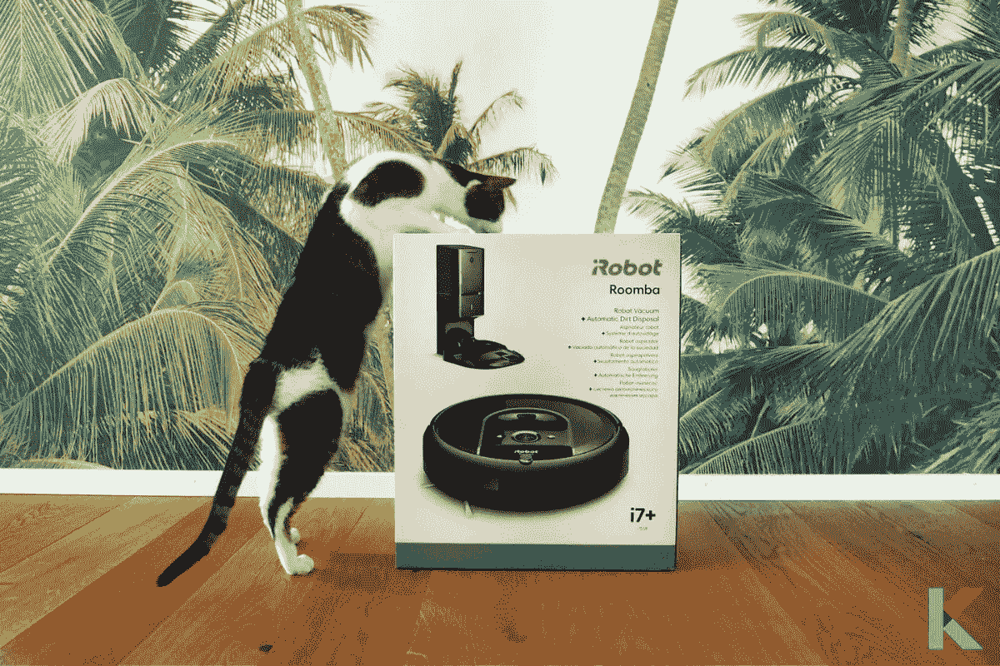
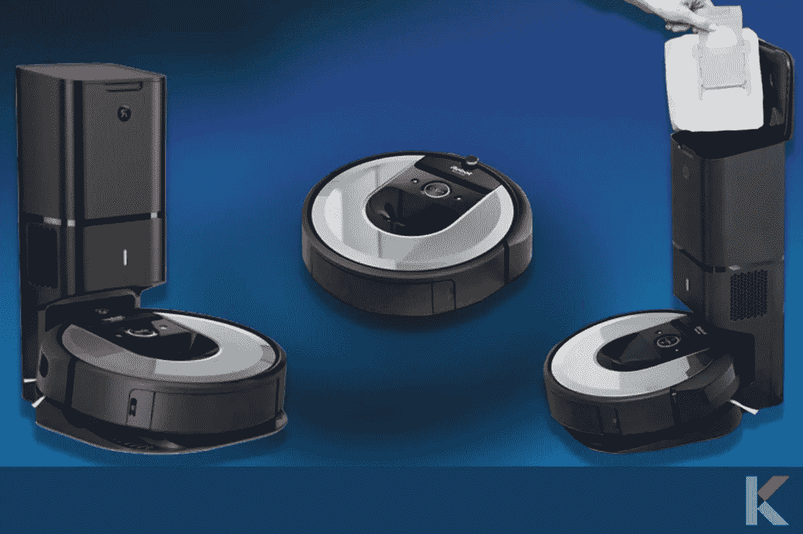
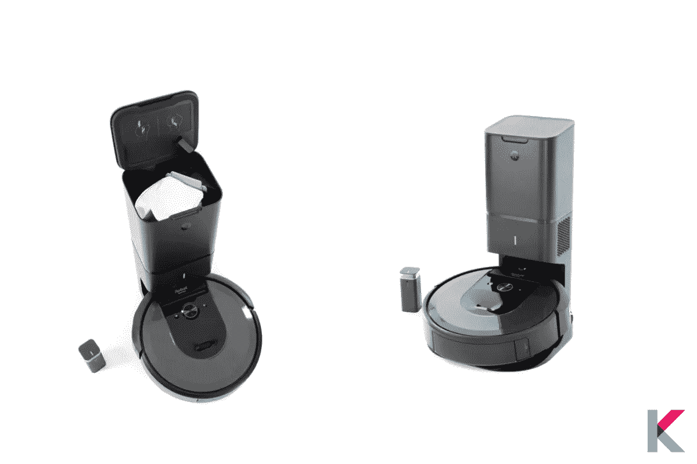
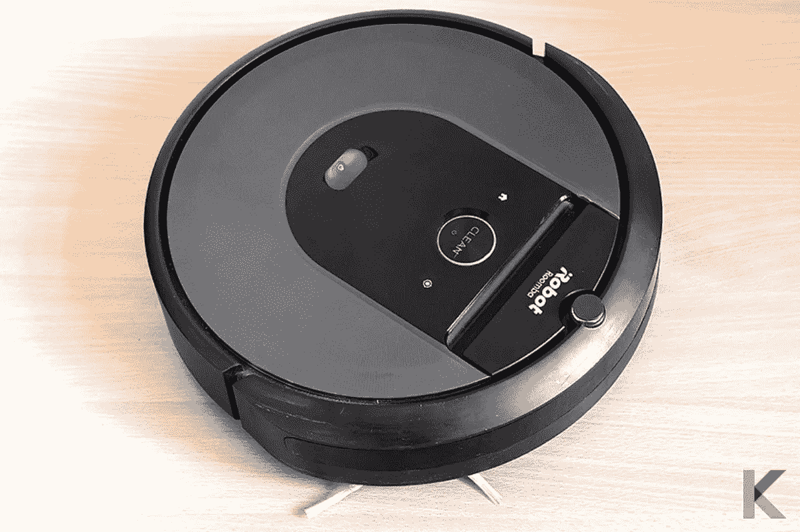
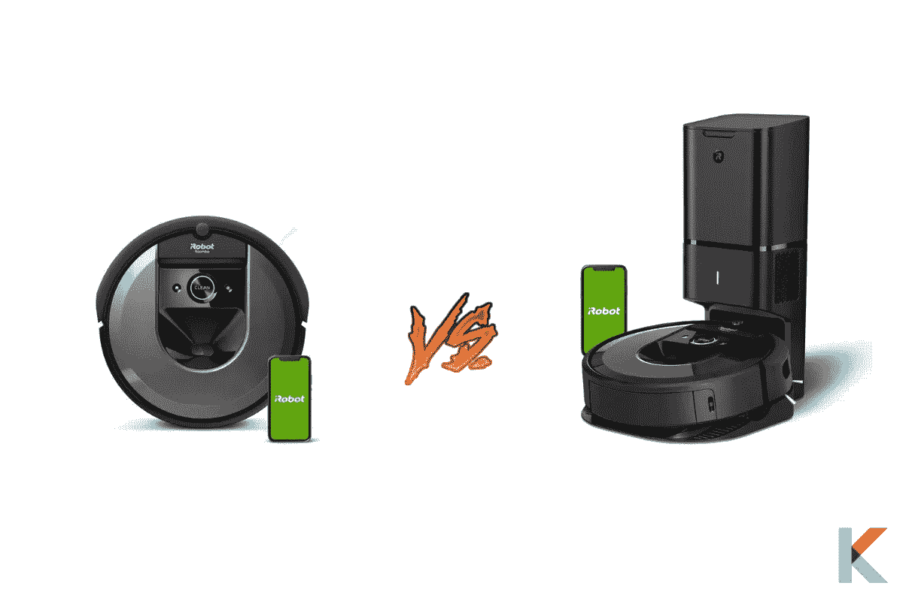
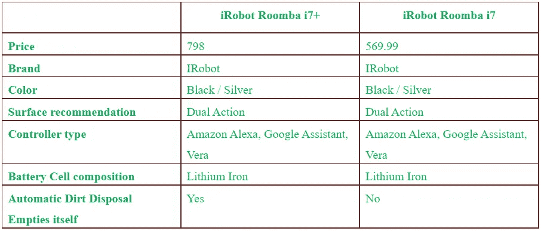
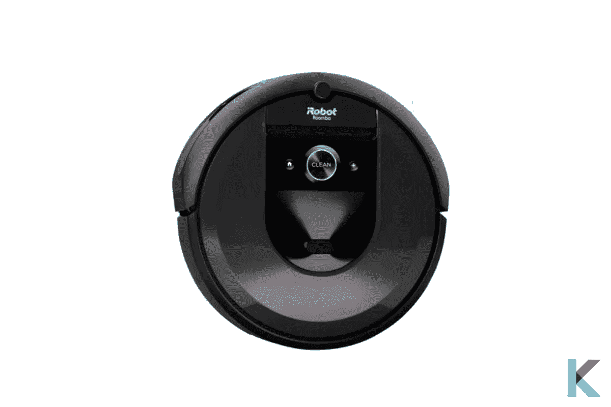

# 2021 年最佳机器人吸尘器

> 原文：<https://blog.devgenius.io/the-best-robot-vacuum-in-2021-faa08c27c721?source=collection_archive---------3----------------------->

这是一个惊喜。iRobot 真空吸尘器是不喜欢清扫、清洁，尤其是吸尘的人的绝佳选择。你可以坐在这里，想想把一盘脏东西倒进垃圾桶是多么大的负担。是的。在数字助理集成和智能绘图技术之间，它是非常值得的。以下是更多关于 2021 年最好的机器人吸尘器。

***在这篇文章中，你会学到:***

*   2021 年最好的真空是什么？
*   Roomba i7+的规格有哪些？
*   谁应该得到这个 iRobot Roomba i7+？
*   Roomba i7+的利与弊
*   购买机器人吸尘器前需要了解什么？
*   iRobot 主页应用程序和设置
*   Roomba i7 和 i7+有什么区别？
*   i7+和 i7 的价格对比
*   Roomba i7+值吗？

# 2021 年最好的真空是什么？

iRobot Roomba i7+是[最好的机器人吸尘器，具有智能地图功能](https://kodmy.com/the-best-robot-vacuum-in-2021/)。它有一个新功能，像自动污物处理-清空自己。此外，这是一个神奇的真空，有 [Alexa 智能助理](https://kodmy.com/the-best-alexa-compatible-devices-in-2021/#alexa)和 Wi-Fi 连接。

你会忘记一次用吸尘器打扫几个月吗？然后，你可以放松了。iRobot Roomba i7+是您的最佳选择。它允许清空自己长达 60 天的清洁基地自动污物处理。

当考虑到性能和回升，它拉在顽固和混乱与 10 倍的强大提升吸力和保费 3 阶段清洁系统。它还由带有 vSLAM 导航的 serious smart 引导。你知道吗，i7 学习你的智能家居的布局，并建立个人智能地图。如果你真的喜欢保持家里干净整洁，可以用这个 i7+ iRobot。

你在厨房桌子下面打扫卫生吗？只有你想请求你最喜欢的语音助手，或者你可以使用 iRobot Home 应用程序。它能让 i7+帮你收拾残局。你的 iRobot 知道你的厨房和你的其他房间，所以你必须通过智能地图来决定哪里是干净的，什么时候是干净的。此外，这是一个令人敬畏的小工具。他知道要避开敏感区域，比如游戏区和宠物碗。

它比你想象的要聪明。它会学习你通常在何时何地打扫卫生，并建议个性化的时间表。它有独特的功能，如独特的双多面橡胶刷。还有就是不会和宠物毛纠缠在一起。可弯曲以保持稳定，刷子可根据硬地板和地毯不断调整。此外，它是英国，马来西亚，新加坡最好的吸尘器。

然而，它是相当嘈杂的，当清空它的极端抽吸过程的垃圾箱，将污垢和灰尘拉进干净的地方。

快一点！ [***现在从亚马逊获得 iRobot Roomba i7+吸尘器***](https://amzn.to/3i0sOY6) 。

# Roomba i7+的规格有哪些？

*   重量:7.44 磅
*   尺寸:13.34 x 13.34 x 3.63 英寸
*   电池寿命:90 分钟
*   语音助手:亚马逊 Alexa、谷歌 Home
*   坞站尺寸:12.2 英寸 x 15.1 英寸
*   充电时间:100%充电 3 小时

# 谁应该得到这个 iRobot Roomba i7+？

如果你对房子的地板质量满意，iRobot Roomba i7 对你来说很好。事实上，今天人们生活在一个忙碌的世界。所以，你不得不做许多其他的事情，而不是清洁地板。它让你不用担心你的脏地板。此外，如果你有更大的面积和硬地板或普通中等地毯，你最好买这个。如果你有现金，想要最好的 iRobot，你可以选择这款机器人吸尘器

如果你喜欢[对比 iRobot Roomba 和 Roborock S7](https://kodmy.com/compare/smart-robot-vacuums?modelList=roborock-s7-robot-vacuum,irobot-roomba-i7-plus) ，你可以在这里找到最好的对比。

# Roomba i7+的利与弊

这个 iRobot 真空吸尘器是你家的绝佳选择，但也有一些缺点。让我们看看它们是什么。

***优点***

*   这比雇佣清洁服务要便宜得多。
*   你可以在任何地方用你的声音或 iRobot Home 应用程序来清洁你的地板和安排它
*   它兼容亚马逊 Alexa 和谷歌助手
*   它可以清洁硬木、地毯和乙烯树脂。
*   它可以毫不费力地从一种地板类型转换到另一种类型。
*   你只要按下按钮。然后它会在你做事的时候擦地板。
*   它是 100%自动化的。
*   它拥有出色的基于摄像头的导航功能

***缺点***

*   如果它在你附近吸尘，你就不能看电视，因为它们声音足够大。
*   它们不适合长而粗糙的地毯。
*   它比另一个更贵
*   经常性运营成本

# 购买机器人吸尘器前需要了解什么？

在使用机器人吸尘器之前，有一些重要的事情需要了解。如果你有楼梯，机器人吸尘器会从楼梯上掉下来。所以，你需要在楼梯前放些东西。特别是，你需要拿起机器人清洁的区域，而不被衣服卡住。你要记得把它当宠物来用，爱它。还有，你会给它起名字。

查看更多: [***Roborock S7 机器人真空与拖把***](https://kodmy.com/roborock-s7-robot-vacuum-and-mop/) ***。***

# iRobot 主页应用程序和设置

首先，你想下载 iOS 和 Android 版的 iRobot home 应用。然后注册一个账号。注册后，选择您想要连接的设备。然后，按下 iRobot 吸尘器上的 home 和 spot clean 按钮，等待开始按钮周围的 LED 环变成蓝色。您可以按照应用程序内的说明连接到家庭 Wi-Fi 网络。

还有，连接你的语音助手也很容易。您希望在相应的应用程序中启用机器人技能，然后链接您的帐户。之后，你可以用你的声音开始和停止清洁，将机器人放回它的基座，检查电池寿命，并定位它。

iRobot 应用程序本身设计良好，非常容易导航。核心屏幕很简约，中央有一个很大的清洁按钮。一旦你开始深入研究子菜单，它看起来相当精简。此外，您还可以在首选项、智能地图、历史记录、日程安排等选项卡之间进行选择。

类似产品: [***从亚马逊***](https://amzn.to/3AzJ35K) 获得 Roborock S6 机器人真空。

# Roomba i7 和 i7+有什么区别？

购买 iRobot Roomba 的最新版本时，有两种选择。你在争论选择 i7 还是 i7+？让我们把这件事解决掉。

*   **收集箱**

iRobot Roomba i7 拥有比 Roomba i7 更多的箱子。材料和尺寸是一样的。如果你喜欢把它冲洗出来，清洗你的真空吸尘器，你可以用肥皂水清洗。这两者是一样的。然而，只有一个区别。i7 收集箱底部有一个洞。所以，你不会在地板上留下任何污垢。那里也有一个小橡胶瓣。它可以用来封住洞口。

*   **自卸式底座**

当我们考虑充电站时，它们是不同的。iRobot Roomba i7 的标准对接门户称为 Home Base。它会插在插座上，坐在你的地板上等着对接。然后，它会开始给电池充电。充电后，它继续清洁或等待下一个计划。

Clean Base 是给 iRobot Roomba i7+的充电站起的名字。这个充电站有不同的平台。它有一个 14 英寸高的塔，有助于靠墙重置。该平台可识别密封收集箱的橡胶盖。当坞站给电池充电时，它开始清空收集箱。此外，你永远不要手动清空收集箱。当它装满的时候，你需要把袋子拿出来扔掉。但是，当它一直满着的时候，你不想检查它。

*   **充电站**

Home Base 和 Clean Base 充电站将为电池充电。Clean Base 充电站存在问题。它是通过收集箱上的橡胶密封片进行检测的。当检测到它时，它会清空垃圾箱中的内容。如果不是，底座除了给电池充电之外什么也做不了。

*   **自己吸尘**

除了充电底座和收集箱之外，这两个机器人完全相同。这包括轮子、马达、提取器和所有内部零件。垃圾箱安装的唯一区别在于机器人本身。此外，无线网络的连接和 iRobot Roomba 语音命令、移动应用程序和控制的使用是相同的，但内存是相同的。

*   **行李和清洁基地通知**

如果包包需要更换，Roomba 手机 app 会为你获取通知。然后你可以打开塔上的盖子，把袋子拿出来，换上一个新的。

# i7+和 i7 的价格对比

# Roomba i7+值吗？

iRobot Roomba i7 机器人真空对大多数人来说绝对值得。他们可以用简单的压力清洁陶瓷、瓷砖、硬木、乙烯基、层压板和地毯地板。如果你想打扫你的家，你甚至不必在家就能打扫干净。在有你最喜欢的毛茸茸的宠物和狗的大房子里，这将是一个特别值得的选择。还有，你可以在宠物少的小一点的家里用。

***雄霸天下***

在我看来，iRobot Roomba i7+是最好的机器人吸尘器。我认为有一个自动清空的扩展坞是很好的。所以，你可以用 i7+。但是，如果你不需要它并且节省预算，你可以选择 iRobot Roomba i7。

同类产品: [***从亚马逊***](https://amzn.to/3AzJ35K) 获得 Roborock S6 机器人真空。