# 最佳智能家庭安全摄像机 2021

> 原文：<https://blog.devgenius.io/the-best-smart-home-security-cameras-2021-a3ec934b207a?source=collection_archive---------1----------------------->

今天，随着技术的进步，我们周围有许多入侵者。所以，你需要时刻关注你家里和周围发生的事情。如果你想让你的家安全无虞，这篇评论特别适合你。市场上有许多安全摄像机和视频监控可供选择。

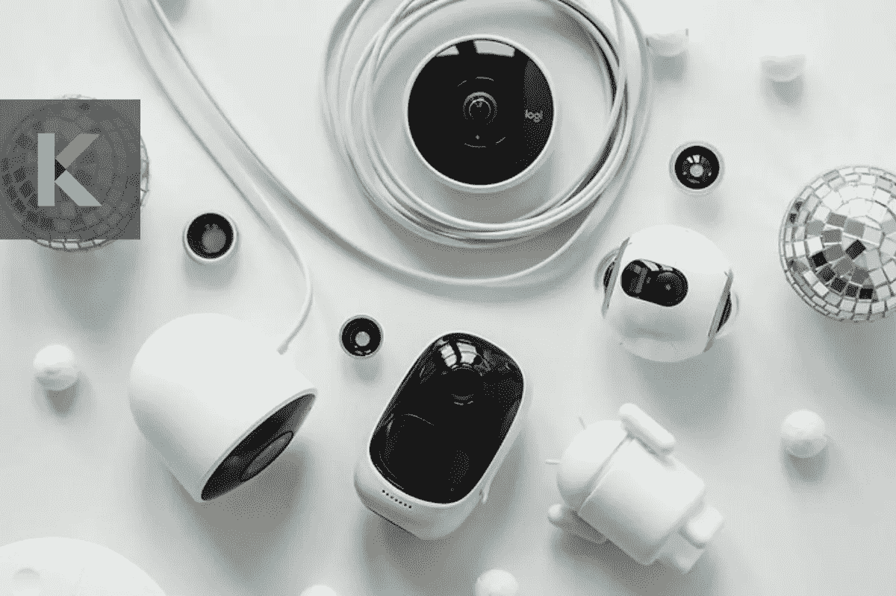

因此，您可以选择具有出色功能的最佳安全摄像机，如运动跟踪、双向通信、云存储、夜视、专业监控和智能通知。以下是 2021 年最好的智能家居安全摄像头[。](https://kodmy.com/best-home-security-cameras/)

***这篇文章，你会学到；***

*   2021 年有哪些最好的家用安防摄像头？
*   最佳整体安全摄像机
*   最佳室内安全摄像机
*   最佳户外安全摄像机
*   最佳谷歌助理相机
*   最佳亚马逊 Alexa 相机
*   最佳支持 Siri 的安全摄像头
*   最实惠的安全摄像机
*   最佳智能家庭安全摄像机的功能比较
*   监控摄像头是如何连接的？
*   为什么需要云存储？
*   为什么需要动作、声音检测、人脸检测？
*   你的监控摄像头能被黑吗？
*   价格和范围比较

# 2021 年有哪些最好的家用安防摄像头？

# 最佳整体安全摄像机

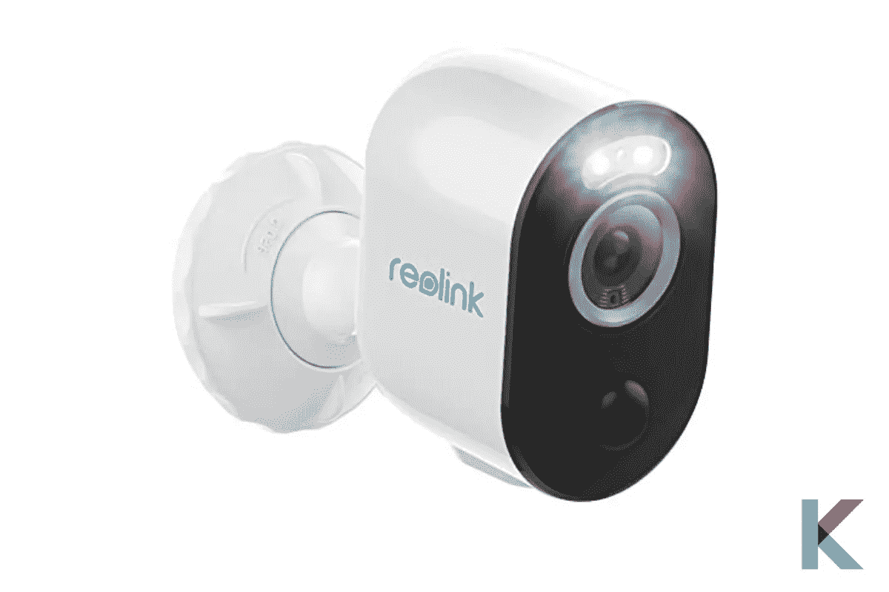

**Reolink Argus 3 Pro**

*   **Reolink Argus 3 Pro**

我们最好的整体安全摄像机是 Reolink Argus 3 Pro。它的性能几乎与爱洛 Pro 4 相同。它是最好的带有 microSD 卡插槽的无线摄像头。所以，不要担心付费订阅来保存视频。它提供了一个本地存储设备来记录和保存运动剪辑。您可以轻松安装，不需要电线或杂物。它带有一个树带和两个安装支架。

这款 Pro 比普通的 Reolink Argus 3 更好，因为它包括更大的电池和 400 万像素的超高视频分辨率。此外，它是英国和迪拜最好的安全摄像头。它支持 5 GHz Wi-Fi 和像亚马逊 Alexa 和谷歌助手这样的智能助手。如果你想知道谁在那里，你可以用声控命令来完成。

快一点！ [**从亚马逊**](https://amzn.to/3lVIs8p) **获取 Reolink Argus 3 Pro 安全摄像头。**点击这里。

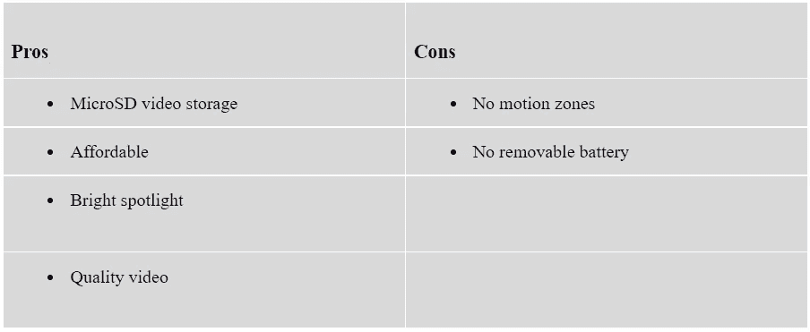

# 最佳室内安全摄像机

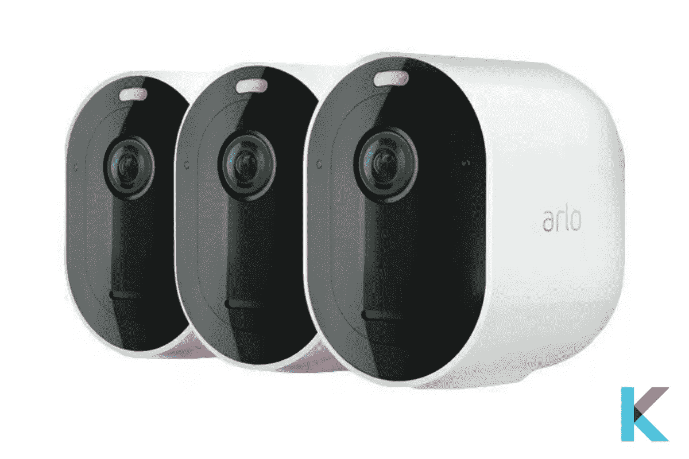

**爱洛 Pro 3 聚光灯摄像头**

*   **爱洛 Pro 3 聚光灯摄像头**

Arlo Pro 3 是一款无线室内和室外安全摄像机，具有彩色夜视、全彩色人脸或车牌、超宽视野和智能运动检测等功能。它有双向音频。所以，你可以用清晰的声音快速回应上门的访客。不要担心摄像机的视角。它拥有完美的相机视野，配有 160°对角视角的宽镜头。此外，单个运动传感器提供 130 度运动检测，具有运动跟踪功能和自动变焦功能。

它的智能提醒功能非常棒。因此，您可以通过订阅爱洛智能计划来接收通知并采取快速行动，例如拨打紧急服务电话或给朋友打电话。它还可以提供出色的 2K 视频。还有，可以配合自己喜欢的语音助手使用。

快一点！ [***从亚马逊***](https://amzn.to/3kuJnNn) 获得爱洛 Pro 3 智能无线安全摄像头。点击这里。

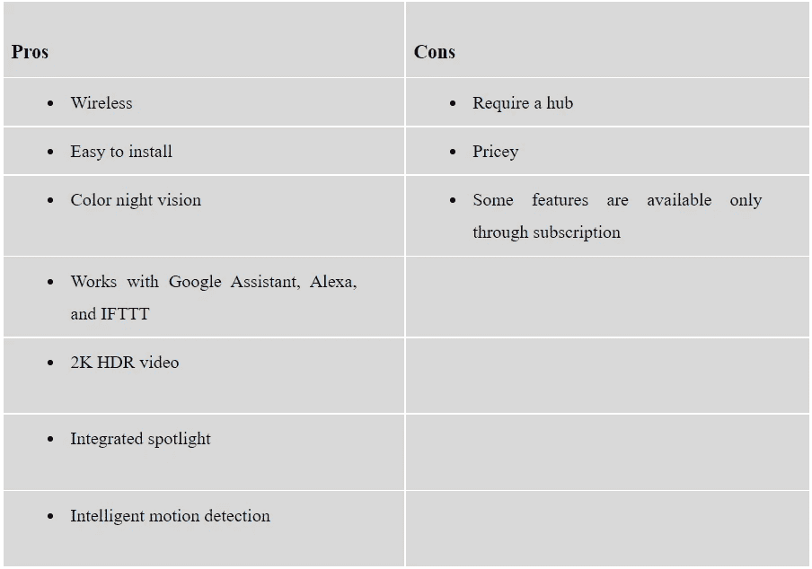

# 最佳户外安全摄像机

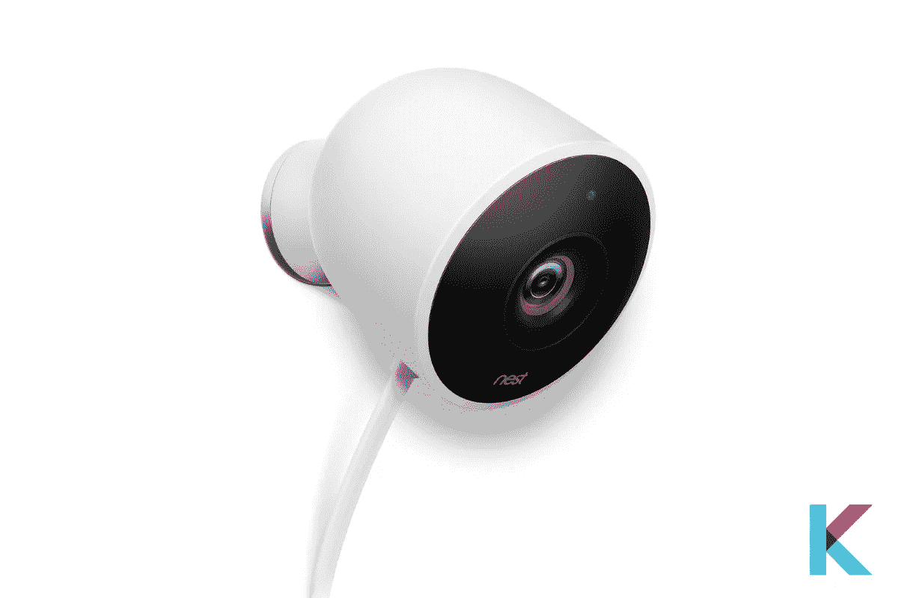

**Google Nest Cam 户外**

*   **Google Nest Cam 户外**

Google Nest Cam Outdoor 是用于家庭安全的最佳防风雨户外摄像机。这个摄像头是为那些想在后甲板、前门廊、车库、车道、游泳池区或他们家以外的任何地方考虑他们的客人的人准备的。此外，它还集成了你最喜欢的语音助手，如谷歌助手、[亚马逊 Alexa](https://kodmy.com/the-best-alexa-compatible-devices-in-2021/#alexa) ，以及 SmartThings。

当检测到运动时，相机会向您的智能手机发送警报。所以，你可以知道你不在的时候发生了什么事。此外，无论白天还是晚上，您都可以获得 1080p 视频。它有一根完全防水的电源线和适配器。此外，你永远不必担心它的电池没电了。你只是想把它插上电源。它还有一个独特的磁性底座，可以指向任何地方。

快一点！ [***现在从亚马逊获得 Google Nest Cam 户外***](https://amzn.to/39JWnsq) 。

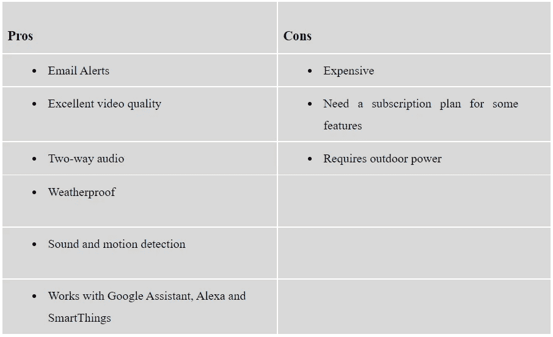

# 最佳谷歌助理相机

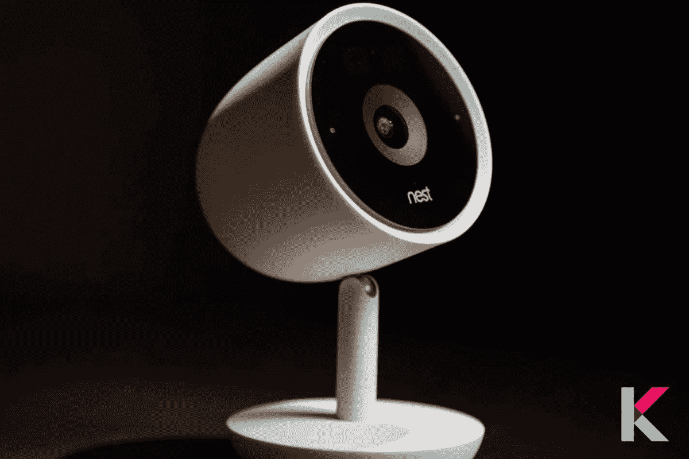

**巢凸轮智商室内**

*   **巢凸轮智商室内**

Nest Cam IQ 是一款一流的室内摄像机，具有先进的智能和 1080p 高清视频。它内置的谷歌助手可以帮助你回答问题和管理任务。所以，你的家不需要单独的智能音箱。它具有出色的功能，如人物提醒、高清通话和收听、24/7 直播以及即时提醒和快照。如果您错过了警报，您可以查看发生了什么。此外，它在 Nest 应用程序中有 3 小时的快照历史记录。

正如我们上面提到的，在音质、视频和图像方面，这是非常棒的。然而，对一些人来说，这可能是值得的。但它提供了智能功能，并以更合理的价格与智能家庭自动化兼容。

类似产品:您可以从现在的亚马逊 获得*。*

此外，您还可以通过 95.99 美元从沃尔玛获得谷歌 Nest Cam 室内 1080p 安全摄像头。

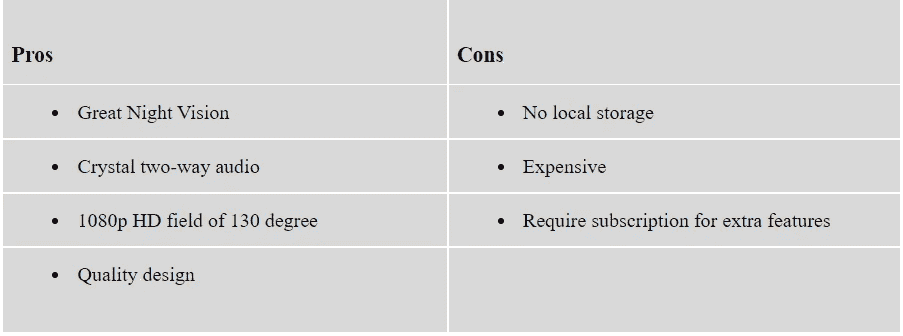

# 最佳亚马逊 Alexa 相机

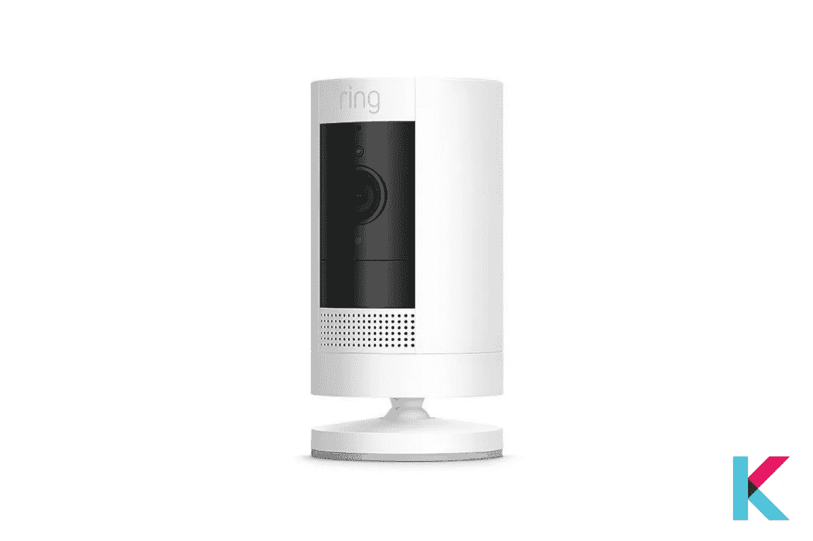

**环贴凸轮电池**

*   **环贴凸轮电池**

环形贴合凸轮与贴合电池完全无导线连接。这也是一款高清安全摄像头，具有双向通话和运动激活通知功能。不要担心靠近您的插座。您可以将它作为设计放置在任何地方。它还可以与您最喜欢的 Alexa 智能家庭助理配合使用，实现免提家庭监控。当有人在的时候，你会永远知道。

对于那些需要无线室外摄像机的人来说，这是个不错的选择，费用在您的预算之内。如果您有几个铃声设备，您可以通过铃声应用程序连接到它们。因此，您可以通过精选的 echo 设备、手机或平板电脑控制整个家庭的安全。此外，[铃声报警安全套件](https://kodmy.com/ring-alarm-home-security-kit/)是您家庭安全的完美入门套件。

快点。 [***从亚马逊获得环贴凸轮电池***](https://amzn.to/2Y7f7zG) **。**

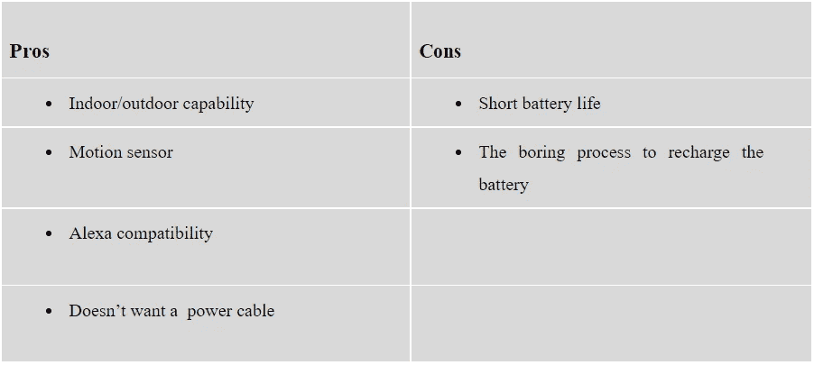

# 最佳支持 Siri 的安全摄像头

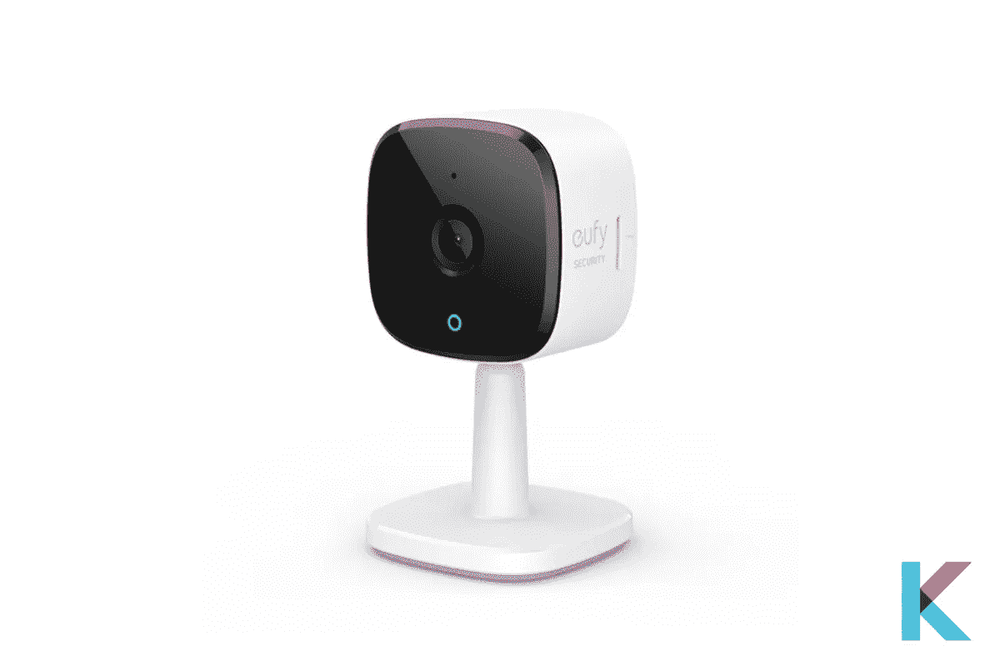

**欧盟成员国 C24**

*   **Eufy Solo indorcam C24**

Eufy Solo indorcam C24 是一款带有 2K 插件的家庭安全摄像头。它特别适用于室内监控或人类和宠物人工智能。它有特殊的功能，如双向音频，先进的夜视，它也与 HomeKit，Alexa 和 Google Assistant 一起工作。此外，Eudy 2K 是一款非常实惠的相机，具有双存储选项。因此，您可以将视频存储在本地或云中。

此外，您可以使用 Eufy Security 应用程序在家中通过 Wi-Fi 从任何地方轻松办理入住手续。此外，你可以远程装备和解除你的相机，或者你可以通过 Eufy 应用程序创建一个自动日程安排。此外，您可以通过内置的双向音频与任何人实时通话。

同类产品:可以 [***从亚马逊***](https://www.amazon.com/gp/product/B08B5Y3R71?ie=UTF8&tag=kodmy-20&camp=1789&linkCode=xm2&creativeASIN=B08B5Y3R71) 获得 Eufy Solo indoorCam P22。

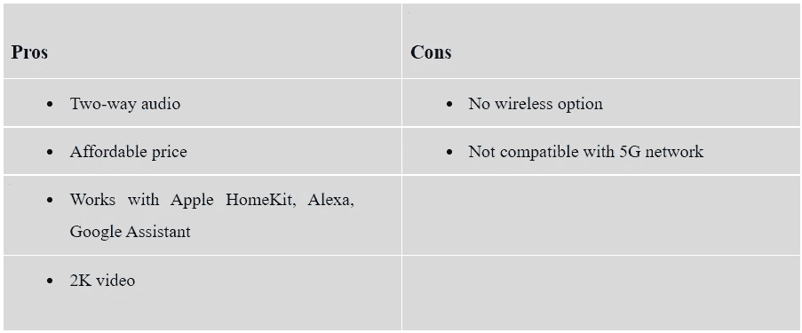

# 最实惠的安全摄像机

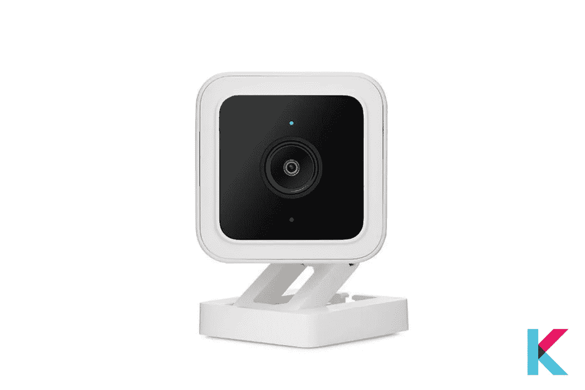

**WYZE 凸轮 v3**

*   **WYZE Cam v3**

WYZE Cam v3 是最实惠的室内/室外家庭安全摄像机，具有语音控制、智能运动检测、夜视、本地视频存储和内置警报器等功能。它是一个有线摄像机，也是 Wyze 的第三代家庭安全摄像机。就其价格范围而言，它提供了奇妙的功能。此外，它看起来像 Wyze cam v2，但有细微的差异。

它的星光传感器可以完整记录夜间视频。不要担心订阅。它提供免费的云存储，无需订阅。此外，您还可以使用 Wyze 应用程序访问最近两周的录音。当检测到声音或动作时， [Wyze cam](https://www.pcmag.com/reviews/wyze-cam-v3) 会录制视频并向您的智能手机发送警报。它有一个 32GB 的 MicroSD 卡 24/7 连续视频记录。

快一点！ [**从亚马逊**](https://amzn.to/3o0WHLu) 获取 Wyze cam v3。

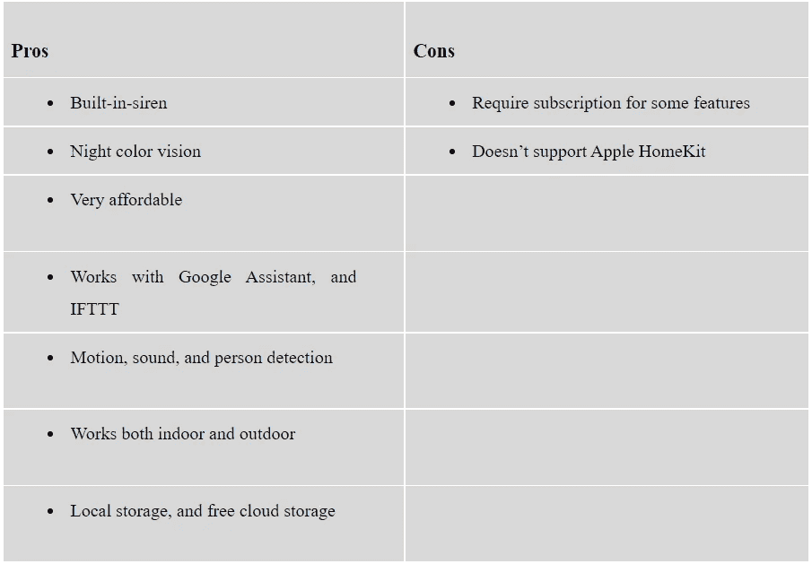

# 最佳安全摄像机的功能比较

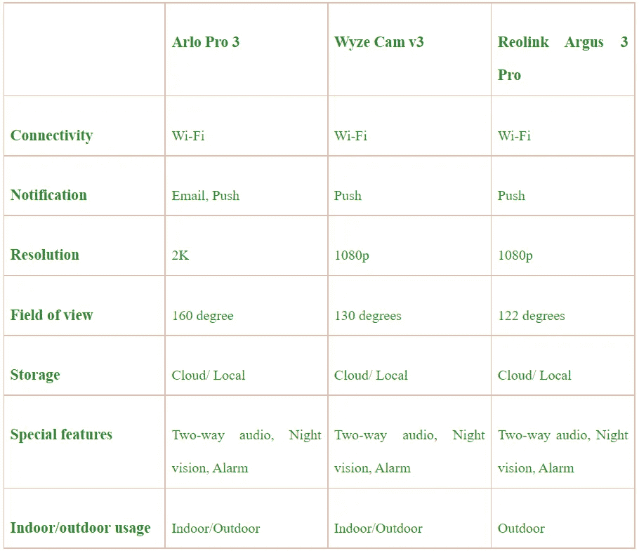

# 监控摄像头是如何连接的？

许多安全摄像头使用 Wi-Fi 连接，但不是全部。一些安全摄像头通过蓝牙连接进行本地控制。你可以通过手机轻松设置这些摄像头。然而，一些人使用单独的家庭自动化网络与其他设备进行交互，如 Z-wave 或 Zigbee。此外，您可以按照应用程序上的说明将安全摄像头连接到您的家庭网络。

当您的安全摄像头连接后，您将能够通过智能手机控制它。许多相机都有自己的应用程序来做任何事情。您还可以使用 web 门户灵活地从任何地方访问您的提醒和视频。此外，您可以使用语音命令来控制它。

# 为什么需要云存储？

你的安全摄像头存储视频吗？录制视频有几种方法。一些相机提供免费的云存储，而另一些则提供订阅服务。还有，云存储需要保存你的视频记录。这些记录不能保存在相机上。因此，你需要付费订阅或免费云存储来为你的安全摄像头获得这一功能。有些有 microSD 卡插槽，可以在本地保存您的视频。有几个可以让你把它保存到一个 NAS 驱动或者一个便携式 USB 上。

# 为什么需要动作、声音检测、人脸检测？

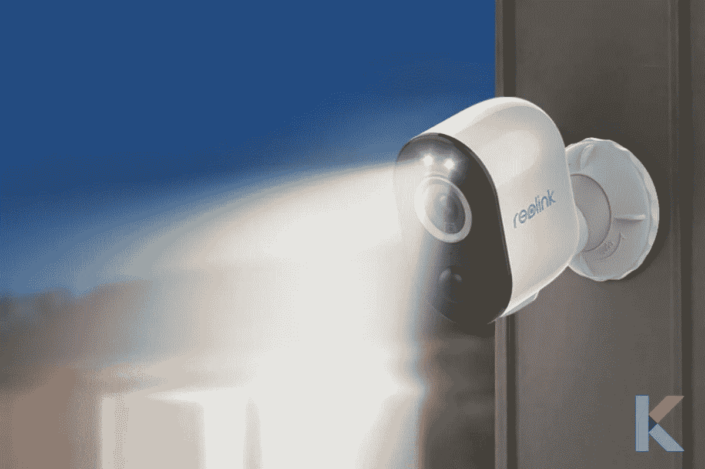

当检测到运动时，大多数安全摄像机会触发摄像机录制视频。大多数户外安全摄像机都配备了这种运动传感器。此外，它还会生成电子邮件提醒或向您的手机推送提醒。当考虑声音检测时，它可以让你知道是否有人在那里。您可以避免来自随机噪音、犬吠声和汽车声的警报。但是，您需要调整声音灵敏度设置。声音检测对于与外界任何人进行双向交流都很重要。

如果您希望在识别人脸时获得通知警报，人脸识别技术可以帮助您自动放大进入视野的人，并向您发送警报。此外，这项技术可以帮助您消除不必要的警报。

# 你的监控摄像头能被黑吗？

了解您的安全摄像头是一件非常重要的事情。它很容易被黑客攻击。你的安全摄像头有很多安全功能。但是你可以通过遵循这些建议来最大限度地保护你的隐私。你要记住的第一件事是，你想买一个具有可识别品牌的安全摄像机，你最好从一个值得信赖的卖家那里购买。

然后，你要确保你家的 wifi 网络是安全的。接下来，您需要为用于访问它的应用程序和您的安全摄像头创建强而唯一的密码。你最好让你的 wi-fi 路由器和相机的固件保持最新。当你不需要远程观看时，关掉它，挡住你相机的镜头。

# 价格和品牌比较

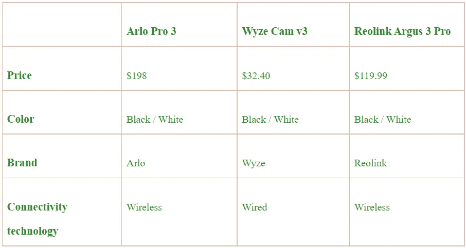

# 我们的选择

如果你正在寻找 2021 年最好的家庭安全摄像机，Reolink Argus 3 Pro 是最适合你的。我们喜欢 Argus 3 pro，因为它具有与 Arlo Pro 4 几乎相同的出色功能，并且价格低廉。然而，如果你考虑你的预算多于它的功能，你可以选择 Wyze Cam v3。这是最好的廉价安全摄像机。

想了解更多在家门口直接与人沟通和交流的方式，请查看我们的 [Best Ring Video 门铃 3 Plus](https://kodmy.com/ring-video-doorbell-3-plus/) 。

你期望选择最好的智能家居设备吗？然后，您可以通过我们的[智能家居比较工具](https://kodmy.com/compare/)将您喜欢的智能家居设备与其他设备进行比较。