# 最佳智能 Wi-Fi 路由器 2021

> 原文：<https://blog.devgenius.io/the-best-smart-wi-fi-routers-2021-9f24483e506c?source=collection_archive---------1----------------------->

今天，一切都基于互联网速度。所以，你必须在家里做一切事情，比如在家工作，并从家里了解新冠肺炎的情况。我们需要一款覆盖范围和性能都最好的优秀 Wi-Fi 路由器。如果你玩网络游戏，最好的路由器很重要。您可以通过无线网络轻松连接智能手机、笔记本电脑、智能电视和其他智能设备。最好的路由器不仅能让你保持连接，还能提供一些有趣的功能，如基于应用的设置、内置安全性和轻松的家长控制。以下是你需要知道的关于最好的智能 Wi-Fi 路由器的信息。

***在这篇文章中，你会学到:***

*   有哪些最好的智能 Wi-Fi 路由器？
*   最佳智能无线路由器
*   最佳 Wi-Fi 6 路由器
*   最经济实惠的路由器
*   最佳游戏路由器
*   最佳网状网路由器
*   各种 Wi-Fi 协议和频率是什么？
*   路由器是如何工作的？
*   调制解调器与路由器有何不同
*   路由器有哪些不同的类型？
*   如何选择适合自己的 Wi-Fi 路由器？
*   更新 Wi-Fi 路由器的理由
*   价格和功能比较

# 有哪些最好的智能 Wi-Fi 路由器？

你应该使用[最好的智能 Wi-Fi 路由器](https://kodmy.com/best-smart-wi-fi-routers/)，实现无拘无束、高质量、安全的互联网接入。这些智能路由器具有独特的功能。是的。现在，您可以解决一些最常见的连接问题。这就是这些智能 Wi-Fi 路由器的用途。

# 最佳智能无线路由器

*   **TP-Link Wi-Fi 6 AX3000 智能 Wi-Fi 路由器(Archer AX50)**

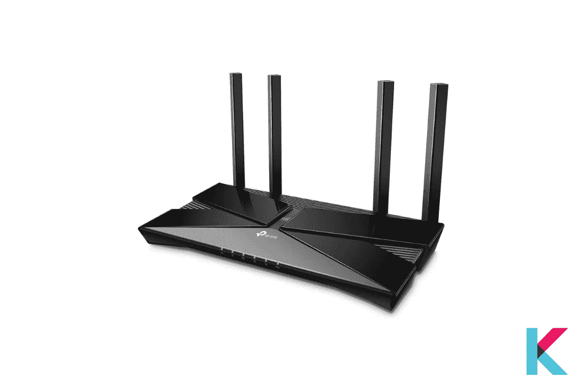

TP-Link Archer AX50 Wi-Fi 6 路由器是整体性能最佳的路由器，是在线传输大量视频或玩视频游戏的用户的绝佳选择。它提供 2402 和 574 Mbps 的速度，并为喜欢有线连接的人提供 5 个以太网插孔。您可以使用 USB 端口通过无线网络共享文件。此外，它还可以与 Alexa 语音控制配合使用。

使用 OFDMA 技术，您可以无缝地向您的设备传输更多数据。因此，您可以比以往任何时候都更好地连接您的所有设备。它可以最大限度地减少应用程序和所有设备的延迟。太神奇了！您可以使用其“唤醒时间”技术来降低设备的功耗。TP-Link Tether 应用程序可帮助您在几分钟内设置好路由器。

如果你喜欢将这款 Wi-Fi 路由器与其他智能 Wi-Fi 路由器进行比较，你可以找到 [TP-Link Archer AX50 Wi-Fi 6 路由器功能比较 2021](https://kodmy.com/compare/smart-wi-fi-routers?modelList=tp-link-archer-ax50,netgear-nighthawk-ax8) 。

快一点！ [***现在点击这里下单***](https://www.amazon.com/gp/product/B07YMFZ28Q/ref=as_li_tl?ie=UTF8&camp=1789&creative=9325&creativeASIN=B07YMFZ28Q&linkCode=as2&tag=kodmy-20&linkId=8ebaf810e122ff93141c0972b828c404) 。

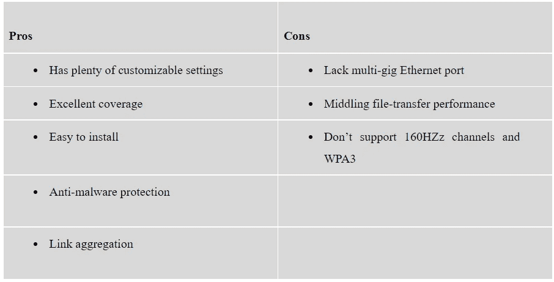

# 最佳 Wi-Fi 6 路由器

*   **网件夜鹰 AX8 (RAX80)**

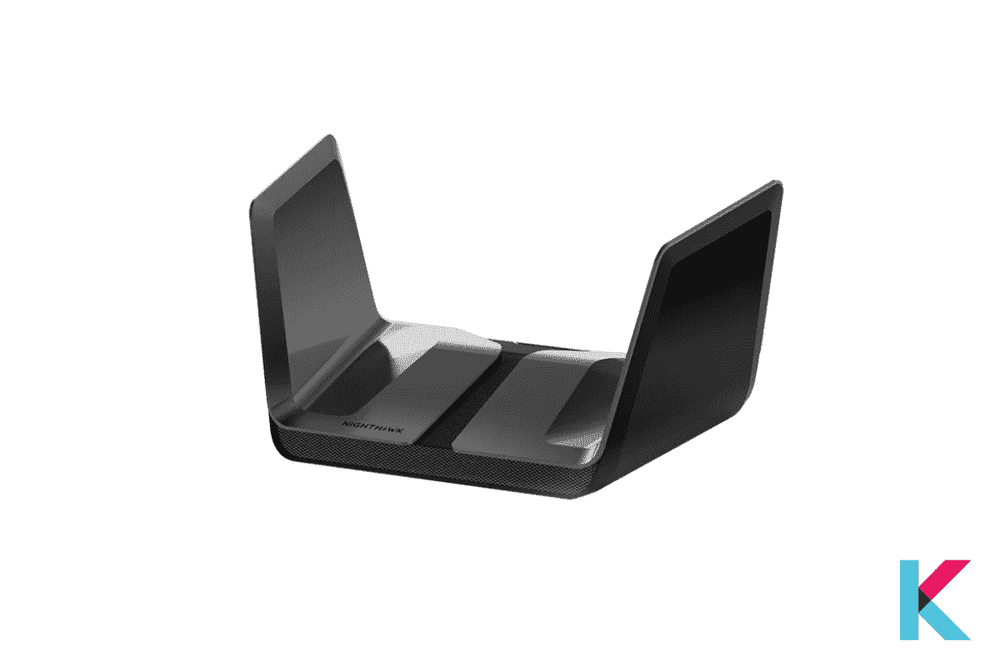

网件夜鹰 AX8 (RAX80) Wi-Fi 6 以史诗般的速度传输一切。它以 6Gbps 的 Wi-Fi 速度传输不间断的电影、视频通话、下载/传输文件和游戏。再也不用担心你的网速了。它可以与 Galaxy S10、Galaxy Note 10 和 iPhone 11 等 Wi-Fi 6 设备配合使用。是时候用这个替换你现有的 Wi-Fi 路由器了。此外，它适用于任何高达 2Gbps 的互联网服务提供商。它包括卫星、电缆、DSL、光纤等等。

当考虑其设置过程时，您可以无缝地设置和管理它。你只是想连接到你现有的电缆调制解调器，他们的夜鹰应用程序方便你设置。您可以轻松创建个人云存储，并使用 2 个 3.0 USB 端口从任何地方访问它，您还可以使用 USB 连接轻松地与任何连接的设备共享存储驱动器。然而，它可能很贵，但它提供了更好的性能。最适合中等大小的家庭。

如果你喜欢比较这款 Archer AX50 Wi-Fi 路由器和另一款智能 Wi-Fi 路由器，你可以看看 [Netgear Nighthawk AX8 功能对比 2021](https://kodmy.com/compare/smart-wi-fi-routers?modelList=netgear-nighthawk-ax8,linksys-ac1200-dual-band) 。

快一点！ [***点击这里从亚马逊***](https://www.amazon.com/gp/product/B082P87P43/ref=as_li_tl?ie=UTF8&camp=1789&creative=9325&creativeASIN=B082P87P43&linkCode=as2&tag=kodmy-20&linkId=b90ed553047e7361b527b6b2f74de01a) 下单。

# 最经济实惠的路由器

*   **Linksys EA6350 AC1200+双频智能 Wi-Fi 无线路由器**

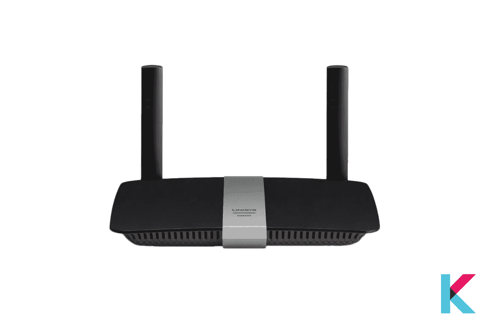

Linksys EA6350 AC1200+双频智能 Wi-Fi 无线路由器是一个极好的选择，如果你不指望一个先进的路由器。它是最便宜的具有智能功能的路由器。它提供快速的 5GHz 吞吐量，非常适合小型家庭。是的。使用 Linksys 智能 Wi-Fi Web 控制台并通过其移动应用程序进行管理和安装非常容易。

它有一个黑色外壳和两个不可拆卸的天线。它可以达到高达 300Mbps 的吞吐速度，并支持波束成形。它直接向每个客户发送无线信号。此外，路由器背面有 4 个千兆局域网端口、一个 USB 3.0 端口、一个广域网端口、一个重置按钮和一个 WPS 按钮。

如果您喜欢将这款 Linksys Wi-Fi 路由器与另一款智能 Wi-Fi 路由器进行比较，您可以查看 [Linksys AC1200+双频特性比较 2021](https://kodmy.com/compare/smart-wi-fi-routers?modelList=linksys-ac1200-dual-band,tp-link-archer-ax50) 。

快一点！ [***点击这里从亚马逊***](https://www.amazon.com/gp/product/B00JZWQW4C/ref=as_li_tl?ie=UTF8&camp=1789&creative=9325&creativeASIN=B00JZWQW4C&linkCode=as2&tag=kodmy-20&linkId=2fef9a72f40b112092b5bda9100f640c) 下单。

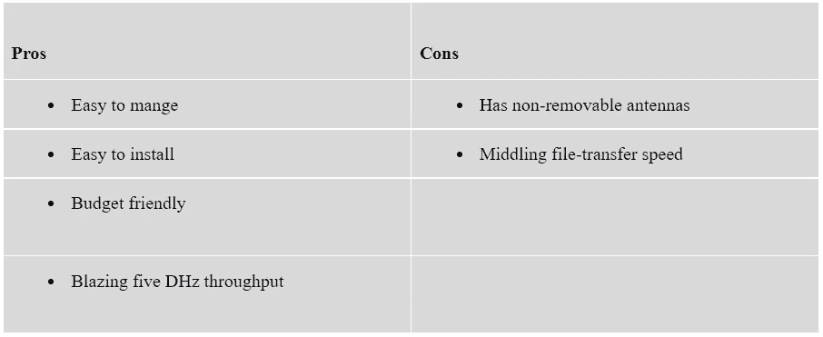

# 最佳游戏路由器

*   **TP-Link Archer AX11000 下一代三频游戏路由器**

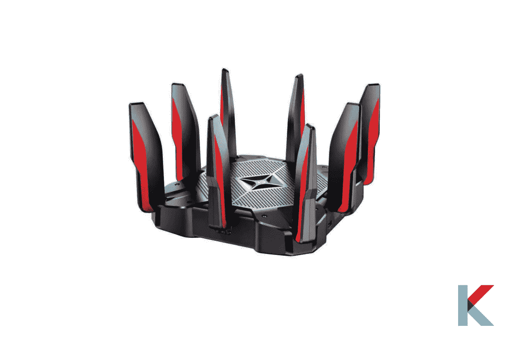

TP-Link Archer AX11000 下一代三频游戏路由器是一款高端游戏路由器，配有红色重音天线和黑色纹理机柜。它速度非常快，并加载了有吸引力的功能。它将帮助您轻松地将在线游戏提升到一个新的水平。它提供了 8 个千兆局域网端口、USB C 连接、链路聚合和一个 2.5 GB WAV 端口。它还包括一个以玩家为中心的用户界面和反恶意软件工具。

此外，它还配备了内容过滤、设备优先级和 TP-Link 家庭护理服务终身订阅等家长控制功能。它让您可以通过一个以玩家为主题的面板来监控系统资源和延迟。此外，通过其网络界面或使用 Tether 移动应用程序安装也很容易。

如果您喜欢将这款三频游戏 Wi-Fi 路由器与其他智能 Wi-Fi 路由器进行比较，您可以查看 [TP-Link Archer 三频游戏路由器功能比较 2021](https://kodmy.com/compare/smart-wi-fi-routers?modelList=tp-link-archer-tri-band-gaming-router,tp-link-archer-ax50) 。

快一点！ [***点击这里从亚马逊***](https://amzn.to/3m0d3Bs) 下单。

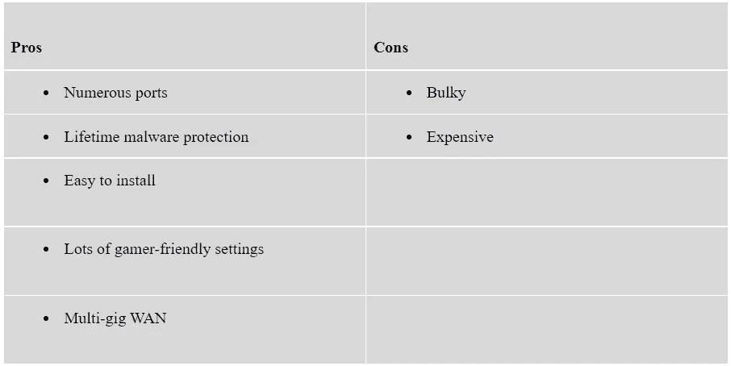

# 最佳网状网路由器

*   **嵌套 Wi-Fi**

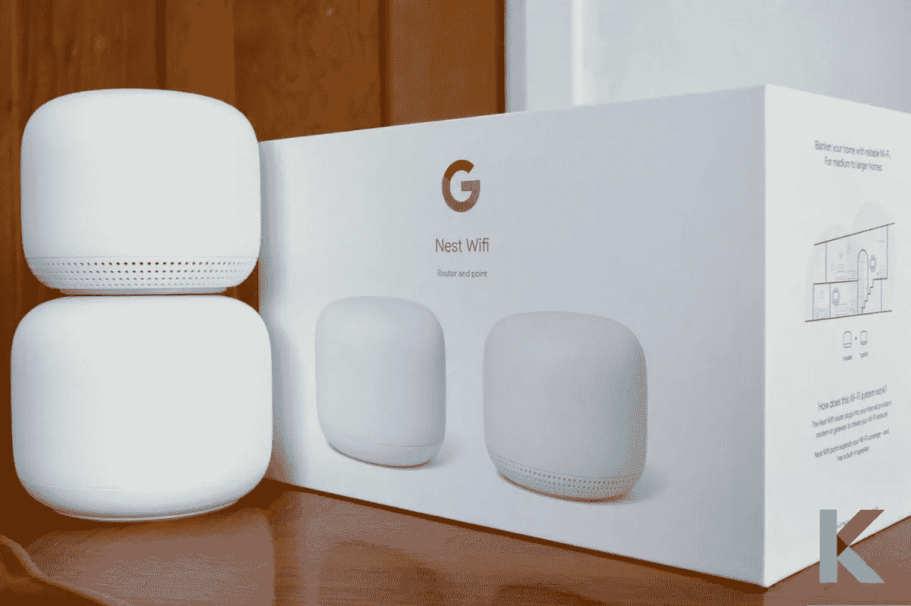

Nest Wi-Fi 路由器是最好的网状网路由器，具有新的吸引人的设计。它有一个快速的无线速度和简单的设置。您可以使用应用程序轻松控制它。此外，它还是一个灵活且可扩展的 Wi-Fi 系统。它插入互联网提供商的调制解调器来创建 Wi-Fi 网络。它的速度足以传输多个 4K 视频，并且足以处理多达 200 个连接的设备。

不过，它不支持 Wi-Fi 6，但支持新的 WPA3 安全标准和 4X4 MU-MIMO 连接。这意味着它可以使用多个 Wi-Fi 天线为您的设备提供更快的最高速度。此外，它还是市场上一款成熟的网状网路由器。

快一点！[从沃尔玛花 169 美元](https://goto.walmart.com/c/3127890/568833/9383?veh=aff&sourceid=imp_000011112222333344&prodsku=324662712&u=https%3A%2F%2Fwww.walmart.com%2Fip%2FGoogle-Nest-Wifi-Router-AC2200-Mesh-Router%2F324662712&intsrc=PUI2_4282)获得 Google Nest Wifi 路由器。

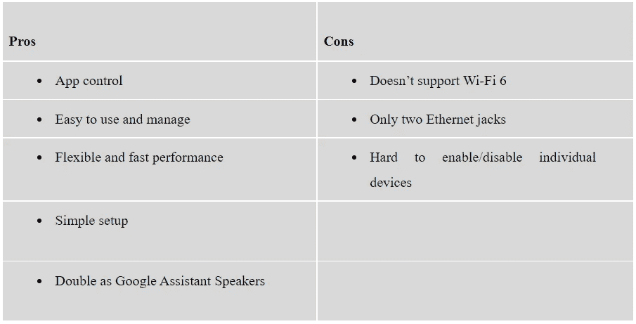

# 各种 Wi-Fi 协议和频率是什么？

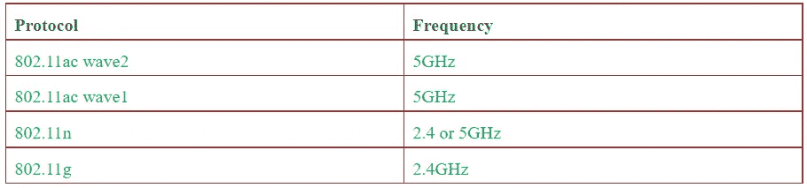

# 路由器是如何工作的？

智能路由器的工作原理是通过大气在特定区域传输大量数据。通常，家里有一系列联网设备，如智能手机、电脑、平板电脑、智能电视、恒温器等。这些智能家居设备与您的 Wi-Fi 路由器形成一个网络。Wi-Fi 路由器以最高效和最快的方式引导网络上的传入和传出流量。

# 调制解调器与路由器有何不同

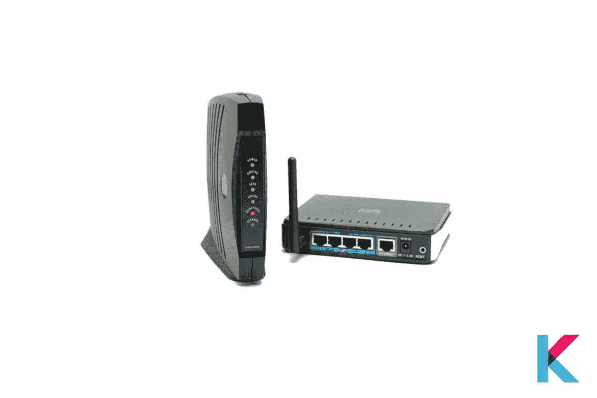

您的家庭网络中有几个组件，如路由器和调制解调器。调制解调器起着重要的作用。没有调制解调器，您就无法将本地网络接入互联网。它将您的互联网服务提供商带入家中。然后连接到您的路由器，将互联网连接传送到您的家庭网络。大多数互联网服务都是通过电话线传输的。但是调制解调器使电话线上使用的模拟信号和你家里的数字设备之间的通信成为可能。

# 路由器有哪些不同的类型？

市场上你能看到的路由器只有两种。第一个是无线路由器。您可以使用无线路由器通过电缆直接连接到调制解调器。这允许它使用内置天线与家庭网络进行通信和创建。第二种是有线路由器，通过有线连接直接连接到计算机。你可以看到一个港口。它可以连接到调制解调器与互联网通信。

# 如何选择适合自己的 Wi-Fi 路由器？

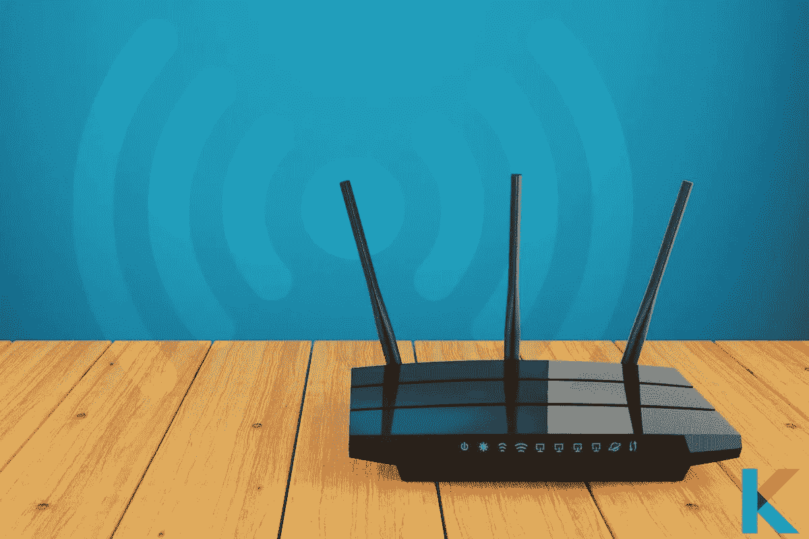

市场上有很多 Wi-Fi 路由器。但是你需要知道如何在其中选择最好的一个。可以问两个问题。第一个是互联网连接的速度，第二个是你家里需要的覆盖范围。

*   **速度和标准**:重要的是要考虑你的网速，以及调制解调器支持的网速。Wi-Fi 6 是路由器的最新技术。它适用于您家中的许多智能家居设备。
*   **覆盖范围**:你要知道的另一件事是覆盖范围。一般来说，基本路由器提供 50 到 100 英尺的范围。如果你有 3000 平方英尺或更多，你可以选择网状路由器。它可以使用不同的设备在更大的家庭中提供信号。
*   价格区间:双频型号的售价通常低于 100 美元。一些路由器价格高达 300 美元，速度更快，覆盖范围更广。新路由器有 Wi-Fi 6 标准，所以售价为 400 美元或更高。
*   **频率**:目前很多路由器都是通过 2 个射频(2.4GHz 和 5GHz)传输数据。还有更贵的路由器支持三个频段。这意味着你获得了额外的 5GHz 频率。如果你想要更快更可靠的互联网连接，你可以选择 MU-MIMO(多用户多输入多输出)。
*   **安全功能**:如果你打算购买支持 WPA2 (Wi-Fi 保护接入协议)的东西，它可以确保你的网络和设备安全。还有另外两个标准(WEP 和 WPA)。这些是不安全的，很容易受到损害。

# 更新 Wi-Fi 路由器的理由

你可能会发现现在你家的 wi-fi 覆盖更好，因此你对现有的慢速 Wi-Fi 连接感到不舒服。然后，是时候更新你古怪的 Wi-Fi 路由器了。如果你家里还有一个 Wireless-AC 或 Wireless-N 路由器，你可以考虑变得更加智能。有更多的好处，如有效的设备管理和互联家庭小工具将感觉更舒适，更快，更快的兼容标准。

有时，您已经从 ISP 那里为路由器支付了月费。智能路由器可以在一年内或每月收回成本(平均每月 10-15 美元)。此外，它还提供更好的功能和服务。重要的是要记住，你要把它和最好的电缆调制解调器配对。然后，你可以免除宽带套餐带来的额外费用。

# 价格和功能比较

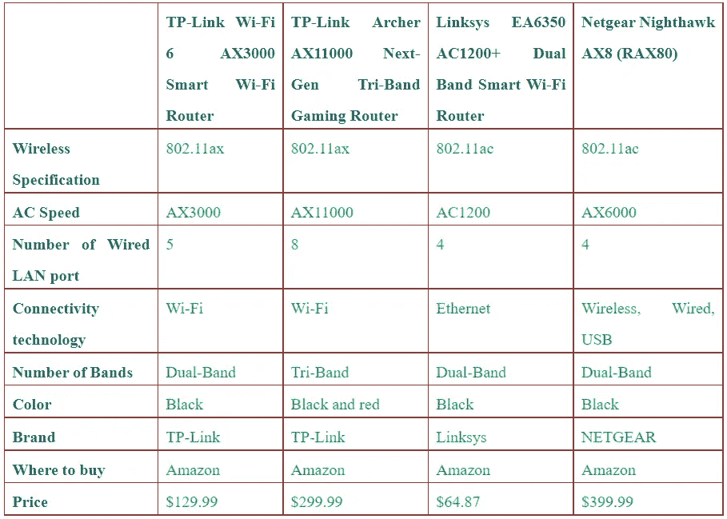

***出挑***

我们在上面提到了[最好的 Wi-Fi 路由器](https://kodmy.com/best-smart-wi-fi-routers/)，它具有长距离、高性能和你能承受的价格。购买最好的路由器甚至可以提供更好的功能，比从其他服务提供商那里购买的设备更省钱。此外，智能路由器针对充满互联设备的家庭进行了优化，从智能电视到智能门铃摄像头。通过更快的连接和更好的覆盖，您可以获得更快的 Wi-Fi 体验。现在是时候和你的新聪明伙伴一起去了。

如果你对 2021 年[响闹家居安防套装](https://kodmy.com/ring-alarm-home-security-kit/) 和 2021 年[最佳智能空气净化器感兴趣，你可能会在这里寻找。](https://kodmy.com/best-smart-air-purifiers/)