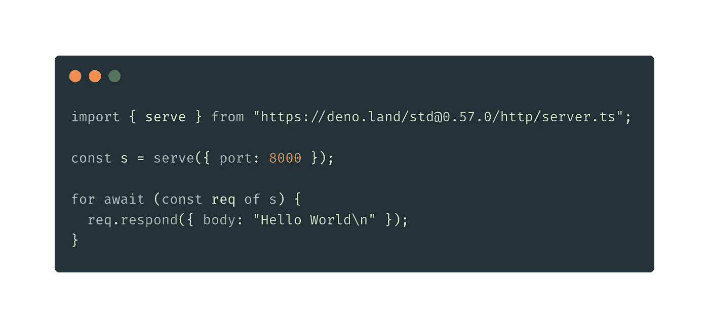
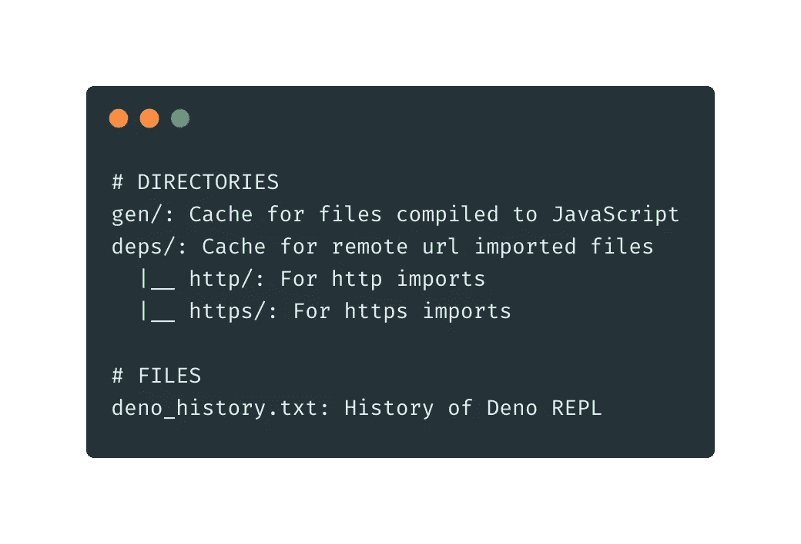

# 缺失 deno_modules 的情况

> 原文：<https://blog.devgenius.io/the-case-of-the-missing-deno-modules-8484ac6d529?source=collection_archive---------27----------------------->

当第一次在 Deno 中使用外部依赖项运行代码时，您可能已经注意到发生了一些包的下载。另外，如果该文件是一个 Typescript 文件，您可能会看到一些 Typescript 到 Javascript 编译的迹象。然而，第二次运行该文件时，这些都没有发生，代码只是立即运行。

您开始寻找任何可能负责代码立即执行的已创建的文件夹或文件。但是你什么也没找到。

> 我的 deno_modules 在哪里？

让我们来揭开这个谜。输入`DENO_DIR`。

默认情况下，`DENO_DIR`位于`$HOME/.deno`。然而，因为它是一个`ENV` 变量，你可以自定义它。我还在`$HOME/Library/Caches/deno`找到了缓存的 Deno 文件

`DENO_DIR`的结构如下:

️缺失 deno_modules 的情况得到了解决。🕵️‍

希望你能从阅读这篇文章中学到一些关于 Deno 的新知识。

黑客快乐！

我在`DENO_DIR`:
[https://www.youtube.com/watch?v=cvcae3OmXXI](https://www.youtube.com/watch?v=cvcae3OmXXI)挖掘的视频

推特:[*https://twitter.com/BarelyDaniel*](https://twitter.com/BarelyDaniel)