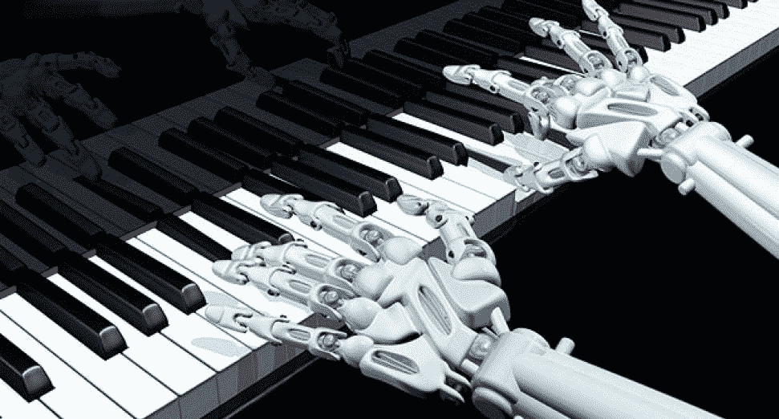
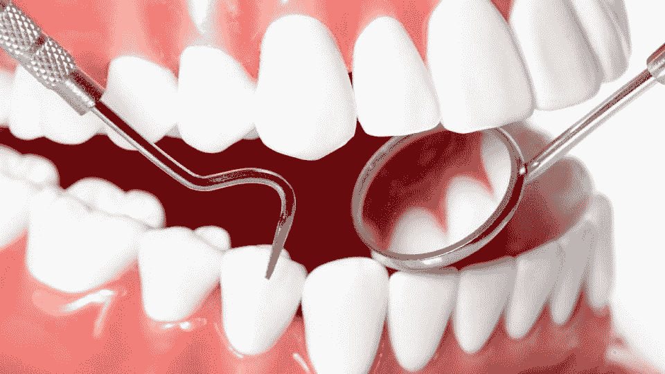
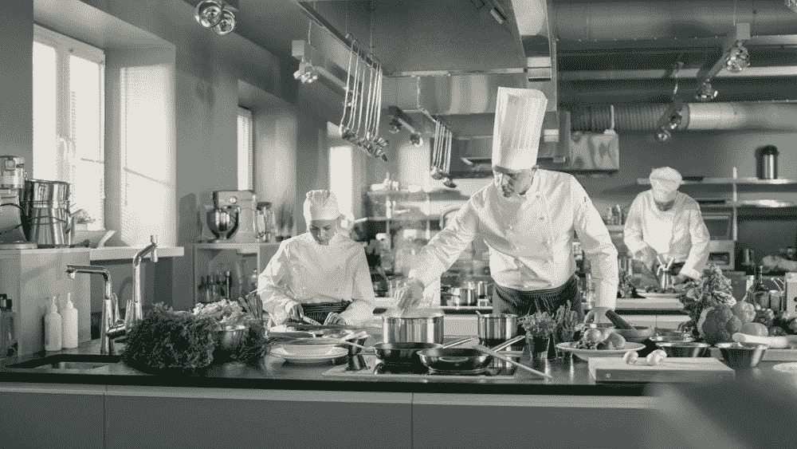

# 人工智能的变化——人工智能如何以最具创造性的方式投入使用

> 原文：<https://blog.devgenius.io/the-changing-face-of-ai-how-artificial-intelligence-is-being-put-to-use-in-the-most-creative-ways-d090fefedbc9?source=collection_archive---------18----------------------->

# AI…这个词你听着不耳熟吗？

人工智能或人工智能在这些日子里有些司空见惯，最近的技术实力使其在现代世界无处不在。

在当今世界，人工智能无处不在。人们已经接受了这项技术，并将其纳入日常生活的各个方面。大企业已经围绕这项技术创造了模型；从使用人工智能了解客户的选择，到使用人工智能将他们想要的产品送到他们的家门口，在业务运营中大量使用人工智能的商业类电子商务近年来获利颇丰。它不仅让消费者更容易做出更明智的选择，而且还弥合了零售商和消费者之间的差距。

然而，人工智能还有许多其他的用途。其中一些是彻头彻尾的创新，似乎是朝着正确方向迈出的一步，使人工智能的使用更加多样化，更广泛的社会阶层可以获得。

## 人工智能已经投入使用的有趣地方

**音乐行业的 AI:**

等等，那么 AI 也在这里出现了？这个问题的答案是一个响亮的是。从为已经成为最畅销歌曲的音乐创作歌词，到 Spotify 这样的平台，用户选择音乐的数据，如流派、艺术家、语言等。被输入到一个人工智能系统中，这个系统将会辨别出应该给出什么样的建议。

**口腔卫生 AI:**

有这么多的问题，如牙齿过敏，牙龈腐烂，牙周病等。这可以在早期使用人工智能工具进行诊断和检测。目前有一个平台叫 Logy。印度的 AI，用来迎合那些选择通过 WhatsApp 号码联系他们的人；他们所要做的就是发送他们牙齿的图像，并在两分钟内获得关于他们基本口腔健康的结果，甚至不需要安装应用程序。这是朝着有利于公众口腔健康的方向迈出的一步。一家专门从事口腔卫生产品的公司 Oral-B 发布了一款基于人工智能的牙刷，它有助于提高刷牙效率，并引导你专注于问题区域。

**美食与烹饪界的 AI:**

人工智能已被很好地用于确保准备食物的人员的卫生，以便在食物被放在顾客的桌子上时保持最佳的质量标准。人工智能还被用来创新和创造无数的味道，让我们的味觉享受独特的味道。IBM 创造了 Chef Watson，这是一个人工智能工具，可以访问各种风味资料，用于创建食谱。

教育中的人工智能:你知道吗，学生为获得国外大学的录取而写的大多数 SOP(目的陈述)不是由人类处理，而是由人工智能驱动的代理处理，这些代理将在他们找到相关机构之前整理和过滤最好的论文。？AI 可以帮助更深入地了解候选人对语法、语言技能、词汇等的掌握情况。

**总结一下…**

因此，我们在现实世界中看到了一些有趣的 AI 用例。随着技术和创新的进一步发展，我们只能期待这一多才多艺、充满活力的领域有更多卓越的应用来解决更多的人类问题。