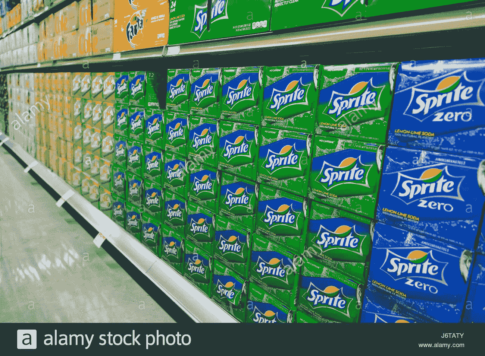
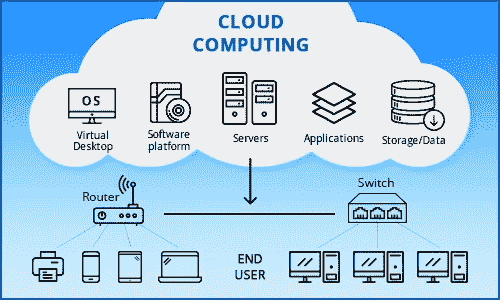

# 云—第 1 部分|介绍+心理模型

> 原文：<https://blog.devgenius.io/the-cloud-part-1-intro-mental-model-bde4ccabcaf3?source=collection_archive---------5----------------------->

云是我一直听到的概念之一，我无法理解。每个人都有一些技术概念，这些概念看起来难以理解，但却像魔法一样有效。对我来说，一些宏伟的黑盒主题包括 API，前端和后端如何交互，当然还有云。虽然云并没有我想象的那么可怕。为了更深入地了解云，如果我们先了解一下术语**虚拟化**会有所帮助。如果不熟悉这个术语，这里有一些链接可以帮助我们开始。

 [## 云计算中的虚拟化及其类型

### 虚拟化是一种如何将服务从该服务的底层物理交付中分离出来的技术。这是…

www.geeksforgeeks.org](https://www.geeksforgeeks.org/virtualization-cloud-computing-types/) 

虚拟化的解释

如果你想要虚拟化的简短版本(摘自 Geeks4Geeks 的文章):【虚拟化】*允许多个客户和组织同时共享一个资源或应用程序的单个物理实例。它通过为物理存储分配一个逻辑名称并根据需要提供指向该物理资源的指针来实现这一点。*“这是一个很高层次的概述。但是请相信我，浏览这些链接将会让你在云计算领域有一个巨大的开端。

# **云心理模型**

我说的“云”是什么意思？让我们首先从一个简单的心智模型开始。我相信你对沃尔玛、梅耶尔、塔吉特和杰威尔·奥斯科等受欢迎的连锁杂货店很熟悉。他们拥有成千上万的产品，但让我们在这个例子中只分析汽水。像可口可乐、雪碧、激浪和胡椒博士这样的品牌不会建立他们自己的商店来存放他们的产品。**所以，** **雪碧不创建雪碧汽水店**。雪碧不用担心所有的维护、管理和基础设施来经营他们自己的商店，而是使用连锁杂货店如沃尔玛来存放他们的产品。雪碧然后付钱给沃尔玛让他们使用他们的空间。这对雪碧来说完全说得通，对吧？当你可以使用已经有基础设施的人时，为什么还要花钱去建一整个商店呢？但我们将受到沃尔玛的摆布。如果他们的商店倒闭了，我们的产品也会倒闭。

架子上的雪碧示例。

把云想象成你的软件的大型连锁杂货店(*一些包括亚马逊网络服务、谷歌云平台和微软 Azure* )。他们已经有了一个商店，你只需把你的软件放在他们维护的商店的货架上就可以了。你怎么能这样做？就像沃尔玛一样，一些大型科技公司拥有巨大的数据中心(*杂货店位置*)，在那里他们存放着数以千计的服务器(*货架*)。您可以为您在特定服务器上使用的空间向他们付费(*货架空间*)，而不必拥有自己的专用服务器。但这变得更有趣了。

假设雪碧不只是想要货架空间。他们想要一些更别致的东西，如罐头冷藏、个性化展示或整个商店的广告。雪碧也可以支付额外的功能，而不仅仅是把他们的产品放在货架上。这和很多云提供商一样。以*谷歌云平台*为例，他们为应用程序提供许多附加服务，如数据库、安全、网络和大量其他服务，您可以在这里[查看](https://console.cloud.google.com/marketplace)。

云计算图片取自[此处](https://thinkitsolutions.com/what-i-think-i-need/increased-productivity-and-efficiency/cloud-computing-solutions/104/?track=10978&af=10978&key5sk0=10978)。

# **云计算的 3 个类别**

目前有 3 种流行的云使用案例。我鼓励你通读斯蒂芬·沃茨和穆罕默德·拉扎对这个话题的解释，但我会通过例子来谈一谈。

## 软件即服务(SaaS)

第一类是 gMail、Vimeo、Slack 或 Dropbox 等应用。这些应用程序通过网络提供全面的服务。你可以把它想象成任何主要通过互联网提供软件的业务。提供商计算出有多少资源用于你对应用程序的使用。提供商计算出服务器、虚拟机、网络设备等等。这些应用被称为软件即服务或 SaaS T21。回到我们的汽水杂货店类比，这意味着其他人负责把汽水放在货架上和管理。相反，我们正专注于我们业务的另一个方面，或者决定只做苏打水的消费者。

## 平台即服务(PaaS)

第二类是 Google App Engine、Windows Azure 等应用。这些应用程序提供了一个[平台](https://en.wikipedia.org/wiki/Computing_platform)，允许客户开发、运行和管理应用程序，而无需构建和维护通常与开发和启动应用程序相关的基础架构。这些应用被称为平台即服务或 **PaaS** 。PaaS 是最流行的模型，主要由开发人员使用。

PaaS 介于 IaaS 和 SaaS 之间。PaaS 为您的应用程序提供了开发该平台的工具。您构建应用程序，但是您使用 API 和工具将它们挂接到环境中并在那里运行它们。回到我们的汽水杂货店类比，这将允许我们冷藏我们的一些罐头，并可能支付我们的汽水每周清洗。

## 基础设施即服务(IaaS)

第三类是亚马逊网络服务(AWS)、谷歌计算引擎(GCE)等应用。这些应用程序提供基础设施服务，如网络、虚拟化和其他服务。这是您希望保持对软件环境的控制，但又不想维护任何设备的地方。你不希望购买服务器，并把它们放在一个气候控制的房间或任何类似的地方。取而代之的是，你去一个提供商那里请求一个虚拟机。这些应用被称为 **IaaS** 。如果我们只是把汽水放在货架上，这就是我们所说的汽水杂货店类比的含义。

> 请注意，许多平台并不相互排斥。例如，AWS 不仅仅是一个 IaaS，而是这三者的结合。我们称之为混合云基础设施，您可以在这里阅读更多信息。
> 
> 此外，同一类别中的应用程序可以用于不同的市场。例如，YouTube 和脸书是针对用户的 SaaS，而 BigCommerce 是针对开发者的 SaaS。

# **我们现在在哪+我们要去哪**

好的，我们知道云是什么，但是云的状态是什么？

您可能会惊讶地发现，云计算是一个意义深远的新话题。直到 1999 年，我们才能够在机器上操纵虚拟化的想法。AWS 于 2002 年推出。直到 2007 年，大学才开始教授云计算。直到 2015 年，大公司才看到了一个潜在的市场，并大规模发展他们的云基础设施。

**关键是云已经存在并且呈指数级增长**！到 2024 年，GlobalData 预测云服务(SaaS、PaaS 和 IaaS)的支出将超过 4290 亿美元。这在电脑上是一大笔钱！

时间线取自:[此处](http://verdict.co.uk/cloud-computing-timeline/)。

# 结论

总而言之，云是计算机的集合，它的主要目标是在那些计算机上存储东西，而不是必须在你的*计算机的硬盘上存储东西。*

举个简单的例子，gMail 不需要存储在你电脑的硬盘上。相反，它存储在一组计算机上。只要有网络连接，你就可以查看所有的电子邮件。gMail 是 SaaS 的一个例子，因为你没有自己的邮件服务器。谷歌托管它，你只需通过你的浏览器访问它。大多数情况下，SaaS 面向最终用户，但也可能面向开发人员。

感谢您阅读这篇关于云的概述！第二部分即将推出。这篇文章花了我一点时间来完成，所以如果你正在读这篇“谢谢你”！对更多感兴趣:如果你想要更多关于特定软件工程和技术行业的视频，请查看我的新 YouTube 频道。上帝保佑。

**注**:我不是云方面的专家。如果有什么我应该添加/修改/编辑的，请在下面评论。感谢阅读！

*资源和进一步阅读:*

 [## 什么是云定义|微软 Azure

### 云的定义看起来模糊不清，但本质上，它是一个用来描述全球服务器网络的术语…

azure.microsoft.com](https://azure.microsoft.com/en-us/overview/what-is-the-cloud/) 

[https://www . cloud flare . com/learning/cloud/what-is-the-cloud/](https://www.cloudflare.com/learning/cloud/what-is-the-cloud/)

[https://www . BMC . com/blogs/SaaS-vs-PAAs-vs-iaas-what-the-difference-and-how-to-choose/](https://www.bmc.com/blogs/saas-vs-paas-vs-iaas-whats-the-difference-and-how-to-choose/)

 [## IaaS vs PaaS vs SaaS:你需要知道的+例子(2018)

### 获得打印版厌倦了滚动？下载 PDF 版本，便于离线阅读和与同事分享…

www.bigcommerce.com](https://www.bigcommerce.com/blog/saas-vs-paas-vs-iaas/) 

[https://www.verdict.co.uk/cloud-computing-timeline/](https://www.verdict.co.uk/cloud-computing-timeline/)

