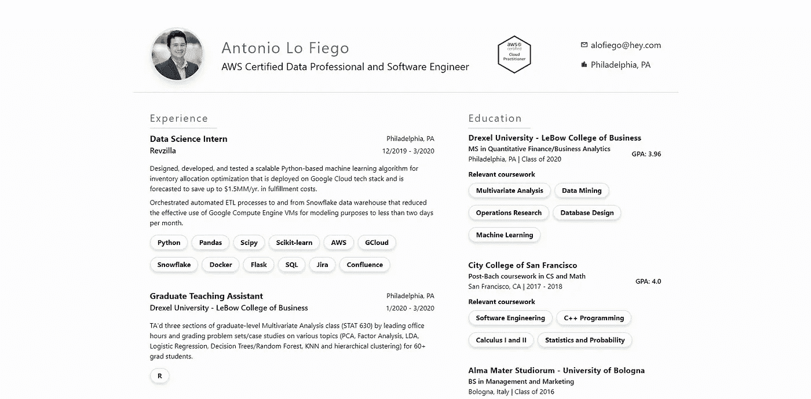

# 云简历挑战，或者说我如何学会不再担心并爱上云

> 原文：<https://blog.devgenius.io/the-cloud-resume-challenge-or-how-i-learned-to-stop-worrying-and-love-the-cloud-f057f437d6ce?source=collection_archive---------3----------------------->

沃尔夫冈·哈塞尔曼-昂斯普拉什

临近毕业时，出于对未来的恐惧，我决定看看我知道如何做的几件事，并深入研究它们。其中，我很幸运在 RevZilla 的最后一次实习中涉足了云软件和提供商。

虽然大部分制作工作是在谷歌云平台上进行的，但我花了很多时间试图弄清楚如何从 AWS 的 EC2 实例启动 Jupiter 笔记本。在此之前从未接触过 AWS，说得轻一点，这是一场噩梦。

但是大脑以神秘的方式工作，随之而来的沮丧和恐惧让我在那之后越来越想学习 AWS。

时间快进到 2020 年 6 月，我刚刚从硕士毕业，我决定开始更多地使用 Twitter 来跟上这个世界(抱歉)的状态和我最喜欢的技术的状态。

我注册了 AWS 认证云从业者，并且 [freeCodeCamp](https://medium.com/u/8b318225c16a?source=post_page-----f057f437d6ce--------------------------------) 发布了一系列由 Andrew Brown 制作的关于如何准备 AWS 考试的完整视频。#AWSCertified 标签吸引了我，在通过我的 CCP 后，我开始积极地在推特上谈论我的云之旅，并被#100DaysOfCloud 机器人转发。

在机器人的转发中，我看到了来自[Forrest brace al](https://medium.com/u/b8d1e8a0e0d8?source=post_page-----f057f437d6ce--------------------------------)的这条推文。

云简历挑战让你敢于建立一个有访客柜台的个人简历/作品集网站。

唯一的问题是通过许多 AWS 服务完全部署它，同时学习正确设置无服务器应用程序、CI/CD 管道、网络、安全性等。

挑战的第一个要求是通过 CCP 考试，已经有了这个要求，我决定投入其中。

7 月 1 日是我挑战的第一天，这是我所学到的故事。

# 前端

挑战从 HTML/CSS 版本的简历开始。我的大部分编程经验都在 Python 和 C++之间，从事机器学习和数据科学应用。

在隔离期开始时，在我学位的最后一个季度，我决定是时候扩展我的软件工程知识了，我决定拿起 MERN 堆栈。

虽然在这次挑战中我甚至没有接触到堆栈中的男性部分，但 React 派上了用场，因为我决定使用 Gatsby.js 来生成静态站点。由于兴奋和失眠，我在一个充满咖啡的通宵期间建立了整个前端。到目前为止，TailwindCSS 是我最喜欢的 CSS 框架，它让构建一个响应迅速的移动优先界面变得异常容易。我不是 UI/UX 专家(或者业余爱好者，或者新手…)，但是为了挑战，它确实符合要求。

在 antoniolofiego.com 检查所有的东西

一旦我建立了网页，我需要把它放在某个地方让公众可以访问。AWS 的好心人给了我们[亚马逊简单存储服务(S3)](https://aws.amazon.com/s3/) 和它的静态托管能力。

没有人喜欢长 URL，所以下一步是从 [Route 53](https://aws.amazon.com/route53/) 购买一个自定义域名，并从[亚马逊证书管理器](https://aws.amazon.com/certificate-manager/)获得一个 SSL 证书。所有内容都由 AWS 的 CDN[CloudFront](https://aws.amazon.com/cloudfront/)提供服务，并使用 Origin Access Identity (OAI)进行保护。将 S3 bucket 设置为 origin 很容易，但是正确安排 DNS 路由无疑更加棘手。

我使用 GitHub 作为我的版本控制主机，并使用 GitHub Actions 创建了一个 CI 工作流来构建我的 Gatsby 站点，并将其上传到 push 上正确的 S3 bucket。

一切都很顺利！我在挑战时间表的第二天，感觉很好。

那就是黑暗降临开始的地方…

# 后端

欢迎来到我的兔子地狱的开端！下一步是使用对 [API 网关](https://aws.amazon.com/api-gateway/)的 REST API 调用创建一个简单的访问者计数器，这将触发一个 [Lambda 函数](https://aws.amazon.com/lambda/)，该函数更新并返回一个存储在 [DynamoDB](https://aws.amazon.com/dynamodb/) 表中的计数器。

如果这还不够，所有这些都必须使用 SAM 模板来完成。

合适的情绪。

SAM 是 AWS 无服务器应用程序模型，一个使用 YAML 文件构建无服务器应用程序的框架。

用 AWS 的话说，

> …最新版本的 SAM CLI 使开发人员更容易进行无服务器开发。

虽然 SAM 确实将无服务器堆栈集中在一个实体中，这肯定更容易跟踪和组织，但现有的文档却是…晦涩难懂的。

SAM 模板转换为 CloudFormation 模板，这是另一个值得单独认证的 AWS 服务，没有太多关于如何从 1 级到 10 级的好资源，因为他们假设每个人都已经达到 11 级了。

幸运的是，云简历挑战社区的成员 Chris Nagy 最近发布了一个非常人性化的简单 SAM 应用程序。如此人性化，事实上，甚至 AWS 的所有者 Jeff Barr 也在他的 Twitter 上发布了它。

在对 SAM 模板进行了几天的研究之后，我成功地开发出了一个可以正常工作的应用程序，它以适当的方式部署了正确的服务。

对于 Lambda 函数，我使用了 Python 3.8 和它的 AWS SDK boto 3。该函数更新 DynamoDB 表并返回一个支持 CORS 的响应，我的前端将能够获取并使用该响应。一切都用 pytest 和服务模拟包 [moto](https://github.com/spulec/moto) 进行了测试。

我构建了自己的定制 CI/CD 管道，它创建了一个 Python 环境，为我提供了对 AWS 服务的编程访问，测试了我的 Lambda 函数并部署了 SAM 堆栈，再次使用 GitHub 作为我的 repo 托管服务和 GitHub 操作。显而易见但始终重要的是要记住使用 GitHub 秘密，而不是在代码库中提交或硬编码您的 AWS 凭证。

最后，我用一个新组件 VisitorsCounter 更新了我的前端，它向适当的 API 网关端点发出 POST 请求，并在页面底部显示计数器。

我的挑战的最终结果可以在 https://antoniolofiego.com 的[看到。](https://antoniolofiego.com)

# 我学到了什么，下一步该去哪里

我非常喜欢这个挑战，我从文档、StackOverflow 帖子和 AWS subreddit 的所有深度讨论中学到了很多东西。

然而，如果我没有提到从云简历挑战赛社区和 Discord 频道获得的令人难以置信的支持，我将是一个骗子。我要感谢福里斯特创造了它，因为我相信，通过将这么多有动力和奉献精神的人聚集在一起，他完成了两倍于他在创造这个挑战时希望完成的事情。

#100DaysOfCloud 吉祥物是💯

我还要对 Twitter 上的#100DaysOfCloud 社区大声欢呼，感谢他们让所有参与者保持兴奋，感谢他们所有的积极氛围和支持环境！

Forrest 要求不要在余下的挑战中分享代码，以保持对所有仍在工作的人的吸引力和成果。

就未来目标而言，我将在下周完成我的解决方案架构师助理考试，我希望这次经历将是云工程领域的第一次。我肯定会有更多的收获！

## 如果你想和我保持联系，可以在 [Twitter](https://twitter.com/antonio_lofiego\) 或 [GitHub](https://github.com/antoniolofiego) 上关注我，也可以在 [LinkedIn](https://www.linkedin.com/in/antoniolofiego/) 上随意添加我(如果你有联系请求，可以给我留言)😃)