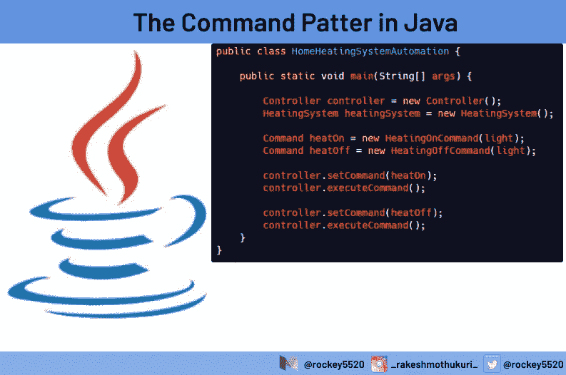
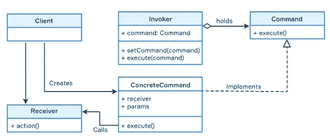

# Java 中的命令模式

> 原文：<https://blog.devgenius.io/the-command-pattern-in-java-8a545a56d68a?source=collection_archive---------3----------------------->

## 权威指南

## 命令模式是一种行为设计模式，是 GoF 正式设计模式列表的一部分。该模式旨在将执行给定动作(命令)所需的所有数据封装在一个对象中



# 介绍

你现在很可能已经知道了行为模式。行为模式是关于 Java 对象连接的问题。虽然大约有 12 种属于行为模式的设计模式，但是命令模式占据了它特殊的位置，因为它比其他模式使用得更频繁。订单设计背后的动机是**分离**命令及其消费者之间的基本原理。

命令模式的关键部分是**将**所有与命令相关的数据封装在一个对象中。通常，这是通过一组方法、它们的参数以及这些方法所属的一个或多个被称为**接收器**的对象来完成的。所以关于解耦的重要一点是，如果你必须改变这些值中的任何一个，你只需要改变一个类。

在经典版本中，实现命令模式包括五个步骤。

*   **命令**接口:这通常被声明为执行命令的单一方法。
*   **ConcreteCommand** :这是一个带有参数的操作，将调用传递给接收者；在传统方法中，一个命令只调用一个*接收者*的一个或多个方法，而不是执行业务逻辑。
*   接受者**:尤其知道如何执行动作。**
*   ****调用者**:要求命令执行请求。**
*   ****客户端**:创建**具体命令**对象，设置*接收者*。**

****

# **命令模式的示例**

**假设你要建立一个家庭自动化系统，你需要打开和关闭供暖系统。这两个命令在很大程度上是相似的。我们可以创建一个名为`Command`的接口，它只有一个名为`execute()`的方法。**

```
public interface Command {
    void execute();
}
```

**我们现在将创建两个实现`Command`接口的类。这些具体的类封装了命令执行两个命令所需的数据，即*加热开启*和*加热关闭*。**

**首先。`HeatingOnCommand`将实现`Command`接口。**

```
public class HeatingOnCommand implements Command {

    private HeatingSystem heatingSystem;

    public HeatingOnCommand(HeatingSystem heatingSystem) {
        this.heatingSystem = heatingSystem;
    }

    @Override
    public void execute() {
        heatingSystem.heatOn();
    }
}
```

**接下来，`HeatingOffCommand`将实现`Command`接口。`HeatingOffCommand`基本上和`HeatingOnCommand`的代码一样。**

```
public class HeatingOffCommand implements Command {

    private HeatingSystem heatingSystem;

    public HeatingOffCommand(HeatingSystem heatingSystem) {
        this.heatingSystem = heatingSystem;
    }

    @Override
    public void execute() {
        heatingSystem.heatOff();
    }
}
```

**接下来，我们将创建我们的*接收器*类，它是这里的`HeatingSystem`类**

```
public class HeatingSystem  {

    public void heatOn() {
        System.out.println("Turn on heat");
    }

    public void heatOff() {
        System.out.println("Turn off heat");
    }
}
```

**接下来，我们需要要求**调用者类**。invoker 类决定如何执行命令。例如，调用者可以保存一个需要以特定顺序执行的命令列表。**

**我们在这里将 invoker 类命名为`Controller`。**

```
public class Controller {

    private Command command;

    public void setCommand(Command command) {
        this.command = command;
    }

    public void executeCommand() {
        command.execute();
    }
}
```

**最后，我们的客户端或`main`方法将使用调用者来执行命令。**

```
public class HomeHeatingSystemAutomation {

    public static void main(String[] args) {

        Controller controller = new Controller();
        HeatingSystem heatingSystem = new HeatingSystem();

        Command heatOn = new HeatingOnCommand(light);
        Command heatOff = new HeatingOffCommand(light);

        controller.setCommand(heatOn);
        controller.executeCommand();

        controller.setCommand(heatOff);
        controller.executeCommand();
    }
}
```

**基本上，main 方法中有三个重要步骤。**

1.  **从 invoker 类创建一个对象，在我们的应用程序中是`Controller`。**
2.  **从我们将要执行的命令中创建对象。**
3.  **使用调用程序执行命令。**

**可能还需要其他步骤来支持这三个主要步骤。例如，这个`main()`方法创建了一个`HeatingSystem`对象，因为需要传递一个`HeatingSystem`对象来创建`Command`对象。当您执行这段代码时，将产生以下输出。**

# **附加选项**

**命令模式可以与以下选项一起使用:**

*   **将命令添加到队列中以便以后执行；**
*   **支持撤消/重做操作；**
*   **存储命令的历史；**
*   **序列化命令以将它们存储在磁盘上；**

**这些选项对于模式来说并不重要，但在实践中经常使用。**

# **结论**

**命令模式的主要优点是它将调用操作的对象与知道如何执行操作的对象分离开来。这种模式的各种修改可以用来保存请求的历史，实现撤销功能和创建宏命令。然而，应用程序可能会变得更加复杂，因为这种模式增加了另一个抽象层。**