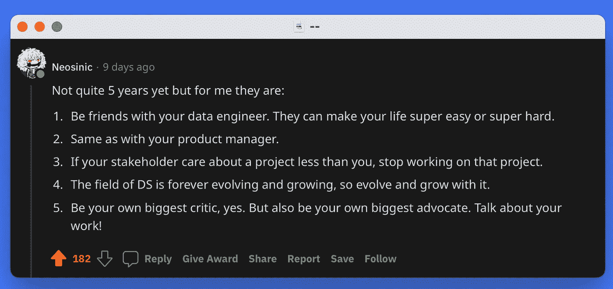
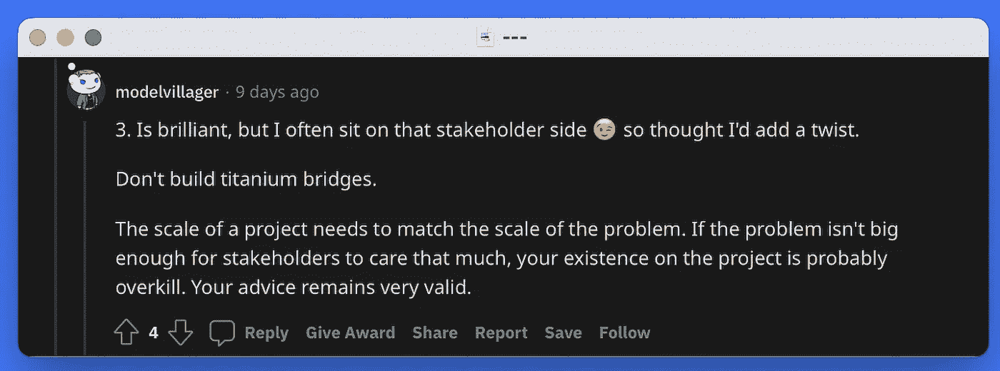
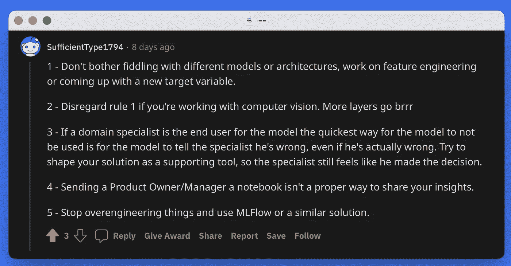
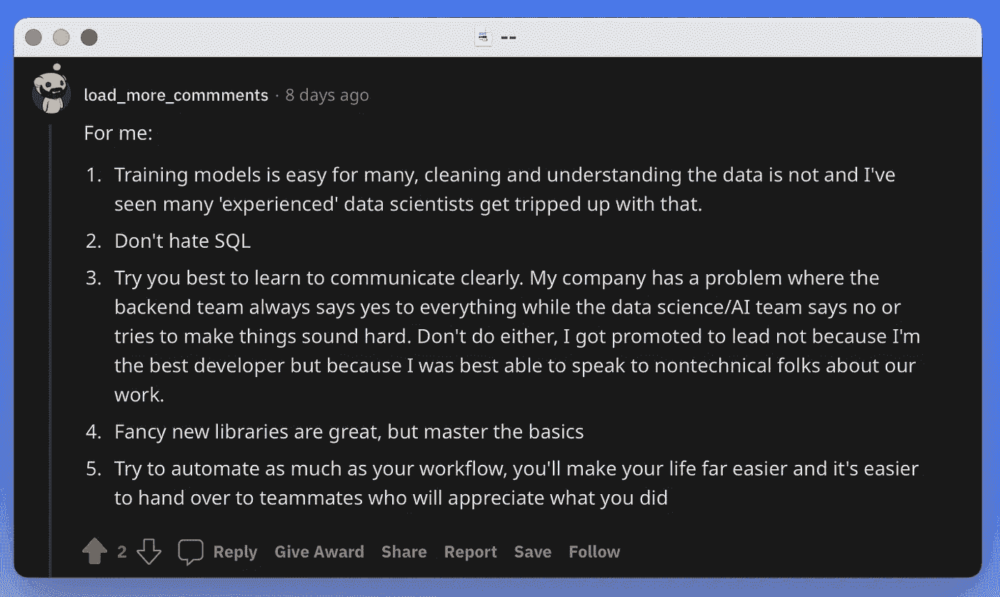
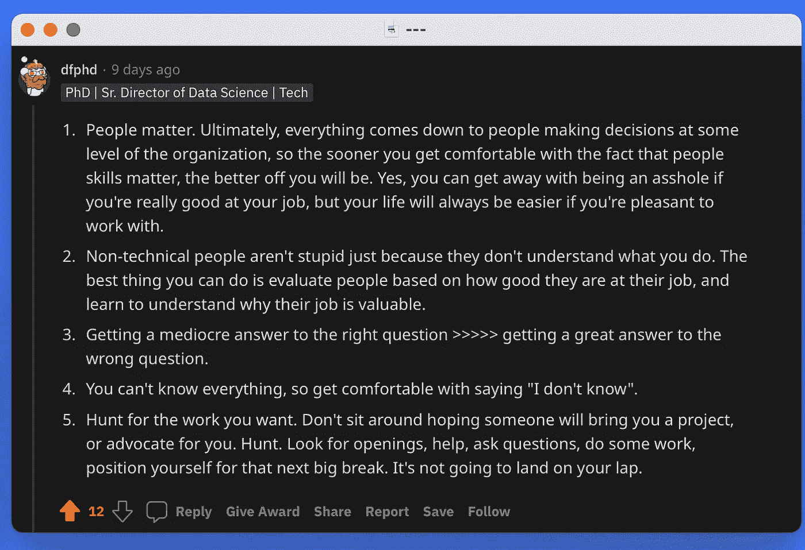
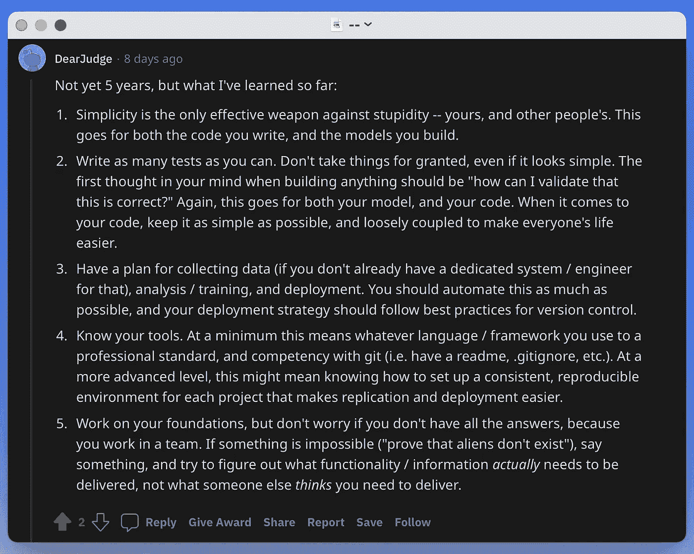

# 社区 5 年的数据科学-您与利益相关者交谈、提出好问题和糟糕沟通的经历

> 原文：<https://blog.devgenius.io/the-communitys-5-years-of-data-science-your-experiences-with-talking-to-stakeholders-asking-a83eb23dd4e8?source=collection_archive---------11----------------------->


伊斯雷尔·安德拉德在 [Unsplash](https://unsplash.com?utm_source=medium&utm_medium=referral) 拍摄的照片

在我最近的帖子 [*5 年的数据科学——关于艰难起步、被高估的评论和垃圾数据的想法*](https://www.ds-econ.com/5-years-of-data-science/) 中，我们谈到了 5 件事，这是我在数据科学的前 5 年学到的。

不过，我很好奇**你**学到了什么。因此，我求助于 [reddit /r/datascience](https://www.reddit.com/r/datascience/comments/vyv3rk/5_years_of_data_science_what_were_your_5_most/) 询问其他人在数据科学的前五年中的 5 大收获。

这个帖子相当受欢迎，有超过 5 万的浏览量。我过滤了评论中的许多列表，提炼出了我个人认为的你的**学习中的前 5 条。**

*简短说明:我试图联系这篇文章中提到的用户，以便能够正确地信任他们，例如，通过他们的 Twitter 或 GitHub 的链接。如果你知道，或者是这些用户中的一员，并希望获得积分，请联系:*[【finn@ds-econ.com】T21](mailto:finn@ds-econ.com)*。*

# 1.何时解雇你的股东



> 如果你的利益相关者比你更关心一个项目，停止那个项目。

在企业环境中，你经常发现自己在数据科学部门工作，该部门为公司的特定利益相关者做项目。这同样适用于许多其他场景，例如在学术界或作为独立顾问。

你应该只做一个项目，如果你的利益相关者至少和你一样关心这个项目的话。我们可以把这句话浓缩成:“**你的利益相关者需要参与游戏**”。

如果不是这样，就会发生不好的事情。他们可能不会给你提供足够的元数据，给你一个**不准确的需求描述**，或者只是在一个糟糕的问题上浪费资源。

不是每个项目都能扭转乾坤。事实上，只有一小部分人知道。‌
‌‌
‌But 在做一些事情，这一点连*项目的所有者*都认为不值得他们关注，是在浪费**大家的时间**。

在他的播客 [*中，我(大部分)钦佩的人*](https://freakonomics.com/series/people-i-mostly-admire/) 、*史蒂夫·莱维特*经常阐述退出的技巧:这种能力与数据科学家特别相关:将“当项目利益相关者不关心时退出项目”添加到你的技能清单中。



> **一个奖励:**不要建造钛桥。

有趣的是，一位自称“利益相关者”的用户补充道:‌
‌**不要建造钛桥**。或者换句话说:不要矫枉过正。

大问题需要大解决方案，小问题只需要小问题。‌
‌Don't 构建了一个神经网络，如果计算出来就足够了。

# 2.亚里士多德是数据科学家



给产品负责人/经理送一个笔记本不是分享你见解的合适方式。

**亚里士多德绝不会把 *Jupyter 笔记本*送给 PowerPoint 观众。** ‌

根据这位希腊哲学家的说法，你用[理性、精神气质和情感](https://www.lsu.edu/hss/english/files/university_writing_files/item35402.pdf)说服人们:内容、可信度和(对你客户的)了解*(糟糕的头韵是我的)*。

不管你的成果(Logos)多么有洞察力，你获得了多少荣誉(Ethos)，当你把一个 *Jupyter 笔记本*交给一个从未写过代码的人的时候，**你不尊重 *Pathos*** 。

在人们所在的地方与他们见面，这样更有说服力。

好消息是，有了像 [*Quarto* 这样的工具，你可以将你心爱的 *Jupyter 笔记本*](https://www.ds-econ.com/quarto/) 转换成 **PowerPoint 幻灯片，供营销团队**使用，作为客户的互动网站，或者作为你老板的打印件。

伟大的数据科学家利用他们的技能来尊重人们的情感，并在他们所在的地方与他们会面。

# 3.真正理解你的数据是困难的



> 对许多人来说，训练模型很容易，清理和理解数据却不容易，我见过许多“经验丰富”的数据科学家被这种方式绊倒。

这与我的[原文](https://www.ds-econ.com/5-years-of-data-science/)中的一点有关:**令人兴奋的数据造就令人兴奋的项目**。获取难以获取的数据和清理不仅仅是肮脏的数据，而且*肮脏的*让你与众不同。

然而，真正*理解*手头的数据，增加了一个新的维度。

表格、图像、视频、音频、网络、基因组或文本数据看起来都有很大的不同，要弄清楚数据的行和列实际上代表了什么需要时间。

更进一步，*真正*了解数据是如何收集的，测量的是什么，以及**哪些信息可以提取出来**需要时间，但却是非常宝贵的。

# 4.我们如何提出更好的问题？



> 对正确的问题得到一个平庸的答案>>>>对错误的问题得到一个伟大的答案。

我们试图用数据分析来回答一个问题。如果我们假设我们问了*完美的*问题，剩下要做的就是给出最精确的答案。

但是，如果我们的**题其实是错的**呢？

你如何提出更好的问题？关于这个问题，我找到了一些文章，例如:Admond Lee 在媒体上的文章。然而，对我来说，这似乎仍然是一个正在进行的辩论。

一个起点可以是，记下你任务的事实，并真正*思考*你的问题:

*   我有什么数据？
*   我能得到更多的数据吗？
*   我有多少时间？
*   项目的既定目标是什么？
*   项目真正的*目标是什么？*

随着计算资源的改善，机器学习领域发明了更多“精确”的方法，我们的答案会越来越好。

**瓶颈是问题本身**:如果我们问了错误的问题，我们最终会得到一个精确但错误的答案。

我们是愿意不精确地瞄准正确的目标，还是精确地瞄准错误的目标？‌
‌The 后者会带来更花哨的展示，但前者是诚实的选择。

我强烈推荐 [Roger Peng 的这篇帖子: *Tukey，设计思维，更好的问题*](https://simplystatistics.org/posts/2019-04-17-tukey-design-thinking-and-better-questions/) ，如果你想了解更多“提出更好的问题”背后的思维过程。尤其是他的图表“证据的强度与问题的质量”非常有见地。

# 5.专业人员做单元测试



> 尽可能多地编写测试。不要想当然，即使事情看起来很简单。

在[原帖](https://www.ds-econ.com/5-years-of-data-science/)中，我谈到了编码如何让你更专业:单元测试让你在编写代码方面更专业。

什么是单元测试？

在数据科学中经常被忽视的**单元测试**在将模型转移到生产阶段时变得至关重要，并且**可以在研究环境中保存您的数据分析**。

根据我的经验，数据科学部门把这个责任推给“真正的程序员”，他们把你的原型作为产品版本来实现。然而，没有理由这样做。单元测试并不复杂，最好由编写代码的人首先实现。

```
assert a == b, "A is not equal to B: There is a problem!"
```

这就是单元测试。

当然，这些可以变得更加复杂，甚至有专门的包来实现这些，例如`[unittest](https://docs.python.org/3/library/unittest.html)`或`[pytest](https://docs.pytest.org/en/7.1.x/)`。但是最终，它归结为一个类似上面的声明:检查条件是否是`true`，否则通知我。

理想情况下，你甚至可以在实现相应代码之前**编写单元测试:**

1.  我想要哪个结果？
2.  编写一个单元测试来检查这个结果
3.  编写代码，使*通过*这个单元测试

通过这样做，您已经有了一个单元测试，它可以捕获代码中的许多 bug。只要测试是“好的”，你的代码就会做你想让它做的事情。

‌Thank 非常感谢你的这些意见！他们让我思考了很多，我希望他们也能给其他人带来新的想法。