# 完全的 AWS Lambda 初学者手册(第 1 部分)

> 原文：<https://blog.devgenius.io/the-complete-aws-lambda-handbook-for-beginners-part-1-5a07add8a6c4?source=collection_archive---------6----------------------->


欢迎来到无服务器的世界。你首先会听到的是 AWS Lambda——而且你会继续听到它！虽然架构可以是无服务器的，但它通常是无服务器应用程序中的关键组件。在这个由 3 部分组成的 AWS Lambda 手册系列的第一篇文章中，我们介绍了什么是 AWS Lambda，使用各种术语回到基础知识，如何创建 Lambda 函数以及如何运行它。

> 阅读本手册的[第 2 部分](https://dashbird.io/blog/complete-aws-lambda-handbook-beginners-part-2/)和[第 3 部分](https://dashbird.io/blog/complete-aws-lambda-handbook-beginners-part-3/)。

# 什么是 AWS Lambda，它有什么作用？

AWS Lambda 是一个事件驱动的无服务器计算平台，响应事件旋转服务——在我们的 Lambda 触发器系列完整指南的[第 1 部分](https://dashbird.io/blog/complete-guide-lambda-triggers-design-patterns-part-1/)和[第 2 部分](https://dashbird.io/blog/complete-guide-lambda-triggers-design-patterns-part-2/)中找到更多关于 Lambda 触发器的信息。您的代码只是作为一个文件放在那里，而 AWS 会留意您设置的触发事件。当该事件发生时，将执行您的代码并执行所需的操作。它被认为是“无服务器的”，因为在用户出去寻找之前，服务器是不存在的——这是[功能即服务(FaaS)](https://dashbird.io/blog/what-is-faas-function-as-a-service/) 的缩影。

Lambda 的另一个好处是它由 AWS 管理的自动可伸缩性，这意味着你不需要考虑基础设施。该服务将自动适应不断增长的需求，同样，将缩小规模以节省资源。所有这些使得 AWS Lambda 成为减少资源和预算浪费的绝佳解决方案。

# AWS Lambda 定义解释

在开始学习如何设置和配置 Lambda 之前，下面是一些常用的定义和术语。

Lambda 函数:在应用程序中执行特定任务的一组相关语句。它由代码和任何与之相关的依赖项组成。每个 Lambda 函数都有其相关的配置信息(名称、描述、入口点和资源需求)。

该功能本身具有以下相关的重要方面:

1.  触发器:一组调用函数的活动(运行您提供的代码)。活动可以是任何事情，比如一个新对象进入你的 S3 桶，一个网站或服务关闭，一个 API 调用，等等。
2.  实际函数:这是构成函数的运行时代码。AWS 支持 Python、Node.js、C#、Go 和 Java8 作为运行时环境。
3.  资源:可以为每个函数分配特定的角色，这将授予该函数特定的权限，例如读取 S3 存储桶内容、将结果写入数据库等等。

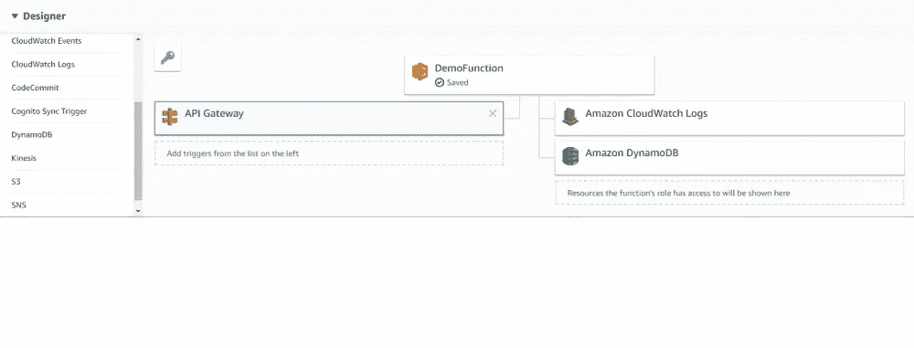

触发器显示在左侧，在这种情况下，API 网关触发器是活动的。资源显示在右边，在本例中是 CloudWatch 日志和 DynamoDB。

事件源:发布事件的实体。事件源可以是 AWS 服务或开发人员创建的应用程序，它产生触发函数运行的事件。

调用:调用被调用来执行特定的 Lambda 函数。这些是函数代码开始运行的触发器。调用可以是同步的或者异步的。

事件源映射:AWS 服务的一种配置，其中事件源与特定的 Lambda 函数相关联。它允许在特定事件发生时自动调用 Lambda 函数。

Lambda 执行模型:当您创建 Lambda 函数时，您可以指定配置信息，例如内存量和您为函数允许的最大执行时间。当调用该函数时，AWS Lambda 根据您提供的配置设置启动一个[执行上下文](https://docs.aws.amazon.com/lambda/latest/dg/running-lambda-code.html)。

冷启动:当 Lambda 函数在长时间不使用后被调用时，会发生冷启动，这会导致调用延迟增加(稍后将详细介绍)。

# AWS Lambda 配置元素

Lambda 函数由代码和相关的依赖项组成，其中还包含配置信息。还提供了一个 API，因此您可以更新一些配置数据。Lambda 函数配置信息包含以下关键元素:

*   计算所需资源:指定希望为 Lambda 函数分配的内存量。AWS Lambda 按照与通用 AWS EC2 实例类型(如 M3 类型)相同的比例，按内存比例分配 CPU 能力。
*   最大执行时间(超时):指定以防止 Lambda 函数不停地运行。因为您是在为运行 Lambda 函数的 AWS 资源付费，所以这一点特别重要。一旦超时，AWS Lambda 将终止 Lambda 函数的执行。建议的设置以预期的执行时间为基础。
*   IAM 角色(执行角色):在执行 Lambda 函数时，AWS Lambda 代表您执行的角色。
*   Handler name:入口点的方法，它运行您的代码，并包含任何事件源依赖项，作为 Lambda 函数的一部分。您将能够发现更多的细节，以及使用它来监控和调试 AWS Lambda 的质量特性。

# 创建简单的 AWS Lambda 函数

让我们创建一个由 API 调用调用的简单 Lambda 函数，即我们生成一个 URL，当在浏览器中输入该 URL 时，它将调用该函数。我们的输入将通过这个 URL 传递到函数中，输出将被返回并显示在浏览器中。

# 步骤 1:创建函数

在 Lambda 控制台面板中，单击创建函数。给你的函数一个名字，在我们的例子中，它是 DemoFunction。还要选择 Python3 作为运行时，因为我们将在这个例子中使用这种特定的语言。最后，为您的功能角色命名，并从策略模板中选择简单微服务权限。

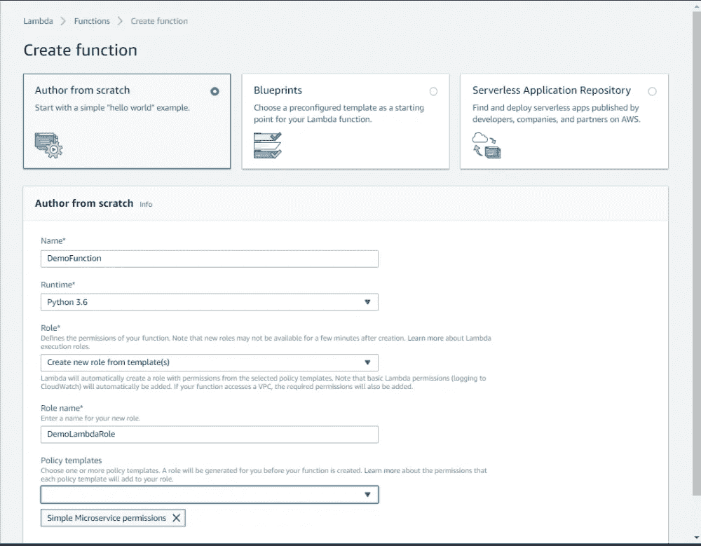

单击 Create Function，您将进入下一个屏幕，在这里您可以提供实际代码。我们正在从头开始编写这个 API，但是您可以从 Amazon repository 中找到大量的模板。

下一页将有一个内联文本编辑器，其中有一个简单的 python 函数。用以下内容替换:

```
import jsonprint('Loading function')def lambda_handler(event, context): firstName = event['first'] lastName = event['last'] return 'Greetings, ' + firstName + ' ' + lastName +'!'
```

第一行是使用 Python 中的 JSON 库解析 JSON。lambda_handler 函数获取事件作为其参数之一；这个事件带来了一组数据。函数中的第一行和第二行提取标记为 first 和 second 的数据，并将它们存储到各自的变量中。

最后一行返回一条消息，这就是我们将在浏览器中看到的内容。

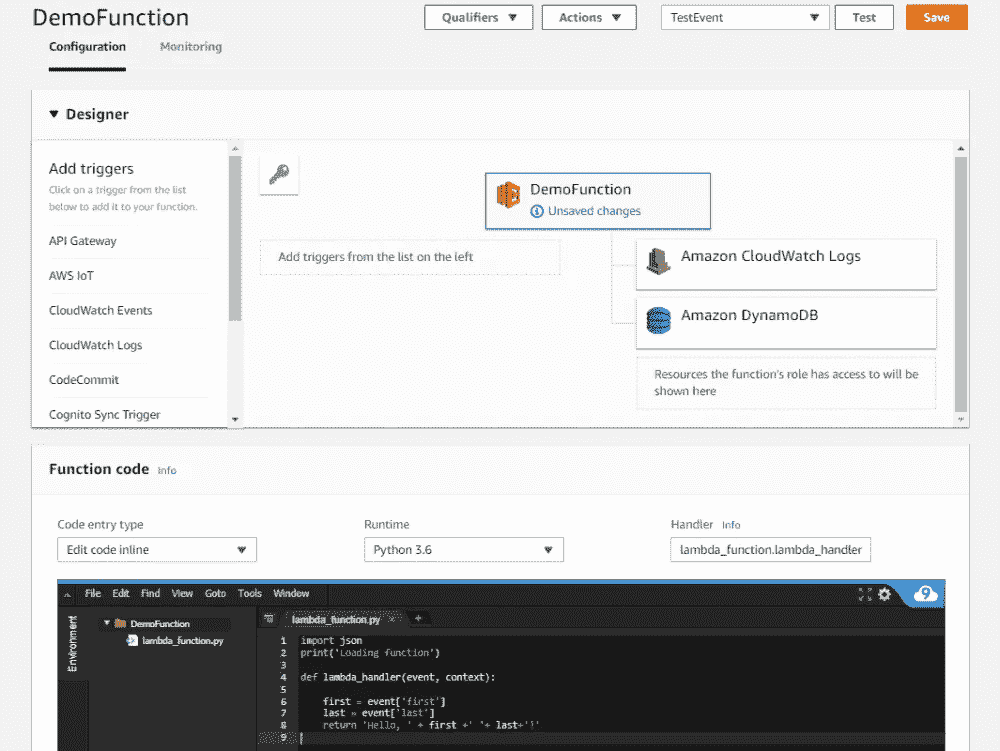

我们可以在这里添加一个 API 网关触发器，但是为了清楚起见，让我们分开来做。现在，我们可以点击保存，进入测试阶段。

# 步骤 2:测试您的功能

要测试您的功能，只需点击右上角的“测试事件”，然后点击配置测试事件。

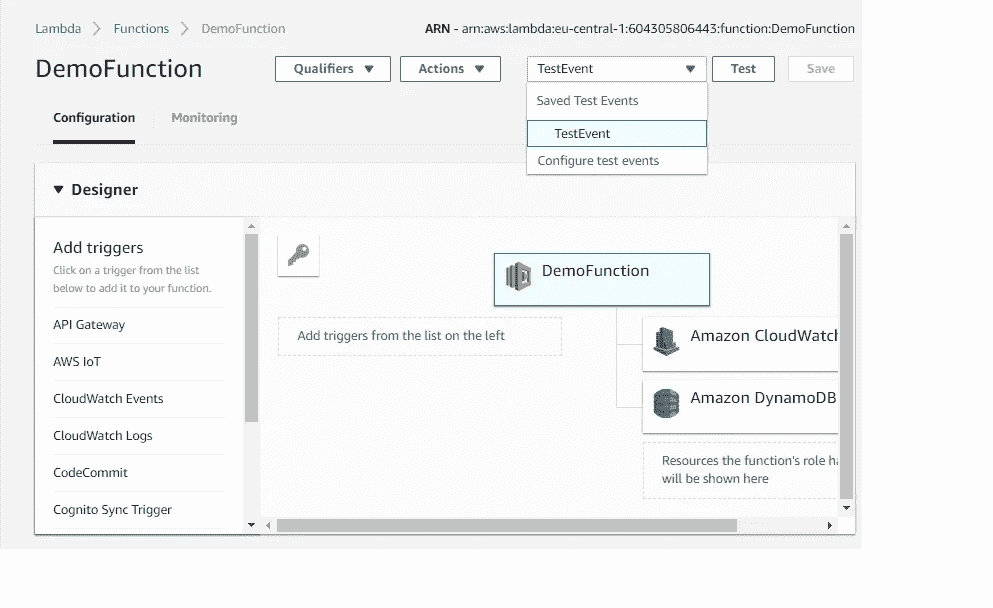

在这里，我们将第一次遇到 JSON 有效载荷。在模板 TestEvent 中。

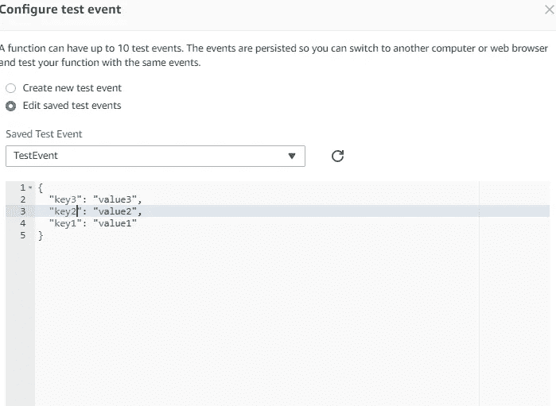

用下面几行替换文件内容:

```
{ "first": "Jane", "last": "Doe"}
```

现在我们已经保存了测试事件。点击上一菜单中的测试。成功执行后，您应该看到:

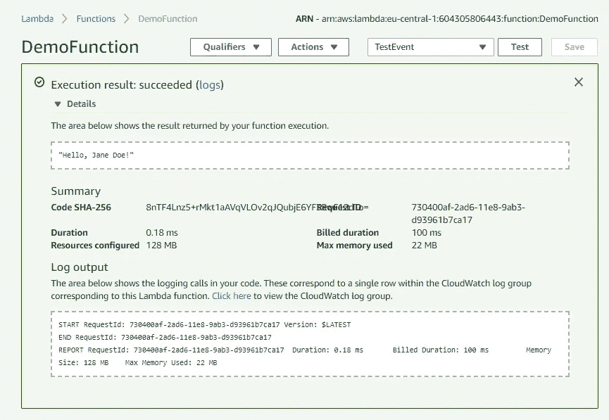

# 步骤 3:设置触发器

如前所述，我们的用户将通过访问某个 URL 来调用函数。要启用它，请转到 AWS 服务下的 API 网关控制台，然后单击 Get Started 或 New API option。

# 让我们从头开始创建一个:

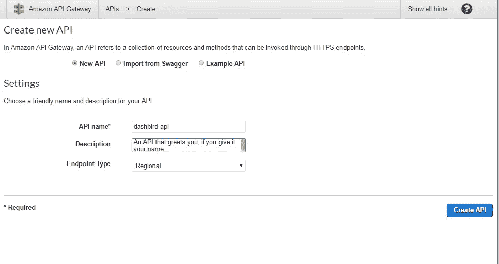

我们的 API 被命名为 dashbird-api。点击创建 API 后。您将获得 API 可以访问的资源(在下一个菜单中列出):

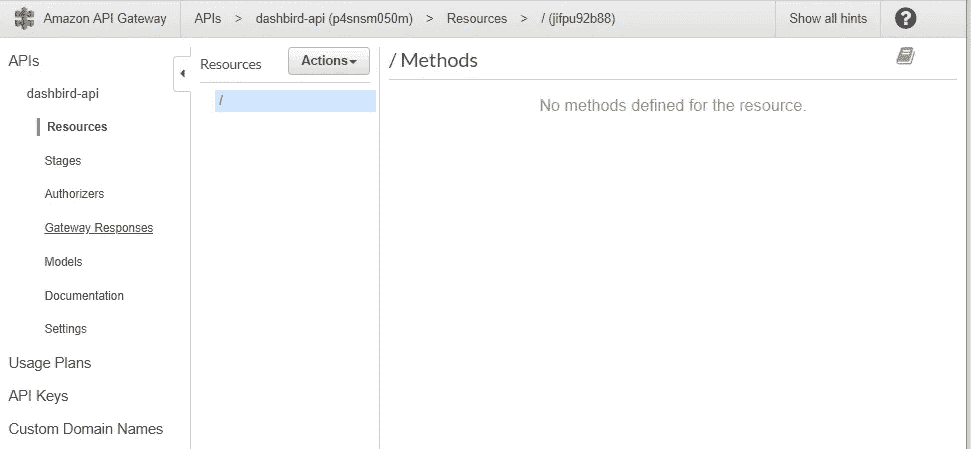

因为没有资源，我们只能得到一个正斜杠。但是您可以通过使用操作下拉菜单并选择创建资源来创建新资源。

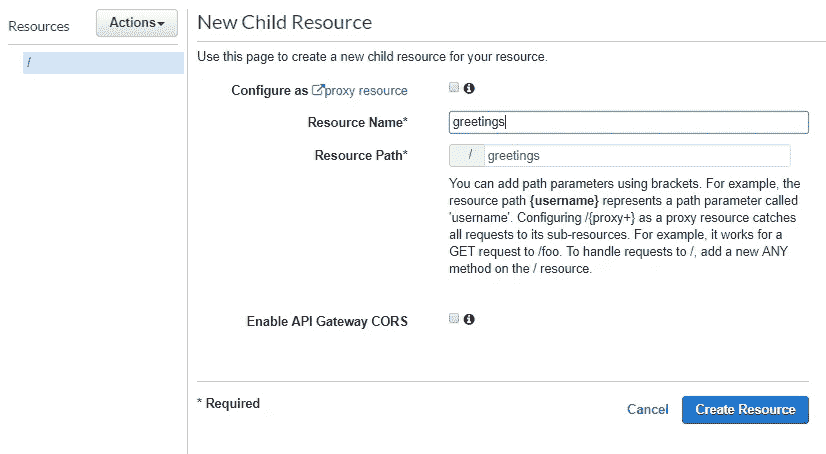

在资源列表中，您可以选择这个新资源(名为 greetings)，单击 Actions 并选择 Create Method。我们的 HTTP 请求方法将是一个 GET 请求，因为我们的目标是通过调用函数获得适当的响应。

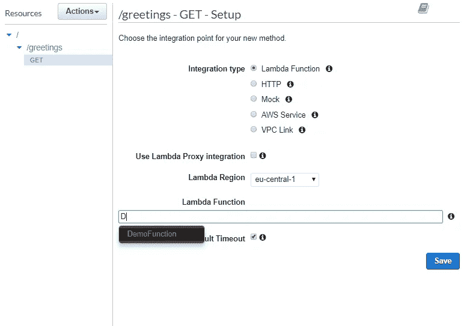

该方法将有一个 Lambda 集成选项，选择它，然后输入您在前面步骤 2 中选择的函数名。此外，从步骤 2 的截图中，请注意该函数的 [ARN](https://dashbird.io/knowledge-base/aws-cloud/arn-amazon-resource-names/) (右上角)，它有一个字符串 eu-central-1 表示它所在的地区。确保 Lambda 区域也选择了相同的区域，如上所示。然后它会请求调用该函数的许可；同意这一点，现在我们准备进行最后的修改。

下图解释了 GET 方法的执行:

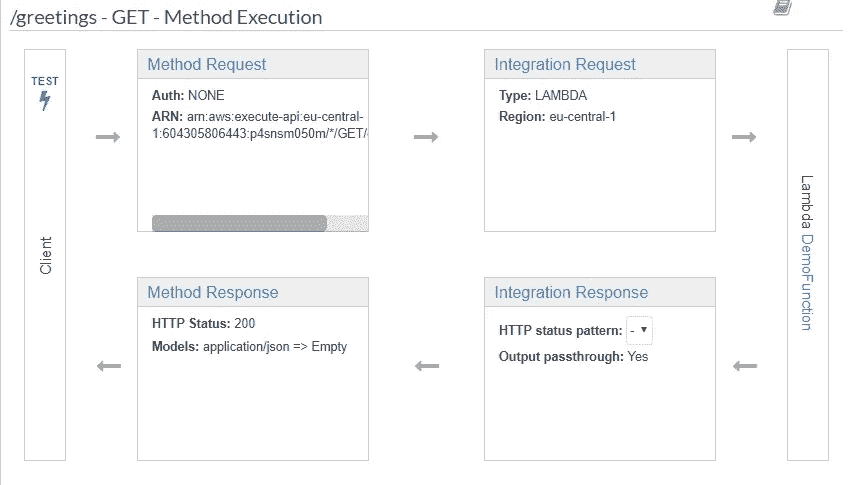

我们仍然需要确保输入参数被正确传递。为此，我们需要修改上面的集成请求阶段。您可以点击它进行修改:

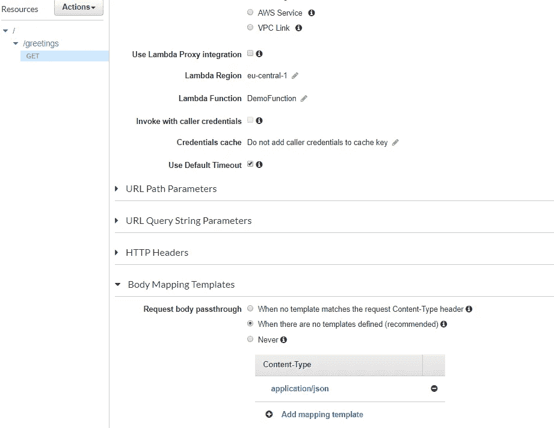

让一切保持原样，除了在菜单的最底部，你会发现身体映射模板，在这里我们可以描述我们的输入模板。模板的类型将是 application/json:

```
"first": "$input.params('first')", "last": "$input.params('last')"}
```

美元符号和 input.params()部分充当占位符，帮助我们定义适当请求的结构。现在我们可以保存我们的更改，单击 Actions 并选择 Deploy API 选项。它会询问艺名；给它一个合适的名称(在我们的例子中，它被称为 prod)。一切就绪！我们现在可以实时运行这个功能。

# 运行功能

可以使用与之相关联的唯一 URL 来调用该函数。在我们第一次选择资源的 API 控制台中，选择 Stage 子菜单。然后下拉到问候语，然后到获取选项。

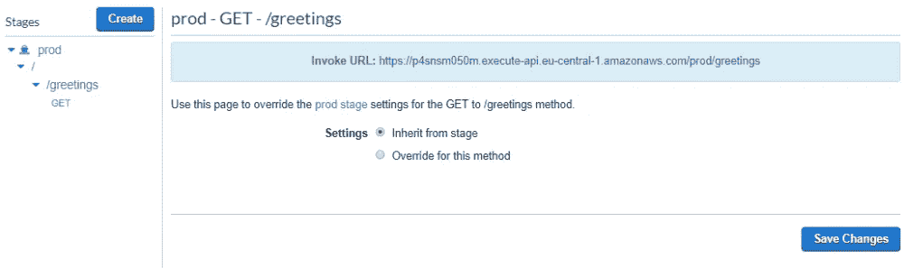

它会给你一个调用 URL，你可以点击它来运行函数。但是，在第一次尝试时，如果没有输入任何内容，您可能会得到一条错误消息。您可以通过如下方式修改 URL 来纠正这一问题:

https://………amazonaws.com/prod/greetings?名字=约翰，姓氏=无名氏

将最后一部分添加到 URL 将导致函数的成功执行:

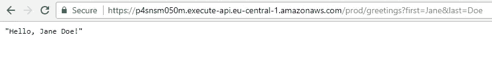

# 创建 Lambda 的选项

当然，以上只是使用一种方法的一个例子，所以在为自己的应用程序创建 Lambda 时，记住其他可用的选项很重要。

*   写代码:支持的语言有 Node.js，Java，C#，Python，Go。这些语言使用特定的工具来创作代码。其中有 AWS Lambda 控制台，Eclipse IDE 等。
*   部署包:部署代码和创建 Lambda 函数要求您首先将代码和依赖项打包到部署包中，以便开发 Lambda 函数。完成后，您需要将部署包上传到 AWS Lambda，这样它将允许您创建一个 Lambda 函数。以特定的方式组织代码和依赖项是构建部署包的第一步。部署包说明可能会因您选择创作代码的语言而异。
*   创建 Lambda:您可以在 AWS Lambda 控制台、 [AWS CLI](https://aws.amazon.com/cli/) 和[AWS SDK](https://aws.amazon.com/tools/#sdk)之间进行选择来创建 Lambda 函数。

在我们的 AWS Lambda 初学者手册系列的下一部分，我们将解释 AWS Lambda 定价，分享一些你可能不知道的事实和伟大的用例。敬请期待！