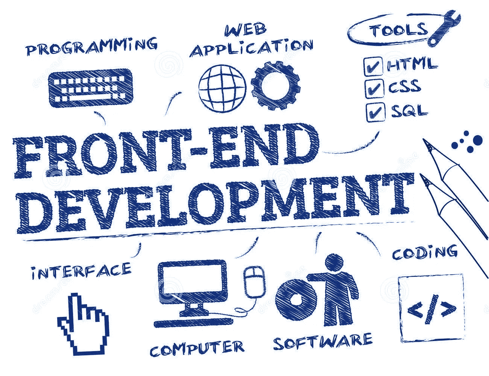
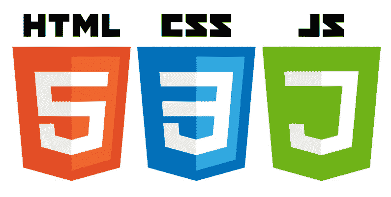
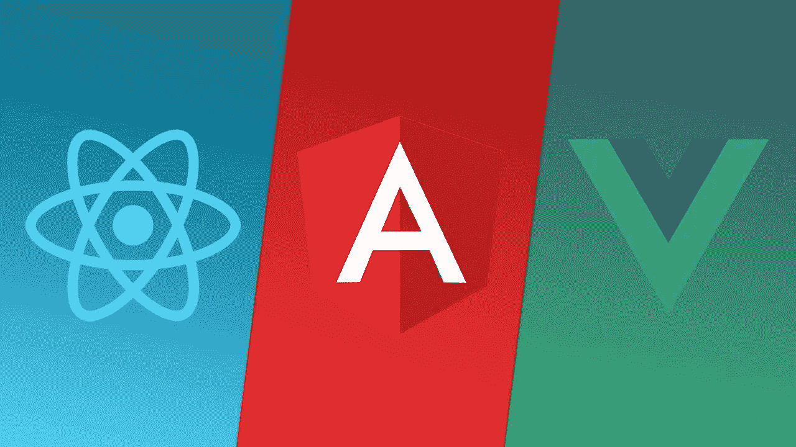
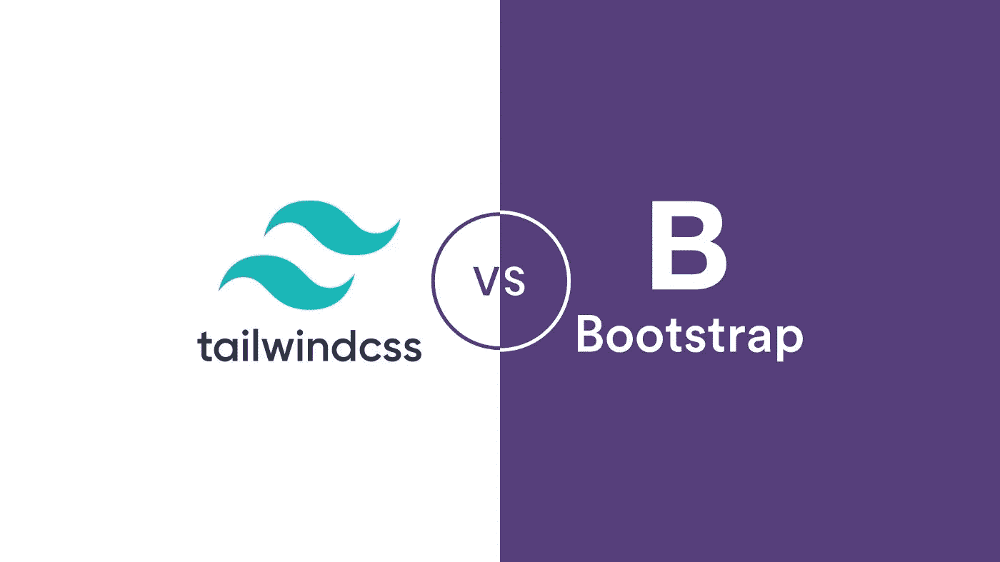

# 完整的前端开发路线图

> 原文：<https://blog.devgenius.io/the-complete-front-end-developer-roadmap-beb345e09898?source=collection_archive---------6----------------------->

> 谷歌是一个寻找前端开发资源的好地方，问题是，我需要学习什么？
> 
> 这里有一个**完整的前端开发人员路线图 2021** ，以启动您的职业生涯，并开始货币化您的开发技能。

# 如何在 2022 年成为前端 Web 开发者

前端开发人员是开发网站和应用程序的用户界面的人员。他们负责确定 web 应用程序的结构和设计，构建功能以改善用户体验，在设计和功能之间取得平衡，针对不同设备优化 web 应用程序，针对速度和可扩展性优化页面，使用不同的标记语言对网页进行编码，维护品牌一致性并编写可重复使用的代码。简单来说，前端开发是指决定用户界面操作和结构的代码行。

# 第一步:了解基础知识

为了建立一个网站，你首先需要对 web 有一个**的基本理解，它是如何构造的，以及你的应用程序如何适应它。**

*什么是网络，什么是服务器，什么是客户端，各种设备如何相互通信，你在圣何塞的电脑上建立的网站如何出现在上海某个人的手机上。*

一旦你对网络(即 IP 地址、互联网协议、数据包)、数据库(即 SQL、NoSQL、缓存)、客户端和服务器有了全面的了解，你就可以继续学习 web 开发的实际基础知识:**编码。**

前端开发人员负责网站面向用户(或客户)的部分。他们的代码运行在客户端的浏览器上，并决定网站的外观(例如，用户界面、布局、导航等)。)，它如何从服务器请求数据，以及它如何与客户机交互。

> *用于开发面向客户端源代码的编码语言有****HTML****，****CSS****，****JavaScript****。*

现在你知道了如何编写基本的前端代码来创建结构化、风格化的动态网站的概念。让我们来看看如何将这一知识推得更远。我们将讨论以下内容:框架、命令行和版本控制。

Web 框架使前端和后端编程的开发和集成变得更加容易。一个 web 框架基本上是一个标准化代码的文件和文件夹包，可以用来作为开始构建一个站点的基础。换句话说，它是一个允许您在其上进行构建的入门包。

前端开发人员最常用的 javascript 框架有:

*   有角的
*   React.js
*   vue . j

前端开发人员最常用的 css 框架有:

*   引导程序
*   顺风 CSS

每个框架都有自己的优点和缺点。有的是严格固定的，有的是非常宽松的，只给出指引。做你的研究，找到适合你的框架，并使用它们将你的技能带到下一个层次。

**命令行**基础知识是成为一名开发人员的基础。命令行界面(CLI)是一种工具，您可以在其中键入命令，使计算机执行任务。

命令可以组合起来实现各种各样的结果，因为你能够直接与计算机通信，这是控制你的任务的更强大和更有效的方法。最常见的 CLI 是 Bash Shell，这是 Linux 和 Mac 系统上的默认设置。

每个开发人员都有自己的想法，知道如何最好地对网站进行编码/编程，但是他们都同意**版本控制**是建设网站最重要的部分。版本控制管理所有项目文件，以便您可以跟踪所有的生成和更改。

由于其灵活性，Git 是世界上最流行的版本控制系统。它会记住对一个项目所做的任何更改，从而很容易恢复到早期版本；它允许多人同时在一个项目上工作。

# 不断学习前端开发。

通过动手实践，用一半的时间掌握前端基础知识。Educative 基于文本的课程侧重于你重新掌握技能或获得一份新工作所需的实践经验。

**成为前端开发者**

# 第三步:试错

你知道他们说要成为专家需要做一万个小时吗？他们是对的。

一旦你学会了如何编码，以及如何构建功能强大的应用程序，并准确地做你需要它们做的事情，你可以变得更好的唯一方法就是**练习**。

建立样本网站。你的那个想成为诗人的邻居？帮助她创建一个带有 twitter 滚动和链接到她已发表作品的互动页面。你那个在 Etsy 上卖陶土珠宝的堂兄？用照片、评论、推荐、她的社交媒体链接等等建立她的网站。

你练习的越多，建立的越多，整个过程对你来说就越直观。不知不觉中，建立网站和应用程序将成为你的第二天性。

# 第四步:不断学习

互联网不断变化，每天都有新的更先进的编程方法推出。你必须跟上新技术的发展，并不断学习。

这并不是说你到目前为止学到的东西就不重要了。你的基础知识总是会给你带来优势。但是为了成长，你必须跟踪什么是前沿，并相应地更新你的技能。

现在你知道了你需要采取的步骤，看看 Educative 的**成为前端开发人员学习之路**，把你在这篇文章中学到的东西付诸实践。在这条道路上，你会发现精心策划的模块，旨在教你一切你需要知道的，从基础知识到全面的指南，推出自己的网站。

*快乐学习！*