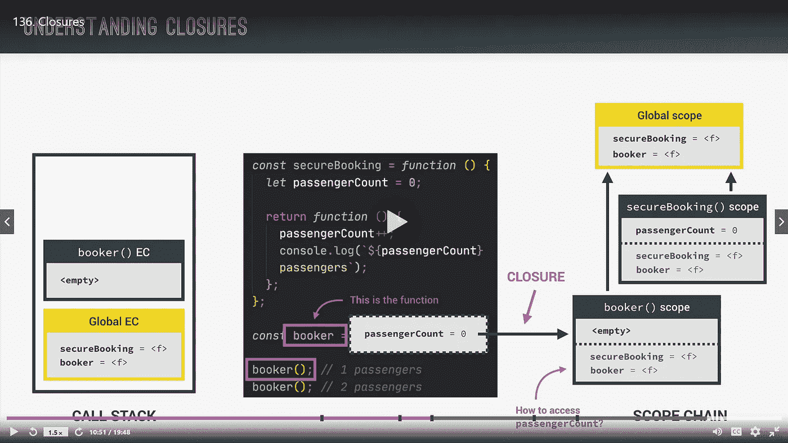
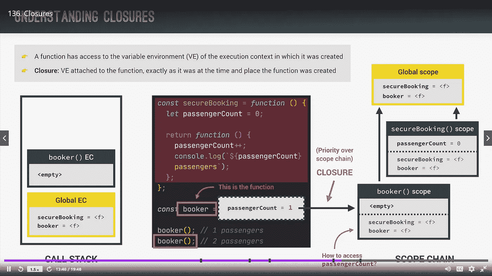
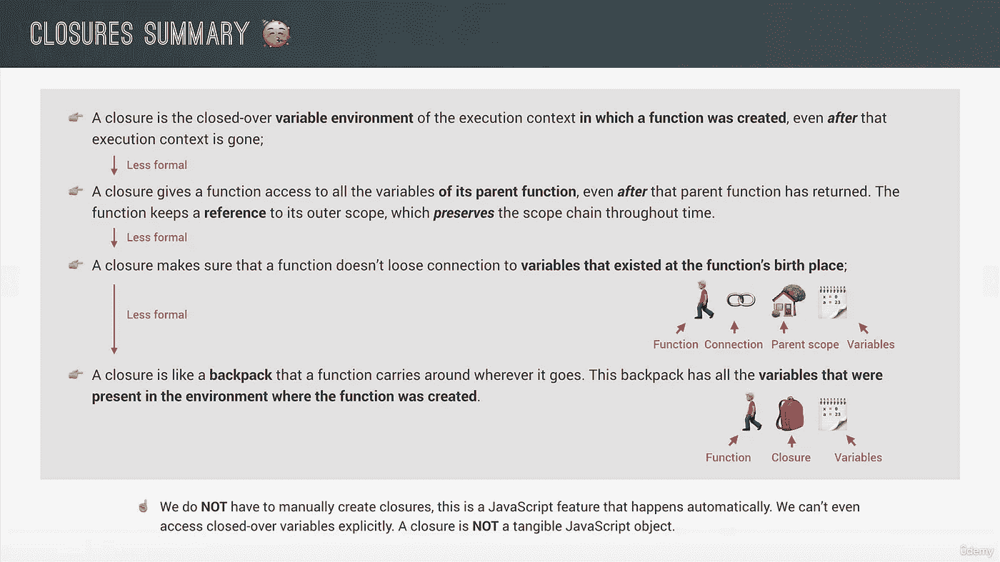
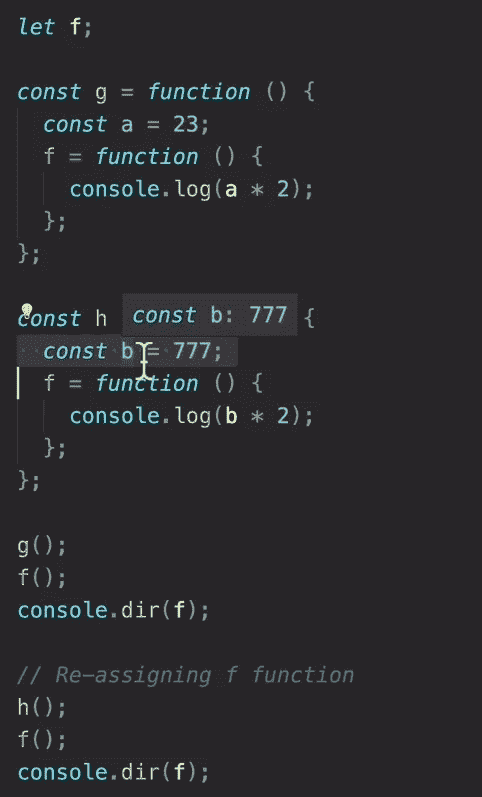

# 完整的 JS 注释#11 🧵函数

> 原文：<https://blog.devgenius.io/the-complete-js-notes-10-46f8bc8c2a5d?source=collection_archive---------10----------------------->


保罗·埃施-洛朗在 [Unsplash](https://unsplash.com?utm_source=medium&utm_medium=referral) 上拍摄的照片

*欢迎阅读我的 JavaScript 笔记的下一篇文章。*

*在本文中我们将讨论:* ***函数、IIFE、闭包***

*所有内容摘自 Jonas Schmedtmann 的惊人课程* [*完整的 JavaScript 课程 2022:从零到专家！*](https://www.udemy.com/course/the-complete-javascript-course/)

请购买课程以了解内容，这只是我对课程的总结笔记。


# 立即调用函数表达式(IIFE)

```
(function () {console.log(‘This function will never run again’);})();
```

这里有两件事很重要

*   我们必须在括号内创建 IIFE 语句，否则会抛出错误
*   我们必须在创建后调用它，否则我们不能再次调用它。

它还有一个箭头功能版本

```
(() => console.log(‘This function ALSO will never run again’))();
```

小心括号

那么我们为什么需要这个生命的东西呢？我们需要它，因为它有助于数据封装和数据隐私。

# 关闭


这里发生了一件有趣的事情。即使我们移出了 secureBooking 函数，它返回的函数也能够到达它的变量并递增它？WTF 对吧？

任何函数总是可以访问创建该函数的执行上下文的可变环境。



这种连接被称为闭合



我们可以用我们创建的匿名函数 console.dir


这里有一些匿名函数的属性

带双方括号的是内部结构，我们实际上无法触及。在 scopes 属性中，我们可以看到闭包。

```
let f;const c = function () {const a = 23;f = function () {console.log(a * 2);};};c();f();
```

这里疯狂的事情是，即使函数 c 带着它的变量 f 离开了 JS 引擎的调用堆栈，它仍然可以访问和使用它的内容，它甚至没有在 c 中定义，也没有被它返回。



```
const boardPassengers = (n, wait) => {const perGroup = n / 3;setTimeout(function () {console.log(`We are now boarding all ${n} passengers`);console.log(`We will accept them in ${perGroup} person groups`);});console.log(`We will start boarding in ${wait} seconds`);};boardPassengers(30, 2);
```

这是闭包的另一个例子，即使 boardPassengers 函数离开了调用堆栈，我们在 setTimeout 中的函数也可以到达它的变量。

[*见本 js 笔记第一篇帖子！*](https://medium.com/@barisbll/the-complete-js-notes-1-36ea76e326b3)

[*见本 js 笔记跟帖的上一篇！*](https://medium.com/dev-genius/the-complete-js-notes-10-d979affa85ea)

[*见本 js 笔记线程下篇！*](https://medium.com/@barisbll/the-complete-js-notes-11-d9df3de726ed)

[*在 twitter 上关注我获取甜蜜内容*](https://twitter.com/barisbll_dev) 😘

*在* [*Dev Genius*](https://blog.devgenius.io/) 中阅读我和许多其他伟大的科技博客作者