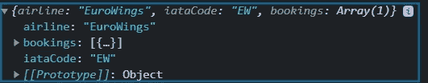
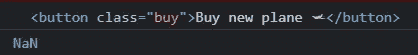
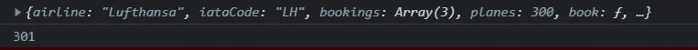

# 完整的 JS 注释#10 🧵函数

> 原文：<https://blog.devgenius.io/the-complete-js-notes-10-d979affa85ea?source=collection_archive---------12----------------------->

欢迎阅读我的 JavaScript 笔记的下一篇文章。

*在本文中我们将谈到:* ***引用 vs 值，高阶函数，调用，应用，绑定***

*所有内容摘自 Jonas Schmedtmann 的惊人课程* [*完整的 JavaScript 课程 2022:从零到专家！*](https://www.udemy.com/course/the-complete-javascript-course/)

*请购买课程以了解内容，这只是我对课程的总结笔记。*


# 默认参数

在 ES5 中，我们用 or 参数短路值来获得默认参数

```
const bookings = [];const createBooking = function (flightNum, numPassengers, price) {numPassengers = numPassengers ?? 1; 
// I short circuit with nullish ascending because it is betterprice = price ?? 3000;const booking = {flightNum,numPassengers,price,};console.log(booking);bookings.push(booking);};createBooking(‘LH123’);
```

但是有了 ES6，我们有了更好的做事方式

```
const createBooking = function (flightNum, numPassengers=1, price=3000) {const booking = {flightNum,numPassengers,price,};console.log(booking);bookings.push(booking);};createBooking(‘LH123’);
```

但是最好的事情是，我们甚至可以使用写在参数之前的参数来进行计算

```
const createBooking = function (flightNum,numPassengers = 1,price = 3000 * numPassengers <- We can also do all kind of calculations) {const booking = {flightNum,numPassengers,price,};console.log(booking);bookings.push(booking);};
```

如果我们想要覆盖默认的参数行为，我们必须

```
createBooking(‘SH123’, undefined, 3000);
```

undefined 仅仅意味着没有参数。

# 传递参数的工作原理:值与引用

```
const flight = ‘LH234’;const jonas = {name: ‘XYZ’,};const checkIn = function (flightNum, passenger) {flightNum = ‘AB!!’;passenger.name = ‘Mr.’ + passenger.name;};checkIn(flight, jonas);console.log(flight);console.log(jonas);//ReturnsLH234
Mr. XYZ
```

但是为什么物体变了而原始人不变呢？

因为当我们将原始值放入函数中时，它只是在参数中做了一个拷贝。

但是对象是引用，所以同一个引用在函数中被改变。

**按引用传递与按值传递**

在一些编程语言中，你可以把所有东西作为引用传递，这样当你离开函数时，全局值就会被改变。这就是 C++的情况，它被称为传递引用

我能听到你说“但是怎么做？”“我们刚刚看到对象是通过引用传递的”看起来是这样，朋友，其实不是。我们复制了引用的值并发送给参数，我们没有把引用放在那里。这是一个重要的区别。

# 一阶和高阶函数


很多人认为一级函数和高阶函数是一回事。这不是真的。

一级函数是一个抽象的概念。它仅仅意味着“像对待变量一样对待函数”

然而，高阶函数实际上是存在的。意思是用一级函数逻辑写的函数。

```
const oneWord = str => {return str.replaceAll(' ', '');};const firstWordUpper = str => {const [fW, ...others] = str.split(' ');return [fW.toUpperCase(), ...others].join(' ');};const higherOrder = (str, fn) => {console.log(`Original string ${str}`);console.log(`Transformed string ${fn(str)}`);console.log(`Transformed by ${fn.name}`);};higherOrder('js is the best', firstWordUpper);//ReturnsOriginal string js is the bestTransformed string JS is the bestTransformed by firstWordUpper
```

这里有两件事很重要

1.  使用函数作为参数的语法
2.  函数有自己的值，如示例中的 funtion.name

higherOrder('js 是最好的'，first word upper)；

我们作为参数放入的函数被称为**回调函数**，这是因为我们自己不调用它，而是让 js 调用它。

```
const high5 = () => {console.log(‘👋’);};[‘Ayse’, ‘Fatma’, ‘Hayriye’].forEach(high5);
```

forEach 也是一个高阶函数。

# 函数返回函数

```
const greet = greeting => {return function (name) {console.log(`${greeting} ${name}`);};};const greetWithName = greet(‘Hey’);greetWithName(‘Jonas’);greetWithName(‘Baris’);//returnsHey JonasHey Baris
```

这里会发生一些疯狂的事情。我们放入第一个函数的问候参数以某种方式保存到我们返回的函数中，我们可以在以后使用它。

我们甚至可以使用

```
greet(‘Hello’)(‘Jonas’);
```

有了箭头函数，我们有了一个超级酷的语法

```
const greatArr = greet => name => console.log(`${greet} ${name}`);
```

# 调用和应用方法

假设我们有一个这样的物体

```
const luftHansa = {airline: 'Lufthansa',iataCode: 'LH',bookings: [],book(flightNum, name) {console.log(`${name} booked a seat on ${this.airline} flight ${this.iataCode} ${flightNum}`);this.bookings.push({ flight: `${this.iataCode}${flightNum}`, name });},};luftHansa.book(234, 'Jonas Shmedtmann');luftHansa.book(659, 'Mike Tyson');
```

我们想在另一个对象中使用这个 objects book()方法，我们该怎么做呢

```
const book = luftHansa.book;book(23, ‘Sarah Williams’); // This will return an error because this is in the global scopeconst euroWings = {airline: ‘EuroWings’,iataCode: ‘EW’,bookings: [],};const book = luftHansa.book;book.call(euroWings, 23, ‘Sarah Williams’);console.log(euroWings);
```



Call 方法允许在对象中调用函数。

这里第一个参数是从哪个对象手动调用它来改变它。那么其他参数就是函数的参数。

Apply 方法基本上是相同的，但是将函数的参数作为一个数组，而不是一个接一个地写它们

```
const data = [24, 'Baris Williams'];book.apply(luftHansa, data);console.log(luftHansa);
```

顺便问一下，我们如何使用这些应用调用等功能？

在 JS 中，函数只是不同类型的对象，所以它们有属性，甚至函数。这个调用、应用等只是所有函数中的函数。

我们也可以两个都用

```
book.call(luftHansa, ...data);
```

# 该绑定方法

Bind 用指定对象的**“this”**创建一个新函数。

```
const bookEW = book.bind(euroWings);bookEW(23, 'Steven Williams');
```

在这里，我们创建了一个新的功能手册，始终指向欧洲之翼

但是我们甚至可以更进一步，我们可以通过绑定方法定义函数的参数

```
const bookEW23 = book.bind(euroWings, 23);bookEW23(‘Ecem’);
```

这个函数总是把 23 作为第一个参数。我们可以越走越远。

假设我们在 lufthansa 对象中添加了飞机数量和飞机购买功能

```
luftHansa.planes = 300;luftHansa.buyPlanes = function () {console.log(this);this.planes++;console.log(this.planes);};
```

我们想在每次点击按钮时添加一个新的平面

```
document.querySelector(‘.buy’).addEventListener(‘click’, luftHansa.buyPlanes);
```

当我们点击按钮时，它返回:



巴顿和南？WTF 男？？

这里我们可以看到 this 关键字的动态性，我们在事件侦听器中调用它，正因为如此，它对 button 元素进行操作。

如何避免？当然是用 bind！！

```
document.querySelector(‘.buy’).addEventListener(‘click’, luftHansa.buyPlanes.bind(luftHansa));
```



Bind 很神奇，它允许我们制作新的函数。在某些情况下，我们甚至他妈的不关心这个关键词

```
const addTax = (rate, value) => value + rate * value;console.log(addTax(0.1, 100));const addVAT = addTax.bind(null, 0.23);console.log(addVAT(100));
```

在这里，我需要创建一个改变了一个参数的函数，而不是创建一个新的函数，用 bind 编写一个要简单得多。

因为我不关心这个关键字，我可以简单地把 null 放在那里。

[*见本 js 笔记第一篇帖子！*](https://medium.com/@barisbll/the-complete-js-notes-1-36ea76e326b3)

[*见本 js 笔记线程的上一篇文章！*](/the-complete-js-notes-9-31bd8489a476)

[*见本 js 笔记线程下篇！*](https://medium.com/@barisbll/the-complete-js-notes-10-46f8bc8c2a5d)

[*在 twitter 上关注我获取甜蜜内容*](https://twitter.com/barisbll_dev) 😘

*在*[*Dev Genius*](https://blog.devgenius.io/)阅读我和其他许多伟大的科技博客作者