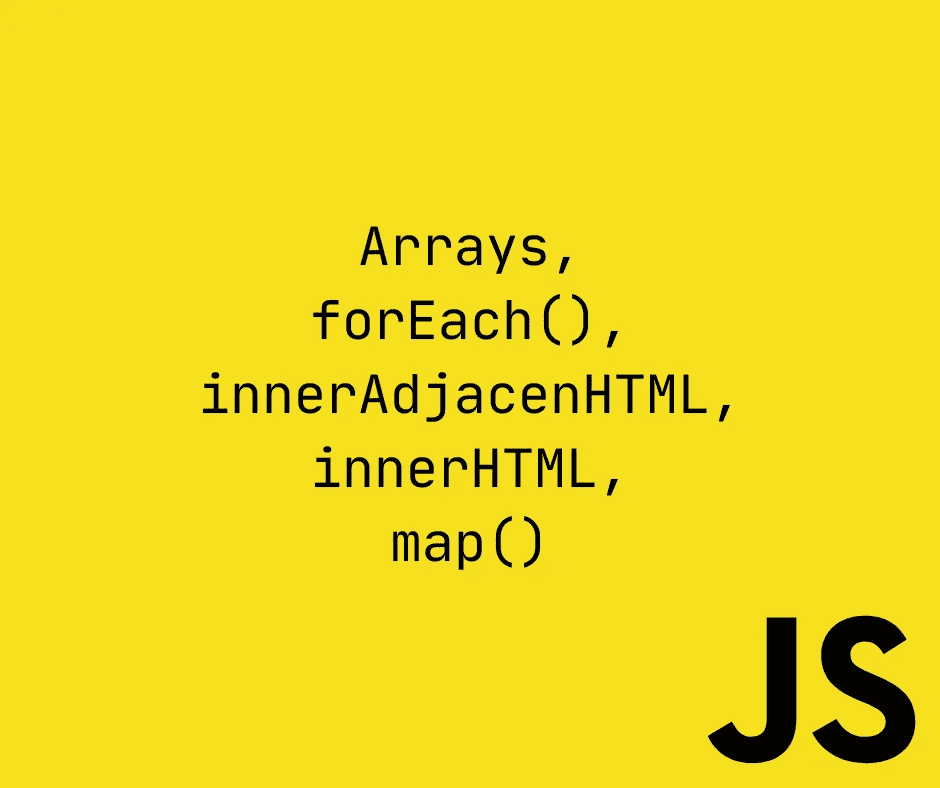
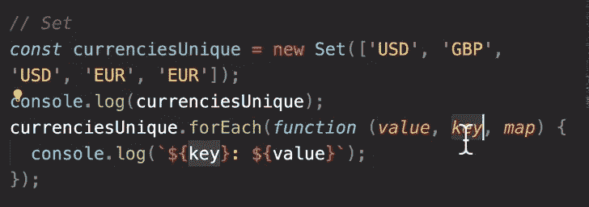
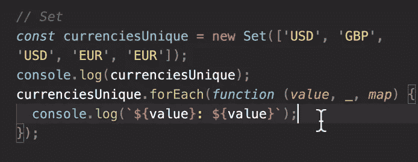
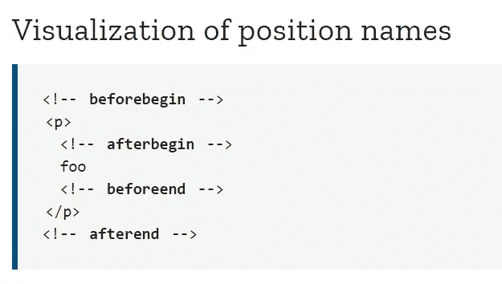
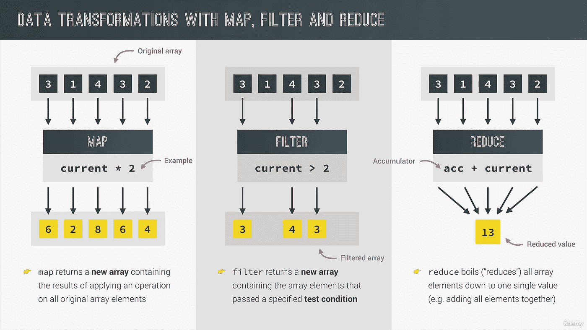

# 完整的 JS Notes #12 🧵阵列

> 原文：<https://blog.devgenius.io/the-complete-js-notes-11-d9df3de726ed?source=collection_archive---------10----------------------->


詹姆斯·哈里逊在 [Unsplash](https://unsplash.com/s/photos/code?utm_source=unsplash&utm_medium=referral&utm_content=creditCopyText) 上拍摄的照片

*欢迎阅读我的 JavaScript 笔记的下一篇文章。*

*在本文中我们将讨论:* ***数组，forEach()，innerAdjacenHTML，innerHTML，map()***

*所有内容摘自 Jonas Schmedtmann 的惊人课程* [*完整的 JavaScript 课程 2022:从零到专家！*](https://www.udemy.com/course/the-complete-javascript-course/)

请购买课程以了解内容，这只是我对课程的总结笔记。



# 数组函数

```
let arr = [1, 2, 3, 4, 5, 6];//Slice makes a copy of items and doesn’t touch the original arrayconsole.log(arr.slice(2));console.log(arr.slice(-1)); // The last element//Splice is like slice but removes items from the arrayconsole.log(arr.splice(2)); // [3, 4, 5, 6]console.log(arr); // [1, 2]
```

通常我们甚至不关心拼接方法返回什么，我们关心的是数组

通常的做法是删除最后一个拼接元素

```
arr.splice(-1);
```

Splice 的第二个参数与 slice 的第二个参数不同。在拼接中，第二个参数是 count。

```
arr.splice(3,2); //Remove 2 elements: element 3 and 4arr.reverse(); // Returns reversed arrayconst letters = arr1.concat(arr2); //Concat the elementsletters.join(‘ — ‘); // a — b — c — d …
```

# 循环数组:forEach

```
const movements = [200, 450, -400, 3000, -650, -130, 70, 1300];movements.forEach(function (movement) {console.log(movement);});
```

forEach 是一个高阶函数。它为每个参数调用函数。它是这样叫的:


我们可以将 forEach 与索引一起使用，尽管这样做非常容易

```
movements.forEach(function (movement, idx, array) {if (movement > 0) {console.log(`Movement ${idx + 1}: Gaining ${movement} $`);} else {console.log(`Movement ${idx + 1}: Withdraw ${movement} $`);}});
```

forEach 总是将第一个元素作为数组的元素

第二个元素作为索引，第三个元素作为数组本身

**Continue 和 break 语句在 forEach 中不起作用！**

# 地图和集合的 forEach

```
const currencies = new Map([[‘USD’, ‘United States dollar’],[‘EUR’, ‘Euro’],[‘GBP’, ‘Pound sterling’],]);currencies.forEach(function (value, key, map) {console.log(`${key}: ${value}`);});
```

对于集合来说也是一样的，值和键的意思是一样的，映射就是整个集合。他们这样做是因为一致性。



我们也可以使用通配符作为丢弃参数



# 创建 DOM 元素

对于导航菜单，我们有一个特殊的 html 元素

```
<nav> … <nav />
```

要添加 html 元素，我们首先需要用模板文字创建它` ` 1

在用模板文字动态改变值之后，我们需要使用 **insertAdjacentHTML** 将它添加到我们的文档中

这里我们有几个选项来指定元素的注入位置



```
const displayMovements = function (movements) {movements.forEach(function (mov, idx) {const type = mov > 0 ? ‘deposit’ : ‘withdrawal’;const html = `<div class=”movements__row”><div class=”movements__type movements__type — ${type}”>${idx} ${type}</div><div class=”movements__date”>3 days ago</div><div class=”movements__value”>${mov}</div></div>`;containerMovements.insertAdjacentHTML(‘afterbegin’, html);});};displayMovements(account1.movements);
```

然而，我们有一个小问题，我们仍然有一些来自硬编码部分的 html，我们需要在开始添加新容器之前以某种方式重置移动容器。

**innerHTML 完成这项工作**

```
const displayMovements = function (movements) {containerMovements.innerHTML = ‘’;};
```

请注意，它像文本内容一样使用

# 数据转换:映射、过滤、简化



通常 map 方法比 forEach 方法有用得多。

# 映射方法

```
const movement = [200, 450, -400, 3000, -650, -130, 70, 1300];const movementUSD = movement.map(function (mov) {return mov * 1.1;});console.log(movement);console.log(movementUSD);Beware of that return statement we don’t have it in forEach.const all23 = movement.map(function (mov) {return 23;});
```

这将返回一个由 23 填充的数组。

我们可以用箭头函数来绘制地图

```
const all23 = movement.map(mov => 23);
```

这个干净多了。但是，我们要时刻记住，那边有一个秘密的返回声明。

我们可以对 map()使用索引吗？

是的，当然，你可以我的朋友，实际上，它给出了与 forEach 函数相同的参数。

```
const movementDescription = movement.map((move, idx, arr) => {if (move > 0) {return `Movement ${idx + 1} You deposited ${move}`;} else {return `Movement ${idx + 1} You withdrew ${Math.abs(move)}`;}});
```

# 计算用户名

我们创建了一个函数，它接受用户名，并用它们的第一个首字母组成小用户名

```
const createUsernames = accs => {accs.forEach(acc => {acc.username = acc.owner.toLowerCase().split(‘ ‘).map(word => word.slice(0, 1)).join(‘’);});};createUsernames(accounts);
```

[*见本 js 笔记线程第一篇！*](https://medium.com/@barisbll/the-complete-js-notes-1-36ea76e326b3)

[*见本 js 笔记的上一篇帖子！*](/the-complete-js-notes-10-46f8bc8c2a5d)

[*见本 js 笔记线程下篇！*](https://medium.com/@barisbll/the-complete-js-notes-12-6788b076c65)

[*在 twitter 上关注我获取甜蜜内容*](https://twitter.com/barisbll_dev) 😘

*在*[*Dev Genius*](https://blog.devgenius.io/)阅读我和许多其他伟大的科技博客作者