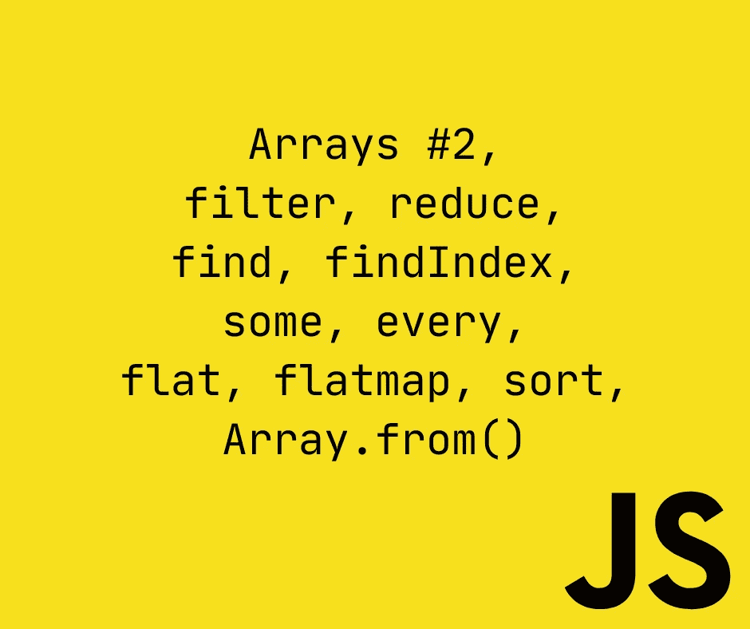
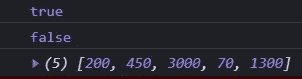
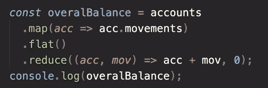
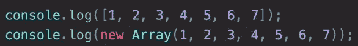
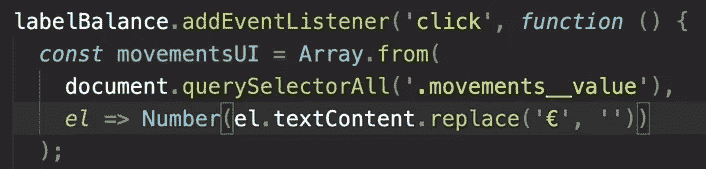

# 完整的 JS Notes #13 🧵阵列

> 原文：<https://blog.devgenius.io/the-complete-js-notes-12-6788b076c65?source=collection_archive---------12----------------------->


由 [Unsplash](https://unsplash.com/s/photos/funny?utm_source=unsplash&utm_medium=referral&utm_content=creditCopyText) 上 [charlesdeluvio](https://unsplash.com/@charlesdeluvio?utm_source=unsplash&utm_medium=referral&utm_content=creditCopyText) 拍摄的照片

*欢迎阅读我的 JavaScript 笔记的下一篇文章。*

*在本文中我们将讨论:* ***数组函数，filter，reduce，find，findIndex，some，every，flat，flatmap，sort，Array.from()***

*所有内容摘自 Jonas Schmedtmann 的惊人课程* [*完整的 JavaScript 课程 2022:从零到专家！*](https://www.udemy.com/course/the-complete-javascript-course/)

请购买课程以了解内容，这只是我对课程的总结笔记。



# 该过滤方法

```
const deposit = movement.filter(function (mov) {return mov > 0;});
```

如果我们用 map()做同样的声明，我们将得到一个布尔数组。

我们可以使用箭头函数

```
const withdrawals = movement.filter(mov => mov < 0);
```

# 该简化方法

最大的区别在于 reduce 方法。因为它带了一个别人没有累加器的参数。它总是成为第一个参数，其他通常的参数都跟随它

我们还必须给累加器一个初始值。在我们的例子中，它是 0

```
const balance = movement.reduce(function (accumulator, current, idx, arr) {return accumulator + current;}, 0);
```

我们也可以使用累加器以一种**性感**的方式找到数组中的最大数字

```
const max = movement.reduce((acc, mov) => (acc < mov ? mov : acc), 0);
```

# 链接方法的魔力

```
const euroToUSD = 1.1;const totalDepositsUSD = movement.filter(mov => mov > 0).map(mov => mov * euroToUSD).reduce((acc, mov) => acc + mov, 0);
```

我们可以把所有这些方法联系在一起

写€的标志=> alt + 0128

使用右边的数字和左边的 alt。

使用链接时有两条规则需要注意

*   链接是昂贵的，如果你有一个使用许多地图的大数组，会降低你的应用程序的速度。你需要在一个 map 调用中优化和做很多事情。
*   你不应该使用改变原始数组的函数，比如 reverse()就是这样一个函数，你不应该使用这种东西。

# 查找方法

```
movements.find((mov) => mov < 0);
```

它的语法类似于 filter。filter 的区别在于 find 方法返回满足条件的第一个元素。

Filter 返回一个新数组，而 find 只返回一个元素

```
const accnt = accounts.find(acc => acc.owner === ‘Jessica Davis’);
```

# 实现登录

```
let currentAccount;btnLogin.addEventListener(‘click’, function (e) {e.preventDefault();currentAccount = accounts.find(account => account.username === inputLoginUsername.value);console.log(currentAccount);});
```

在窗体中总是使用防止默认。

如何使用 js 将不透明度从 0 更改为 1？

```
containerApp.style.opacity = 1;
```

我们可以进行双重赋值，因为赋值是从左到右进行的

```
inputLoginUsername.value = inputLoginPin.value = “”;
```

好了，我们在输入值之后，把输入字段清理干净了。然而，我们的光标仍然有焦点，这看起来很难看，如何避免它？

```
inputLoginPin.blur()
```

htmlElement.blur()从 html 元素中移除焦点

# 实施转移

# 查找索引方法

```
const idx = accounts.findIndex(acc => acc.username === currentAccount.username);
```

它像 find()一样工作，但是它不返回元素，而是返回索引

这个方法和数组方法 **indexOf()** 很像

```
[3, 5, 7, 10].indexOf(3);
```

在这里，indexOf 检查数组中是否存在 3，如果正确，则返回索引。

然而，在 findIndex 中，我们可以在数组中进行更复杂的搜索。

# 如何删除数组中的一个元素？

```
accounts.splice(idx, 1);
```

就这样。

# 一些和所有

```
movement.includes(-130)
```

我们用 includes 来检查数组中的确切元素，但大多数时候我们想检查不同的条件

```
movement.some(mov => mov > 199 && mov < 201)
```

我们可以使用 some 来检查我们想要的所有条件，它会返回一个布尔值。

正如你所能猜到的，每个元素都满足条件

```
movement.every(mov => typeof mov === ‘number’
```

我们可以创建一个函数，并将其用作所有接受返回 true false 的函数的数组方法的回调函数

```
const movement = [200, 450, -400, 3000, -650, -130, 70, 1300];const deposit = movement => movement > 0;console.log(movement.some(deposit));console.log(movement.every(deposit));console.log(movement.filter(deposit));
```



# 平面和平面地图

平面和地图是 ecmaScript 2019 语言中添加的新功能

```
const arr = [[1, 2, 3], [4, 5, [6]], 7, 8];console.log(arr.flat());//returns[1, 2, 3, 4, 5, Array(1), 7, 8]
```

Flat 不处理比默认参数(默认参数为 1)中的第二级更深的数组

要处理更深的数组，请更改参数

```
console.log(arr.flat(2));//returns[1, 2, 3, 4, 5, 6, 7, 8]
```

假设我们想把所有账户的所有变动相加，然后求和，该怎么做呢？

1.  使用 map 并制作一个数组的数组
2.  使用平板，形成一个大阵列
3.  使用 reduce 并进行求和



实际上，使用贴图然后扁平化是很常见的，他们为此做了一个特殊的数组方法，这比使用贴图和扁平化更有效

```
const overall = accounts.flatMap(acc => acc.movements).reduce((acc, value) => acc + value, 0);
```

它和地图一样，实际上只是在最后的单位。

请注意，平面地图只能深入 1 层。

# 排序数组

```
//stringsconst arr = [‘b’, ‘d’, ‘c’, ‘a’];console.log(arr.sort());console.log(arr); — — — — — — — — -[“a”, “b”, “c”, “d”][“a”, “b”, “c”, “d”]
```

我们在使用 sort 时需要小心，因为它**改变了**原始数组。

```
//numbersconst movement = [200, 450, -400, 3000, -650, -130, 70, 1300];console.log(movement);console.log(movement.sort()); — — — — — — — — — — -[200, 450, -400, 3000, -650, -130, 70, 1300][-130, -400, -650, 1300, 200, 3000, 450, 70]
```

看起来根本没排序。事实上，的确如此，但方式不同。

默认情况下，sort 方法只对字符串进行排序，所以这里它将元素返回给字符串，然后对其进行排序。

如果你想对数字进行排序，你必须使用回调函数

```
console.log(movement);// return < 0, [a, b] keeps the order// return > 0, [b, a] switchesmovement.sort((a, b) => {if (a > b) return 1;if (b > a) return -1;});console.log(movement); — — — — — — — — — — — -[200, 450, -400, 3000, -650, -130, 70, 1300][-650, -400, -130, 70, 200, 450, 1300, 3000]
```

有用！所以我们在这里做的是:

sort 方法有一个接受 2 个参数的回调函数，这些参数表示 a:一个元素，b:a 元素旁边的一个元素

如果排序回调方法返回的结果是负数，这意味着您应该保持顺序

如果返回值是正的，这意味着您应该切换它并寻找下一个元素。

这样的工作只是他妈的排序。

如果我们想按降序排序，我们需要做的就是改变 1。

```
movement.sort((a, b) => {if (a > b) return -1;if (b > a) return 1;});
```

这也适用于琴弦。

在简单数学的帮助下，我们可以使这个操作变得非常简单

如果 a 大于 b，这意味着 a-b 总是正的，我们可以用这个返回正的值。

```
movement.sort((a, b) => a — b); — — — — — — [-650, -400, -130, 70, 200, 450, 1300, 3000]
```

通过一个简单的符号开关，我们也可以进行降序排列

```
movement.sort((a, b) => -a + b); — — — — — — — [3000, 1300, 450, 200, 70, -130, -400, -650]
```

# 创建和填充数组的更多方法

到目前为止，我们已经学会了创建这样的数组:



你认为这个数组会返回什么:

```
const a = new Array(7); — — — — — — — — — — — [empty × 7]
```

您可能希望使用 map 等方法用值填充这个数组。然而它不允许

```
console.log(a.map(() => 5)); — — — — — — — — — — — — [empty × 7]
```

除了一个重要的方法之外，它对任何事情都没有用:

```
a.fill(13);
```

但是我们可以做更多的事情，我们可以用一个数字来填充它，就像用切片法一样

```
a.fill(1, 3); — — — — — — — [empty × 3, 1, 1, 1, 1]alsoa.fill(1, 3, 5);
```

我们甚至可以对非空数组使用 fill 方法

```
const arr = [1, 2, 3, 4, 5, 6];arr.fill(23, 3, 5); — — — — — — — — -[1, 2, 3, 23, 23, 6]
```

还有一种方法是创建一个空数组并填充它。

它叫做 **Array.from()**

```
const y = Array.from({ length: 7 }, () => 1);console.log(y); — — — — — — — -[1, 1, 1, 1, 1, 1, 1]
```

我们可以像使用 map()一样使用的回调函数

```
const z = Array.from({ length: 7 }, (current, idx) => idx + 1);console.log(z); — — — — — — — [1, 2, 3, 4, 5, 6, 7]
```

**我们可以使用丢弃参数，以便其他程序员能够理解它**

```
const z = Array.from({ length: 7 }, (_, idx) => idx + 1);
```

**这个 Array.from 结构实际上是为了将不同的 iterables 转换成数组，这样他们就可以使用 Array 方法。**

**对于集合和映射，很容易说和做，但是对于节点数组，例如，我们需要这个方法。**

****

**[*见本 js 注释线程第一条！*](https://medium.com/@barisbll/the-complete-js-notes-1-36ea76e326b3)**

**[*见本 js 注释线程前一篇！*](/the-complete-js-notes-11-d9df3de726ed)**

**[*参见本 js 笔记的下一篇帖子！*](https://medium.com/@barisbll/the-complete-js-notes-14-numbers-33fa369fbb77)**

**[*在推特上关注我的甜蜜内容*](https://twitter.com/barisbll_dev) 😘**

***阅读我和许多其他伟大的科技博客在* [*开发天才*](https://blog.devgenius.io/)**