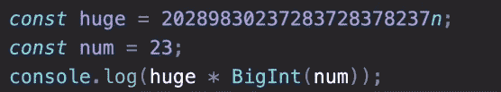

# 完整的 JS 注释#14 🧵数字

> 原文：<https://blog.devgenius.io/the-complete-js-notes-14-numbers-33fa369fbb77?source=collection_archive---------22----------------------->


[贾里德·赖斯](https://unsplash.com/@jareddrice?utm_source=unsplash&utm_medium=referral&utm_content=creditCopyText)在 [Unsplash](https://unsplash.com/s/photos/funny?utm_source=unsplash&utm_medium=referral&utm_content=creditCopyText) 上的照片

*欢迎阅读我的 JavaScript 笔记的下一篇文章。*

*在本文中我们将讨论:* ***JavaScript 数字***

*所有内容摘自 Jonas Schmedtmann 的惊人课程* [*完整的 JavaScript 课程 2022:从零到专家！*](https://www.udemy.com/course/the-complete-javascript-course/)

请购买课程以了解内容，这只是我对课程的总结笔记。


# 转换和检查数字

在 js 中，每个数字都在内部转换成浮点数

```
console.log(23 === 23.0); //true
```

之后，它们在内部被转换成二进制

就像 python js 在表示浮点数方面有问题一样，所以记住你不能通过 js 进行科学计算

```
cl(0.1 + 0.2 === 0.3); // false
```

我们都知道如何将一个字符串转换成数字(Number("15 "))。然而，有一种更简单的方法

```
+”15"; // automatically converts the string to number+(“15”); // also valid
```

解析类似于将字符串转换成数字，但更好。JS 会自动理解其中的数字，并删除所有不必要的符号。

注意，只有当字符串以数字开头时，它才有效

```
console.log(Number.parseInt(‘30px’)); // 30console.log(Number.parseInt(‘e32’)); // NaN
```

parseInt()有第二个参数叫做 **redix** 这基本上是我们使用的数字系统，比如十进制 10 或二进制 2

```
console.log(Number.parseInt(‘30’, 16)); // 48console.log(Number.parseInt(‘32’, 2)); // NaN it doesn’t work for binary I don’t know why?
```

我们可以看到 parceFloat 和 parceInt 之间的区别

```
console.log(Number.parseFloat(‘ 2.5rem ‘)); // 2.5console.log(Number.parseInt(‘ 2.5rem ‘)); // 2console.log(parseFloat(‘ 2.5rem ‘)); // These functions are global so can be written like that however this is old school way of writing functions Number part is called namespace and it is encouraged to use that
```

isNaN 如何使用它？

```
console.log(Number.isNaN(2.5)); // falseconsole.log(Number.isNaN(‘2’)); // falseconsole.log(Number.isNaN(‘20x’)); // falseconsole.log(Number.isNaN(+’20x’)); // true
```

有趣的是，即使字符串也不叫 NaN，只有当你试图把它们转换成数字时，它们才是 NaN，所以你不能用它来检查用户输入的值是否是数字，

但是您可以先转换成数字，然后检查这是否是一个 NaN

无限和伊斯南？

```
console.log(23 / 0); // Infinityconsole.log(Number.isNaN(23 / 0)); // false
```

**检查数字的最佳方式= isFinite()**

```
console.log(Number.isFinite(2)); // trueconsole.log(Number.isFinite(‘2’)); // falseconsole.log(Number.isFinite(+’2X’)); // falseconsole.log(Number.isFinite(2 / 0)); // false
```

所以只使用 isNaN 来检查数字的类型是否是 isNaN。否则**总是**使用 **isFinite()**

# 数学和舍入

```
console.log(Math.sqrt(25)); // 5console.log(25 ** (1 / 2)); // 5console.log(8 ** (1 / 3)); // 2console.log(Math.max(2, 5, 23)); // 23console.log(Math.max(2, 5, ‘23’)); // 23 Does the conversionconsole.log(Math.max(2, 5, ‘23x’)); // NaN But doesn’t make the parsingconsole.log(Math.min(2, 5, 23)); // 2console.log(Math.PI); // 3.141592653589793console.log(Math.round(23.3)); // 23console.log(Math.round(23.9)); // 24console.log(Math.round(23.5)); // 24console.log(Math.round(-23.5)); // -23console.log(Math.ceil(23.3)); // 24console.log(Math.ceil(23.9)); // 24console.log(Math.floor(23.3)); // 23console.log(Math.floor(23.9)); // 23
```

floor 比 trunc 好，因为不管我们用负数还是正数，它总是把数字转换成最大的小整数。(是的，我以前是反过来说的)

```
console.log((2.7).toFixed(0)); // 2.7console.log((2.7).toFixed(3)); // 2.700console.log((2.345).toFixed(2)); // 2.34console.log(+(2.345).toFixed(2)); // 2.34 toFixed() always returns a string
```

但是这些数字是原始值，原始值没有对象。这里 js 在幕后制作**拳击**。它将自己转换成一个对象，并在一切完成后返回到一个原语。

# 余数运算符

% ->余数运算符(rimayndı)

# 使用 BigInt

BigInt 是 ES2020 中引入的一种特殊类型的整数

对于每个数字，我们都有一个 64 位的位置来存储一个数字，其中只有 53 位实际上代表数字，其他的代表正负符号，并放置小数

如果只有 53 位来存储一个数，这意味着该数的大小是有限的

所以这是 js 可以表示的最大数字

```
console.log(2 ** 53–1); // -1 because starts from 0// 9007199254740991
```

这个数字也被保存为一个特殊的关键

```
console.log(Number.MAX_SAFE_INTEGER);console.log(2 ** 53–1); // 9007199254740991console.log(2 ** 53 + 0); // 9007199254740992console.log(2 ** 53 + 1); // 9007199254740992console.log(2 ** 53 + 2); // 9007199254740994
```

正如你所看到的，我们把 0 和 1 相加，但是得到了相同的结果，这意味着 js 不能给出准确的结果

这些 num 被称为不安全的数字，有时它们会显示正确的值，但那是因为 js 在幕后做了一些手脚

我们用“n”符号构建 bigints。

console . log(347893843289347893)；// 347893843289347900 基本上打错了

console . log(347893843289347893n)；// 347893843289347893n BigInt

console . log(BigInt(347893843289347893))；//347893843289347904n 打错了！不要使用大 int 构造函数，' n '更安全

我们可以使用 bigints 之间的所有算术运算


如果需要，可以使用构造函数



比较运算符欺骗了可以使用它们的系统

我们可以粗略地比较这些元素(==)


```
cl(10n / 3n); // Returns 3n
```

对于除法，它不像正常数那样工作。

[*见本 js 笔记线程第一篇！*](https://medium.com/@barisbll/the-complete-js-notes-1-36ea76e326b3)

[*见本 js 笔记的上一篇帖子！*](https://medium.com/p/6788b076c65#8bcc-40b0449c9047)

[*见本 js 笔记线程下篇！*](https://medium.com/@barisbll/the-complete-js-notes-15-dates-f87b415eeadb)

[*在 twitter 上关注我获取甜蜜内容*](https://twitter.com/barisbll_dev) 😘

*在*[*Dev Genius*](https://blog.devgenius.io/)阅读我和许多其他伟大的科技博客作者