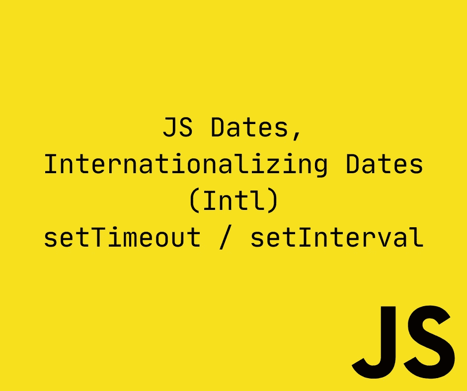
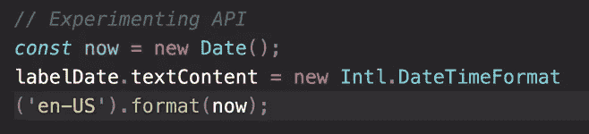
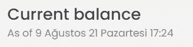
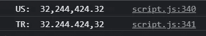
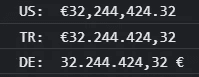

# 完整的 JS 注释#15 🧵日期

> 原文：<https://blog.devgenius.io/the-complete-js-notes-15-dates-f87b415eeadb?source=collection_archive---------8----------------------->


安德里·列昂诺夫在 [Unsplash](https://unsplash.com/s/photos/funny?utm_source=unsplash&utm_medium=referral&utm_content=creditCopyText) 上的照片

*欢迎阅读我的 JavaScript 笔记的下一篇文章。*

*在本文中我们将讨论:* ***JavaScript 日期、国际化日期(Intl)、setTimeout/setInterval***

*所有内容摘自 Jonas Schmedtmann 的惊人课程* [*完整的 JavaScript 课程 2022:从零到专家！*](https://www.udemy.com/course/the-complete-javascript-course/)

请购买课程以了解内容，这只是我对课程的总结笔记。



# 创建日期

创建新日期有 4 种方法

```
const date1 = new Date();console.log(date1); // Sat Aug 07 2021 17:09:39 GMT+0300 (GMT+03:00)
```

我们可以解析日期字符串并将它们转换成日期对象

```
const date2 = new Date(‘Aug 07 2021 17:09:39’); 
// Sat Aug 07 2021 17:09:39 GMT+0300 (GMT+03:00)const date3 = new Date(‘December 24 2015’); 
//Thu Dec 24 2015 00:00:00 GMT+0200
```

它甚至能计算出星期几。Js 在这方面很聪明。但是最好还是使用 js 创建的日期字符串。

世界时区

```
const date3 = new Date(‘2019–11–18T21:31:17.178Z’);
```

以 Z 结尾的日期字符串表示世界时区，所以无论你在世界的哪个地方，这个时区都不会改变..

```
const date = new Date(2037, 10, 3, 15, 24, 59); // Tue Nov 03 2037 15:24:59 GMT+0300 (GMT+03:00)console.log(date);
```

当心欧洲订单年月日

11 月是第 11 个月，但我在这个月超过了 10，这是因为 js 开始从 0 开始计算月份，是的，我知道

Js 也自动更正我们的错误，比如说我们想把 11 月 33 日

```
const date = new Date(2037, 10, 33); // Thu Dec 03 2037 00:00:00 GMT+0300 (GMT+03:00)console.log(date);
```

它会自动移到下个月

我们还可以传递从初始 UNIX 时间开始的毫秒数

这个构造函数其实挺有用的。尽管看起来不像。

日期是一种对象类型，和 JS 中的所有对象一样，它也有自己的方法。

```
const future = new Date(2037, 1, 25, 17, 0, 0);console.log(future.getFullYear()); <- Always use getFullYear() not getYear()console.log(future.getMonth());console.log(future.getDate()); <- Day of monthconsole.log(future.getDay()); <- Day of weekconsole.log(future.getHours());console.log(future.getMinutes());console.log(future.getSeconds());console.log(future.getMilliseconds());console.log(future.toISOString()); // 2037–02–25T14:00:00.000Zconsole.log(future.getTime()); // 2119183200000 <- time passed since UNIX time startconsole.log(new Date(2119183200000)); // Wed Feb 25 2037 17:00:00 GMT+0300 (GMT+03:00)
```

所有这些方法都有 setters

```
cl(future.setFullYear(2040));
```

# 添加日期

```
// How to display date as dd/mm/yy hh:mimiconst now = new Date();const day = now.getDate();const month = now.getMonth() + 1;const year = now.getFullYear();const hour = now.getHours();const min = now.getMinutes();labelDate.textContent = `${day}/${month}/${year}, ${hour}:${min}`;
```

如果日期是 1 位数，我们通常在开头写 0

```
const day = `${now.getDate()}`.padStart(2, 0);const month = `${now.getMonth() + 1}`.padStart(2, 0);
```

# 有日期的操作

```
const future = new Date(2037, 1, 25, 17, 0, 0);console.log(+future); // A big num
```

这意味着我们可以将日期转换成数字，并用它们进行运算

```
const future = new Date(2037, 1, 25, 17, 0, 0);console.log(+future);const calcDaysPassed = (date1, date2) =>Math.abs(date1 — date2) / (1000 * 60 * 60 * 24);console.log(calcDaysPassed(future, Date.now())); 
// Date.now() gives that moment without creating a date object
```

# 让日期看起来对人类来说很熟悉

```
const formatMovementDate = date => {const calcDaysPassed = (date1, date2) =>Math.floor(Math.abs(date1 — date2) / (1000 * 60 * 60 * 24));const daysPassed = calcDaysPassed(date, Date.now());const daysPassedStr = daysPassed => `${daysPassed} days ago.`;if (daysPassed === 0) return `Today`;else if (daysPassed === 1) return `Yesterday`;else if (daysPassed > 1 && daysPassed < 7) return daysPassedStr(daysPassed);else {const day = `${date.getDate()}`.padStart(2, 0);const month = `${date.getMonth() + 1}`.padStart(2, 0);const year = date.getFullYear();return `${day}/${month}/${year}`;}};
```

# 国际化日期(国际)

JS 有一个新的内部化 API，使得显示世界各地时间的日期变得简单。



首先是语言和国家，然后是要格式化的日期对象。这会以字符串形式返回 2021 年 9 月 8 日。

```
//Experimenting the APIconst now = new Date();labelDate.textContent = Intl.DateTimeFormat(‘tr-TR’).format(now); // 09.08.2021
```

检查你的内容的正确代码谷歌“ISO 语言代码”

这种情况总是持续到今天、月、年吗？

不要！我们可以让它显示我们想要的任何格式，为此我们必须创建一个选项对象，在该对象中，我们需要定义选项。

```
const now = new Date();const options = {year: ‘2-digit’,month: ‘long’,day: ‘numeric’,weekday: ‘long’,hour: ‘numeric’,minute: ‘numeric’,};labelDate.textContent = Intl.DateTimeFormat(‘tr-TR’, options).format(now);
```

一些选项可以采用不同的参数=(两位数、数字、长、短、箭头)



显示土耳其语示例

将语言硬编码到应用程序中并不是一个好的做法。你可以从浏览器上下载

```
const locale = navigator.language;labelDate.textContent = Intl.DateTimeFormat(locale, options).format(now);
```

# 号码国际化(国际)

```
const num = 32244424.32;console.log(‘US: ‘, Intl.NumberFormat(‘en-US’).format(num));console.log(‘TR: ‘, Intl.NumberFormat(‘tr-TR’).format(num));
```



```
const options2 = {style: ‘unit’,unit: ‘mile-per-hour’,};console.log(‘US: ‘, Intl.NumberFormat(‘en-US’, options2).format(num));console.log(‘TR: ‘, Intl.NumberFormat(‘tr-TR’, options2).format(num));console.log(‘DE: ‘, Intl.NumberFormat(‘de-DE’, options2).format(num));
```



# 定时器设置超时和设置间隔

```
setTimeout runs only once while setInterval runs until we stop itsetTimeout(() => console.log(‘Here is your pizza’), 3000);How to pass parameters to the callback function?setTimeout((ing1, ing2) => console.log(`Here is your pizza with ${ing1} and ${ing2}`),3000,‘spinach’,‘olives’);
```

我们可以在它结束前中断超时

```
const ingredients = [‘spinach’, ‘olives’];const pizzaTimer = setTimeout((ing1, ing2) => console.log(`Here is your pizza with ${ing1} and ${ing2}`),3000,…ingredients);if (ingredients.includes(‘spinach’)) clearTimeout(pizzaTimer);setInterval runs always between a specific time stamp until we stop itsetInterval(() => {console.log(new Date());}, 1000);
```

要删除间隔，我们使用 clear。我们也可以在区间内使用 clearInterval

```
const startLogOutTimer = function () {let time = 100;let min = Math.floor(time / 60);let sec = time % 60;const timer = setInterval(() => {min = String(Math.floor(time / 60)).padStart(2, 0);sec = String(time % 60).padStart(2, 0);labelTimer.textContent = `${min}:${sec}`;time — ;if (time === 0) clearInterval(timer);}, 1000);};
```

我们有一个问题，但是我们的间隔开始后 1 秒钟。但是我们不希望它立即开始，我们使用函数调用技巧。

```
const startLogOutTimer = function () {let time = 10 * 60;let min = Math.floor(time / 60);let sec = time % 60;const tick = () => {min = String(Math.floor(time / 60)).padStart(2, 0);sec = String(time % 60).padStart(2, 0);labelTimer.textContent = `${min}:${sec}`;time — ;if (time === 0) {clearInterval(timer);containerApp.style.opacity = ‘0’;labelWelcome.textContent = ‘Log in to get started’;}};tick();const timer = setInterval(tick, 1000);};
```

此外，我们的显示屏在 1 秒钟内消失了，我们不希望这种情况发生。如何避免？在减少时间之前，只需检查时间是否为 0。

我们现在有一个大问题，当我去找另一个客户时，比如杰西卡·戴维斯。另一个计时器正在创建，运行速度提高了 2 倍。如何避免。

首先，我们需要创建一个全局时间变量来存储计时器，然后我们需要从 interval 函数中返回计时器，最后每当用户登录时，我们需要检查计时器是否存在，如果存在，则删除它并创建一个新的计时器

```
const startLogOutTimer = function () {…return timer;};let timer;btnLogin.addEventListener(‘click’, function (e) {…//Start the timerif (timer) clearInterval(timer);timer = startLogOutTimer();}});
```

[*见本 js 笔记线程第一篇！*](https://medium.com/@barisbll/the-complete-js-notes-1-36ea76e326b3)

[*见本 js 笔记的上一篇帖子！*](https://medium.com/@barisbll/the-complete-js-notes-14-numbers-33fa369fbb77)

[*见本 js 笔记线程下篇！*](https://medium.com/@barisbll/the-complete-js-notes-16-dom-1-cc5c1c47086d)

[*在 twitter 上关注我获取甜蜜内容*](https://twitter.com/barisbll_dev) 😘

*在*[*Dev Genius*](https://blog.devgenius.io/)阅读我和许多其他伟大的科技博客作者