# 完整的 JS 注释#17 🧵 DOM #2

> 原文：<https://blog.devgenius.io/the-complete-js-notes-17-dom-2-efdaf05e7d05?source=collection_archive---------14----------------------->

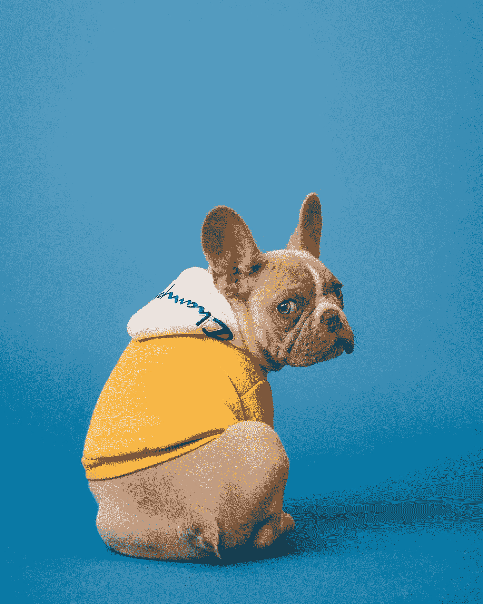

由 [Unsplash](https://unsplash.com/s/photos/animals?utm_source=unsplash&utm_medium=referral&utm_content=creditCopyText) 上的 [Karsten Winegeart](https://unsplash.com/@karsten116?utm_source=unsplash&utm_medium=referral&utm_content=creditCopyText) 拍摄

*欢迎阅读我的 JavaScript 笔记的下一篇文章。*

*在本文中我们将讨论:* ***平滑滚动、事件和事件处理程序、事件传播***

*所有内容摘自 Jonas Schmedtmann 的惊人课程* [*完整的 JavaScript 课程 2022:从零到专家！*](https://www.udemy.com/course/the-complete-javascript-course/)

请购买课程以了解内容，这只是我对课程的总结笔记。

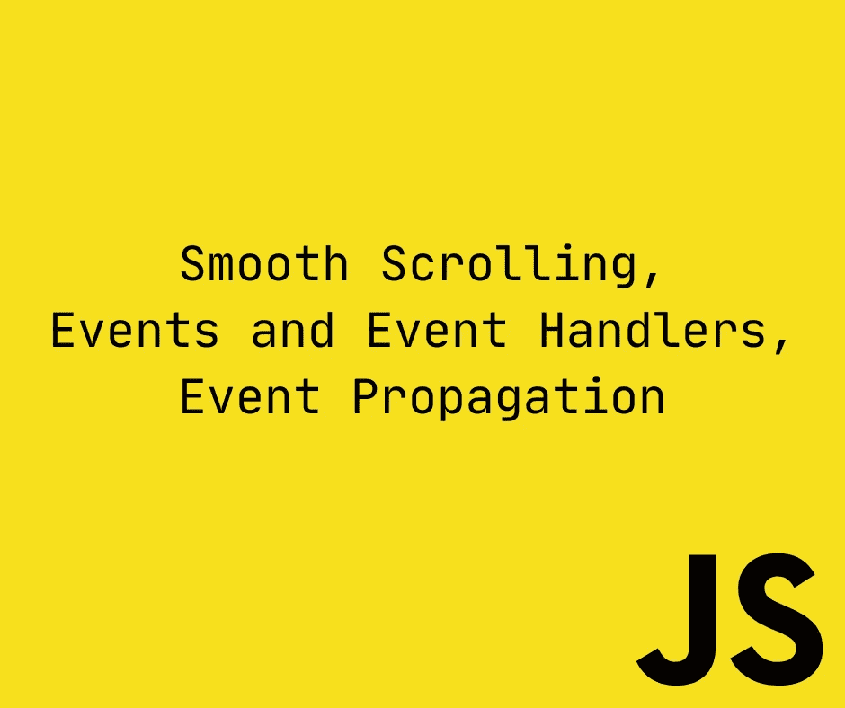

# 实现平滑滚动

我们将实现这样的 UI 效果，当我们点击一个按钮时，我们的页面平滑地滚动到那里

首先，我们需要获得想要去的部分的坐标。

```
const buttonScrollTo = document.querySelector(‘.btn — scroll-to’);const section1 = document.querySelector(‘#section — 1’);buttonScrollTo.addEventListener(‘click’, function (e) {const s1coords = section1.getBoundingClientRect(); <- Returns DOMRect objectconsole.log(s1coords);console.log(e.target.getBoundingClientRect()); <- e.target is the element being clicked});
```

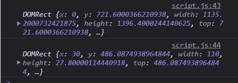

当我们再次滚动并点击时，y 值发生变化。所以 getBoundingClientRect()是相对于屏幕快照的。

# 当前滚动

```
console.log(‘Current scroll (X/Y)’, window.pageXOffset, pageYOffset);
```

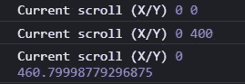

# 查看屏幕宽度和高度

```
buttonScrollTo.addEventListener(‘click’, function (e) {const s1coords = section1.getBoundingClientRect();console.log(‘height/width of viewport’,document.documentElement.clientHeight,document.documentElement.clientWidth);});
```

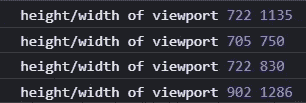

# 卷动

```
buttonScrollTo.addEventListener(‘click’, function (e) {const s1coords = section1.getBoundingClientRect();//Scrollingwindow.scrollTo(s1coords.left, s1coords.top);});
```

这种方法有它的问题，只有当我们在页面的最顶端时才有效。因为 getBoundingClientRect() top 和 left 是相对的，当我们稍微滚动时，top 和 left 将是较小的值。这是一个巨大的问题。

```
buttonScrollTo.addEventListener(‘click’, function (e) {const s1coords = section1.getBoundingClientRect();//Scrollingwindow.scrollTo(s1coords.left + window.pageXOffset,s1coords.top + window.pageYOffset);});
```

使用 pageX 和 pageY 偏移，我们总是在正确的位置绘制它。

到目前为止，一切顺利，这不是这项工作最酷的部分

```
window.scrollTo({left: s1coords.left + window.pageXOffset,top: s1coords.top + window.pageYOffset,behavior: ‘smooth’,});
```

有一个超级新的功能使所有这些工作变得非常简单

```
section1.scrollIntoView({ behavior: ‘smooth’ });
```

# 事件和事件处理程序的类型

# 鼠标进入事件监听器

```
const h1 = document.querySelector(‘h1’);h1.addEventListener(‘mouseenter’, function (e) {window.alert(‘Great you are reading a header’);});We cal also use it like:h1.onmouseenter = function (e) {window.alert(‘Great you are reading a header’);};
```

对于每个事件，我们在 html 元素中都有 onevent 属性。例如 Onclick 是最常用的一个。

然而，我们不应该使用它们。这是老派的 js。始终使用 addEventListener

# 1 次事件监听

我们不必为整个时间设置一个事件监听器，我们可以只设置一次。

```
const h1 = document.querySelector(‘h1’);const alertH1 = function (e) {window.alert(‘Great you are reading a header’);h1.removeEventListener(‘mouseenter’, alertH1);};h1.addEventListener(‘mouseenter’, alertH1);
```

我们不需要在制作 1 次后移除它，因为我们可以随时随地移除它。

```
setTimeout(() => h1.removeEventListener(‘mouseenter’, alertH1), 3000);
```

# Html 事件侦听器

还有一种编写事件侦听器的糟糕方法，这是一种非常糟糕的做法

```
<h1 onclick=”alert(‘HTML alert’)”>
```

这是来自老学校的 js 天，不要使用它。

# 事件传播冒泡和捕获

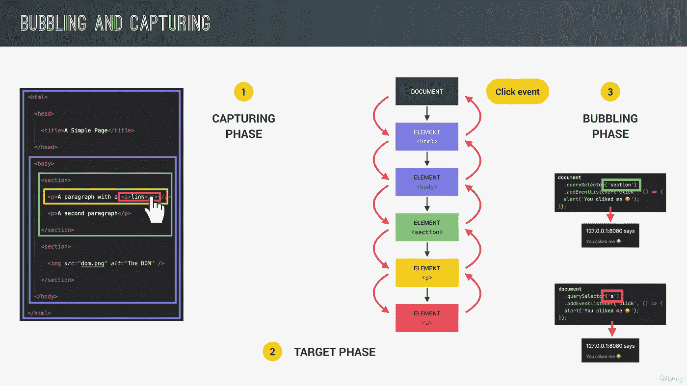

# 实践中的事件传播

假设我们内部有 3 个元素的事件侦听器

```
document.querySelector(‘.nav__link’).addEventListener(‘click’, function (e) {this.style.backgroundColor = randomColor();});document.querySelector(‘.nav__links’).addEventListener(‘click’, function (e) {this.style.backgroundColor = randomColor();});document.querySelector(‘.nav’).addEventListener(‘click’, function (e) {this.style.backgroundColor = randomColor();});
```

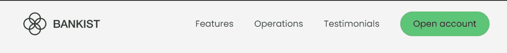

当我们点击最外面的容器时，就会发生这种情况

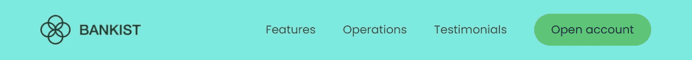

我们重置并点击最深的元素，这种情况会发生


发生这种情况是因为当事件发生时，根从最大的父节点到最小的子节点，但是它们的事件监听器没有捕捉到它。

事件侦听器在冒泡期间捕获事件。

为了证明这一点，让我们稍微修改一下代码

```
document.querySelector(‘.nav__link’).addEventListener(‘click’, function (e) {this.style.backgroundColor = randomColor();console.log(‘Feature’, e.target);});document.querySelector(‘.nav__links’).addEventListener(‘click’, function (e) {this.style.backgroundColor = randomColor();console.log(‘Feature Container’, e.target);});document.querySelector(‘.nav’).addEventListener(‘click’, function (e) {this.style.backgroundColor = randomColor();console.log(‘Navbar’, e.target);});
```

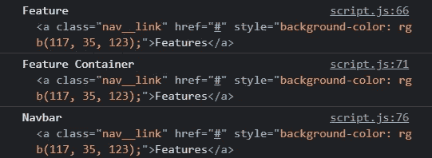

这里有两点需要注意

*   特征是第一个被触发的，所以父级的事件捕获发生在冒泡期间
*   相同的事件传递给所有的 eventListeners

我们也有一个事件属性来具体说明这一点: **event.currentTarget**

```
document.querySelector(‘.nav__link’).addEventListener(‘click’, function (e) {this.style.backgroundColor = randomColor();console.log(‘Feature’, e.target, e.currentTarget);});document.querySelector(‘.nav__links’).addEventListener(‘click’, function (e) {this.style.backgroundColor = randomColor();console.log(‘Feature Container’, e.target, e.currentTarget);});document.querySelector(‘.nav’).addEventListener(‘click’, function (e) {this.style.backgroundColor = randomColor();console.log(‘Navbar’, e.target, e.currentTarget);});
```

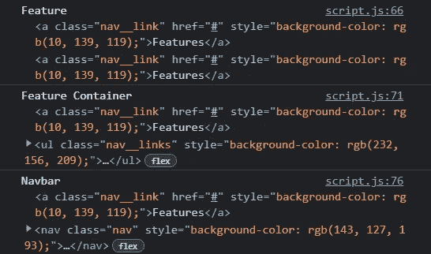

这仅仅意味着

```
event.currentTarget === this; // true
```

# 停止事件传播

还有一种方法可以阻止此事件传播。到焦点元素:

```
document.querySelector(‘.nav__link’).addEventListener(‘click’, function (e) {this.style.backgroundColor = randomColor();e.stopPropagation(); <- Stops the propagation});document.querySelector(‘.nav__links’).addEventListener(‘click’, function (e) {this.style.backgroundColor = randomColor();});document.querySelector(‘.nav’).addEventListener(‘click’, function (e) {this.style.backgroundColor = randomColor();});
```

我们可以做到，但不应该。这在存在大量事件监听器的大型应用程序中有时非常重要。否则最好不要使用它。

默认情况下，冒泡阶段是寻找事件的阶段，捕获阶段不会做很多事情，但我们可以改变它。

如果我们将第三个参数放入事件侦听器中，它将开始在捕获阶段寻找事件

```
document.querySelector(‘.nav__link’).addEventListener(‘click’, function (e) {this.style.backgroundColor = randomColor();console.log(‘Feature’);});document.querySelector(‘.nav__links’).addEventListener(‘click’, function (e) {this.style.backgroundColor = randomColor();console.log(‘Feature Container’);});document.querySelector(‘.nav’).addEventListener(‘click’,function (e) {this.style.backgroundColor = randomColor();console.log(‘Navbar’);},true
```

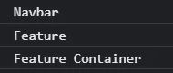

现在 navbar 是第一个触发 eventListener 的。

今天 2 个阶段存在的唯一原因是历史原因。

[*见本 js 笔记第一篇帖子！*](https://medium.com/@barisbll/the-complete-js-notes-1-36ea76e326b3)

[*见本 js 笔记线程的上一篇文章！*](https://medium.com/@barisbll/the-complete-js-notes-16-dom-1-cc5c1c47086d)

[*在 twitter 上关注我获取甜蜜内容*](https://twitter.com/barisbll_dev) 😘

*在*[*Dev Genius*](https://blog.devgenius.io/)阅读我和许多其他伟大的科技博客作者