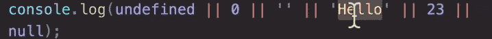
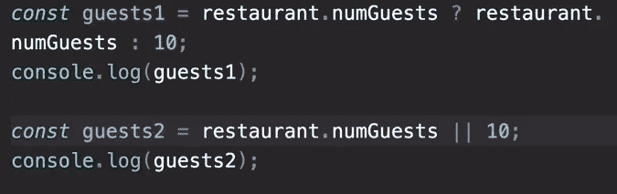
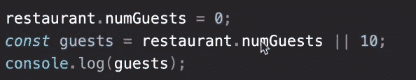

# 完整的 JS 注释#7 🧵

> 原文：<https://blog.devgenius.io/the-complete-js-notes-7-d21d5e26e405?source=collection_archive---------15----------------------->

欢迎阅读我的 JavaScript 笔记的下一篇文章。

*在本文中我们将讨论:* ***Rest 模式和参数，短路和无效合并运算符***

*所有内容摘自 Jonas Schmedtmann 的惊人课程* [*完整的 JavaScript 课程 2022:从零到专家！*](https://www.udemy.com/course/the-complete-javascript-course/)

*请购买课程以了解内容，这只是我对课程的总结笔记。*


```
//Spread operator because on the RIGHT side of the assignment operator
const arr = [1, 2, …[3, 4]];//REST because on the LEFT side of the operator
const [a, b, …others] = [1, 2, 3, 4, 5];
```

Rest 运算符被称为 rest，因为它是 exp 数组的剩余部分

Rest 操作符总是必须在集合的末尾使用，否则 js 不知道什么时候结束

```
const [pizza, , risotto, …others, bread] = […restaurant.mainMenu, …restaurant.starterMenu];// It returns an error rest must be the last element
```

因此，每个集合只能有一个 rest 运算符。

就像扩展操作符一样，我们可以在对象中使用 rest

```
const { saturday, …weekdays } = restaurant.workingDays;
```

# 使用 rest 作为参数

```
const manyParameters = (…nums) => { //Rest operator
cl(nums)
}manyParameters(2,3,4);manyParameters(5,6,23,555,12,43);parameters = [5,6,23,555,12,43];manyParameters(…parameters); //Spread operator
```

这些函数返回一个参数数组

在使用 rest 之前，我们可以指定几个参数

```
const degree = (centigrad, …others) => {…}degree(true, 27, 0.86);degree(false, 112, 0.90);
```

# 短路&&，||

关于逻辑运算符，有三件事需要了解

*   他们可以使用任何数据类型
*   它们可以返回任何数据类型
*   他们可以使用短路

or 运算符的短路是:

如果第一个值是真值，Js 甚至不会查看第二个操作符，它会立即返回第一个值

```
cl(3 || ‘Jonas’); // Prints 3cl( ‘’ || ‘Jonas’ ) // Jonascl( true || 0 ) // truecl( undefined || null ) // null
```

在最后一个例子中，它们都是假的，但它返回第二个。



返回“你好”



在这里，他们俩做着同样的工作。所以短路 or 就像三元手术。

And 运算符是 or 的反义词

```
cl( 0 && ‘Jonas’ ) // 0cl ( 7 && ‘Jonas’ ) // Jonas
```

现在举一个实际的例子

```
// Practical Exampleif(restaurant.orderPizza) {restaurant.orderPizza(spinach, mushroom)}restaurant.orderPizza && restaurant.orderPizza(spinach, mushroom) // Best practice
```

你不应该用短路来改变你所有的 if 语句，因为这会使你的代码很难阅读。

# 零融合算子



在这个例子中，即使我们有 0 个客人，它也将是假的，并给控制台 10

```
const guestCorrect = restaurant.numGuests ?? 10;cl(guestCorrect);
```

这个操作符只寻找空值，比如(undefined 和 null ),否则它接受值为 true。

[*见本 js 笔记线程第一篇！*](https://medium.com/@barisbll/the-complete-js-notes-1-36ea76e326b3)

[*见本 js 笔记的上一篇帖子！*](/the-complete-js-notes-6-8cd7ed08a2cc)

[*见本 js 笔记线程下篇！*](https://medium.com/@barisbll/the-complete-js-notes-8-7646d3ccf2e9)

[*在 twitter 上关注我*](https://twitter.com/barisbll_dev) 💣🔥

*在*[*Dev Genius*](https://blog.devgenius.io/)中阅读我和许多其他伟大的科技博客作者