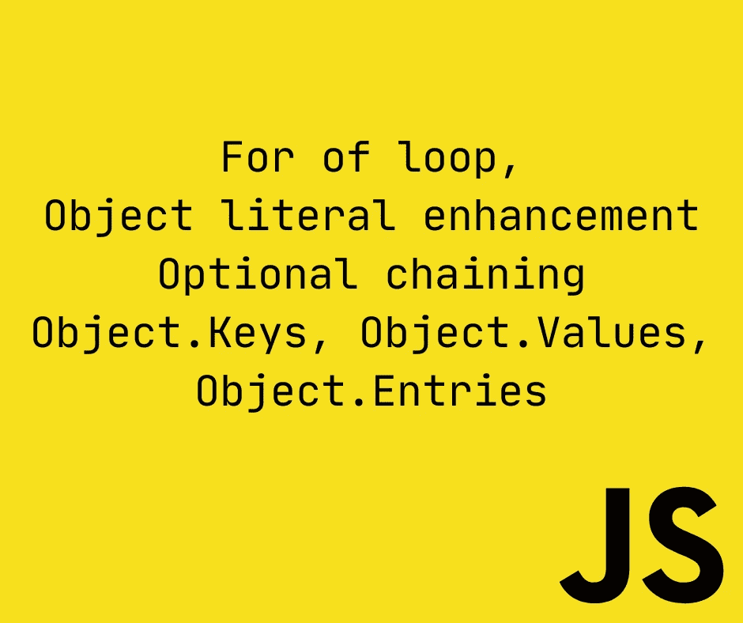
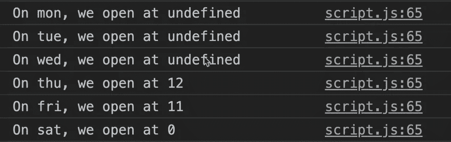
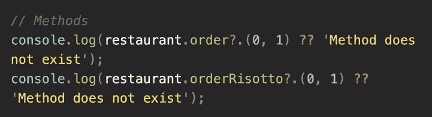

# 完整的 JS 注释#8 🧵

> 原文：<https://blog.devgenius.io/the-complete-js-notes-8-7646d3ccf2e9?source=collection_archive---------13----------------------->

欢迎阅读我的 JavaScript 笔记的下一篇文章。

*在本文中我们将谈到:* ***For 循环，对象文字增强，可选链接，对象。钥匙，物体。值，对象。条目***

*所有内容摘自 Jonas Schmedtmann 的惊人课程* [*完整的 JavaScript 课程 2022:从零到专家！*](https://www.udemy.com/course/the-complete-javascript-course/)

*请购买课程以了解内容，这只是我对课程的总结笔记。*



# For of 循环

```
for (const item of menu) cl(item);
```

它在语法上看起来类似于 python 的 for each

好在在这个 for 循环中，我们仍然可以使用 continue 和 break。

我们如何在循环时找到这些元素的索引

```
for (const item of menu.entries()) cl(item);//Entries is an array function it returns index and value of the element//This would print// [0, ‘Focaccio’]// [1, ‘Bruschetta’]…
```

这是什么？条目()

```
cl(menu.entries()) // Array Iterator {}
```

稍后将详细介绍数组迭代器

如果我们真的想看看数组迭代器里面是什么

```
cl( […menu.entries()] );
```


它是一个数组的数组，每个数组中都有索引和值

因此，让我们以一种美丽的方式展示我们的菜单

```
for (const item of menu.entries()) {cl(`${item[0] + 1}. element of menu is ${item[1]}`)}
```

但是在这个水平上，我们可以做得更好

```
for (const [idx, ele] of menu.entries()) {cl(`${idx + 1}. element of menu is ${ele}`)}
```

# 增强的对象文字

假设我们有一个对象，我们希望将该对象包含在另一个对象中。我们如何做到这一点？

```
smallObj = {…};bigObj = {…smallObj: smallObj,};
```

在 ES6 之前，我们也是这样做的，但问题是 smallObj 意味着两种不同的东西，这可能会让人混淆

```
//ES6 SolutionsmallObj = {…};bigObj = {…smallObj,                //Just like this};
```

另一个增强功能更简单

```
// Before ES6const bigObj = {
…,order: function(item, price) {…}}// After ES6const bigObj = {…,order(item, price) {…}}
```

另一个增强的计算属性名称

```
// Before ES6const weekdays = {‘mon’: 1,‘tue’: 2,‘wed’: 3,};// After ES6const weekdays = [‘mon’, ‘tue’, ‘wed’]const weekdays = {[weekdays[0]]: 1,[weekdays[1]]: 2,[`day-${3+3}`]: 3,};
```

有了方括号，我们就可以计算对象名了

# 可选链接

假设我们想打印这个

```
cl(restaurant.openingHours.mon.open);//It throws an error because there is no ‘mon’ property in openingHours//So we need to check each one of them if they existif(restaurant.openingHours &&restaurant.openingHours.mon &&restaurant.openingHours.mon.open)cl (restaurant.openingHours.mon.open);
```

它变成了一堆难看的代码。没有简单的方法来检查这个吗？

是的，有一个 ES2020 特性**可选链接**

```
cl(restaurant.openingHours.mon?.open);//Only if mon property exists look for the open property//Here exists mean not null nor undefined
```

如果 mon 不存在，它会立即返回 undefined

```
//Practical examplefor (const day of weekdays) {const open = restaurant.openingHours[day]?.open;cl(`On ${day} we open at ${open}`);}
```



为了避免未定义，我们可以使用**无效合并运算符**

```
for (const day of weekdays) {const open = restaurant.openingHours[day]?.open ?? 'closed';cl(`Onn ${day} we open at ${open}`);}
```

这篇文章不太有意义，但你有逻辑

函数中也可以使用可选的链接。如果存在这样做的函数，那么就这样做



数组使用

```
const users = [{name: ‘Jonas’, email: ‘hello@jonas.io’}];cl( users[0]?.name ?? ‘User array empty’)
```

# 循环对象:对象键、值、条目

```
for (const day of Object.keys(openingHours)) {cl(day);}//mon//tue…const values = Object.values(openingHours);cl(values);//Returned as an array// 0: {open: 12, close: 22}// 1: {open: 11, close: 23}
```

Values 不返回键，只返回值

```
//Entries are names + valuesconst entries = Object.entries(openingHours);cl(entries);//Returned as an array//0: [‘mon’, {open:12, close:22}]//1: [‘tue’, {open:11, close:23}]
```

条目是键和值的组合。

# 如何求物体属性的长度？

```
Object.keys(game.odds).length
```

[*见本 js 笔记第一篇帖子！*](https://medium.com/@barisbll/the-complete-js-notes-1-36ea76e326b3)

[*见本 js 笔记跟帖的上一篇！*](/the-complete-js-notes-7-d21d5e26e405)

[*见本 js 笔记线程下篇！*](https://medium.com/@barisbll/the-complete-js-notes-9-31bd8489a476)

[*在 twitter 上关注我*](https://twitter.com/barisbll_dev) 💣🔥

*在* [*开发天才*](https://blog.devgenius.io/) 阅读我和许多其他伟大的科技博客