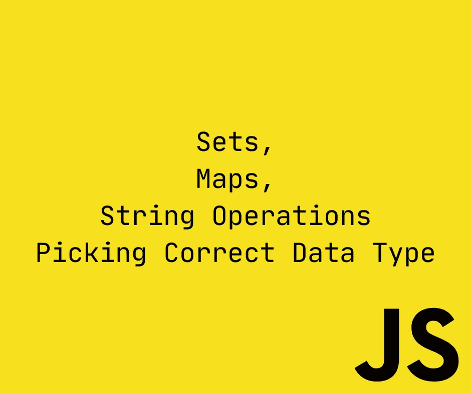
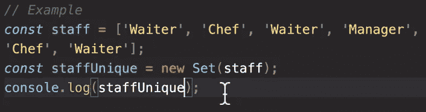
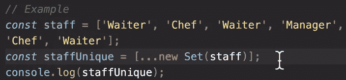
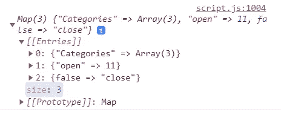
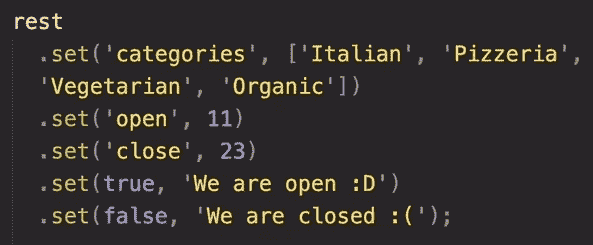
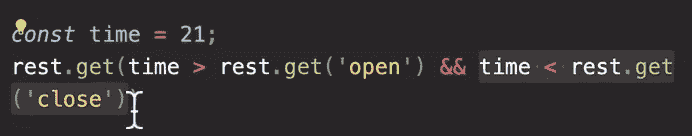
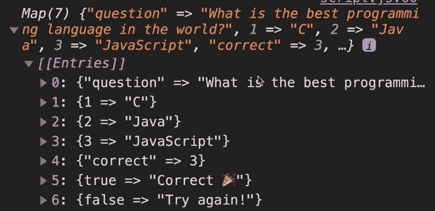
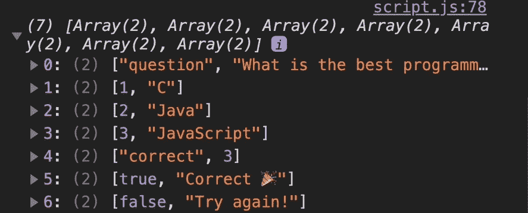
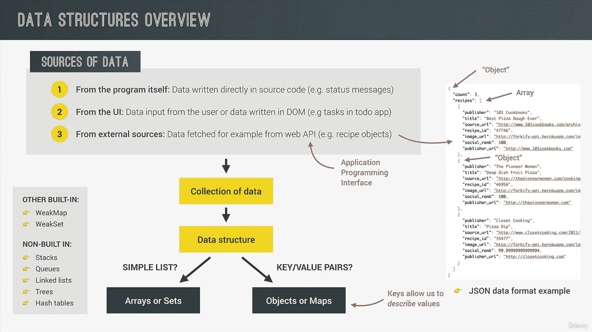
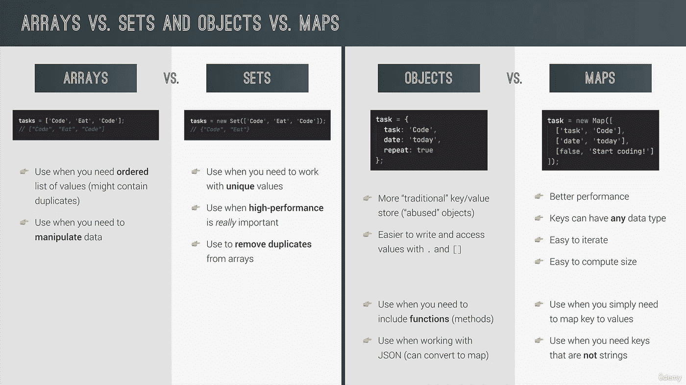

# 完整的 JS 注释#9 🧵

> 原文：<https://blog.devgenius.io/the-complete-js-notes-9-31bd8489a476?source=collection_archive---------13----------------------->

欢迎阅读我的 JavaScript 笔记的下一篇文章。

*在本文中我们将谈到:* ***集合、地图、字符串操作、挑选正确的数据类型***

*所有内容摘自 Jonas Schmedtmann 的惊人课程* [*完整的 JavaScript 课程 2022:从零到专家！*](https://www.udemy.com/course/the-complete-javascript-course/)

*请购买课程以了解内容，这只是我对课程的总结笔记。*



很长一段时间以来，js 没有集合和地图，在 ES6 之后，它们被包含到语言中。

# 设置

集合是不重复的数据结构。它们可以保存不同类型的数据

```
const foodSet = new Set([‘Pizza’,‘Pizza’,‘Pasta’,‘Pasta’,3,4,3]);//Pizza, Pasta, 3, 4
```

集合接受 iterables，所以它们也接受 strings。

```
const ecemSet = new Set(‘Ecem’); // ‘E’, ‘c’, ‘m’
```

它有惊人的功能

```
foodSet.has(‘Pizza’); //truefoodSet.add(‘Garlic Bread’);foodSet.delete(‘Pasta’);
```

如何从集合中获取值

```
cl(foodSet[2]); //undefined
```

集合没有索引，它们是无序的，所以我们不能使用 square 语法。实际上，没有办法从一个集合中检索数据，如果你仔细想想，你会发现这很符合逻辑。如果所有的数据对于一个集合来说都是唯一的，那么就没有必要去检索它们。

我们只需要知道一个值是否在集合中。

我们可以使用。清洁()

```
foodSet.clear();
```

集合是可迭代的，所以我们可以在 for 循环中使用它们。

```
for (const food of foodSet) {cl(food);}
```

集合在寻找数组的唯一元素时非常有用



这很好，但是它返回一个集合，而集合没有数组有的一些有用的方法。那么如何将它们转换成数组呢？



为了找到集合的大小，我们甚至不需要将其转换为数组

```
cl(new Set([‘a’, ‘a’, ‘b’]).size); // 2
```

同样可以用来找出你的名字中有多少个字母

```
cl( new Set(‘Baris’).size ); // 5
```

当然，它会找到独一无二的角色

# 地图:基础

地图比集合有用得多。

映射像对象一样是键值对。对象之间的最大区别是地图属性可以是任何类型，甚至对象，数组和其他地图。这个特性打开了地图的许多大门。

```
const rest = new Map();rest.set(‘name’, ‘Classico Italiano’); 
// First the name of the parameter then the valuerest.set(1, ‘Firenze, Italy’);cl(rest.set(2, ‘Lisbon, Portugal’)); 
//Add to the map and returns the whole maprest.set(‘Categories’, [‘Pizzeria’, ‘Vegetarian’, ‘Tasty’]).set(‘open’, 11).set(false, ‘close’);console.log(rest);
```



每次我们使用集合时，它并不嵌套它们，而是添加到地图中。

为了从地图中检索数据，我们使用带有属性名的 get 方法

```
cl(rest.get(‘Categories’));
```

一个聪明的例子



```
cl(rest.has(‘categories’));rest.delete(2);cl(rest.size) // 7
```

# 检索数组键的值

```
rest.set([1, 2], ‘data’);rest.get([1,2]); // Returns undefined because both of the arrays has different places in memory// Our map checks the address and says that it does not exist
```

要检索数据，我们应该做什么？

```
const arr = [1,2]rest.set(arr, ‘data’);rest.get(arr);
```

# DOM 元素作为键

```
rest.set(document.querySelector(‘h1’), ‘Heading’);
```

# 地图:迭代

# 替代地图创建



我们也可以直接将 Object.entries 转换成 map，因为它是同一个东西键和值

```
const hoursMap = new Map(Object.entries(openingHours));
```

# 迭代地图

Map 是一种可迭代的数据类型。

假设我们想要打印问题地图的 3 个答案

```
for ( [key, value] of question) {if (typeof key === ‘number’) {cl(`Answer ${key}: ${value}`);}}
```

# 将地图转换为数组

我们再次使用扩展操作符

```
cl(…question);
```



您也可以将键和值

```
cl([…question.keys()]);cl([…question.values()]);
```

# 总结:使用哪种数据结构？



# 使用字符串第 1 部分

```
‘Baris’.length; //5const airline = ‘TAP Air Portugal’;cl(airline.indexOf(‘r’)); // 6cl(airline.lastIndexOf(‘r’)); // 10 starts counting from the endcl(airline.indexOf(‘Portugal’)); // 8 can also search for the whole wordcl(airline.indexOf(‘portugal’)); // -1 because index is case sensitivecl(airline.slice(4)); // ‘Air Portugal’ remember that string is 0 indexedcl(airline.slice(4, 7)); // ‘Air’cl(airline.slice(0, airline.indexOf(‘ ‘))); // ‘TAP’ this is a cool trick to extract first wordcl(airline.slice(airline.lastIndexOf(‘ ‘) + 1)); // ‘Portugal’ we added 1 to avoid including spacecl(airline.slice(-2)); // ‘al’ We can even write negative numbers to count
```

# 拳击

如果 JS 字符串是原语，我们如何使用那些方法？

每当我们调用一个 string 方法，js 就用一个 string 对象偷偷地改变我们的字符串

```
new String(‘your old string’);
```

然后我们使用这个对象的方法。

每当我们完成操作的时候，JS 会把字符串变回原始状态，即使我们一开始就像创建一个对象一样创建字符串。

# 使用字符串第 2 部分

```
const airline = ‘TAP Air Portugal’;cl(airline.toLowerCase()); // ‘tap air portugal’cl(airline.toUpperCase()); // ‘TAP AIR PORTUGAL’const spacedString = ‘ Strriing ‘;cl(spacedString.trim()); // ‘Strriing’ you can also use trimStart and trimEndconst priceGB = ‘298,97£’; // We need to convert it to . and $ to also work with USlet priceUS = priceGB.replace(‘£’,’$’).replace(‘,’, ‘.’);//However replace has a weak poin it replaces only the first occurence but there is a solution for thatlet str = ‘baris baris baris ecem’;str.replaceAll(‘baris’, ‘ecem’); // “ecem ecem ecem ecem”str.replace(/baris/g, ‘ecem’); // A simple look at the regex in jsconst plane = ‘A30neo’;cl(plane.includes(‘A320’)); // truecl(plane.startsWith(‘Air’)); // false we can also use .endsWith()
```

# 使用字符串第 3 部分

```
cl(‘a+very+nice+string’.split(‘+’)); // ‘A very nice string’const [firstName, lastName] = ‘Baris Balli’.split(‘ ‘);const newName = [‘Mr.’, firstName, lastName.toUpperCase()].join(‘ ‘);//Paddingconst message = ‘Go to gate 23!’;cl(message.padStart(25, ‘+’)); // ‘++++++++++++++Go to gate 23!’
```

填充只是填充空白空间，直到填满 25 个字符的空间

[*见本 js 笔记线程第一篇！*](https://medium.com/@barisbll/the-complete-js-notes-1-36ea76e326b3)

[*见本 js 笔记的上一篇帖子！*](https://medium.com/p/7646d3ccf2e9)

[*见本 js 笔记线程下篇！*](https://medium.com/@barisbll/the-complete-js-notes-10-d979affa85ea)

[*在 twitter 上关注我*](https://twitter.com/barisbll_dev) 💣🔥

*在*[*Dev Genius*](https://blog.devgenius.io/)阅读我和许多其他伟大的科技博客作者