# 完整的现代 React 开发人员 2022

> 原文：<https://blog.devgenius.io/the-complete-modern-react-developer-2022-9ecf0ae8d63f?source=collection_archive---------1----------------------->

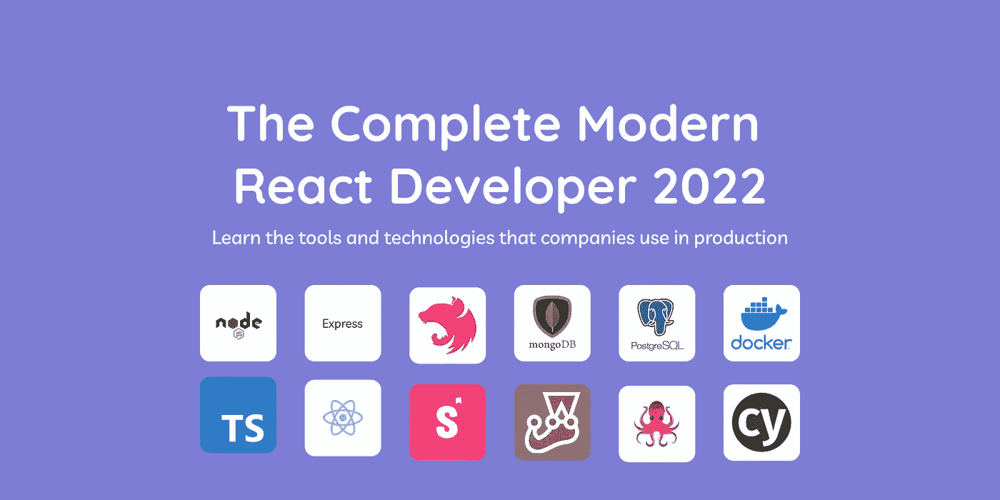

# 介绍

这将是一个在 2022 年成为一个完整的现代 React 开发者的课程。本课程中唯一没有涉及的三个主题是 [Redux](https://redux.js.org/) 、 [GraphQL](https://graphql.org/) 和 [React Native](https://docs.expo.dev/) ，它们可以在以后的课程中涉及。TypeScript 将是主要的编程语言，但是如果你已经知道 JavaScript，你会发现它很容易理解，因为语法没有太大的不同。

我们将建立一个超级基本的 Twitter 克隆，具有发布，阅读和删除推文的 CRUD 功能。

本课程将为您提供成为全栈软件开发人员的技能和知识。在本课程中，您将学习:

*   [node . js](https://nodejs.org/en/)([express . js](https://expressjs.com/)和 [nest.js](https://nestjs.com/) )
*   [MongoDB](https://www.mongodb.com/) 和 [PostgreSQL](https://www.postgresql.org/)
*   [码头工人](https://www.docker.com/)
*   [打字稿](https://www.typescriptlang.org/)
*   [反应](https://reactjs.org/)(钩子和上下文 API)
*   [Storybook.js](https://storybook.js.org/)
*   [Jest](https://jestjs.io/) 、 [React 测试库](https://testing-library.com/)和 [Cypress](https://www.cypress.io/) (单元测试、集成测试、端到端测试)

# 先决条件

确保您已经设置了开发环境，并安装了简介中列出的所有工具/库。我在 Mac 上工作，所以我提到的一些工具将只适用于 macOS，但是如果您使用 Windows 或 Linux，您应该能够找到替代工具并能够跟随。

# MongoDB 设置

您需要安装以下工具来使用 MongoDB NoSQL 数据库。MongoDB Compass 是一个使用 MongoDB 数据库的 GUI。mongosh 是一个 MongoDB shell，用于使用命令行处理 MongoDB 数据库。

[蒙古罗盘](https://www.mongodb.com/products/compass)
[蒙古文](https://www.mongodb.com/docs/mongodb-shell/)

# PostgreSQL 设置

您需要安装以下工具来使用 PostgreSQL 数据库。Postgres.app 是一款管理 PostgreSQL 数据库的 app。Pgcli 是 Postgres 的命令行界面，带有自动完成和语法突出显示功能。它相当于 mongosh 的 PostgreSQL。

说到使用 GUI 处理 PostgreSQL 数据库，我更喜欢 Valentina Studio。这是一个很棒的工具，因为它甚至可以连接到 MongoDB 和 MySQL 数据库。尽管有像 [PgAdmin](https://www.pgadmin.org/) 这样的选择，所以只要用你觉得舒服的就行了。

[postgres . app](https://postgresapp.com/)
[pg CLI](https://www.pgcli.com/)
[Valentina 工作室](https://www.valentina-db.com/en/)

# 设置后端

在本节中，您将学习如何使用 Express.js 和 Nest.js 设置节点后端。这两个框架都将使用不同的端点连接到 MongoDB 和 PostgreSQL 数据库。另外，当我们将 MongoDB 和 PostgreSQL 数据库放入 Docker 容器时，您还会学到一些 DevOps。

Docker 基本上让开发人员能够将应用程序打包到容器中。所以本质上你可以在 Docker 容器中有一个数据库，任何外部应用程序都可以连接到它。使用这种类型的设置，您甚至不需要在本地机器上安装或设置数据库。你可以在 Docker 容器中运行所有的东西，这种设置在任何机器上都是一样的。

我认为这是本地安装的一个很好的替代方案，有了这个知识，它为您提供了与数据库交互的另一个选择。这个工作流不需要大量的设置，您可以使用 GUI 或命令行与 Docker 容器中的数据库进行交互，就像在本地或在线一样。

# 本地数据库设置

[Pgcli 命令](https://www.pgcli.com/commands)
[mongosh 命令](https://www.mongodb.com/docs/mongodb-shell/run-commands/)

## MongoDB 本地

打开你的命令行工具，我将使用 [Hyper](https://hyper.is/) ，运行下面的命令连接到你的本地 MongoDB 安装。

```
mongosh
```

首先运行这个命令，它将显示您正在使用哪个数据库。它应该返回默认数据库`test`。

```
db
```

现在运行下面的命令，它将显示您当前已经创建了哪些数据库。

```
show dbs;
```

接下来运行命令创建一个名为 **twitter** 的数据库。

```
use twitter;
```

最后使用下面的命令创建一个集合，当你在命令行中再次使用命令`show dbs;`时，你应该会看到你创建的名为`twitter`的数据库。

```
db.createCollection('contents');
```

最后，我们将添加一些起始数据拷贝，并将下面的代码粘贴到您的命令行中。如果您在插入数据后在命令行中运行这个命令`db.contents.find().pretty()`，那么您将能够在表中看到数据。

```
db.contents.insertMany([ {tweet: "Hello World!", img: ""}, {tweet: "Content creation and programming are basically full time jobs. I have enough projects and work to keep me busy for years. Working in tech is definitely going to entertain you for a long time which is why so many people want to transition into this field.", img: ""}, {tweet: "JavaScript developers are forever in high demand", img: ""} ])
```

如果您在计算机上打开 MongoDB Compass 应用程序，并使用连接字符串`mongodb://localhost:27017`连接到您的本地安装，那么您应该能够看到您的所有数据库，包括我们刚刚在 GUI 中创建的数据库。现在，您可以使用命令行或 GUI 与数据库进行交互。

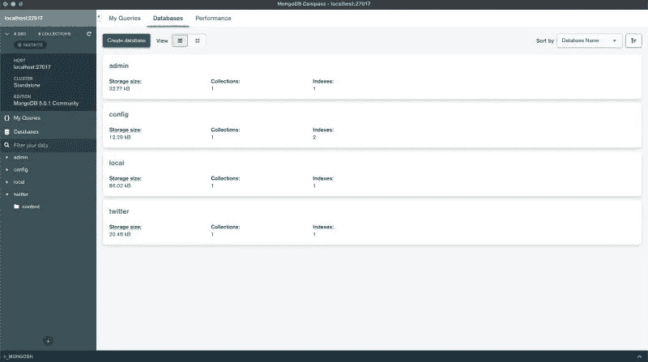

## PostgreSQL 本地

在执行任何操作之前，请检查 PostgreSQL 数据库是否正在本地运行。如果它没有运行，那么当您运行命令`pgcli`时，可能会在命令行中得到一个错误。在 macOS 上，我将使用 Postgres.app，所以让它在你的机器上运行，然后它应该会出现在你的操作系统顶部的菜单栏中。

现在转到命令行并运行下面的命令来连接到您的本地 PostgreSQL 安装。

```
pgcli
```

运行下面的命令将显示您所有的 PostgreSQL 数据库。

```
\l
```

将下面的 SQL 查询复制并粘贴到您的 pgcli 命令行窗口中，创建一个名为 **twitter** 的数据库。现在，如果您在同一个窗口中再次运行命令`\l`，您应该会看到所有的数据库，包括我们刚刚创建的数据库。

```
CREATE DATABASE twitter;
```

接下来，我们需要在同一个窗口中连接到数据库，所以使用下面的命令来完成。

```
\c twitter
```

接下来，我们必须创建一个表，并添加一些数据，这些数据将进入数据库 **twitter** 。将下面的 SQL 代码复制并粘贴到命令行窗口中。

```
CREATE TABLE contents (id UUID DEFAULT gen_random_uuid (),tweet VARCHAR(280) NOT NULL,img VARCHAR(500) NOT NULL);INSERT INTO contents (tweet, img)VALUES ('Hello World!', ''), ('Content creation and programming are basically full time jobs. I have enough projects and work to keep me busy for years. Working in tech is definitely going to entertain you for a long time which is why so many people want to transition into this field.', ''), ('JavaScript developers are forever in high demand', '');
```

如果您在计算机上打开 Postgres.app 应用程序，您应该会看到所有数据库，包括我们刚刚创建的数据库。

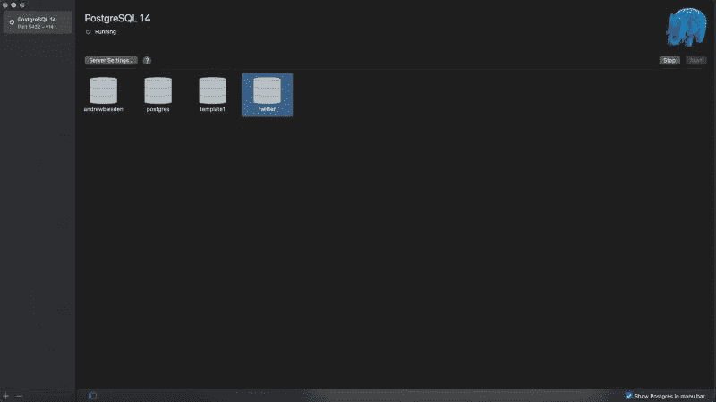

如果您连接到 Valentina Studio 或您选择的数据库 GUI，您应该能够看到您创建的数据库。

PostgreSQL 数据库连接设置

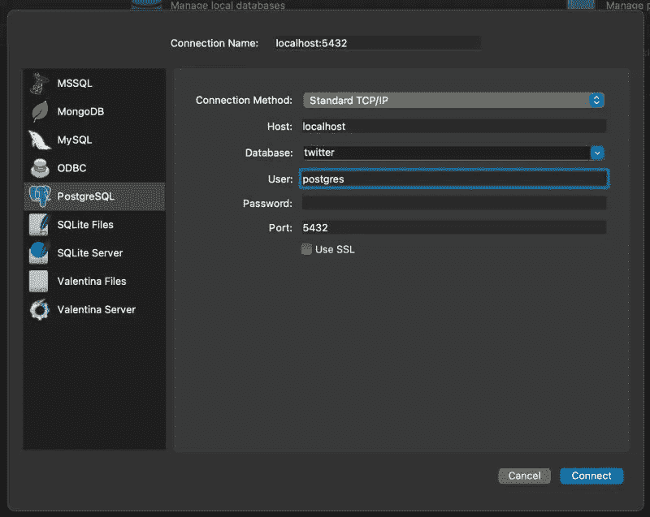

瓦伦蒂娜工作室

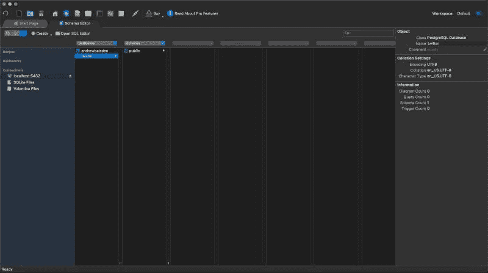

# Docker 数据库设置

在您的计算机上启动 Docker 应用程序，并对每个数据库执行以下步骤。首先在本地机器上创建一个名为**complete-react-developer**
的文件夹，然后使用命令行进入`cd`。

## MongoDB Docker

仔细检查您是否在**complete-react-developer**的根文件夹中，然后运行下面的命令来设置项目。

```
mkdir docker-twitter-mongodb
cd docker-twitter-mongodb
touch docker-compose.yml
```

在代码编辑器中打开该文件夹，并将以下代码添加到`docker-compose.yml`文件中。

`docker-compose.yml`

小心 yaml 代码的格式，如果缩进不正确，就会出现错误。

```
version: '3.9'
services:
  mongo_db:
    container_name: db_container
    image: 'mongo:latest'
    restart: always
    ports:
      - '2717:27017'
    volumes:
      - 'mongo_db:/data/db'
volumes:
  mongo_db: {}
```

现在运行下面的代码，用 MongoDB 数据库启动 docker 容器。

```
docker compose up
```

假设一切顺利，您应该有一个运行在 Docker 容器中的 MongoDB 数据库。

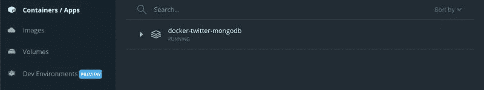

连接到 Docker 容器中的 MongoDB 数据库

现在可以同时连接到本地 MongoDB 数据库和 MongoDB Docker 数据库，因为它们都被配置为在不同的端口上运行。

本地 mongodb 数据库位于端口 27017 上，因此使用下面的命令连接到本地 MongoDB 数据库。

```
mongosh --port 27017
```

MongoDB Compass 的连接字符串如下。

```
mongodb://localhost:27017
```

MongoDB Docker 数据库位于端口 2717 上，因此使用下面的命令连接到 Docker MongoDB 数据库。

```
mongosh --port 2717
```

MongoDB Compass 的连接字符串如下。

```
mongodb://localhost:2717
```

所以现在您有两个用于 Twitter 的 MongoDB 数据库，一个在本地，一个在 Docker 容器中。让我们向数据库中添加一些数据，即使您删除了容器，这些数据也将持续存在。

在命令行中，打开一个到 Docker 容器中的 mongosh 数据库的连接。

```
mongosh --port 2717
```

运行下面的命令。您正在创建一个名为 **twitter** 的数据库，其中包含一个名为 **contents** 的集合。然后将一些数据插入数据库。

```
use twitter;db.createCollection('contents');db.contents.insertMany([ {tweet: "Hello World!", img: ""}, {tweet: "Content creation and programming are basically full time jobs. I have enough projects and work to keep me busy for years. Working in tech is definitely going to entertain you for a long time which is why so many people want to transition into this field.", img: ""}, {tweet: "JavaScript developers are forever in high demand", img: ""} ]);
```

现在，当您在命令行中运行命令`db.contents.find().pretty();`时，它应该会返回您刚刚插入的数据。如果你去 MongoDB compass 并使用这个连接字符串`mongodb://localhost:2717`，你应该会看到包含数据的 **twitter** 数据库。

## PostgreSQL Docker

检查你是否在**complete-react-developer**的根文件夹中，然后运行下面的命令来设置这个项目。

```
mkdir docker-twitter-postgresql
cd docker-twitter-postgresql
touch docker-compose.yml
mkdir sql
cd sql
touch twitter.sql
cd ..
```

在代码编辑器中打开该文件夹，并将以下代码添加到`docker-compose.yml`和`twitter.sql`文件中。

`docker-compose.yml`

小心 yaml 代码的格式，如果缩进不正确，就会出现错误。

```
version: '3.7'
services:
  postgres:
    image: postgres:latest
    restart: always
    environment:
      - POSTGRES_USER=twitter
      - POSTGRES_PASSWORD=twitter
      - POSTGRES_DB=twitter
    ports:
      - '5433:5432'
    volumes:
      - ./postgres-data:/var/lib/postgresql/data
      # copy the sql script to create tables
      - ./sql/twitter.sql:/docker-entrypoint-initdb.d/twitter.sql
```

`twitter.sql`

```
CREATE TABLE contents (id UUID DEFAULT gen_random_uuid (),tweet VARCHAR(280) NOT NULL,img VARCHAR(500) NOT NULL);INSERT INTO contents (tweet, img)VALUES ('Hello World!', ''), ('Content creation and programming are basically full time jobs. I have enough projects and work to keep me busy for years. Working in tech is definitely going to entertain you for a long time which is why so many people want to transition into this field.', ''), ('JavaScript developers are forever in high demand', '');
```

现在运行下面的代码，用 PostgreSQL 数据库启动 Docker 容器。

```
docker compose up
```

当您看到日志说**数据库系统准备好接受连接**时，您将知道它正在工作。这也可以在 Docker 桌面应用程序中验证，如果你检查它，你应该看到容器正在运行。

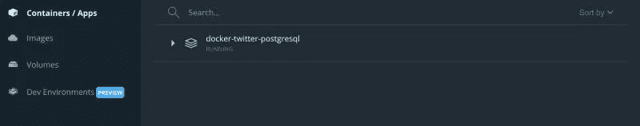

我们刚刚做的是设置一个 PostgreSQL 数据库，它将驻留在 Docker 容器中。这个数据库甚至会有一些来自我们创建的 SQL 脚本的预构建数据。

连接到 Docker 容器中的 PostgreSQL 数据库

**docker-Twitter-PostgreSQL**文件夹内的`docker-compose.yml`文件有一个端口映射 **5433:5432** 。5433 是本地端口，5432 是 docker 端口，这也是 Postgres 的默认端口。我这样做是为了让我们可以在本地端口 5432 上使用 Postgres 应用程序，同时在端口 5433 上运行 Docker 数据库。

这就是奇迹发生的地方！使用下图中的连接凭证，您应该能够连接到 docker 容器中的 PostgreSQL 数据库！

顺便说一下，密码是 **twitter** ，您可以在`docker-compose.yml`文件中找到凭证。


或者，您也可以使用下面的命令，在命令行中使用`pgcli`连接到数据库。密码和之前一样是 **twitter** 。

```
pgcli -h localhost -p 5433 -u twitter -d twitter
```

所以现在我们在端口 5432 上有了一个名为 **twitter** 的本地 PostgreSQL 数据库。以及一个在端口 5433 上名为 **twitter** 的 Docker PostgreSQL 数据库。Valentina Studio 可以同时连接到它们，您可以运行所有的 SQL 查询。此外，Docker 容器中的 PostgreSQL 数据库可以保存其数据。如果您删除正在运行的 Docker 容器，然后再次运行命令`docker compose up`，一切都将保持不变！

如果需要，使用命令`docker compose down`停止 Docker 容器的运行。

恭喜你刚刚学习了 MongoDB、PostgreSQL 和 Docker 的基础知识！

# 节点后端设置

这将分为两个部分。一个用于使用 Express.js 和 TypeScript 创建后端。另一个用于使用 Nest.js 和 TypeScript 创建后端，这样您就可以看到两者之间的区别，并了解在 Node 中开发后端的替代方法。

因此，将有 4 个节点后端可供使用:

*   后端-快速-mongodb
*   后端-快速-postgresql
*   后端-嵌套-mongodb
*   后端嵌套 postgresql

将需要一个 REST API 测试工具，以便您可以测试各种路由和端点。这些是我最喜欢的 3 个，如果你想的话，可以随意使用其他的。

[邮递员](https://www.postman.com/)
[迅雷客户端](https://www.thunderclient.com/)
[失眠](https://insomnia.rest/)

您不需要创建所有这些后端，因为当我们创建 React 前端时，它只需要一个后端，但这仍然是值得学习的好知识。显然，您可以只拥有一个连接到 MongoDB 和 PostgreSQL 的后端，这在这些示例中更容易解释。

## 快速应用程序

后端 Express MongoDB

确保您在文件夹**complete-react-developer**中。

运行下面的命令来搭建您的项目。

```
mkdir backend-express-mongodb
cd backend-express-mongodb
tsc --init
npm init -y
npm i express @types/express @types/node ts-node cors @types/cors mongoose @types/mongoose typescript rimraf copy-files dotenv nodemon
touch .env
mkdir src
cd src
touch app.ts
mkdir controllers models routes
touch controllers/Admin.ts
touch models/Twitter.ts
touch routes/Admin.ts
cd ..
```

在代码编辑器中打开项目，转到根文件夹中的`tsconfig.json`文件，并启用这些属性。

```
"rootDir": "./src" /* Specify the root folder within your source files. */,
"moduleResolution": "node" /* Specify how TypeScript looks up a file from a given module specifier. */,
"outDir": "./dist/src" /* Specify an output folder for all emitted files. */,
```

在下一步中，打开`package.json`文件并添加这些运行脚本。

```
"scripts": {"start": "node dist/src/app.js","dev": "nodemon src/app.ts","clean": "rimraf dist/","build": "npm run clean && tsc && npm run copy-files","copy-files": "copyfiles -u 1 src/**/*.html src/**/*.css src/**/*.json dist/src"},
```

运行脚本

**启动**
当文件有更新时，启动脚本使用 Node 运行应用程序，无需自动重新加载。

**dev**
dev 脚本使用 nodemon 在发生变化时自动重新加载和更新文件。

**清理**
清理脚本删除 **dist** 文件夹。

**构建**
构建脚本删除 **dist** 文件夹，然后自动复制所有文件，并将它们放回 **dist** 文件夹。

**复制文件**
复制文件脚本用于将文件从一个目录复制到另一个目录。

添加代码

最后，将下面的代码添加到相应的文件中。

`controllers/Admin.ts`

```
import { Response, Request } from 'express';import mongoose from 'mongoose';import Twitter from '../models/Twitter';export const getTweets = (req: Request, res: Response): void => {
    Twitter.find((err, data) => {
        console.log(data); res.json(data); if (err) {
            console.log(err);
        }
    });
};export const getTweet = async (req: Request, res: Response): Promise<any> => {
    const tweetId = req.params.tweetId; console.log('Tweet ID', tweetId); // This line of code fixes the CastError: Cast to ObjectId failed for value "favicon.ico" (type string) at path "_id" for model "contents" if (!mongoose.Types.ObjectId.isValid(tweetId)) return false; await Twitter.findById(tweetId).exec(); Twitter.findById(tweetId, (err: any, tweet: any) => {
        console.log(tweet); res.json(tweet); if (err) {
            console.log(err);
        }
    });
};export const postTweet = (req: Request, res: Response) => {
    const { tweet, img } = req.body; const twitter = new Twitter({ tweet: tweet, img: img }); twitter.save(); console.log('Tweet Created'); res.status(201).json({ msg: 'Tweet Created' });
};export const updateTweet = (req: Request, res: Response) => {
    const tweetId = req.params.tweetId; const { tweet, img } = req.body; Twitter.findByIdAndUpdate(tweetId, { tweet: tweet, img: img }).then(() => {
        console.log(`Tweet ${tweetId} Updated`); res.json({ msg: `Tweet ${tweetId} Updated` });
    });
};export const deleteTweet = (req: Request, res: Response) => {
    const tweetId = req.body.tweetId; Twitter.findByIdAndRemove(tweetId, () => {
        res.json({ msg: `Tweet ${tweetId} Deleted` });
    });
};
```

`models/Twitter.ts`

```
import { Schema, model } from 'mongoose';interface Twitter {
    tweet: string; img: string;
}const schema = new Schema<Twitter>({
    tweet: { type: String, required: true }, img: { type: String, required: false },
});const TwitterModel = model<Twitter>('contents', schema);export default TwitterModel;
```

`routes/Admin.ts`

```
import express from 'express';import { getTweets, getTweet, postTweet, updateTweet, deleteTweet } from '../controllers/Admin';const router = express.Router();router.get('/', getTweets);router.get('/:tweetId', getTweet);router.post('/delete', deleteTweet);router.post('/tweet', postTweet);router.post('/:tweetId', updateTweet);export default router;
```

`app.ts`

```
import dotenv from 'dotenv';dotenv.config();console.log(process.env.DB_HOST);import express from 'express';import cors from 'cors';import mongoose from 'mongoose';import adminRoute from './routes/Admin';const app = express();app.use(cors());app.use(express.urlencoded({ extended: false }));app.use(express.json());app.use('/', adminRoute);const port = process.env.PORT || 8080;mongoose // Use DB_HOST_DOCKER to connect to the MongoDB Database in the Docker Container .connect(`${process.env.DB_HOST_LOCAL}`) .then(() => {
        app.listen(port, () => console.log(`Server and database running on port ${port}, http://localhost:${port}`));
    }) .catch((err: any) => {
        console.log(err);
    });
```

`.env`

```
DB_HOST_LOCAL="mongodb://127.0.0.1:27017/twitter"DB_HOST_DOCKER="mongodb://127.0.0.1:2717/twitter"
```

应用程序被设置为连接到本地 MongoDB 数据库，但是您可以在`app.ts`文件中对此进行更改，并且可以在`.env`文件中找到数据库连接字符串。

使用下面的命令启动服务器。

```
npm run dev
```

测试 API

我将使用 Postman，但你可以使用任何你想要的 API 测试工具。如果你想看到它完全工作，你必须做的第一件事是添加一些数据到数据库，如果你还没有这样做。为此使用创建 tweet 路线，并查看下面截图中的示例。

获取所有推文

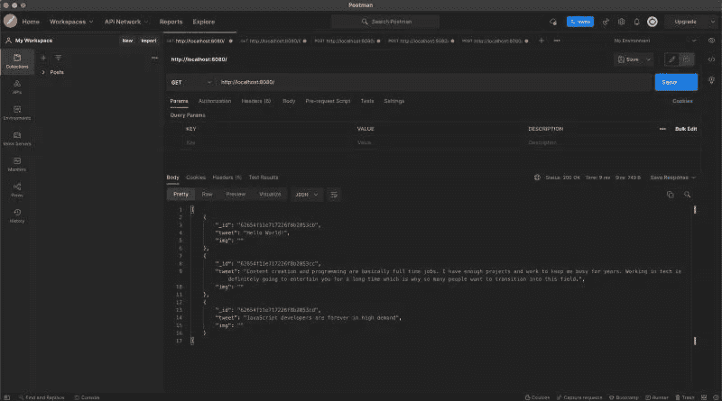

通过 ID 获取推文

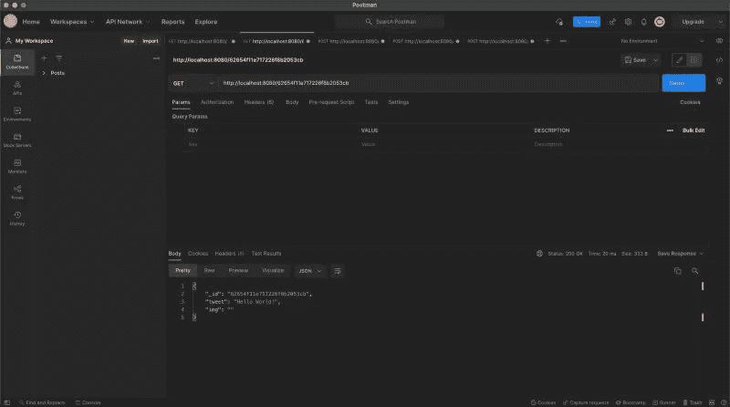

创建推文

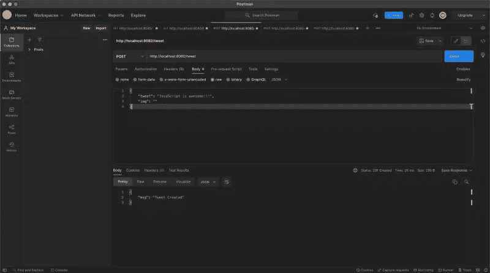

按 ID 更新推文

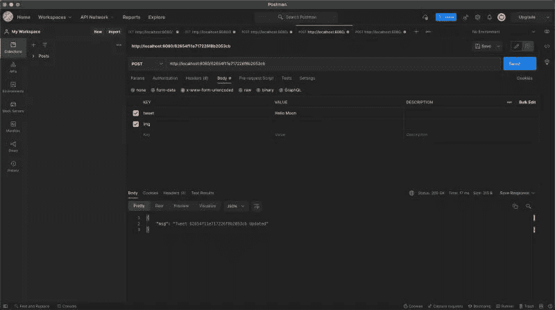

删除推文

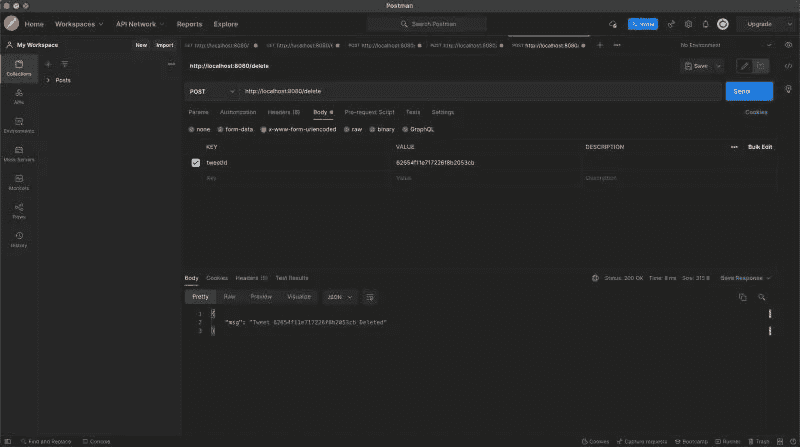

后端快速 PostgreSQL

我们将使用[https://typeorm.io/](https://typeorm.io/)来创建一个连接到 PostgreSQL 数据库的 Express.js 应用程序。

你应该在文件夹**完成-反应-开发者**里面。

运行下面的命令来搭建您的项目。

```
mkdir backend-express-postgresql
cd backend-express-postgresql
tsc --init
npm init -y
npm i express @types/express @types/node ts-node cors @types/cors typescript rimraf copy-files dotenv nodemon pg reflect-metadata typeorm
mkdir src
cd src
touch app.ts app-data-source.ts
mkdir entity
cd entity
touch Tweet.ts
cd ../..
```

在代码编辑器中打开项目，找到`tsconfig.json`文件，用下面的代码替换其中的所有代码。

```
{
    "compilerOptions": {
        "lib": ["es5", "es6", "dom"], "target": "es5", "module": "commonjs", "moduleResolution": "node", "emitDecoratorMetadata": true, "experimentalDecorators": true, "rootDir": "./src", "outDir": "./dist/src"
    }
}
```

在下一步中，打开`package.json`文件并添加这些运行脚本。

```
"scripts": {"start": "node dist/src/app.js","dev": "nodemon src/app.ts","clean": "rimraf dist/","build": "npm run clean && tsc && npm run copy-files","copy-files": "copyfiles -u 1 src/**/*.html src/**/*.css src/**/*.json dist/src"},
```

将下面的代码添加到相应的文件中。

`entity/Tweet.ts`

```
import { Entity, Column, PrimaryGeneratedColumn } from 'typeorm';@Entity()
export class Tweet {
    @PrimaryGeneratedColumn('uuid')
    id: string; @Column()
    tweet: string; @Column()
    img: string;
}
```

`app-data-source.ts`

```
import { DataSource } from 'typeorm';export const myDataSource = new DataSource({
    type: 'postgres', host: 'localhost', port: 5432, username: 'postgres', password: '', database: 'twitter', entities: ['dist/src/entity/*.js'], logging: true, synchronize: true,
});
```

`app.ts`

```
import * as express from 'express';import { Request, Response } from 'express';import { Tweet } from './entity/Tweet';import { myDataSource } from './app-data-source';// establish database connectionmyDataSource .initialize() .then(() => {
        console.log('Data Source has been initialized!');
    }) .catch((err) => {
        console.error('Error during Data Source initialization:', err);
    });// create and setup express appconst app = express();app.use(express.json());app.use(express.urlencoded({ extended: false }));// register CRUD routes// CREATE// READ// UPDATE// DELETE// READ: All tweetsapp.get('/tweets', async function (req: Request, res: Response) {
    const tweets = await myDataSource.getRepository(Tweet).find(); res.json(tweets);
});// READ: Tweet by IDapp.get('/tweets/:id', async function (req: Request, res: Response) {
    const results = await myDataSource.getRepository(Tweet).findOneBy({
        id: req.params.id,
    }); return res.send(results);
});// CREATE: New tweetapp.post('/tweets', async function (req: Request, res: Response) {
    const tweet = await myDataSource.getRepository(Tweet).create(req.body); const results = await myDataSource.getRepository(Tweet).save(tweet); return res.send(results);
});// UPDATE: Tweet by IDapp.put('/tweets/:id', async function (req: Request, res: Response) {
    const tweet = await myDataSource.getRepository(Tweet).findOneBy({
        id: req.body.id,
    }); myDataSource.getRepository(Tweet).merge(tweet, req.body); const results = await myDataSource.getRepository(Tweet).save(tweet); return res.send(results);
});// DELETE: Tweet by IDapp.delete('/tweets/:id', async function (req: Request, res: Response) {
    const results = await myDataSource.getRepository(Tweet).delete(req.body.id); return res.send(results);
});const port = process.env.PORT || 8080;// start express serverapp.listen(port, () => console.log(`Server and database running on port ${port}, [http://localhost:${port}`));](http://localhost:${port}`));)
```

应用程序被设置为连接到本地 PostgreSQL 数据库，但是您可以在`app-data-source.ts`文件中对此进行更改。如果你需要的话，可以在 Docker 部分找到 Docker 连接设置。不要忘记，在连接到 PostgreSQL 数据库之前，您需要安装并运行它。

使用下面的命令运行应用程序。

警告:如果您试图使用命令`npm run dev`来启动应用程序，您可能会得到错误`EntityMetadataNotFoundError: No metadata for "Tweet" was found.`。我认为这与静态和动态数据以及 nodemon 自动重载的事实有关。因此，使用下面的命令更安全，只需使用节点服务器进行一次干净的构建，直到您手动重启它，它才会更新。

```
npm run build
npm run start
```

现在您应该熟悉使用 REST API 工具了，但是在这个例子中，路由和 CRUD 请求略有不同。参见下面的例子，不要忘记使用 CREATE tweet 路径将一些数据添加到数据库中，以便您可以看到一些数据。

获取所有推文

请求:获取
路线:[http://localhost:8080/tweets](http://localhost:8080/tweets)

通过 ID 获取推文

请求:获取
路线:[http://localhost:8080/tweets/d5d 29839-788 f-4d 23-99ee-82 b49 f1 bbf 1](http://localhost:8080/tweets/d5d29839-788f-4d23-99ee-82b49ff1bbf1)

创建推文

请求:帖子
路线:[http://localhost:8080/tweets](http://localhost:8080/tweets)
Body raw:{ " tweet ":' Hello World '，img: ""}

按 ID 更新推文

请求:放
路线:[http://localhost:8080/tweets/d5d 29839-788 f-4d 23-99ee-82 b49 ff 1 bbf 1](http://localhost:8080/tweets/d5d29839-788f-4d23-99ee-82b49ff1bbf1)
Body raw:{ " tweet ":' Hello Moon '，img: ""}

按 ID 删除推文

请求:删除
路由:[http://localhost:8080/tweets/d5d 29839-788 f-4d 23-99ee-82 b49 f1 bbf 1](http://localhost:8080/tweets/d5d29839-788f-4d23-99ee-82b49ff1bbf1)
Body:x-www-form-urlencoded
KEY:id
VALUE:您的 id

## Nest 应用

后端嵌套 MongoDB

是时候创建将连接到 MongoDB 的 Nest 后端了。进入文件夹**complete-react-developer**并运行下面的命令。选择您首选的软件包管理器，我将选择 npm。如果您选择了不同的选项，记得稍后运行正确的命令。

```
nest new backend-nest-mongodb
```

在代码编辑器中打开项目，准备生成一些控制器和服务文件。我们还将首先在命令行中把 mongose`cd`安装到**后端-nest-mongodb** 文件夹中，并运行下面的命令。

```
cd backend-nest-mongodb
npm install --save @nestjs/mongoose mongoose
nest g controller twitter
nest g service twitter
```

在我们创建其他项目文件之前，让我们做一些文件清理。删除以下文件:

`app.service.ts`
`app.controller.ts`


现在是时候为这个项目创建其余的文件了。进入 **backend-nest-mongodb** 的根文件夹，运行下面的命令。

```
touch src/twitter/twitter.module.ts
mkdir src/twitter/{dto,schemas}
touch src/twitter/dto/create-twitter.dto.ts
touch src/twitter/schemas/twitter.schema.ts
```

我们已经创建了该项目所需的所有文件，现在让我们添加代码。用下面的代码添加或替换现有文件中的代码:

`app.module.ts`

```
import { Module } from '@nestjs/common';import { MongooseModule } from '@nestjs/mongoose';import { TwitterController } from './twitter/twitter.controller';import { TwitterService } from './twitter/twitter.service';import { TwitterModule } from './twitter/twitter.module';@Module({
    imports: [
        TwitterModule, // Local MongoDb database // Change the port to 127.0.0.1:2717 to connect to Docker MongooseModule.forRoot('mongodb://127.0.0.1:27017/twitter'),
    ], controllers: [TwitterController], providers: [TwitterService],
})
export class AppModule {}
```

`twitter.service.ts`

```
import { Model } from 'mongoose';import { Injectable } from '@nestjs/common';import { InjectModel } from '@nestjs/mongoose';import { Twitter, TwitterDocument } from './schemas/twitter.schema';import { CreateTwitterDto } from './dto/create-twitter.dto';@Injectable()
export class TwitterService {
    constructor(@InjectModel(Twitter.name) private twitterModel: Model<TwitterDocument>) {} async create(createTwitterDto: CreateTwitterDto): Promise<Twitter> {
        const createdTwitter = new this.twitterModel(createTwitterDto); return createdTwitter.save();
    } async findAll(): Promise<Twitter[]> {
        return this.twitterModel.find().exec();
    } async findOne(id: string): Promise<Twitter> {
        return this.twitterModel.findOne({ _id: id });
    } async update(id: string, twitter: Twitter): Promise<Twitter> {
        return this.twitterModel.findByIdAndUpdate(id, twitter, { new: true });
    } async delete(id: string): Promise<Twitter> {
        return this.twitterModel.findByIdAndRemove({ _id: id });
    }
}
```

`twitter.module.ts`

```
import { Module } from '@nestjs/common';import { MongooseModule } from '@nestjs/mongoose';import { Twitter, TwitterSchema } from './schemas/twitter.schema';@Module({
    imports: [MongooseModule.forFeature([{ name: Twitter.name, schema: TwitterSchema }])], exports: [MongooseModule],
})
export class TwitterModule {}
```

`twitter.controller.ts`

```
import { Controller, Get, Post, Body, Param, Put, Delete } from '@nestjs/common';import { CreateTwitterDto, TwitterDto } from './dto/create-twitter.dto';import { TwitterService } from './twitter.service';@Controller('tweets')
export class TwitterController {
    constructor(private twitterService: TwitterService) {} @Post()
    async create(@Body() createTwitterDto: CreateTwitterDto) {
        this.twitterService.create(createTwitterDto);
    } @Get()
    async findAll(): Promise<TwitterDto[]> {
        return this.twitterService.findAll();
    } @Get(':id')
    async findOne(@Param('id') id): Promise<TwitterDto> {
        return this.twitterService.findOne(id);
    } @Put(':id')
    update(
        @Body() updateTwitterDto: CreateTwitterDto, @Param('id') id
    ): Promise<TwitterDto> {
        return this.twitterService.update(id, updateTwitterDto);
    } @Delete(':id')
    delete(@Param('id') id): Promise<TwitterDto> {
        return this.twitterService.delete(id);
    }
}
```

`schemas/twitter.schema.ts`

```
import { Prop, Schema, SchemaFactory } from '@nestjs/mongoose';import { Document } from 'mongoose';export type TwitterDocument = Twitter & Document;@Schema()
export class Twitter {
    @Prop()
    tweet: string; @Prop()
    img: string;
}export const TwitterSchema = SchemaFactory.createForClass(Twitter);
```

`dto/create-twitter.dto.ts`

```
export class CreateTwitterDto {
    id?: string; tweet: string; img: string;
}export class TwitterDto {
    id?: string; tweet: string; img: string;
}
```

现在一切都应该设置好了，后端被配置为连接到本地 MongoDB 数据库。您可以通过编辑`app.module.ts`文件中的连接字符串将其更改为 Docker。

运行下面的命令以监视模式启动应用程序。

```
npm run start:dev
```

值得一提的是，默认情况下，NestJS 应用程序运行在端口 3000 上，这是我们的 React 应用程序将要使用的默认端口。因此，为了保持一致性，您可能希望将其更改为 8080 或不同的端口。您可以在`main.ts`文件中完成此操作。你还需要启用 CORS，否则当你试图连接后端到前端时，你会得到那个烦人的 CORS 错误。

`main.ts`

```
import { NestFactory } from '@nestjs/core';import { AppModule } from './app.module';async function bootstrap() {
    const app = await NestFactory.create(AppModule); app.enableCors(); await app.listen(8080);
}bootstrap();
```

路由应该和以前一样，这里是一个复习，你可以在 Postman 或者你正在使用的任何 REST API 工具中测试:

获取所有推文

请求:获取
路线:[http://localhost:8080/tweets](http://localhost:8080/tweets)

通过 ID 获取推文

请求:获取
路线:[http://localhost:8080/tweets/d5d 29839-788 f-4d 23-99ee-82 b49 f1 bbf 1](http://localhost:8080/tweets/d5d29839-788f-4d23-99ee-82b49ff1bbf1)

创建推文

请求:发布
路线:[http://localhost:8080/tweets](http://localhost:8080/tweets)
Body raw:{ " tweet ":' Hello World '，img: ""}

按 ID 更新推文

请求:放
路线:[http://localhost:8080/tweets/d5d 29839-788 f-4d 23-99ee-82 b49 f1 bbf 1](http://localhost:8080/tweets/d5d29839-788f-4d23-99ee-82b49ff1bbf1)
Body raw:{ " tweet ":' Hello Moon '，img: ""}

按 ID 删除推文

请求:删除
路线:[http://localhost:8080/tweets/d5d 29839-788 f-4d 23-99ee-82 b49 f1 bbf 1](http://localhost:8080/tweets/d5d29839-788f-4d23-99ee-82b49ff1bbf1)

后端嵌套 PostgreSQL

最后，我们现在将创建连接到 PostgreSQL 的嵌套后端。在这个阶段之后，我们将最终转移到 React 前端。确保您在文件夹**complete-react-developer**中，并运行下面的命令。与上一章选择您的首选软件包管理器一样，我将选择 npm。如果您选择了不同的选项，记得稍后运行正确的命令。

```
nest new backend-nest-postgresql
```

在代码编辑器中打开项目，准备生成一些控制器和服务文件。我们还将安装 PostgreSQL 和 [TypeORM](https://github.com/typeorm/typeorm) ，这样我们就可以连接到 PostgreSQL 数据库。首先`cd`进入命令行中的**back end-nest-PostgreSQL**文件夹，运行下面的命令。

```
cd backend-nest-postgresql
npm install --save pg @nestjs/typeorm typeorm
nest g controller twitter
nest g service twitter
```

在我们创建其他项目文件之前，让我们做一些文件清理。删除以下文件:

`app.service.ts`
`app.controller.ts`


现在是时候为这个项目创建其余的文件了。当你在**back end-nest-PostgreSQL**的根文件夹中时，运行下面的命令。

```
touch src/twitter/{twitter.module.ts,twitter.entity.ts}
mkdir src/twitter/dto
touch src/twitter/dto/twitter.dto.ts
```

我们已经创建了该项目所需的所有文件，现在让我们添加代码。用下面的代码添加或替换现有文件中的代码:

`app.module.ts`

```
import { Module } from '@nestjs/common';import { TypeOrmModule } from '@nestjs/typeorm';import { TwitterController } from './twitter/twitter.controller';import { TwitterService } from './twitter/twitter.service';import { TwitterModule } from './twitter/twitter.module';import { Connection } from 'typeorm';@Module({
    imports: [
        TypeOrmModule.forRoot({
            type: 'postgres', host: 'localhost', port: 5432, username: 'postgres', password: '', database: 'twitter', entities: ['dist/**/*.entity{.ts,.js}'], synchronize: false,
        }), TwitterModule,
    ], controllers: [TwitterController], providers: [TwitterService],
})
export class AppModule {
    constructor(private connection: Connection) {}
}
```

`twitter.service.ts`

```
import { Injectable, NotFoundException } from '@nestjs/common';import { InjectRepository } from '@nestjs/typeorm';import { DeleteResult, InsertResult, Repository } from 'typeorm';import { Twitter } from './twitter.entity';@Injectable()
export class TwitterService {
    constructor(
        @InjectRepository(Twitter)
        private twitterRepository: Repository<Twitter>
    ) {} async addTwitter(twitter: Twitter): Promise<InsertResult> {
        return this.twitterRepository.insert(twitter);
    } async findAll(): Promise<Twitter[]> {
        return this.twitterRepository.find();
    } async findOne(id: string): Promise<Twitter> {
        return this.twitterRepository.findOne(id);
    } async update(id: string, twitter: Twitter): Promise<Twitter> {
        const twitterUpdate = await this.findOne(id); if (twitterUpdate === undefined) {
            throw new NotFoundException();
        } await this.twitterRepository.update(id, twitter); return this.twitterRepository.findOne(id);
    } async delete(id: string): Promise<DeleteResult> {
        const twitterUpdate = await this.findOne(id); if (twitterUpdate === undefined) {
            throw new NotFoundException();
        } return this.twitterRepository.delete(id);
    }
}
```

`twitter.module.ts`

```
import { Module } from '@nestjs/common';import { TypeOrmModule } from '@nestjs/typeorm';import { TwitterController } from './twitter.controller';import { TwitterService } from './twitter.service';import { Twitter } from './twitter.entity';@Module({
    imports: [TypeOrmModule.forFeature([Twitter])], controllers: [TwitterController], providers: [TwitterService], exports: [TypeOrmModule],
})
export class TwitterModule {}
```

`twitter.entity.ts`

```
import { Entity, Column, PrimaryGeneratedColumn } from 'typeorm';@Entity()
export class Twitter {
    @PrimaryGeneratedColumn('uuid')
    id: string; @Column()
    tweet: string; @Column()
    img: string;
}
```

`twitter.controller.ts`

```
import { Controller, Get, Post, Patch, Delete, Param, Body } from '@nestjs/common';import { TwitterService } from './twitter.service';import { TwitterDto } from './dto/twitter.dto';import { Twitter } from './twitter.entity';@Controller('tweets')
export class TwitterController {
    constructor(private twitterService: TwitterService) {} @Post()
    create(@Body() twitter: Twitter) {
        return this.twitterService.addTwitter(twitter);
    } @Get()
    findAll(): Promise<TwitterDto[]> {
        return this.twitterService.findAll();
    } @Get(':id')
    getOneTwitter(@Param('id') id: string): Promise<Twitter> {
        return this.twitterService.findOne(id);
    } @Patch(':id')
    updateTwitter(
        @Param('id') id: string, @Body() twitter: Twitter
    ): Promise<Twitter> {
        return this.twitterService.update(id, twitter);
    } @Delete(':id')
    deleteTwitter(@Param('id') id: string) {
        return this.twitterService.delete(id);
    }
}
```

`dto/twitter.dto.ts`

```
export class TwitterDto {
    tweet: string; img: string;
}
```

现在一切都应该设置好了，后端被配置为连接到本地 PostgreSQL 数据库。您可以通过编辑`app.module.ts`文件中的连接细节将其更改为 Docker。

有一点值得注意，尽管这个应用程序使用了一个名为 **twitter** 的数据库表。查看示例 SQL，您可以使用它来生成一些快速测试数据。如果你得到一个错误，可能是因为它期望找到一个名为 **twitter** 的表。

```
CREATE TABLE twitter (id UUID DEFAULT gen_random_uuid (),tweet VARCHAR(280) NOT NULL,img VARCHAR(500) NOT NULL);INSERT INTO twitter (tweet, img)VALUES ('Hello World!', ''), ('Content creation and programming are basically full time jobs. I have enough projects and work to keep me busy for years. Working in tech is definitely going to entertain you for a long time which is why so many people want to transition into this field.', ''), ('JavaScript developers are forever in high demand', '');
```

运行下面的命令以监视模式启动应用程序。像以前一样，这些路线非常相似，但也有一些不同。另外不要忘记在`main.ts`文件中把端口改成 8080。像以前一样，你将需要启用 CORS，否则当你试图连接后端到前端时，你会得到那个恼人的 CORS 错误。

`main.ts`

```
import { NestFactory } from '@nestjs/core';import { AppModule } from './app.module';async function bootstrap() {
    const app = await NestFactory.create(AppModule); app.enableCors(); await app.listen(8080);
}bootstrap();npm run start:dev
```

您可以在 Postman 或您正在使用的任何 REST API 工具中进行测试:

获取所有推文

请求:获取
路线:[http://localhost:8080/tweets](http://localhost:8080/tweets)

通过 ID 获取推文

请求:获取
路线:[http://localhost:8080/tweets/d5d 29839-788 f-4d 23-99ee-82 b49 f1 bbf 1](http://localhost:8080/tweets/d5d29839-788f-4d23-99ee-82b49ff1bbf1)

创建推文

请求:发布
路线:[http://localhost:8080/tweets](http://localhost:8080/tweets)
Body raw:{ " tweet ":' Hello World '，img: ""}

按 ID 更新推文

请求:补丁
路由:[http://localhost:8080/tweets/d5d 29839-788 f-4d 23-99ee-82 b49 ff 1 bbf 1](http://localhost:8080/tweets/d5d29839-788f-4d23-99ee-82b49ff1bbf1)
Body raw:{ " tweet ":' Hello Moon '，img: ""}

按 ID 删除推文

请求:删除
路线:[http://localhost:8080/tweets/d5d 29839-788 f-4d 23-99ee-82 b49 f1 bbf 1](http://localhost:8080/tweets/d5d29839-788f-4d23-99ee-82b49ff1bbf1)
正文:x-www-form-urlencoded
KEY:id
VALUE:您的 id

# 设置前端

我们终于到达了前端部分！它不会像我们刚刚完成的后端部分那么长，因为只有一个 React 前端！

# 构建 Twitter 克隆应用

该应用程序将是一个非常简单的 Twitter 克隆。你可以创建、阅读和删除推文。没有更新/编辑推文的选项，反正现在就是这样😂然而，用于更新的端点已经存在于后端，所以如果您愿意，您可以实现它。顺便说一下，这不是一个 Twitter 的克隆课程，所以不要指望它是像素完美和 100%准确😁

代码库非常大，所以我没有复制和粘贴代码十几次，也没有经历漫长的项目设置，而是创建了应用程序，并将其放在 GitHub 上。因此，您需要做的就是克隆/下载代码库并运行安装脚本。

【https://github.com/andrewbaisden/complete-react-developer 

接下来，在代码编辑器中打开项目，查看代码库，并在各自的根文件夹中使用下面的命令。安装说明也在自述文件中。

# 设置

在你的电脑上启动 Docker 桌面应用程序

`cd`放入根文件夹中的 **backend-nest-mongodb** 和 **frontend** ，然后运行下面的命令来安装依赖项。在这种情况下，当试图安装前端 React 应用程序的依赖项时，您可能需要强制安装，否则它可能会给你一个错误。

```
# Run this command inside of the backend-nest-mongodb folder
npm install# Run this command inside of the frontend folder
npm install --force
```

`cd`到根文件夹 **docker-twitter-mongodb** 中，运行下面的命令在 docker 容器中启动 mongodb 数据库。

```
docker compose up
```

`cd`到根文件夹 **backend-nest-mongodb** ，运行下面的命令启动后端 NestJS 服务器。

```
npm run start:dev
```

`cd`进入**前端**的根文件夹，运行下面的命令启动前端 React 服务器。

```
npm run start
```

如果您想在 REST API 工具中测试它们，请使用来自**后端 Nest MongoDB** 部分的路由。

# Twitter 克隆应用

您应该看到您的数据库在 Docker 容器中运行，您的 Twitter 克隆 React 应用程序在浏览器中打开。

在 frontend 的根文件夹中运行这些命令，这是 React 所在的位置。下面的命令启动故事书。

```
# Starts Storybook
npm run storybook
```

您应该会看到浏览器中打开了一个故事书组件库，其中有一个用于撰写 tweets 的组件。您可以尝试更改控件中的名称，看看它在演示中是什么样子。下面的命令运行单元和集成测试。

```
# Runs the React testing library unit and integration tests
npm run test
```

您可能需要按下 **a** 或 **Enter** 来触发新的测试运行。所有的测试都应该在你的控制台上通过。下面的命令启动 Cypress。

```
# Runs the Cypress End-To-End tests
npx cypress open
```

应该会打开一扇新的柏树窗户。运行集成测试，准备好大吃一惊吧，它会自动为你发布 3 条推文！用 React 应用程序重新加载网页，你也会看到新的推文！

# 上下文 API

这个应用程序使用全局状态的上下文 API。如果您想让应用程序连接到您的 MongoDB、PostgreSQL 或 Docker 数据库，那么您需要更改 API 路由和端口号[。这同样适用于方法，不要忘记他们中的一些使用 POST，PUT，PATCH，DELETE 等。这取决于你使用的后端。](http://localhost:8080/tweets)

`src/contexts/TwitterContext.tsx`

```
import { useEffect, useState, createContext, useContext } from 'react';interface ContextProps {
    data: any; loading: boolean; handleToggleComposetweet: any; toggleComposeTweet: boolean; tweet: string; setTweet: any; postTweet: any; deleteTweet: any;
}const TwitterContext = createContext({} as ContextProps);export const useTwitter = () => useContext(TwitterContext);const TwitterContextProvider = (props: any): any => {
    useEffect(() => {
        const getTweets = () => {
            const API = 'http://localhost:8080/tweets'; fetch(API)
                .then((response) => {
                    console.log(response); return response.json();
                }) .then((data) => {
                    console.log(data); setLoading(false); setData(data);
                }) .catch((err) => {
                    console.log(err);
                });
        }; getTweets();
    }, []); const [data, setData] = useState([]); const [loading, setLoading] = useState(true); const [toggleComposeTweet, setToggleComposeTweet] = useState(false); const [tweet, setTweet] = useState(''); const handleToggleComposetweet = () => {
        toggleComposeTweet === true ? setToggleComposeTweet(false) : setToggleComposeTweet(true);
    }; const postTweet = () => {
        if (tweet === '') {
            let myHeaders = new Headers(); myHeaders.append('Content-Type', 'application/json'); let raw = JSON.stringify({
                tweet: 'Congratulations this is what happens when you post an empty tweet 🤪 Create some validation 🙃', img: '',
            }); fetch('http://localhost:8080/tweets', { method: 'POST', headers: myHeaders, body: raw, redirect: 'follow' })
                .then((response) => response.text()) .then((result) => console.log(result)) .catch((error) => console.log('error', error));
        } else {
            let myHeaders = new Headers(); myHeaders.append('Content-Type', 'application/json'); let raw = JSON.stringify({
                tweet: tweet, img: '',
            }); fetch('http://localhost:8080/tweets', { method: 'POST', headers: myHeaders, body: raw, redirect: 'follow' })
                .then((response) => response.text()) .then((result) => console.log(result)) .catch((error) => console.log('error', error));
        }
    }; const deleteTweet = (tweetId: string) => {
        console.log('Deleted', tweetId); let urlencoded = new URLSearchParams(); fetch(`http://localhost:8080/tweets/${tweetId}`, {
            method: 'DELETE', body: urlencoded, redirect: 'follow',
        })
            .then((response) => response.text()) .then((result) => console.log(result)) .catch((error) => console.log('error', error)); window.location.reload();
    }; const value = {
        data, loading, toggleComposeTweet, handleToggleComposetweet, postTweet, tweet, setTweet, deleteTweet,
    }; return <TwitterContext.Provider value={value}>{props.children}</TwitterContext.Provider>;
};export default TwitterContextProvider;
```

# 使用 React 测试库和 Jest 进行测试

有两个测试文件，一个用于`App.test.tsx`，一个用于`TwitterMenu.test.tsx`。

我将展示`App.test.tsx`的例子。这些测试只是测试所需的文本是否显示在页面上。每个组件都应该有一个测试文件。

`App.test.tsx`

```
import { render, screen } from '@testing-library/react';import App from './App';describe('<App />', () => {
    it('has a following text label', () => {
        render(<App />); const el = screen.getByText(/Following/i); expect(el).toBeTruthy();
    }); it('has a followers text label', () => {
        render(<App />); const el = screen.getByText(/Followers/i); expect(el).toBeTruthy();
    }); it('has a you might like heading', () => {
        render(<App />); const el = screen.getByText(/You might like/i); expect(el.innerHTML).toBe('You might like');
    }); it('has a whats happening heading', () => {
        render(<App />); const el = screen.getByText(/Whats happening/i); expect(el.innerHTML).toBe('Whats happening');
    });
});
```

# 使用 Cypress 进行端到端测试

这个 Cypress 测试将自动发布 3 条推文。这一切都是实时完成的，推文将显示在您的数据库和实时应用程序中。

`cypress/integratioin/tweet.spec.js`

```
describe('user form flow', () => {
    beforeEach(() => {
        cy.viewport(1600, 900); cy.visit('http://localhost:3000/');
    }); it('user posts a tweet', () => {
        // Post a tweet cy.get('.compose-tweet-btn').click(); cy.get('textarea[name="tweet"]').type(
            'What happened to all that fun you were having?! Come on, lets try to enjoy this!'
        ); cy.wait(3000); cy.get('.post-tweet-btn').click();
    }); it('user posts a second tweet', () => {
        // Post a tweet cy.get('.compose-tweet-btn').click(); cy.get('textarea[name="tweet"]').type('That was an Attack on Titan easter egg 🥚 😄'); cy.wait(3000); cy.get('.post-tweet-btn').click();
    }); it('user posts a third tweet', () => {
        // Post a tweet cy.get('.compose-tweet-btn').click(); cy.get('textarea[name="tweet"]').type(
            'The Rumbling arrives on Marley 😱 https://www.youtube.com/watch?v=wT2H68kEmi8'
        ); cy.wait(3000); cy.get('.post-tweet-btn').click();
    });
});
```

# 部署

完成应用程序的构建后，最后一步是部署。你需要把你的申请放到网上，这样每个人都能看到。有几十个平台，但这里是我排名前五的平台，排名不分先后。

1.  [网络生活](https://www.netlify.com/)
2.  [维尔塞尔](https://vercel.com/)
3.  [Heroku](https://www.heroku.com/)
4.  [数字海洋](https://www.digitalocean.com/)
5.  [AWS](https://aws.amazon.com/)

# 最后的想法

我们涵盖了所有的 MERN 堆栈，包括 TypeScript、SQL、测试驱动开发、端到端测试甚至 Docker！恭喜你，你变得超级棒，因为你提升了你的技能和工作前景🔥🚀

摆弄数据库和反应前端，你可以用它做很多事情。例如，创建更多故事书组件、集成测试、添加编辑推文的功能，以及让图片和视频等媒体显示在推文中。