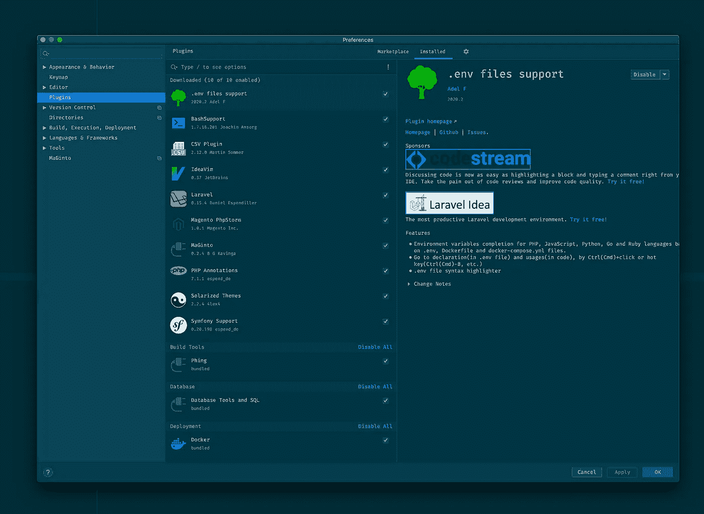

# 为 Magento 2 设置 PhpStorm

> 原文：<https://blog.devgenius.io/the-complete-phpstorm-setup-for-magento-2-7776d4156c1e?source=collection_archive---------5----------------------->


**照片由** [**阿索格蒂**](https://unsplash.com/@asoggetti?utm_source=unsplash&utm_medium=referral&utm_content=creditCopyText) **上** [**下**](https://unsplash.com/s/photos/winter-mountains?utm_source=unsplash&utm_medium=referral&utm_content=creditCopyText)

作为一名 Magento 开发者，你正在处理一个复杂的代码库，你必须浏览它。这就是为什么拥有一个 [IDE(集成开发环境)](https://en.wikipedia.org/wiki/Integrated_development_environment)来帮助你编写代码并确保其质量是非常有用的。

对于 PHP 开发人员来说，最著名的 IDE 之一可能是 [PHPStorm](https://www.jetbrains.com/phpstorm/) 。PHPStorm 自带编写 PHP 应用程序所需的所有工具。下面是我作为 Magento 开发人员日常使用的一些关于 PHPStorm 配置的技巧和诀窍。

我将不涉及以下内容:键盘快捷键、字体和配色方案，因为它们对每个人来说都是不同的。最后我会把我的 [settings.zip](https://github.com/rickdaalhuizen90/phpstorm) 分享给你下载。

转到菜单栏并隐藏您不需要的内容:

**显示选项菜单**

*   ✔压缩目录(确保更少的空文件夹嵌套)

**查看>外观**

隐藏以下内容:

*   ☐工具窗口栏
*   ☐状态栏
*   ☐导航栏

然后进入 Phpstorm -> Preferences 或使用组合键 **⌘ +、**打开“Preferences”

**外观&行为>外观**

*   ☐动画窗口
*   ☐显示工具窗口编号
*   ☐允许合并对话框上的按钮
*   ☐显示工具窗口栏
*   ☐禁用菜单中的助记符

**外观&行为>系统设置**

*   ☐在启动时重新打开最后一个项目
*   ☐确认应用程序退出
*   ✔在新窗口中打开项目

**编辑>通用>面包屑**

*   ☐显示面包屑

**编辑>总工**

*   ☐在编辑器中启用拖放功能
*   ☐在重新格式化代码操作后显示通知
*   ✔确保保存时文件末尾换行

**目录:**

排除文件:

```
.github;.idea;generated;phpserver;pub;setup;update;var
```

这给了我们一个更有组织的文件夹结构，只有我们关心的文件夹。


**插件**

我喜欢尽可能少的安装必要的插件，如下所示。

*   [IdeaVim](https://plugins.jetbrains.com/plugin/164-ideavim) — *基于 IntelliJ 平台的 IdeaVim 仿真插件*
*   [Magento PhpStorm](https://plugins.jetbrains.com/plugin/8024-magento-phpstorm)—*Magento 2 的官方 Magento PHP storm 插件*
*   [Magento](https://plugins.jetbrains.com/plugin/8331-maginto)—*插件，创建用于在使用 Magento 2* 时改善生活与工作的平衡
*   [PHP 批注](https://plugins.jetbrains.com/plugin/7320-php-annotations) — *扩展 PhpStorm 以支持文档块中的批注*
*   [Symfony 支持](https://plugins.jetbrains.com/plugin/7219-symfony-support)—*Symfony 框架/组件支持。*
*   bash support——*增加了对 bash 脚本的额外支持*
*   [CSV 插件](https://plugins.jetbrains.com/plugin/10037-csv-plugin) — *用于编辑 CSV/TSV/PSV 文件的轻量级插件*
*   [。env 文件支持](https://plugins.jetbrains.com/plugin/9525--env-files-support) — *轻松支持 dotenv 文件*
*   [日晒主题](https://plugins.jetbrains.com/plugin/12784-solarized-themes) — *添加日晒深色和浅色主题。*



**将 PSR1/PSR2 标准应用于您的代码**

**⌘ +，**代码样式->PHP->set from…->PS R1/PSR 2


**配置 PHP 代码嗅探器(phpcs)、PHP Mess detector (phpms)和 PHP CS Fixer**

**⌘ +，**语言&框架- > PHP - >质量工具- > PHP 代码嗅探器- > …

*   PHP_CodeSniffer 路径: <magento_root>/vendor/bin/phpcs</magento_root>
*   phpcbf 的路径: <magento_root>/vendor/bin/phpcbf</magento_root>

点击“验证”按钮，确保一切设置正确。

对 Mess Detector 和 PHP CS Fixer 重复相同的步骤。您可以在: <magento_root>/vendor/bin/下找到这些文件</magento_root>


最后，不要忘了通过进入文件->管理 IDE 设置->导出设置来备份你的配置，你可以在[这里](https://github.com/rickdaalhuizen90/phpstorm)下载我的。

这是我的博客的结尾，如果我错过了什么或者你有任何想要分享的设置，请在下面留下评论。

# 觉得这个帖子有用吗？请点击👏下面的按钮！:)