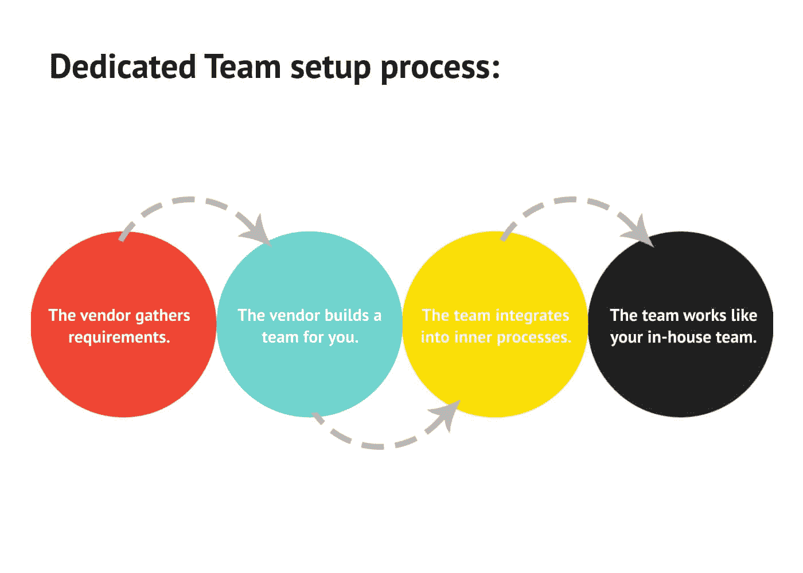
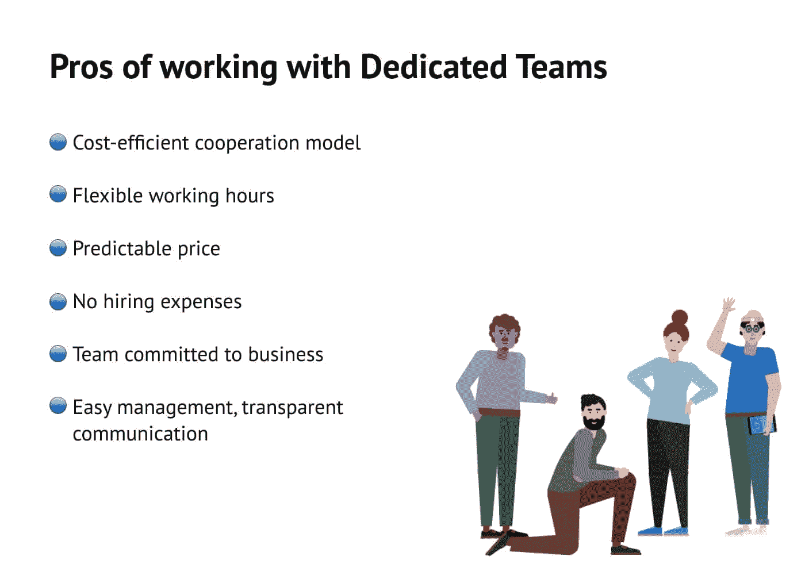
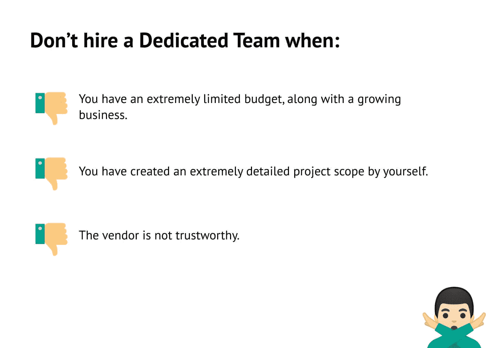

# 为您的下一个应用程序开发雇佣专门团队的全面指南

> 原文：<https://blog.devgenius.io/the-comprehensive-guide-to-hiring-dedicated-team-for-your-next-application-development-ff12c7018b01?source=collection_archive---------10----------------------->

图片来源:Lvivity

您的业务正在扩展，并且您决定是时候将您的业务应用程序开发提升到下一个级别了。恭喜你！开发一个定制的应用程序可以为你的公司创造奇迹——但前提是做得正确。你需要雇佣一个专门的开发团队，他们可以将你的愿景变成现实。

在这篇博客中，我们将讨论雇佣一个专门的开发团队的好处，并给你一些为你的项目挑选合适的团队的建议。

# 什么是专门的开发团队？

一个专门的开发团队是一组专注于你的项目的开发人员。他们不做任何其他事情，当你需要他们的时候，你可以依靠他们。这些团队通常是基于他们对特定技术堆栈(如 Ruby 或 Node.js)的经验而组建的。

这允许他们立即投入工作，让你的项目有一个好的开始，而不需要增加新的技术。

如果你有一个现有的产品需要修复错误或维护工作，一个专门的团队将能够迅速介入，因为他们已经知道它是如何工作的。如果你正在寻找一个从头开始构建的应用程序，他们将能够了解你的系统，并以最快的速度构建新功能。

图片来源:HQSoftware

如果你的公司没有足够的内部资源来做一个移动应用项目，**外包一个软件产品开发公司**给 [**雇佣专门的开发团队**](https://www.valuecoders.com/dedicated-development-teams?utm_source=Dedi_dev_team&utm_medium=Guest_Blog&utm_campaign=Medium&utm_id=NKY_devgenius) 。这将帮助你在办公桌前找到专家，并在更短的时间内开发一个应用程序。

另请阅读:[建立专门的离岸开发中心:基本原则](https://www.valuecoders.com/blog/technology-and-apps/setting-up-a-dedicated-offshore-development-center/?utm_source=Seting_up_Team&utm_medium=Guest_Blog&utm_campaign=Medium&utm_id=NKY_devgenius)

# 专用团队模型的结构是什么？

根据项目的需要，专门的团队可以由不同的角色组成。例如，您可能需要

*   项目管理人
*   一组专门的软件开发人员
*   专门的用户界面/UX 设计师
*   质量保证工程师/分析师
*   数字营销和搜索引擎优化专家
*   其他专家，如数据科学家、顾问、业务分析师等。

最重要的是，你组建的团队拥有完成项目所需的所有技能。你不必依赖外界的帮助——一切都应该由内部来处理。

# 为什么要雇佣专门的开发团队？

图片来源:HQSoftware

开发团队的外包目前正在上升，如今美国有 60%以上的企业主选择外包。

这一趋势还在继续，因为 70%的英国企业家希望由专业人士组织专门的运营，这些专业人士可以为他们提供有关行业技术要求的专业知识。

另请阅读:[雇用远程开发团队的一条全面的决定性信息](https://www.valuecoders.com/blog/outsourcing-and-off-shoring/a-piece-of-comprehensive-decisive-information-to-hire-remote-team-of-developers/?utm_source=Guide_remote_developers&utm_medium=Guest_Blog&utm_campaign=Medium&utm_id=NKY_devgenius)

# 以下是您需要一个敬业团队的原因:

## 推出新产品

有了专门的团队，您可以立即启动并运行您的产品。雇佣应用程序开发公司的最大好处是，他们可以为你提供设置软件的专家建议，以及哪些功能最有效。在他们的指导下，你可以确保你的应用从第一天起就是高质量的。

此外，专门的团队可以帮助你更快地推出新产品，这比你自己尝试去做要快得多。这意味着你将有更多的时间投入到市场营销、客户服务和其他重要的业务发展方面。

## 运行带有更新的长期项目

有了专门的团队，你可以确保你的项目将迅速完成。此外，他们将能够在进展过程中向您提供更新，以便您了解事情的进展情况。如果您有几个需要持续完成的项目，这尤其有用。

通过您团队的定期更新，您将始终知道每个项目处于哪个阶段，以及需要多长时间才能完成。这意味着当发布或更新你的产品时，不会有任何令人讨厌的惊喜。

如果你需要帮助创建和维护多个应用程序或更新现有应用程序，雇佣一个专门的团队是值得考虑的。

## 预算紧张

如果你想在**雇佣一个软件开发团队**，但是没有太多的钱，外包开发可能是一个不错的选择。你可能不相信不花很多钱就能完成高质量的工作，但是有很多负担得起的选择。

如果你想节省一些钞票，并仍然得到高质量的结果，请尝试从印度或中国雇佣一个团队。他们的费用往往比西方国家的费用低得多，而且可以提供极好的结果。

此外，如果你刚刚开始，不确定你的产品会有多受欢迎，从一个预算较小的项目开始可能是有意义的。如果事情进展顺利，你的产品变得比预期的更受欢迎，你就不会浪费太多的钱来开始！

## 节省时间

如果你想节省时间，雇佣一个专门的团队是值得考虑的。有了团队，您可以确保您的项目按时完成，并始终保持最新状态。这意味着当发布或更新你的产品时，不会有任何令人讨厌的惊喜。

雇佣 app 开发公司或者 [**印度顶级 IT 咨询公司**](https://www.valuecoders.com/it-strategy-consulting-firms?utm_source=IT_Strategy&utm_medium=Guest_Blog&utm_campaign=Medium&utm_id=NKY_devgenius) 性价比高，但也能节省你的优质时间&精力。如果你想要高质量的结果，而不是自己做所有的工作，外包你的开发可能正是你所需要的！

## 促进协作

如果你正在仔细检查以与你的团队建立长期关系，那么雇佣一个专门的团队是值得考虑的。

拥有一个专门的团队意味着与他们密切合作，并在未来的项目中进行协作。如果您有大量的产品或应用程序需要持续更新，这尤其有用。

# 如何为你的下一个项目雇佣一个专门的开发团队？

在为你的下一个项目雇佣一个专门的开发团队时，这里有一些简单的方法可以遵循。

## 与专门的开发人员讨论您的需求

在你开始寻找一个专注的开发团队之前，你应该讨论你需要他们做什么。这将有助于你确保每个人都在船上，并了解他们的期望。确保没有语言障碍也很重要。

如果可能的话，有一个既会说英语又会说母语的人总是好的。如果在翻译中丢失了什么，那就不是问题了。你也可能希望建立一个在线聊天，这样他们可以问问题或澄清他们不明白的任何事情。

## 采访专门的开发人员

一旦你确定了你对他们的需求，就该去面试他们了。在你的面试中，你应该询问他们过去的工作经历，以及他们对你的项目的感受。

他们给出的答案会告诉你很多关于他们的个性，以及他们是否适合你的团队。你也应该问他们是否有问题要问你。

这是至关重要的一步，因为这表明他们对你的项目感兴趣，并确保以后不会有误解。

## 管理团队并接收每日更新

一旦你雇佣了你的专职开发人员，你必须妥善管理他们。你应该给他们明确的指示，告诉他们需要做什么，然后定期和他们联系。如果他们是远程的，你可以使用在线聊天或视频会议软件，如 Skype 或 Google Hangouts。

这可以让你定期看到他们的进步。这也是一个好主意，建立每周例会，让每个人都在正轨上。在这些会议上，确保每个人都有机会向其他人更新他们一直在做的事情，并从其他团队成员那里获得反馈。

## 签一个 NDA

在雇佣一个专门的开发团队之前，你必须签署一份保密协议(NDA)。这将保护你的想法，并确保没有其他人可以复制它。确保你在他们把工作发回给你之前检查了他们的工作，这样以后就不会有误解了。

让他们签一份合同，说明他们能拿到多少钱以及什么时候能拿到钱，这也很好。如果可能的话，加入一个条款，说明如果他们没有在特定日期前全部完成工作，他/她将不会得到任何金额，直到他们完成同样的工作。如果出了问题，你对他们有一些影响力，可以确保他们完成他们开始的事情。

图片来源:HQSoftware

# 结论

如果你想快速有效地启动你的下一个项目，雇佣一个专门的开发团队是个不错的选择。通过遵循本文中概述的步骤，您可以确保找到满足您需求的完美团队。

如果你的下一个项目需要**雇佣开发团队**，请不要犹豫 [**外包软件产品开发公司**](https://www.valuecoders.com/outsource-software-product-development-services?utm_source=out_soft_pro_dev&utm_medium=Guest_Blog&utm_campaign=Medium&utm_id=NKY_devgenius) 。这会节省时间&金钱。而且，你会得到一个高质量的产品。

也可以阅读:[新兴软件开发外包趋势指南](https://www.valuecoders.com/blog/technology-and-apps/latest-software-development-outsourcing-trends/?utm_source=Guide_Outsourceing_Trend&utm_medium=Guest_Blog&utm_campaign=Medium&utm_id=NKY_devgenius)