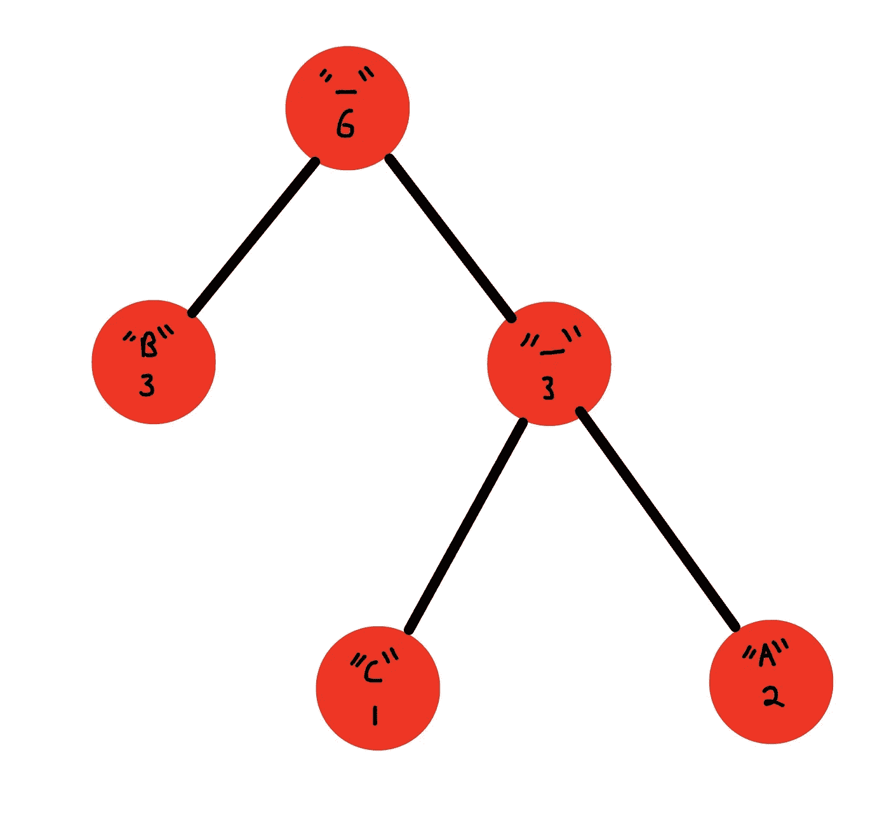

# 压缩编年史:霍夫曼编码

> 原文：<https://blog.devgenius.io/the-compression-chronicles-huffman-encoding-ab063e28dfb1?source=collection_archive---------8----------------------->

霍夫曼编码是一种无损压缩数据的方式。它用于传统的压缩格式，如 GZIP，PKZIP 等。它也用于(稍加修改)压缩图像数据到。png 格式。

算法背后的想法很简单，比如我有一个文本，说“我在酒吧吃了一个苹果”。这个句子包含 23 个字符，这相当于总共 23×8 位(字符的大小)= 184 位。然而，我们实际上并没有使用 1 字节(8 位)所允许的全部 256 个 unicode 字符。事实上，我们只使用了 10 个，并且我们在这些发行版中使用它们…

char | occurrences
———
e | 2
I | 1
l | 1
a | 6
| 6
n | 1
p | 2
b | 1
r | 1
t | 2

如果我们采用这个新的字母表，只用 4 位来包含我们的 10 个独特的字符(剩下 6 位是为了好玩)。我们可以把尺寸减半！而且只需要用 87 位！但在这种情况下，我们能做得更好吗？霍夫曼同意了。

让我们仔细看看这些情况，如果我们能为这些频繁出现的字符使用更少的空间，比如 a 和空格，那就太好了。如果我们能创造出用更少的比特来表示的字母表，会怎么样呢？假设 a 是 01，空间是 10，那么我们可以从我们的大小中删除 2*2*6 位=> 75 位。但是我们怎么知道 0110 是“a”还是字母表中的其他字符呢？答案是，用一棵树！我们可以说每一个左边的分支给二进制数加一个“0 ”,每一个右边的分支加一个“1 ”,然后我们将把我们的字符放在叶子上，这样我们可以最小化频繁使用的字符的深度。下面是一个简单字符串“AABBBC”的示例树



“_”是虚拟节点，真正的编码在叶子上，左分支为 0，右分支为 1。(B => 0，C => 10，A => 11)。请注意，由于 B 出现的频率最高，我们的树将它放在更靠近顶部的位置，因此可以使用更少的比特进行编码。

但是我们如何创建这样一棵树呢？让我们通过创建一个交互式 java 程序来研究这个算法。

# 密码

让我们从导入开始，为树创建节点，并为节点创建一个比较器。

这非常简单，它只引用了它的子元素(如果存在的话)和它所代表的字符以及它出现的次数。

现在让我们添加类文件的其余部分。

**Huffman.java**

这里发生了很多事情，所以我们将一步一步地来。

**变量和构造函数**

我们创建一个根节点，这是我们访问树的顶部的方式。我们还创建了 charToBinaryMap，以便在确定了正确的映射后对字符串进行编码。我们还有一个基本的构造函数和一个根的 getter。

**编码**

这是我们类中最复杂的函数，它负责为我们的字符串创建最优树。

1.  首先，我们接受一个人类可读的字符串，比如“我在酒吧吃了一个苹果”
2.  接下来，我们在字符和它在字符串中出现的次数之间创建一个映射
3.  然后，我们将为所有的事件映射条目创建一个 priorityQueue(将事件编号最小的条目放在队列的前面)
4.  我们遍历这个队列，得到两个最小的节点，并用两个组合的出现值创建一个虚拟父节点，然后我们将这个虚拟节点放入队列，并进行迭代，直到队列完成，给出我们的树！
5.  我们使用助手函数在线创建 charToBinaryMap 并打印出事件图
6.  然后，我们打印出编码的统计数据，如编码前的位数与编码后的位数以及压缩率。

**createchartobinarimap**

这是一个简单的按顺序遍历树，因为实际的角色节点将只在叶子上，我们只在两个孩子都为空时添加到映射中。

**解码**

这将接收一个编码的字符串，遍历树，直到遇到一片叶子(遵循模式' 1' = >向右' 0' = >向左)。一旦它到达一片叶子，它将把那个字符添加到我们的字符串生成器中，并返回到根，它将继续这个模式，直到它在二进制字符串的末尾。

**客户端**

现在我们可以运行它了！！！

```
Char | Huffman code | occurrences
----------------------------------
e   |  000  |  2
I   |  0010  |  1
l   |  0011  |  1
a   |  01  |  6
    |  10  |  6
n   |  1100  |  1
p   |  1101  |  2
b   |  11100  |  1
r   |  11101  |  1
t   |  1111  |  2
Original bits:184
Binary Encoding: 00101001111100010011100100111011101001100010011111100110111000111101
After bits (content): 68
After bits (tree): 103
After bits (total): 171
Compression ratio: 0.9293478260869565
I ate an apple at a bar
```