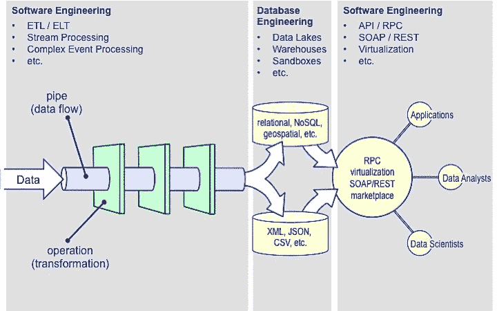
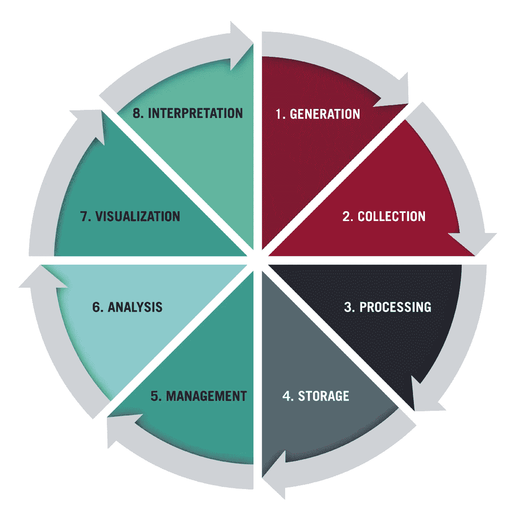
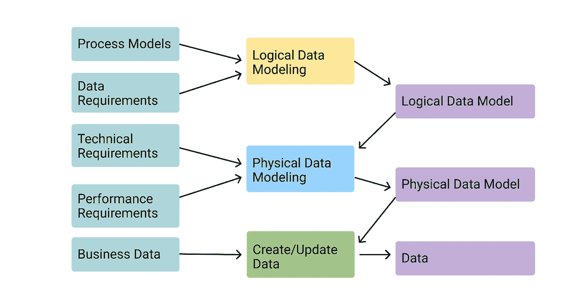
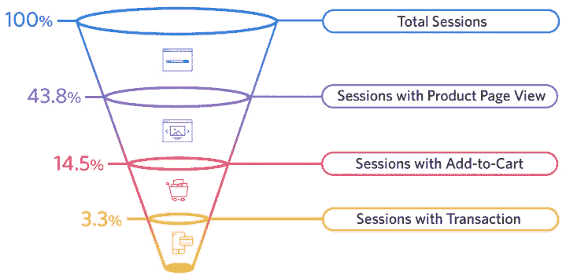
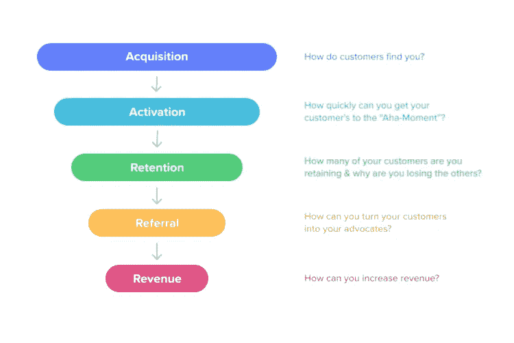
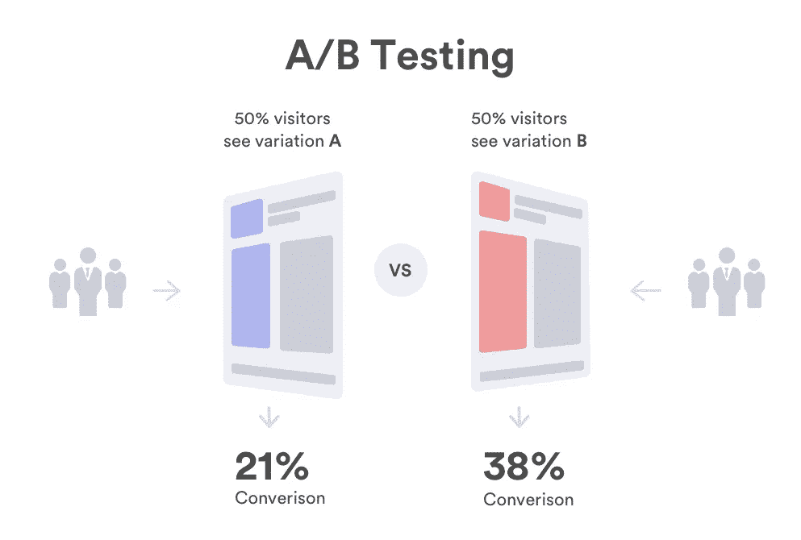

# 数据分析的概念

> 原文：<https://blog.devgenius.io/the-concept-of-data-analysis-d9209321cd58?source=collection_archive---------10----------------------->

马库斯·斯皮斯克在 [Unsplash](https://unsplash.com?utm_source=medium&utm_medium=referral) 上的照片

## 数据分析的目的是对隐藏在大量看似杂乱无章的数据中的信息进行浓缩、提取和提炼，以找出目标对象的内在原理。

数据分析是指使用适当的统计方法来分析收集的数据，以最大限度地发挥数据的价值。数据本身并没有太大的价值，但是它利用分析方法发现问题，得出一定的结论。

数据工程师从不同的来源收集数据，然后通过 ETL 统一到数据平台上。转化成有价值的信息要消耗 90%的时间。数据分析与实际业务案例紧密结合，以报告和可视化的形式支持业务决策，涵盖所有产品、运营、营销、销售和客户支持。

例如，在电子商务企业系统中至少有 3 个方面的数据，

1.  用户行为
2.  交易订单
3.  客户关系管理

【https://quanthub.com/what-is-data-engineering/ 

数据分析有 4 个主要原因

1.  分析运营线和产品的过去数据，以洞察问题
2.  数据可用于深入的需求分析。例如，理解对象之间的交互
3.  判断问题的性质
4.  评估商业机会

数据分析产生巨大的商业价值。一个完整的数据分析系统包括多个过程:

1.  收藏品
2.  清洁
3.  转换
4.  储存；储备
5.  管理
6.  形象化
7.  分析
8.  决策

[https://online.hbs.edu/blog/post/data-life-cycle](https://online.hbs.edu/blog/post/data-life-cycle)

**数据收集**

**原理 1** —全卷

从不同的数据源收集数据

*   前端(网页、客户端应用程序)
*   后端(补充客户端 app 无法收集的数据)

**原则 2** —多维分割

*   细化客户行为事件(时间、人员、地点、原因、内容和方式)
*   **谁** —性别、年龄、职位、账户类型
*   **当** —开始时间，结束时间
*   **其中** — IP 地址、位置信息、网络接入(2G/3G/4G/5G/ WiFi)
*   **为什么**——爱好、需求、习惯
*   **什么** —产品、主题
*   **如何**—动作、步骤
*   行为事件和维度的结合可以理解用户的行为

**数据建模**

[https://www . astera . com/type/blog/understanding-data-modeling-tools/](https://www.astera.com/type/blog/understanding-data-modeling-tools/)

*   构建数据指标模型有 3 个要素

1.  连接行为数据和业务数据
2.  产生关键指标
3.  从多个维度考虑数据的可行性

*   例如，您想要增加收入(关键指标)，要么:增加购买者数量(子指标)，要么增加产品的单价(子指标)
*   公式:流量*转化率*客户平均购买价格=活动展示*活动转化率*订单率*付款率*平均单位购买价格

**数据分析**

*   整体数据分析框架—数据报告、PowerBI(可视化),深入挖掘数据的价值
*   常用的数据分析方法:

1.  [**害虫分析方法**](https://corporatefinanceinstitute.com/resources/knowledge/strategy/pest-analysis/)
2.  [**5W2H 分析方法**](https://www.thinkleansixsigma.com/article/what-is-5w2h)
3.  [**比较分析法**](https://www.methods.manchester.ac.uk/themes/qualitative-methods/qualitative-comparative-analysis/)
4.  [**漏斗分析法**](https://data36.com/funnel-analysis/)
5.  [**用户行为分析方法**](https://www.kantega.no/blogg/user-behaviour-analysis-uba)
6.  [**A/B 测试**](https://vwo.com/ab-testing/)
7.  多维事件分析
8.  [**漏斗分析**](https://www.hotjar.com/blog/funnel-analysis/)
9.  [**AARRR 分析**](https://growthrocks.com/blog/aarrr-framework/)

**漏斗分析**

*   它广泛应用于各种关键的操作过程中
*   每个阶段都可以分解成几个子阶段。在每个阶段，都会流失一部分用户，留下一部分用户。

[https://www.crazyegg.com/blog/ecommerce-conversion-funnel/](https://www.crazyegg.com/blog/ecommerce-conversion-funnel/)

*   每一个子流程，你都可以想出改进的办法

**AAARR 型号**

【https://www.paldesk.com/aarrr-pirate-metrics/ 号

**指标**

1.  获取— **每日新增用户(DNU)，**推广渠道监控(费用、流量)
2.  激活-每日活跃用户(DAU)，平均每日使用时间
3.  保留—过去 7 天、过去 28 天、过去 90 天、过去 365 天
4.  收入—支付率、每用户平均收入(ARPU)、每付费用户平均收入(ARPPU)、终身价值(LTV)
5.  引荐—)**[**净推介值**](https://en.wikipedia.org/wiki/Net_promoter_score)**

****A/B 测试****

****

**[https://www.cin7.com/industry-terms/ab-testing](https://www.cin7.com/industry-terms/ab-testing)**

*   **一个为不同渠道、不同用户群获得合适解决方案的框架**

****数据分析工具****

1.  **[**谷歌分析**](https://analytics.google.com/analytics/web/provision/#/provision)**
2.  **[**疾风分析**](https://www.flurry.com/)**
3.  ****
4.  ****[**亚马逊移动分析**](https://aws.amazon.com/mobileanalytics/)****
5.  ****[**龙头流**](https://www.tapstream.com/)****
6.  ****[**App Annie**](https://www.data.ai/en/)****
7.  ****[**单簧管**](https://www.crunchbase.com/organization/claritics)****
8.  ****[**Kissmetrics**](https://www.kissmetrics.io/)****
9.  ****[**混合面板**](https://mixpanel.com/)****

****如果你发现我的任何文章有帮助或有用，那么请考虑给我一杯咖啡，帮助支持我的工作或给我赞助😊·通过使用和****

****[**帕特里翁**](https://www.patreon.com/jinlowmedium)****

****【Ko-fi.com】T5[T6](https://ko-fi.com/jinlowmedium)****

****[**buymeacoffee**](https://www.buymeacoffee.com/jinlowmedium)****

*****最后但同样重要的一点是，如果您还不是灵媒会员，并打算成为灵媒会员，我恳请您通过以下链接成为灵媒会员。我将收取你的一部分会员费，不增加你的额外费用。*****

**** [## 用我的引荐链接-金加入 Medium

### 阅读金(以及其他成千上万的作家)的每一篇小说。你的会费直接支持金和…

jinlow.medium.com](https://jinlow.medium.com/membership)****