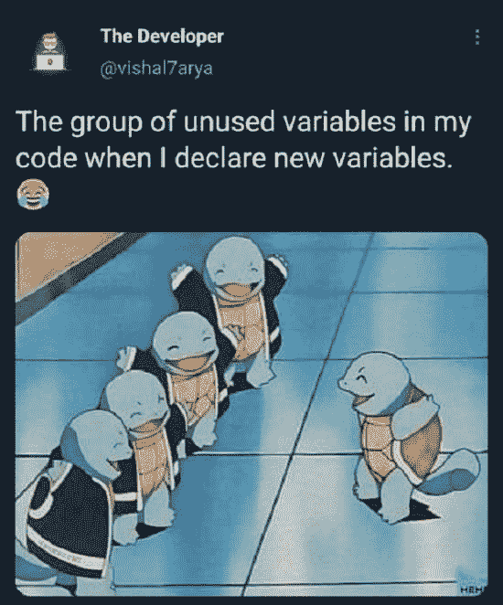
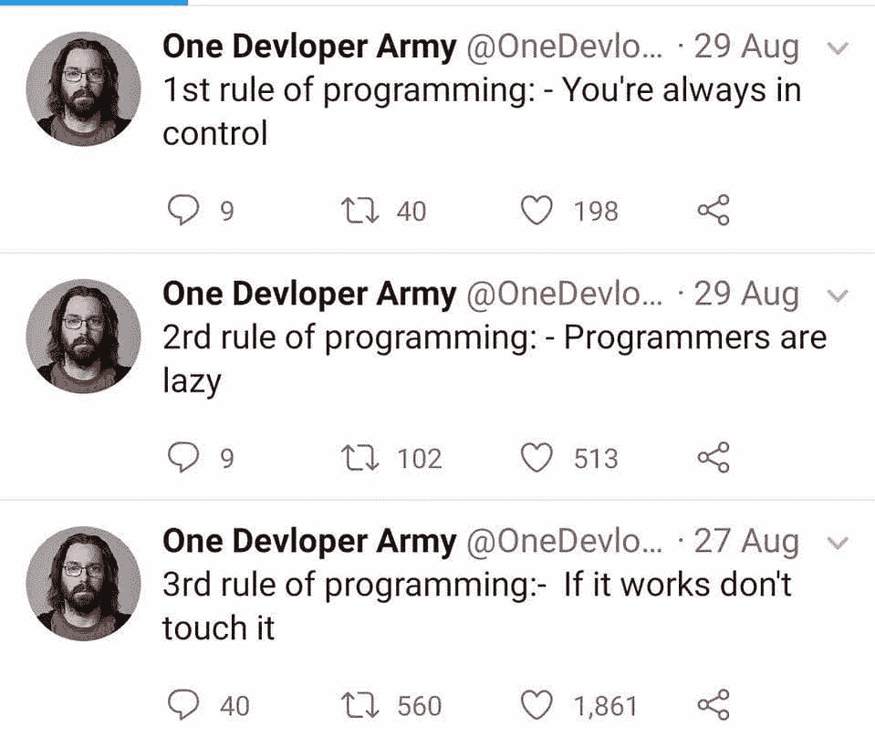
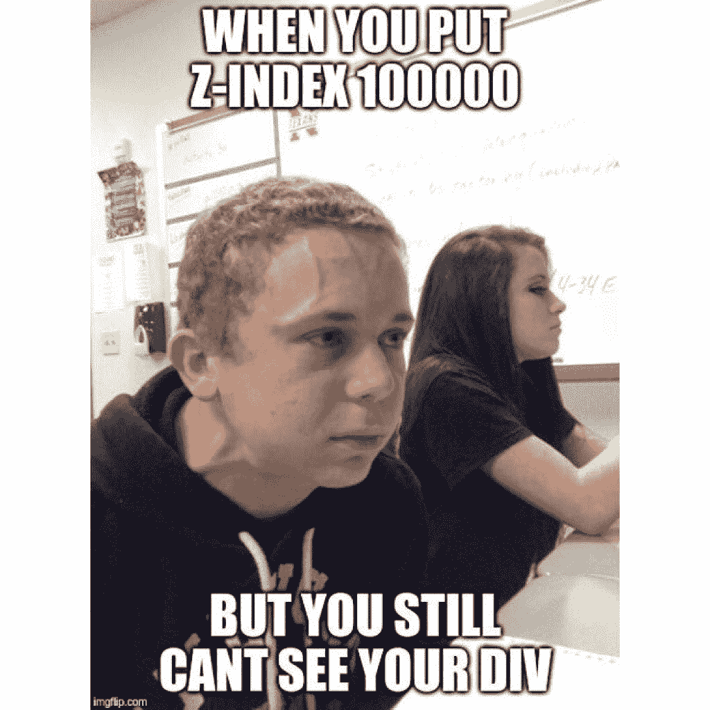
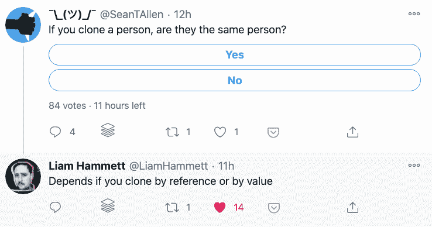
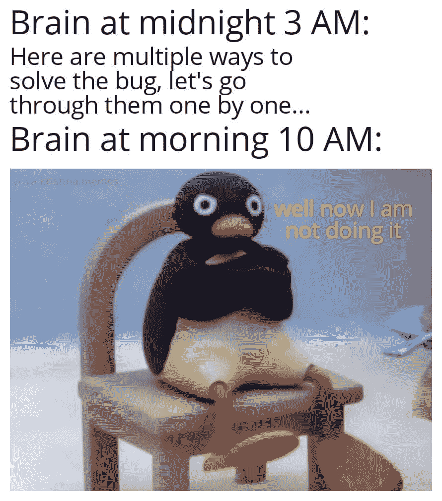
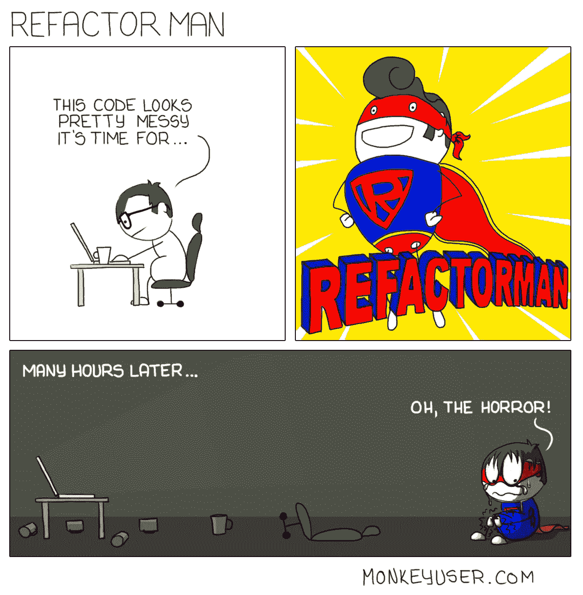
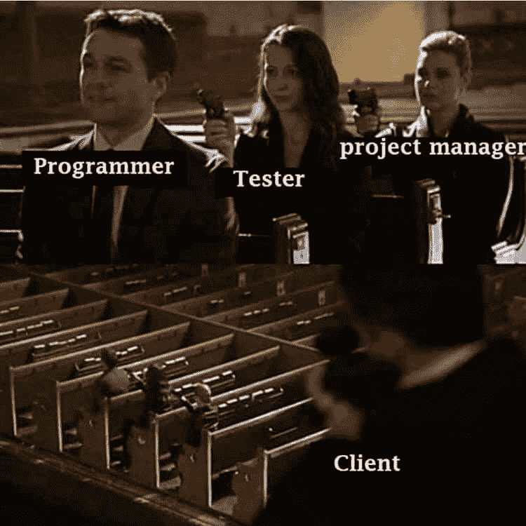
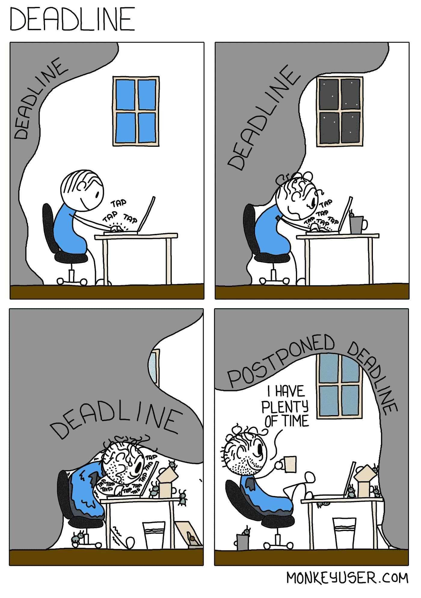
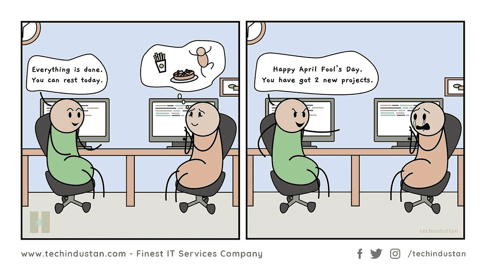

# 编程迷因和幸福之间的联系

> 原文：<https://blog.devgenius.io/the-connection-between-programming-memes-and-happiness-d768ab85b83d?source=collection_archive---------0----------------------->

## 2021 年最佳编程迷因汇编

克里斯蒂安·鲍文在 [Unsplash](https://unsplash.com?utm_source=medium&utm_medium=referral) 上的照片

***模因和幸福之间有什么联系吗？*** 如果你是我喜欢的类型的人，我喜欢在完成工作后看手机和我在那里看到的东西？有什么猜测吗？

我主要是在互联网上看到**视频、ticktock 和 meme**。我不知道为什么，但它有助于恢复我的思维和工作压力。这就是为什么我相信

> “笑是人类最好的提神按钮”

在这篇文章中，我收集了一些我喜欢的网络迷因。

> 请随意分享你宝贵的掌声和评论，这样我可以在未来提供更多类似的内容。

# LOL…之前有严格的开发模式..这是我的代码的内部状态..当一个新变量加入未使用的变量时…

[https://www.facebook.com/photo?fbid=899897387465482&set = GM . 2799768736940435](https://www.facebook.com/photo?fbid=899897387465482&set=gm.2799768736940435)

# 作为一名初级开发人员，我学到的第一件事是..不要碰工作正常的东西..它可以增加重新测试的努力，并可以打破其他东西…

[https://www . Facebook . com/JavaScript js/photos/1861659490638313](https://www.facebook.com/javascriptJS/photos/1861659490638313)

# 有时候我的 Div 元素隐藏的方式让 z-index 也帮不上忙……:)

[https://www . Facebook . com/JavaScript js/photos/1599789793491952](https://www.facebook.com/javascriptJS/photos/1599789793491952)

# 当你看到这段对话时，你有没有更深入地思考这个问题？也许电脑在向每个人询问它的家庭..谁知道…

[https://www.thecoderpedia.com/blog/programming-memes/](https://www.thecoderpedia.com/blog/programming-memes/)

# 如果一个常见的编码问题以这种方式问你会怎么样？

[https://www.facebook.com/DZoneInc/photos/10158915022879712](https://www.facebook.com/DZoneInc/photos/10158915022879712)

# 当我被某事卡住时…我的大脑会想…没有什么比满足感更重要…

[https://www.facebook.com/groups/programming.jokes](https://www.facebook.com/groups/programming.jokes)

# 你见过可以帮助重构的超级英雄吗？抱歉，尚不存在任何内容…

[https://www.monkeyuser.com/](https://www.monkeyuser.com/)

# 总是关注你所有行动的客户…

来源:https://www.facebook.com/programminggeeks.in

# 当我的最后期限延长时…我也有同样的感觉..最佳水平的拖延症…

【https://www.monkeyuser.com/ 

# 愚人节玩笑？是的，这可以适用于任何月份…哈哈

[https://www.facebook.com/techindustan/](https://www.facebook.com/techindustan/)

# 你错过了以前的搞笑炸弹吗？看看这里，爆发你的快乐…

 [## 25 个以上的 StackOverflow 编程迷因，所有开发人员都可以涉及到

### 编程幽默可以通过刷新你的情绪来减轻你的压力

javascript.plainenglish.io](https://javascript.plainenglish.io/25-more-stackoverflow-programming-jokes-that-all-devs-can-relate-to-ebc2f9c11ca3)  [## 11 个能让你心情愉快的编程迷因

### 2021 年最佳编程迷因

javascript.plainenglish.io](https://javascript.plainenglish.io/11-programming-memes-that-will-lighten-up-your-mood-e165be3513ea)  [## 2021 年最佳编程幽默汇编

### 编程迷因可以减轻你的压力

blog.devgenius.io](/best-programming-humor-compilations-2021-623473bfb0d)  [## 有趣的编程迷因会让你笑死

### 编笑话来点亮你的周五

blog.devgenius.io](/funny-programming-memes-that-will-make-you-die-laughing-1ccd8e139040)